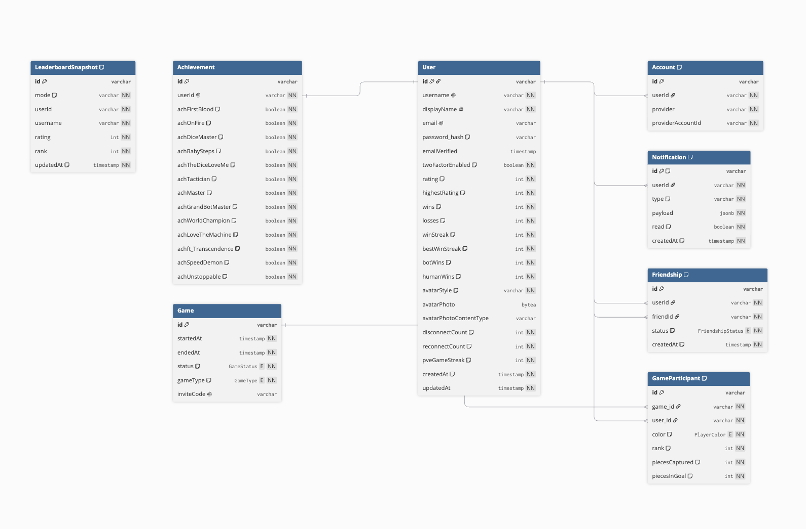

_This project has been created as part of the 42 curriculum by chtan, bleow, liyu-her, hang, jow._

# ft_transcendence

## Description

A browser-based multiplayer Ludo platform. Players register or sign in through an external
provider, join a lobby, and play server-authoritative matches against remote opponents, a
local hotseat partner, or an AI. Results feed a persistent profile, a leaderboard, and an
achievement system, and the whole interface is available in multiple languages.

### Key features

- **Server-authoritative Ludo** — dice rolls, turn order, captures, safe squares and home
  entry are all resolved on the server; the client renders, it does not decide
- **Match formats** — Hotseat mode, vs Bot/AI (PVE) mode, vs Multiplayer (PVP) mode
- **Real-time play** — WebSocket transport with live board updates, presence, and reconnect
- **User management** — profiles, avatars, friends, live online status
- **Authentication** — local accounts, OAuth 2.0 sign-in (Google, GitHub, 42), email verification, and two-factor authentication (email code)
- **Progression** — match history, statistics, leaderboard, and achievements
- **Multilingual UI** — English, Malay, and French
- **Notifications, file upload, game customization, and extended browser support**

## Instructions

### Prerequisites

- **Docker** and **Docker Compose** (the only runtime requirement).
- **make** (to use the provided build commands).
- A restored `secrets/` directory (see [Secrets](#secrets) below). The stack refuses to start if a required secret file is missing.
- OAuth client IDs and secrets for Google, GitHub, and 42 — **optional**. Local sign-up and login work without them.
- At least one free port: `8443` (HTTPS). Ports `3000`, `3001`, `5432`, `5555`, `6479` are used inside/for debugging.

### Running

```bash
git clone https://github.com/JaxzTan/ft_transcendence.git
cd ft_transcendence
make
```

`make` builds the images and starts the stack (required secrets are prepared automatically). Then open https://localhost:8443 in your browser — accept the self-signed certificate warning on first visit.

### Development mode (hot reload)

```bash
make dev
# App:   http://localhost:8080   (Vite dev server, auto-reloads on save)
# Prod:  https://localhost:8443  (still running alongside, via nginx)
```

### Commands

| Command                    | Effect                                    |
| -------------------------- | ----------------------------------------- |
| `make secrets`             | Prepare required secrets                  |
| `make` or `make all`       | Build images and start the stack          |
| `make dev`                 | Start the Vite dev server with hot reload |
| `make stop` / `make down`  | Stop services / remove containers         |
| `make logs`                | Tail service logs                         |
| `make clean` / `make re`   | Clean everything / full rebuild           |
| `make lan` / `make tunnel` | LAN mode / public ngrok tunnel            |

### Access

| URL                       | What it is                                                      | Profile |
| ------------------------- | --------------------------------------------------------------- | ------- |
| `https://localhost:8443`  | The app (via nginx)                                             | default |
| `http://localhost:8080`   | Vite dev server with hot reload                                 | dev     |
| `http://localhost:3000`   | Backend API (direct, host-only)                                 | default |
| `http://localhost:5555`   | Prisma Studio (database browser)                                | default |
| `wss://<host>/socket.io/` | Game engine connection (same-origin through nginx / Vite proxy) | default |

### Secrets

The project stores configuration in plain-text files under `secrets/`, one value per file, named after the variable in lowercase (for example `JWT_SECRET` → `secrets/jwt_secret.txt`). The directory is mounted read-only into the containers. **Never commit this folder to git** (it is already ignored).

- `make secrets` generates and seeds everything that can be derived.
- OAuth credentials must be obtained from the provider consoles (Google Cloud, GitHub, 42 intra) and placed manually.

## Team Information

| Login      | Role(s)                    | Responsibilities                                                                                                                |
| ---------- | -------------------------- | ------------------------------------------------------------------------------------------------------------------------------- |
| `chtan`    | Product Owner, Developer   | Product vision, backlog and feature priorities, validating completed work, stakeholder communication — plus feature development |
| `bleow`    | Tech Lead, Developer       | Technical architecture, stack decisions, code quality and review of critical changes — plus feature development                 |
| `liyu-her` | Project Manager, Developer | Planning sessions, progress and deadline tracking, risk and blocker management — plus feature development                       |
| `hang`     | Developer                  | Feature implementation, code review, testing, documentation                                                                     |
| `jow`      | Project Manager, Developer | Planning sessions, progress and deadline tracking, risk and blocker management — plus feature development                       |

## Project Management

- **Tools** — Discord and Lark for coordination and task tracking
- **Communication** — Discord for day-to-day, plus in-person working sessions on campus

## Technical Stack

### Frontend

| Technology            | Purpose                                   |
| --------------------- | ----------------------------------------- |
| React 19 + TypeScript | Component model, routing, client state    |
| Vite                  | Build tooling and dev server (hot reload) |
| Tailwind CSS          | Styling                                   |
| i18next               | Localization (English, Malay, French)     |
| Socket.IO client      | Real-time transport                       |

### Backend

| Technology                                 | Purpose                                                    |
| ------------------------------------------ | ---------------------------------------------------------- |
| NestJS                                     | HTTP API, dependency injection, module structure           |
| Socket.IO                                  | WebSocket gateway and room fan-out                         |
| Passport + JWT (httpOnly cookies) + bcrypt | OAuth 2.0 (Google, GitHub, 42), sessions, password hashing |
| Prisma                                     | ORM, schema and migrations                                 |
| nginx                                      | Reverse proxy and TLS termination                          |
| Docker Compose                             | One-command reproducible stack, service isolation          |

### Data

| Technology | Purpose                                                                  |
| ---------- | ------------------------------------------------------------------------ |
| PostgreSQL | Durable data — users, friendships, match history, achievements           |
| Redis      | Live game state — board, dice, turn pointer, matchmaking queue, presence |

### Justification for major technical choices

**Why React + NestJS + PostgreSQL.** They are the stack the team is most comfortable with
and they are explicitly allowed by the subject (as opposed to, e.g., Django or Spring), so
the team could move fast and defend every choice in review.

**Why Redis alongside it.** A running match is high-frequency, short-lived state — board
position, current dice value, whose turn it is, who is queued for matchmaking. Writing that
to Postgres on every move would put transactional write load on the database for data that
becomes worthless the moment the game ends. Redis holds it in memory; only the durable
outcome — result, opponents, duration, rating delta — is written to Postgres. Redis also
backs the Socket.IO adapter so broadcasts reach every client regardless of which backend
instance holds the socket.

**Why a server-authoritative game loop.** The client never decides a dice value or validates
a move. Every action is a request the server accepts or rejects against its own copy of the
board, which is what makes the multiplayer and remote-player modules defensible rather than
merely functional.

**Why Socket.IO over plain WebSockets.** It provides automatic reconnection, rooms, and
broadcasting out of the box, which the live board, presence, and reconnect flows build on.

**Why Passport + JWT in httpOnly cookies + bcrypt.** Passport handles the OAuth 2.0 flows
for Google, GitHub, and 42, so the provider callbacks are handled by a well-known library.
Sessions use a short-lived JWT access token (15 minutes) stored in an httpOnly cookie, so
page scripts cannot read it and XSS cannot steal it. The refresh token (7 days) is stored
hashed in Redis and rotated on every use, so a leaked token stops working once it is reused,
and can be revoked on logout or password reset. Passwords are hashed with bcrypt, so a
database leak does not expose usable credentials.

**Why Prisma.** Prisma keeps the database schema in one place and generates a type-safe
client from it, so queries are checked at compile time and no SQL is written by hand. Schema
changes are kept as committed migrations, so the database can be recreated or upgraded
consistently on any machine.

## Database Schema



## Modules

### Major modules

| #   | Module                             | Owner   | How it was implemented                                                                                                            |
| --- | ---------------------------------- | ------- | --------------------------------------------------------------------------------------------------------------------------------- |
| 1   | Framework for frontend and backend | `chtan` | React on the client, NestJS on the server — framework routing, state and dependency injection rather than hand-rolled equivalents |
| 2   | Real-time features                 | `bleow` | Socket.IO gateway with a Redis adapter for cross-instance broadcast; live board updates, presence, and reconnect                  |
| 3   | Standard user management           | `hang`  | Profiles, avatar upload, friend requests, live online status                                                                      |
| 4   | AI opponent                        | `bleow` | Heuristic move selection — no external model, no black-box library                                                                |
| 5   | Web-based game                     | `bleow` | Server-authoritative Ludo: dice RNG, turn order, captures, safe squares and exact-count home entry all resolved server-side       |
| 6   | Remote players                     | `chtan` | Two players on separate machines over the network, with reconnect inside a grace window                                           |
| 7   | Multiplayer, more than two players | `chtan` | Four concurrent seats with server-enforced turn order and seat identity derived from the session                                  |

### Minor modules

| #   | Module                            | Owner      | How it was implemented                                                 |
| --- | --------------------------------- | ---------- | ---------------------------------------------------------------------- |
| 1   | ORM                               | `jow`      | Prisma — schema, relations and committed migration history             |
| 2   | Multiple languages                | `liyu-her` | Session-based language switching across English, Malay and French      |
| 3   | Game statistics and match history | `bleow`    | Wins, losses, rating and leaderboard, reconciled against match records |
| 4   | Remote authentication             | `jow`      | OAuth 2.0 sign-in via Google, GitHub, and 42 Intra                     |
| 5   | Two-factor authentication         | `jow`      |                                                                        |
| 6   | Gamification                      | `bleow`    | Achievements, badges and leaderboards                                  |
| 7   | User activity analytics           | `chtan`    | Insights dashboard                                                     |
| 8   | Notification system               | `hang`     | Notifications on create, update and delete actions                     |
| 9   | Custom minor module               | `chtan`    | Ngrok tunneling for exposing the local stack for remote testing        |

## Individual Contributions

### `chtan`

- **Built:** Frontend/backend framework setup (React + NestJS); remote players module (cross-machine play with reconnect); multiplayer module (four-seat, server-enforced turn order); user activity analytics dashboard; Ngrok tunneling for exposing the local stack, including a new auth setup to secure the tunnel
- **Challenges:** As team lead, the main challenge was team management — balancing everyone's workload and morale while making sure each member could still learn from the project rather than just clearing tickets

### `bleow`

- **Built:** Real-time features (Socket.IO gateway with Redis adapter for cross-instance broadcast, live board updates, presence, reconnect); AI opponent (heuristic move selection, no external model); web-based game (server-authoritative Ludo — dice RNG, turn order, captures, safe squares, exact-count home entry); game statistics and match history (wins/losses, rating, leaderboard); gamification (achievements, badges, leaderboards) Debugging and smoothly integrating backend with frontend. Numerous small guards to include to patch problems. Timely and clear communication with team.
- **Challenges:** Debugging and smoothly integrating backend with frontend. Numerous small guards to include to patch problems. Timely and clear communication with team.

### `liyu-her`

- **Built:** Multiple languages module (session-based language switching across English, Malay and French); frontend design and the revamp to frontend v2
- **Challenges:** Extracting all user-facing text and data out of the frontend so it could be translated, without breaking the pages being redesigned at the same time

### `hang`

- **Built:** Standard user management module (profiles, avatar upload, friend requests, live online status); notification system module (real-time notifications on create, update and delete actions); frontend implementation
- **Challenges:** Balancing deadlines against wanting the frontend to be pixel-perfect

### `jow`

- **Built:** ORM setup (Prisma — schema, relations and committed migration history); remote authentication module (OAuth 2.0 sign-in via Google, GitHub, and 42 Intra); two-factor authentication module (email code verification)
- **Challenges:** Day-to-day database management and debugging OAuth provider integrations — tedious but constant work

## Resources

### Documentation

All project documentation lives under `docs/`, grouped by category. Each file is listed with the responsibility it covers.

#### Overview

| Document                                     | Responsibility                                                                              |
| -------------------------------------------- | ------------------------------------------------------------------------------------------- |
| [docs/architecture.md](docs/architecture.md) | System topology, services, request paths, data layer, secrets, make targets, file structure |
| [docs/API-list.md](docs/API-list.md)         | Complete HTTP + WebSocket API reference                                                     |
| [docs/Ludo_Rules.md](docs/Ludo_Rules.md)     | Classic Ludo rules                                                                          |

#### Deployment

| Document                                       | Responsibility                                                                                               |
| ---------------------------------------------- | ------------------------------------------------------------------------------------------------------------ |
| [docs/deploy/nginx.md](docs/deploy/nginx.md)   | How nginx fronts every mode (local, LAN, tunnel) without the frontend or backend knowing which one is active |
| [docs/deploy/lan.md](docs/deploy/lan.md)       | Reaching the app from another device on the same WiFi                                                        |
| [docs/deploy/tunnel.md](docs/deploy/tunnel.md) | Reaching the app from the internet via an ngrok tunnel                                                       |

#### Backend (NestJS API)

| Document                                                                                         | Responsibility                                               |
| ------------------------------------------------------------------------------------------------ | ------------------------------------------------------------ |
| [docs/backend/backend-app-bootstrap-system.md](docs/backend/backend-app-bootstrap-system.md)     | App bootstrap, module wiring, secrets, health check          |
| [docs/backend/backend-auth-module.md](docs/backend/backend-auth-module.md)                       | Registration, login, OAuth, 2FA, sessions, password reset    |
| [docs/backend/backend-user-module.md](docs/backend/backend-user-module.md)                       | Public profiles, game history, avatars                       |
| [docs/backend/backend-friends-module.md](docs/backend/backend-friends-module.md)                 | Friend requests, accept/decline, block/unblock, game invites |
| [docs/backend/backend-match-module.md](docs/backend/backend-match-module.md)                     | Matchmaking (PvP/PvE/hotseat) and game lifecycle             |
| [docs/backend/backend-leaderboard-module.md](docs/backend/backend-leaderboard-module.md)         | Rankings with Redis cache + PostgreSQL fallback              |
| [docs/backend/backend-achievements-module.md](docs/backend/backend-achievements-module.md)       | 13 achievement badges and their evaluation                   |
| [docs/backend/backend-player-stats-module.md](docs/backend/backend-player-stats-module.md)       | Per-player lifetime statistics                               |
| [docs/backend/backend-presence-module.md](docs/backend/backend-presence-module.md)               | Online / in-game / offline presence tracking                 |
| [docs/backend/backend-notification-module.md](docs/backend/backend-notification-module.md)       | Real-time notifications (SSE + Redis pub/sub)                |
| [docs/backend/backend-database-schema-system.md](docs/backend/backend-database-schema-system.md) | PostgreSQL schema — models, enums, relationships, indexes    |
| [docs/backend/backend-seeding-system.md](docs/backend/backend-seeding-system.md)                 | Development/test seed data                                   |

#### Frontend (React SPA)

| Document                                                                                         | Responsibility                                             |
| ------------------------------------------------------------------------------------------------ | ---------------------------------------------------------- |
| [docs/frontend/frontend-app-bootstrap-system.md](docs/frontend/frontend-app-bootstrap-system.md) | App bootstrap, route categories, auth guard                |
| [docs/frontend/frontend-router-system.md](docs/frontend/frontend-router-system.md)               | Custom client-side router                                  |
| [docs/frontend/frontend-store-system.md](docs/frontend/frontend-store-system.md)                 | Global state (auth, game setup, settings, real-time match) |
| [docs/frontend/frontend-shell-system.md](docs/frontend/frontend-shell-system.md)                 | Shell layout wrapper (side rail + header)                  |
| [docs/frontend/frontend-auth-pages-module.md](docs/frontend/frontend-auth-pages-module.md)       | Login and signup pages                                     |
| [docs/frontend/frontend-auth-extras-module.md](docs/frontend/frontend-auth-extras-module.md)     | 2FA, forgot/reset password pages                           |
| [docs/frontend/frontend-home-module.md](docs/frontend/frontend-home-module.md)                   | Home page — stats, rank, friends, notifications            |
| [docs/frontend/frontend-dashboard-module.md](docs/frontend/frontend-dashboard-module.md)         | Dashboard (superseded by Home)                             |
| [docs/frontend/frontend-lobby-module.md](docs/frontend/frontend-lobby-module.md)                 | Game lobby — mode/seat setup, match creation               |
| [docs/frontend/frontend-game-module.md](docs/frontend/frontend-game-module.md)                   | Real-time gameplay page (Socket.IO)                        |
| [docs/frontend/frontend-results-module.md](docs/frontend/frontend-results-module.md)             | Post-game results and rematch                              |
| [docs/frontend/frontend-friends-module.md](docs/frontend/frontend-friends-module.md)             | Friends page — list, requests, blocked, invites            |
| [docs/frontend/frontend-leaderboard-module.md](docs/frontend/frontend-leaderboard-module.md)     | Leaderboard page                                           |
| [docs/frontend/frontend-settings-module.md](docs/frontend/frontend-settings-module.md)           | Settings (AccountMenu, game preferences)                   |
| [docs/frontend/frontend-profile-module.md](docs/frontend/frontend-profile-module.md)             | Profile page — stats, history, friends                     |
| [docs/frontend/frontend-components-system.md](docs/frontend/frontend-components-system.md)       | Shared UI components                                       |

#### Ludo Engine (real-time game engine)

| Document                                                                                       | Responsibility                                     |
| ---------------------------------------------------------------------------------------------- | -------------------------------------------------- |
| [docs/ludo-engine/ludo-engine-core-system.md](docs/ludo-engine/ludo-engine-core-system.md)     | Game state machine, turn logic, win conditions     |
| [docs/ludo-engine/ludo-engine-bot-module.md](docs/ludo-engine/ludo-engine-bot-module.md)       | Bot AI decision logic                              |
| [docs/ludo-engine/ludo-engine-lobby-module.md](docs/ludo-engine/ludo-engine-lobby-module.md)   | Lobby management — colors, ready check, game start |
| [docs/ludo-engine/ludo-engine-socket-system.md](docs/ludo-engine/ludo-engine-socket-system.md) | Socket.IO connection and event protocol            |
| [docs/ludo-engine/ludo-engine-redis-system.md](docs/ludo-engine/ludo-engine-redis-system.md)   | Redis persistence + pub/sub                        |

### Classic references

- Ludo rules: [Wikipedia — Ludo](https://en.wikipedia.org/wiki/Ludo)
- React: [react.dev](https://react.dev)
- NestJS: [docs.nestjs.com](https://docs.nestjs.com)
- Socket.IO: [socket.io/docs](https://socket.io/docs)
- Prisma: [prisma.io/docs](https://www.prisma.io/docs)
- Docker Compose: [docs.docker.com/compose](https://docs.docker.com/compose)

### Use of AI

The team used **Claude** and **ChatGPT** during development, in the following areas:

- **Test planning** — deriving an evaluation test plan from the module list, then structuring
  it into per-module test cases and tracking execution against it.
- **Debugging** — narrowing down defects.
- **UI and styling**.
- **Documentation generation** — drafting, structuring, and refining project documentation, including  
  the architecture overview, API reference, and the per-module docs under `docs/`.

No AI tool was used to generate a complete module or feature end to end; all generated
material was reviewed and adapted by the team member responsible for that area.

## Known Limitations

- The self-signed certificate triggers a browser warning on first visit (expected — it is a local development setup).
- Ngrok's free tier shows an interstitial page for new visitors.
- Campus/corporate WiFi may block device-to-device traffic in LAN mode (use a phone hotspot to test).

## License

This project is distributed under the **GPL-3.0** license — see [LICENSE](LICENSE) in the repository root.

## File structure

The full directory and file structure is documented in [docs/architecture.md](docs/architecture.md).
