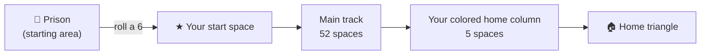
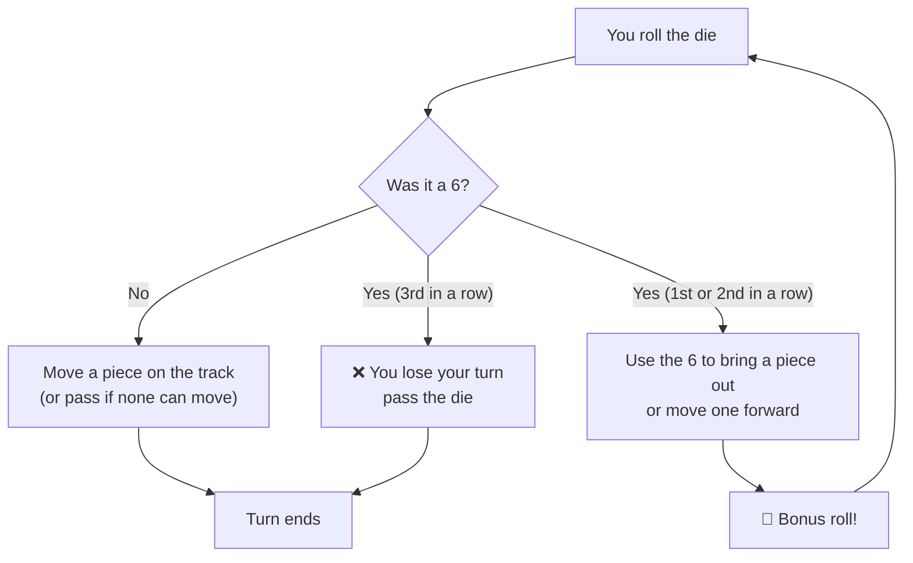
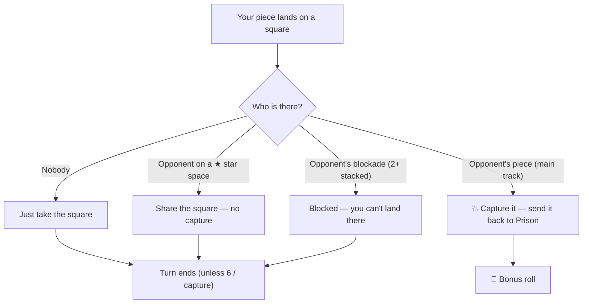

# RetroLudo '42 — Full Ruleset

---

## 1. The Journey in One Number: 57

In Ludo, it takes **57 exact moves** for each piece to go from the starting
position to the final home triangle. This distance is split into two parts:

- **52 spaces** to go once around the main board, and
- **5 spaces** to go up your colored home column to the center.

Each player has 4 pieces, so your goal is to get all 4 pieces to finish — a
total of **228 moves** (57 × 4) is the fewest moves needed to win.

But these numbers are the *fewest* moves. In a real game it usually takes much
longer, because pieces often get captured by opponents and have to start over
from the beginning.



| Step range | Zone | Who can be here |
|------------|------|-----------------|
| 0 | Prison (starting area) | Only you |
| 1–51 | Main track (52-space loop) | Everyone |
| 52–56 | Colored home column | Only you |
| 57 | Home triangle | Only you (finished) |

---

## 2. Objective

Be the first player to get **all four** of your pieces from the Starting Area
to the Home Triangle.

## 3. Setup

Each player picks one of the four colors (**Red, Green, Yellow, Blue**) and
puts their four pieces in their matching Starting Area.

## 4. Turn Order

Players take turns **clockwise**. On your turn you roll the die once.

---

## 5. Rolling and Entering the Board

### Entering play ("leaving Prison")

Pieces start locked in the Starting Area (the **Prison**). To get a piece out
onto the track you **must roll a 6**.

> ⚙️ How it works: when you roll a 6 to leave Prison, your piece lands on
> **your start space** (your own ★). The 6 is used up to get out — the other
> 5 steps are **not** used. Your next roll moves the piece 1–6 spaces like
> normal.

### The "6" rule

- Rolling a **6** gives you a **bonus roll**.
- You can use the 6 to **bring a new piece out** *or* **move a piece already
  on the track**.
- If you roll **three 6s in a row**, you **lose your turn** (and start counting
  6s over again).



---

## 6. Movement and Capturing

### Moving

Move a piece **forward clockwise** the exact number of spaces shown on the die.
You can never move past the home triangle: if the roll is too big, that piece
cannot move (so you pass, or move a different piece).

### Capturing

If your piece lands on a space with an **opponent's piece**, you **capture**
it: it goes back to their Starting Area (Prison), and **you get a bonus roll**.

Captures only happen on the **main track (steps 1–51)**. Pieces in the home
column and on star spaces are safe (see below). If you capture a **stack** of
same-color pieces, the whole stack goes home at once.



---

## 7. 🚧 Blocking (Blockades)

This is the best trick for defending your position. It lets you *guard* by
stacking your own pieces.

### What a blockade is

When **two or more of your own pieces** land on the **exact same space** on the
main track, they form a **blockade**.

```
Blockade formed — two RED pieces stacked on one track square:

   Track (positions 16 – 22):
   ⭐22   21   20   19   18   17   16
   [ ]   [ ]  [ ]  [ ]  [ ]  [ ]  [RR]

   Position 17 holds TWO red pieces → a RED blockade.
```

> ✅ You can make one by moving a second piece onto a space your own piece
> already sits on. This is allowed — your own pieces never block *you*.

### What a blockade does

A blockade **cannot be crossed**:

1. **Opponents cannot pass through it.** If their move path crosses the
   blockade square, that move is not allowed.
2. **Opponents cannot land on it.** It cannot be captured and cannot be shared.

```
Blockade blocks a passing piece:

   GREEN piece at position 24 rolls a 4 → wants to reach position 28.

   Track (positions 23 – 29):
   23   24   25   26   27⭐  28   29
   [ ]  [G]  [ ]  [ ]  [ ]  [BB] [ ]

   The path crosses 25, 26, 27, 28. Position 28 is a BLUE blockade
   (2 blue pieces) → the move is NOT allowed. Green cannot jump over it.
```

```
Blockade blocks a landing:

   GREEN piece at position 19 rolls a 5 → would land on position 24.

   Track (positions 19 – 25):
   19   20   21   22⭐  23   24   25
   [G]  [ ]  [ ]  [ ]  [ ]  [YY] [ ]

   Landing square 24 holds a YELLOW blockade → the move is NOT allowed.
   Green must pick a different piece or pass.
```

### Where blockades DON'T work

- **On ★ star (safe) spaces.** Safe zones never make a blockade. If two of your
  pieces are on a star space, they share it but do **not** block anyone.
- **In the home column or home triangle (steps 52–57).** Blockades only work
  on the main track.
- **Against your own pieces.** Your blockade only blocks *opponents*, never you.

### Blockade strategy

- **Early game:** stack two pieces to make a moving "tank" that opponents
  can't stop or capture.
- **Mid game:** put a blockade on a busy part of the track to slow down an
  opponent who is about to pass you.
- **⚠️ Careful:** a blockade is very strong, but it also means two of your
  pieces are stuck together instead of covering more ground — and a blockade
  at your own home-column entry can slow down *your* other pieces behind it.

---

## 8. ⭐ Star Spaces (Safe Zones)

There are **eight** star spaces on the main track, at these shared track
positions:

```
  1, 9, 14, 22, 27, 35, 40, 48
```

Each player's **start space is one of these** (that's why your start space has
a star). Rules for star spaces:

1. **Pieces on a star space cannot be captured.** If an opponent lands on your
   piece here, you both just **share the space**.
2. **Blockades cannot be made on star spaces** to stop others landing there.
3. They are the only squares where pieces of *different* colors can share a
   square.

```
Safe space — sharing is allowed:

   RED piece is on star position 27⭐.
   GREEN rolls a 5 and lands on position 27.

   Track (positions 23 – 29):
   23   24   25   26   27⭐  28   29
   [ ]  [ ]  [ ]  [ ]  [RG] [ ]  [ ]

   Result: no capture. Red and Green now SHARE the star space.
```

---

## 9. 🎨 Colored Columns (Home Stretch)

- **What it is:** a vertical row of **5 colored spaces** matching your piece's
  color, leading straight to the center (steps 52–56).
- **Who can enter:** only pieces of the matching color. Opponents cannot enter
  your colored column, so your pieces are **100% safe from capture** here.
- **Blockades:** allowed inside your own column — good for slowing down your
  own pieces behind if you need to (opponents can't reach them anyway).

```
Home stretch — only the owner can enter:

   RED pieces are climbing the red column (steps 52, 53, 54).

   Step:   51   52   53   54   55   56   57
          [ ]  [R]  [R]  [ ]  [ ]  [ ]  [🏠]

   GREEN can never land on steps 52–56. Red pieces here are untouchable.
```

---

## 10. 🏠 Home Triangle (The End)

- **What it is:** the large colored triangle in the exact center of the board
  (step 57).
- **How to enter:** you must roll the **exact number** needed to land on it.
  If your piece is 3 spaces away, you must roll exactly a 3. Rolling a 4 or 5
  means that piece cannot move and your turn passes.
- **Once inside:** the piece **stays there forever** — it can never be captured
  or moved again. Get all 4 pieces here to win.

```
Exact roll needed:

   RED piece is at step 55 of the red column, 2 steps from home.

   Step:   55   56   57
          [R]  [ ]  [🏠]

   Roll a 2 → piece lands in the Home Triangle. ✅
   Roll a 3, 4, 5, or 6 → too far, piece stays put, turn passes.
```

---

## 11. Bonus Rolls at a Glance

| Situation | Do you get another roll? |
|-----------|--------------------------|
| Roll a 6 (1st or 2nd in a row) | ✅ Yes |
| Capture an opponent's piece | ✅ Yes |
| Roll a third 6 in a row | ❌ No — you lose your turn |
| Normal move (no 6, no capture) | ❌ No — turn ends |
| No piece can move | Turn passes on its own (a 6 still gives another roll) |

---

## 12. Quick Reference

| Rule | Summary |
|------|---------|
| Goal | Get all 4 pieces to the Home Triangle first |
| Track | 52 main-track spaces + 5-space home column = 57 steps |
| Leaving Prison | Roll a 6 |
| Three 6s in a row | You lose your turn |
| Capture | Land on an opponent (main track, not a star) → they go home, you roll again |
| Blockade | 2+ of your pieces on one track square → opponents can't pass or land |
| Star spaces | Positions 1, 9, 14, 22, 27, 35, 40, 48 — safe, shareable, no blockades |
| Home column | Only your color — safe from capture |
| Home triangle | Exact roll needed to enter |
