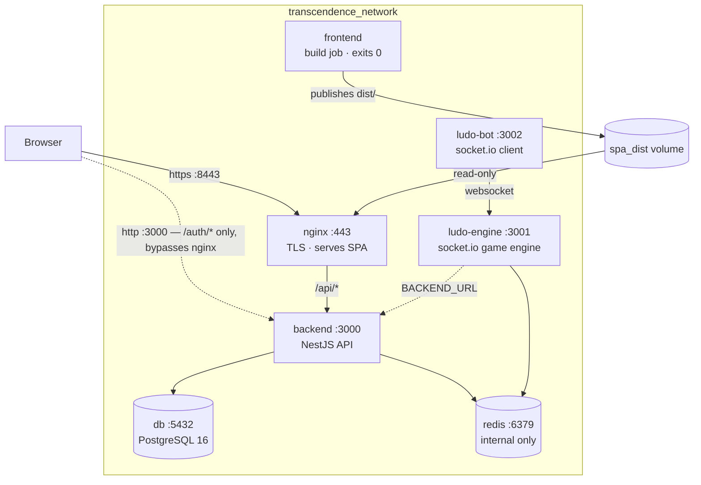

# Architecture

**Project:** ft_transcendence — Ludo Royale
**Updated:** 2026-07-21

A seven-service Docker Compose stack: a React SPA served over TLS by nginx, a NestJS
API, a standalone real-time game engine, a bot client, PostgreSQL, and Redis.

For defects in what's described here, see [known-issues.md](known-issues.md).

---

## Topology

The dashed browser→backend edge is a design gap, not a feature — see
[Issue 3](known-issues.md#issue-3--nginx-does-not-proxy-auth).

---

## Services

| Service | Host port | Container | Role |
|---|---|---|---|
| `nginx` | 8443 | 443 | TLS termination, serves built SPA, proxies `/api/*` |
| `backend` | 3000 | 3000 | NestJS REST API, auth, persistence |
| `ludo-engine` | 3001 | 3001 | Authoritative game state over socket.io |
| `ludo-bot` | 3002 | 3002 | Automated player, socket.io client of the engine |
| `db` | 5432 | 5432 | PostgreSQL 16, Prisma-managed |
| `redis` | — | 6379 | Game state + leaderboard cache; **not published** |
| `frontend` | — | — | Build-only job; compiles SPA, exits 0 |
| `frontend-dev` | 8080 | 8080 | Vite HMR server — `dev` profile only |

Images are built from `Dockerfile`s in each service directory. `db` and `redis` wrap
their official images with an init script that reads secrets before `exec`ing the
real process (`backend/app/postgres_16_db/`, `backend/app/redis/`).

---

## The SPA build handoff

The frontend is **not** a server. It is a one-shot job:

1. `frontend` builds the SPA (`tsc -b && vite build`) into `/app/dist`.
2. Its `CMD` copies that into `/export`, which is the `spa_dist` named volume, then exits 0.
3. `nginx` mounts `spa_dist` read-only at `/usr/share/nginx/html`.

`nginx` gates on `depends_on: frontend: condition: service_completed_successfully`,
so it cannot start against an empty document root on first boot.

> A single `📦 SPA published to spa_dist` log line followed by `exited (0)` is the
> success case for the `frontend` container, not a crash.

The nginx config is **bind-mounted** from `nginx/conf/nginx.conf`, so config edits
need only a container restart, not an image rebuild. The `Dockerfile` also `COPY`s it
as a fallback so the image stays runnable standalone.

---

## Request paths

**Static / SPA** — `https://localhost:8443/*` → nginx → `try_files $uri $uri/ /index.html`,
so client-side routing works on deep links. `frontend/src/router.tsx` is a hand-rolled
`window.location` router, not React Router.

**API** — `https://localhost:8443/api/*` → `proxy_pass http://backend:3000`. The `/api`
prefix is *preserved*, so controllers must include it themselves. There is no global
prefix in `backend/src/main.ts`; each controller carries `api/` in its own decorator.

**Auth** — `@Controller('auth')` has no `api/` prefix, so `/auth/*` falls outside the
proxy and is reached directly on port 3000. This is why the OAuth callback secrets
point at `http://localhost:3000`.

**Game realtime** — socket.io to `ludo-engine:3001`. Currently only `ludo-bot`
connects; the SPA has no socket client yet.

---

## Data layer

### PostgreSQL

Prisma-managed, schema at `backend/prisma/schema.prisma`.

**Models:** `User`, `Account` (OAuth provider links), `Game`, `GameParticipant`, `Friendship`
**Enums:** `FriendshipStatus`, `UserStatus`, `PlayerColor`, `GameStatus`, `GameType`

Schema is applied with `npx prisma db push --accept-data-loss` from
`backend/docker-entrypoint.sh` on every boot. **There is no migration history** — this
is a deliberate project choice, so treat the schema file as the single source of truth
and never hand-edit the database.

`DATABASE_URL` is assembled at container start from `db_credentials.txt` +
`db_password.txt`, producing `@db:5432`. It is *not* read from `database_url.txt`,
which holds the host-side URL (`@localhost:5432`) for running the app outside Docker.
The two are not interchangeable.

### Redis

Two distinct uses:

- **Leaderboard cache** — `LeaderboardRedisService`, sorted sets keyed `leaderboard:{mode}`, with a PostgreSQL fallback on read failure.
- **Live game state** — `MatchService` (matchmaking, rematch, active games) and the engine's `RedisGameStore`.

Redis runs with `requirepass` sourced from `redis_password.txt`. Only the leaderboard
service currently authenticates — see [Issue 1](known-issues.md#issue-1--redis-authentication-is-broken-critical-live).

---

## Backend modules

`backend/src/app.module.ts` composes eight feature modules:

| Module | Route prefix | Responsibility |
|---|---|---|
| `AuthModule` | `/auth` | Local + Google/GitHub/42 OAuth, JWT cookie issuance |
| `UserModule` | `/api/user` | Profile, settings |
| `FriendsModule` | `/api/friends` | Requests, accept/decline, block |
| `LeaderboardModule` | `/api/leaderboard` | Rankings, Redis-backed |
| `AchievementsModule` | `/api/achievements` | Unlockables |
| `StatsModule` | `/api/stats` | Per-player aggregates |
| `MatchModule` | `/api/match`, `/api/game` | Matchmaking, game lifecycle |
| `CronModule` | `/api/cron` | Scheduled cleanup |

### Auth flow

1. `GET /auth/{google,github,42}` → passport guard redirects to the provider.
2. Provider redirects to the callback URL from `secrets/{provider}_callback_url.txt`.
3. Strategy upserts `User` + `Account`, `AuthService` signs a JWT.
4. Token is set as an `httpOnly`, `sameSite: lax` cookie named `token`, `secure` when `NODE_ENV=production`.
5. Browser is redirected to `FRONTEND_URL` (`https://localhost:8443`).
6. `JwtStrategy` reads the token from `req.cookies` — `cookieParser()` in `main.ts` is required for this.

---

## Secrets

One value per file under `secrets/`, named after the variable it holds, lowercased —
`JWT_SECRET` → `secrets/jwt_secret.txt`. The directory is bind-mounted read-only at
`/secrets` in every service that needs it.

**Nothing sensitive passes through `.env` or the compose environment.** No
`--env-file` is used anywhere. The remaining `${...}` in `compose.yaml` are non-secret
topology values and all carry defaults, so the stack runs with no `.env` present.

Resolution order in `backend/src/secrets.ts`: `SECRETS_DIR` → `/secrets` →
`../secrets` → `./secrets`, so host-run `npm run start:dev` sees the same files as
containers. `requireSecret()` throws at boot on a missing value; `secret()` returns
`undefined` and falls back to `process.env`.

`make prepare-secrets` generates or seeds everything derivable. `make check-secrets`
hard-fails on the nine OAuth values, which must come from the provider consoles.

---

## Dev vs. production paths

Both run simultaneously and independently:

| | `make start` | `make dev` |
|---|---|---|
| Compose profile | default | `dev` |
| SPA source | built, in `spa_dist` | live from bind mount |
| Served by | nginx, `https://localhost:8443` | Vite, `http://localhost:8080` |
| Reload | rebuild + restart | HMR |
| API access | nginx `/api` proxy | Vite `/api` proxy |

`frontend-dev` bind-mounts `./frontend:/app` with an anonymous volume over
`/app/node_modules` so the image's dependencies aren't shadowed by the host. Vite uses
`usePolling` when containerised — Docker Desktop on macOS does not deliver inotify
events through bind mounts, and HMR silently never fires without it.

`make dev` still brings up nginx, so the production path stays verifiable while you
iterate against HMR.

---

## Make targets

| Target | Effect |
|---|---|
| `all` | `check-secrets` → `build` → `start` |
| `prepare-secrets` | Generate/seed derivable secrets; never overwrites |
| `check-secrets` | Fail fast if an OAuth secret is missing |
| `build` / `start` | Build images / bring up the default profile detached |
| `dev` | Bring up default + `dev` profile with HMR |
| `stop` / `down` / `logs` | Profile-aware, so `frontend-dev` isn't orphaned |
| `clean` / `fclean` / `prune` | Docker teardown, increasing severity |
| `tunnel` / `dev-tunnel` / `stop-tunnel` | ngrok against 8443 |
| `re` | `stop` → `down` → `all` |
