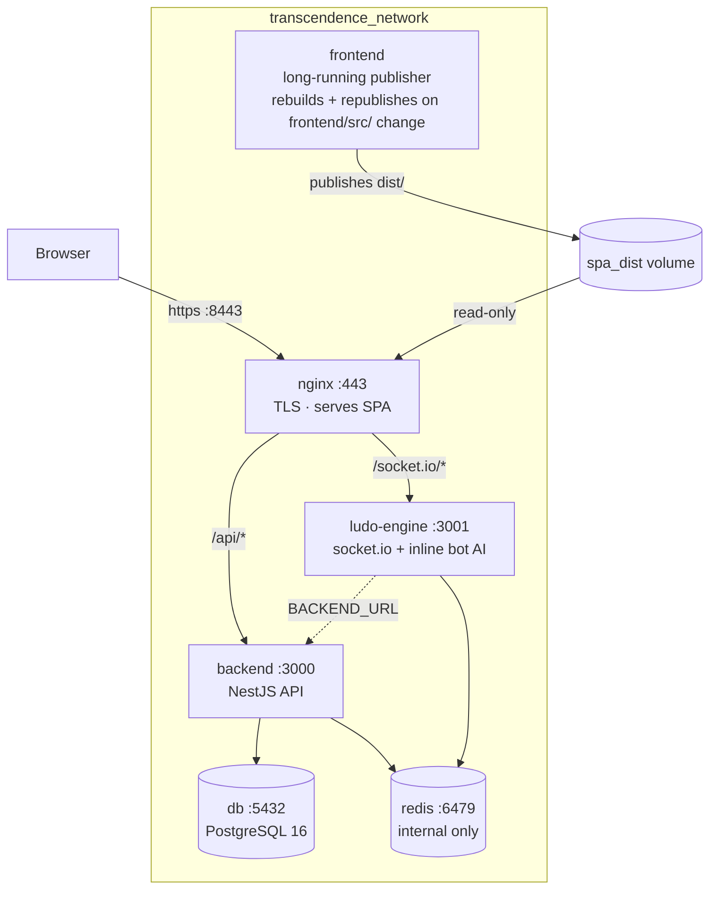

# Architecture

**Project:** ft_transcendence — RetroLudo '42
**Updated:** 2026-09-10

An eight-service Docker Compose stack: a React 19 SPA built, published, and
watched for source changes by a long-running `frontend` job, served over TLS by
nginx, a NestJS REST API, a standalone real-time game engine (with an inline bot
AI), PostgreSQL, Redis, and a Prisma Studio DB browser. A separate `frontend-dev`
Vite HMR service is available for development only.

---

## Topology


```mermaid
graph TB
    Browser["Browser"]

    subgraph net["transcendence_network"]
        nginx["nginx :443<br/>TLS · serves SPA"]
        backend["backend :3000<br/>NestJS API"]
        engine["ludo-engine :3001<br/>socket.io + inline bot AI"]
        db[("db :5432<br/>PostgreSQL 16")]
        redis[("redis :6479<br/>internal only")]
        fe["frontend<br/>long-running publisher<br/>rebuilds + republishes on frontend/src/ change"]
    end

    Browser -->|"https :8443"| nginx
    nginx -->|"/api/*"| backend
    nginx -->|"/socket.io/*"| engine
    fe -->|"publishes dist/"| spa[("spa_dist volume")]
    spa -->|"read-only"| nginx
    backend --> db
    backend --> redis
    engine --> redis
    engine -.->|"BACKEND_URL"| backend
```

> **Note:** Auth endpoints use `@Controller('api/auth')`, so they are proxied
> through nginx like all other API routes. There is no direct browser→backend
> path for auth.

---

## Services

External access URLs live in the [README](../README.md) **Access** section; the full
container / port / role breakdown is in the [Containers, images & volumes](#containers--images--volumes)
section below. This file keeps the deeper service notes:

Images are built from `Dockerfile`s in each service directory. `db` and `redis` wrap
their official images with an init script that reads secrets before `exec`ing the
real process (`backend/app/postgres_16_db/`, `backend/app/redis/`).

> **Note:** There is no separate `ludo-bot` container. The bot AI lives inside the
> `ludo-engine` process (`backend/app/ludo-engine/src/bot.ts`). The engine accepts
> a `bot` role in the JWT and can auto-fill slots with bot players.

---

## Containers, images & volumes

Everything is defined in the root `compose.yaml`. Image names are `<project>-<service>`,
where `<project>` is the **compose project name** — by default the clone directory's
name, lower-cased and stripped of characters Docker doesn't allow. It is *not* fixed
in the repo (`compose.yaml` sets no `name:` and `COMPOSE_PROJECT_NAME` is unset), so
it differs per machine/checkout: a clone at `Team-submission-10Sep` builds
`team-submission-10sep-backend`, `team-submission-10sep-nginx`, etc. Every container
attaches to the `transcendence_network` bridge and reaches the others by service name.

### Containers

| Container | Image (base) | What runs inside | Host port → container port | Depends on |
|---|---|---|---|---|
| `db` | `…-db` (postgres:16-alpine) | `postgres_16_db-init.sh` validates `POSTGRES_PASSWORD`, then `exec`s the official postgres entrypoint → **PostgreSQL 16** | `127.0.0.1:5432 → 5432` | — |
| `redis` | `…-redis` (redis:7-alpine) | `redis-init.sh` writes `/tmp/redis.conf` (port 6479, AOF persistence, 256 MB LRU) then `exec redis-server … --requirepass` → **Redis 7** | `127.0.0.1:6479 → 6479` | — |
| `backend` | `…-backend` (node:22-alpine) | `docker-entrypoint.sh` validates env → `prisma db push --accept-data-loss` → `node dist/main.js` (**NestJS API** on 3000) | `127.0.0.1:3000 → 3000` | db (healthy), redis (healthy) |
| `studio` | `…-studio` (reuses the backend image) | `npx prisma studio --port 5555 --browser none` — **Prisma DB browser** over the `db` service (skips the backend entrypoint to avoid a `prisma db push` race) | `127.0.0.1:5555 → 5555` | db (healthy) |
| `ludo-engine` | `…-ludo-engine` (node:22-alpine) | `node dist/index.js` — **Socket.IO game engine + inline bot AI** on 3001 (clients reach it same-origin via nginx; the host port exists for local `npm run dev`) | `127.0.0.1:3001 → 3001` | redis (healthy) |
| `frontend` | `…-frontend` (node:22-alpine) | `publish.sh` — builds the **React SPA**, publishes it into the `spa_dist` volume, then watches the bind-mounted `./frontend/src` (`/app/src` in the container) and `package.json` and republishes on change (long-running build job) | — | — |
| `frontend-dev` *(profile: dev)* | `…-frontend-dev` (node:22-alpine, `Dockerfile.dev`) | `npm run dev` — **Vite dev server with HMR**, serves source from the bind mount | `8080 → 8080` | backend, ludo-engine |
| `nginx` | `…-nginx` (debian + nginx-extras) | `nginx.sh` waits for the backend health check, then `exec nginx -g "daemon off;"` — **TLS reverse proxy**: serves the SPA and proxies `/api/*` + `/socket.io/*` | `8443 → 443` | frontend (healthy), backend, ludo-engine |

### Volumes

| Volume | Mounted into | Purpose |
|---|---|---|
| `db_data` | `db → /var/lib/postgresql/data` | PostgreSQL data directory — survives container recreates |
| `redis_data` | `redis → /data` | Redis persistence (AOF + RDB snapshots) |
| `spa_dist` | `frontend → /export` (write), `nginx → /usr/share/nginx/html:ro` (read) | The SPA build handoff: `frontend` builds into it, `nginx` serves it read-only |

The compose file also uses **bind mounts** (host paths, not volumes): `./frontend → /app`
on `frontend` / `frontend-dev` so Vite watches live source, and
`./nginx/conf/nginx.conf` + `app.inc → /etc/nginx/*` so nginx config can be edited
without a rebuild.

### Network

`transcendence_network` (bridge) — all containers attach to it; `db`, `redis`,
`backend`, `ludo-engine`, and `nginx` resolve each other by service name.

---

## The SPA build handoff

The frontend is **not** a server. It is a **long-running build-and-watch job**
(`frontend/publish.sh`):

1. On every boot it runs `npm install` (keeping the anonymous-volume `node_modules`
   in sync with the current lockfile), builds the SPA, and publishes the output
   into `/export` — the `spa_dist` named volume.
2. The build itself runs outside the bind mount (`BUILD_OUT_DIR=/tmp/dist-out`,
   `BUILD_PUBLIC_DIR=/tmp/public-safe`), because a Docker Desktop for macOS
   VirtioFS bug intermittently fails reads under `/app` (ENOLCK "Unknown system
   error -35"); each step is retried a few times before giving up. The failure is
   specific to the zero-copy syscall used by `fs.copyFileSync`, `cp` and `tar` —
   plain `read()`/`write()` (`cat`, `dd`) is unaffected. Both env vars are
   optional: unset, they fall back to the in-project `public/` and `dist/`, which
   is what local/host builds use.
3. It then watches `/app/src` and `/app/package.json` with `inotifywait` — `/app`
   is the bind mount of the repo's `./frontend`, so this is the SPA's own
   `frontend/src` (unrelated to `backend/src`) — and republishes on every
   change. The container never exits.
4. `nginx` mounts `spa_dist` read-only at `/usr/share/nginx/html`.

`nginx` gates on `depends_on: frontend: condition: service_healthy` — the health
check is `test -f /export/index.html` (retries 20 over ~30s) — so it cannot start
against an empty document root on first boot.

> A failed rebuild does **not** take the site down: `publish.sh` explicitly checks
> the build result and, on failure, keeps the last good build in `/export` rather
> than wiping it. The log line `📦 SPA published to spa_dist` is the success
> marker; a `❌ Build failed` line means the previously published bundle is still
> being served — fix the error and save again.

The nginx config is **bind-mounted** from `nginx/conf/nginx.conf`, so config edits
need only a container restart, not an image rebuild. The `Dockerfile` also `COPY`s it
as a fallback so the image stays runnable standalone.

---

## Request paths

**Static / SPA** — `https://localhost:8443/*` → nginx → `try_files $uri $uri/ /index.html`,
so client-side routing works on deep links. `frontend/src/router.tsx` is a custom
`window.location` router, not React Router.

**API** — `https://localhost:8443/api/*` → `proxy_pass http://backend:3000`. The `/api`
prefix is *preserved*, so controllers must include it themselves. There is no global
prefix in `backend/src/main.ts`; each controller carries `api/` in its own decorator.

**Auth** — `@Controller('api/auth')` includes the `api/` prefix, so `/api/auth/*`
is proxied through nginx to backend:3000. OAuth callbacks are **browser-facing**:
each provider is registered with a callback URL like
`https://localhost:8443/api/auth/github/callback` (the ngrok variants use the
`*.ngrok-free.dev` origin), so the provider redirects the *browser* back through
nginx, which proxies to backend:3000. The matching callback/strategy set is
selected per request from the `Host` header (`isTunnelRequest` in
`backend/src/secrets.ts`) — see [`deploy/tunnel.md`](./deploy/tunnel.md).

**Game realtime** — the SPA connects to `socket.io` on its **own origin**: nginx
(and the Vite dev proxy) forwards `/socket.io/` to `ludo-engine:3001`
(`frontend/src/socket.ts` → `connectSocket`). The browser never needs to know the
engine's real hostname or port. The inline bot AI connects internally inside the
engine process.

---

## Connection liveness (two-direction heartbeats)

Long-lived state is kept honest by **two independent heartbeats, one in each direction**. They are
deliberately named apart, and neither substitutes for the other.

| Direction | Constant | Where it lives | Why it exists |
| --- | --- | --- | --- |
| **client → server** | `PRESENCE_HEARTBEAT_MS` (`sendPresenceHeartbeat()`) | `frontend/src/store.tsx` → `POST /api/presence/heartbeat` every 20 s while signed in (`DELETE` on logout) | Liveness of the **client**: proves the browser is still there. The server keeps a per-user Redis key with a 45 s TTL, so a crashed tab or a dropped network expires on its own and friends' presence dots correct themselves. |
| **server → client** | `SSE_HEARTBEAT_MS` | `backend/src/notification/notification.controller.ts` → a `ping` frame written into the `/api/notifications/stream` SSE response every 20 s | Liveness of the **connection**: the SSE response is otherwise byte-silent for minutes, and ngrok's HTTP/2 edge resets an idle stream (`net::ERR_HTTP2_PROTOCOL_ERROR`). The periodic frame satisfies the tunnel's socket requirements, so the stream is never treated as dead. |

**Why both are needed**

- The presence heartbeat is an ordinary **request/response on its own connection**. It carries no
  application meaning for the notification stream and writes nothing into it, so it cannot keep that
  stream alive.
- The SSE keep-alive is **server-pushed** and carries no application meaning for presence; the server
  learns nothing about the client from it.

In short: the client → server beat answers *"is the user still connected?"*, while the
server → client beat answers *"is our connection to them still usable?"* — the second exists
specifically because the ngrok tunnel will not tolerate an idle socket. Because SSE has no replay,
keeping the stream up is also what stops live events (for example `avatar_changed`) from being lost
during a drop.

---

## Data layer

### PostgreSQL

Prisma-managed, schema at `backend/prisma/schema.prisma`.

**Models:** `User` (account + per-user stats, avatar, counters), `Account` (OAuth provider links), `Achievement` (13 achievement flags), `Game`, `GameParticipant`, `Friendship`, `Notification`
**Enums:** `FriendshipStatus`, `PlayerColor`, `GameStatus`, `GameType`

Schema is applied with `npx prisma db push --accept-data-loss` from
`backend/docker-entrypoint.sh` on every boot — the runtime deliberately uses **db
push, not `migrate deploy`**, so schema state is driven by `schema.prisma` (the
single source of truth — never hand-edit the database). A `migrations/` directory
exists for reference/history snapshots, but nothing on the boot path replays it.

`DATABASE_URL` comes from the root `.env` via compose's `env_file:`; on the
backend container compose's `environment:` override swaps in `CONTAINER_DATABASE_URL`
(`@db:5432`, service host) before the app boots. The plain `.env` `DATABASE_URL`
holds the host-side URL (`@localhost:5432`) for running scripts outside Docker. The
two are not interchangeable — see `backend/prisma.config.ts`.

### Redis

Several distinct uses:

- **Leaderboard cache** — `LeaderboardRedisService`, sorted sets keyed `leaderboard:{mode}`, backfilled from PostgreSQL when the set is empty (a Redis outage is surfaced as an error, not masked).
- **Live game state** — `MatchService` (matchmaking, active games) and the engine's `RedisGameStore`.
- **Presence** — heartbeat keys per user for online/offline/playing status (`PresenceService`). The heartbeat itself is the **client → server** direction; see [Connection liveness](#connection-liveness-two-direction-heartbeats).
- **Notifications** — Redis Pub/Sub channels (`notify:<userId>`) bridge persisted notifications to the SSE stream (`NotificationService`).

Redis runs on the internal port **6479** with `requirepass` sourced from the
`REDIS_PASSWORD` env var (written into `/tmp/redis.conf` by `redis-init.sh`).
The leaderboard, presence, session, two-factor, and notification services all
authenticate their Redis connections via `secret('REDIS_PASSWORD')`. The
matchmaking service and the engine's `RedisGameStore` also authenticate.

---

## Backend modules

`backend/src/app.module.ts` composes **nine** feature modules:

| Module | Route prefix | Responsibility |
|---|---|---|
| `AuthModule` | `/api/auth` | Local + Google/GitHub/42 OAuth, 2FA, email verification, password reset, refresh tokens |
| `UserModule` | `/api/user` | Profile, avatar, game history |
| `FriendsModule` | `/api/friends` | Requests, accept/decline, block |
| `LeaderboardModule` | `/api/leaderboard` | Rankings, Redis sorted sets (Postgres backfill when the set is empty; a Redis outage surfaces as an error) |
| `AchievementsModule` | `/api/achievements` | 13 Ludo achievements |
| `StatsModule` | `/api/stats` | Per-player aggregates |
| `MatchModule` | `/api/match`, `/api/game` | Matchmaking (PvP/PvE/hotseat), game lifecycle |
| `PresenceModule` | `/api/presence` | Online/offline/playing presence tracking |
| `NotificationModule` | `/api/notifications` | Persisted notifications + SSE stream (Redis pub/sub) |

### Auth flow

1. `GET /api/auth/{google,github,42}` → passport guard redirects to the provider.
2. Provider redirects the browser to the callback URL from `.env`
   (`{GOOGLE,GITHUB,FORTYTWO}_CALLBACK_URL` / `NGROK_*` variants), read at boot by
   the matching Passport strategy via `requireSecret()`.
3. Strategy upserts `User` + `Account`, `AuthService` validates the user.
4. If the user has 2FA enabled, an email code is sent and the browser is redirected to `{FRONTEND_URL}/2fa?token={pendingToken}`.
5. If 2FA is disabled, a session is issued: a short-lived access token (15 min) and a long-lived refresh token (7 days) are set as `httpOnly`, `sameSite: lax` cookies named `token` and `refresh_token`.
6. Browser is redirected to `FRONTEND_URL` (`https://localhost:8443`).
7. `JwtStrategy` reads the access token from `req.cookies` — `cookieParser()` in `main.ts` is required for this.
8. When the access token expires, the SPA calls `POST /api/auth/refresh` with the `refresh_token` cookie to silently rotate the session.

---

## Configuration (.env)

See the [README](../README.md) **Configuration (.env)** section for the `.env` layout,
the `make env` pipeline, and the OAuth setup. This file keeps the implementation notes:

All configuration lives in the root `.env` (one `KEY=VALUE` per line). Containers load
it via compose's `env_file:`; host-side scripts load it through dotenv. `backend/src/secrets.ts`
is a single lookup point over `process.env`: `secret(name)` returns `undefined` when unset,
`requireSecret(name)` throws at boot on a missing value. The remaining `${...}` in
`compose.yaml` are non-secret topology values and all carry defaults.

---

## Dev vs. production paths

See the [README](../README.md) **Development mode** section for the two modes and
their URLs/ports. This file keeps the implementation note:

`frontend-dev` bind-mounts `./frontend:/app` with an anonymous volume over
`/app/node_modules` so the image's dependencies aren't shadowed by the host. Vite uses
`usePolling` when containerised — Docker Desktop on macOS does not deliver inotify
events through bind mounts, and HMR silently never fires without it.

`make dev` still brings up nginx, so the production path stays verifiable while you
iterate against HMR.

---

## Make targets

See the [README](../README.md) **Commands** section for the full list of make targets.

---

## Directory Layout

```
.
├── compose.yaml                  # Docker Compose — all 8 services
├── Makefile                      # Build / run / dev / tunnel targets
├── .env.example                   # Config template (`make env` validates) — real .env is gitignored
│
├── backend/                      # NestJS REST API (port 3000)
│   ├── Dockerfile
│   ├── docker-entrypoint.sh      # Prisma push + app start
│   ├── package.json
│   ├── tsconfig.json
│   ├── nest-cli.json
│   ├── prisma.config.ts
│   │
│   ├── src/                      # NestJS feature modules (9)
│   │   ├── app.module.ts         # Root module (9 feature modules + throttler)
│   │   ├── main.ts               # Bootstrap, cookie-parser, trust proxy, /health
│   │   ├── prisma.service.ts     # Prisma client singleton
│   │   ├── secrets.ts            # env-var secret lookup over process.env
│   │   ├── common/               # Shared helpers
│   │   │   ├── scoring.ts        # ratingDeltaFor() — piece-based scoring
│   │   │   └── bot.ts            # isBotUserId() / BOT_PREFIX
│   │   │
│   │   ├── auth/                 # JWT + OAuth (Google, GitHub, 42) + 2FA + mail
│   │   │   ├── auth.controller.ts    # register, login, logout, me, 2FA, OAuth
│   │   │   ├── auth.service.ts       # Token signing, password hashing
│   │   │   ├── auth.module.ts        # JWT config (15-min access) + local & ngrok OAuth strategies
│   │   │   ├── twofactor.service.ts  # Email one-time-code 2FA (idempotent)
│   │   │   ├── session.service.ts    # Session/refresh concerns
│   │   │   ├── mail.service.ts       # SMTP mailer (nodemailer)
│   │   │   ├── jwt.strategy.ts       # Reads token from httpOnly cookie
│   │   │   ├── jwt-auth.guard.ts     # Route guard
│   │   │   ├── jwt-payload.ts        # Type definitions
│   │   │   ├── google.strategy.ts    # Google OAuth
│   │   │   ├── github.strategy.ts    # GitHub OAuth
│   │   │   ├── fortytwo.strategy.ts  # 42 (intra) OAuth
│   │   │   ├── ngrok_google_strategy.ts / ngrok_github_strategy.ts / ngrok_fortytwo_strategy.ts  # tunnel-mode OAuth
│   │   │   ├── oauth.guards.ts       # OAuth route guards (per-Host strategy pick)
│   │   │   └── dto/                  # login, register, 2FA, password, profile DTOs
│   │   │
│   │   ├── user/                 # User profiles & game history
│   │   ├── friends/              # Friend system (requests, accept/decline, block)
│   │   ├── match/                # Matchmaking & game lifecycle (split services)
│   │   ├── leaderboard/          # Rankings (Redis sorted sets, Postgres backfill when empty)
│   │   ├── achievements/         # 13 Ludo achievements
│   │   ├── player-stats/         # Per-player aggregates
│   │   ├── presence/             # Online/offline/playing tracking
│   │   └── notification/         # Notifications (SSE + Redis pub/sub)
│   │
│   ├── app/
│   │   ├── ludo-engine/          # Standalone game engine (port 3001)
│   │   │   ├── Dockerfile
│   │   │   ├── package.json
│   │   │   ├── tsconfig.json
│   │   │   └── src/
│   │   │       ├── index.ts              # Entry point → SocketServer.start(3001)
│   │   │       ├── engine.ts             # Game state machine (roll, move, win)
│   │   │       ├── move-validator.ts     # Legal move computation
│   │   │       ├── turn.ts               # Move outcome: mirrors, win check, turn advance
│   │   │       ├── board-mapper.ts       # Board geometry (safe zones, tracks)
│   │   │       ├── bot.ts                # Heuristic bot AI
│   │   │       ├── player-handler.ts     # Disconnect/reconnect/exit/ready
│   │   │       ├── lobby.ts              # Lobby management (color selection)
│   │   │       ├── redis.ts              # RedisGameStore (persistence)
│   │   │       ├── types.ts              # GameState, PlayerColor, events
│   │   │       └── socket/
│   │   │           ├── server.ts             # SocketServer, event routing
│   │   │           ├── socket-handlers.ts    # join_game, roll_dice, move_piece, …
│   │   │           ├── join-manager.ts       # Seat assignment, bot seeding on join
│   │   │           ├── bot-scheduler.ts      # One timer per game for bot turns
│   │   │           ├── post-game.ts          # End-of-game flow → result-submitter
│   │   │           ├── auth.ts               # JWT middleware, GameSocket type
│   │   │           ├── event-publisher.ts    # Redis pub/sub → Socket.IO bridge
│   │   │           ├── redis-broadcaster.ts  # Room-based state broadcasts
│   │   │           └── result-submitter.ts   # POST /api/game/end to backend
│   │   │
│   │   ├── postgres_16_db/       # Custom PostgreSQL image
│   │   │   ├── Dockerfile
│   │   │   └── postgres_16_db-init.sh
│   │   └── redis/                # Custom Redis image (port 6479)
│   │       ├── Dockerfile
│   │       └── redis-init.sh
│   │
│   ├── prisma/
│   │   ├── schema.prisma         # DB schema (single source of truth)
│   │   ├── seed.ts               # Development seed data (dev)
│   │   ├── seed_friends.ts       # Friendship seed (dev)
│   │   ├── seed_user_profile.ts  # User profile seed (dev)
│   │   ├── sync_leaderboard.ts   # Leaderboard sync script (dev)
│   │   ├── drop-all.sql          # Drop-all script (dev)
│   │   ├── truncate-all.sql      # Truncate-all script (dev)
│   │   ├── migrations/           # Prisma migrations (migration_lock.toml)
│   │   └── ... (generated client output lives in backend/generated, gitignored)
│   │
│   └── scripts/
│       └── migrate-snapshot.sh
│
├── frontend/                     # React 19 SPA (Vite)
│   ├── Dockerfile                # Build + publish via publish.sh → spa_dist
│   ├── Dockerfile.dev            # Vite HMR (dev profile)
│   ├── package.json
│   ├── vite.config.ts            # Dev proxies for /api and /socket.io
│   ├── tsconfig.json / tsconfig.app.json / tsconfig.node.json
│   ├── index.html
│   ├── .npmrc / .oxlintrc.json    # npm registry config / oxlint rules
│   ├── publish.sh                # Build, publish, watch src/ (long-running)
│   ├── public/                   # OAuth button images + logo
│   │
│   └── src/
│       ├── main.tsx              # React entry point
│       ├── App.tsx               # Root component (routes + auth guard)
│       ├── router.tsx            # Custom window.location router
│       ├── store.tsx             # React context + API + game/settings state
│       ├── api.ts                # Typed fetch wrapper (refresh + retry, ngrok)
│       ├── socket.ts             # Socket.IO client types + connectSocket()
│       ├── i18n.ts               # i18next init
│       ├── theme.ts              # Theme constants + bot pool
│       ├── index.css             # Global styles
│       ├── styles/retrowave.css  # Retro theme (styles/tw.ts: tailwind helpers)
│       ├── data.ts               # Mock/helper game data
│       ├── avatarCache.ts        # avatar state store (userId-keyed overrides)
│       ├── dicebear.ts           # @dicebear avatar style resolution
│       ├── validatePassword.ts   # Client-side password policy mirror
│       ├── pages/                # Home, Login, Signup, TwoFactor, Forgot/ResetPassword,
│       │                         # LudoLobby, Lobby, Game, Friends,
│       │                         # Leaderboard, Profile, LegalPage
│       ├── components/           # Shell, RetroAuthLayout, RetroNavbar,
│       │                         # AccountMenu, NotificationBell/Toast, Board, Die,
│       │                         # JoinByCode, OAuthButtons, ProfileEditModal,
│       │                         # RankBadge, RulesModal, UserAvatar, CyberModal,
│       │                         # DeleteAccountModal, LegalModal, MarkdownViewer,
│       │                         # ResultsModal
│       ├── game/                 # reducer.ts, types.ts
│       ├── hooks/                # useNotifications.tsx
│       ├── locales/              # en.ts, fr.ts, ms.ts
│       ├── content/docs/         # Markdown docs rendered by LegalPage
│       ├── utils/                # audio.ts, ranks.ts, botName.ts
│       └── assets/               # images/svg
│
├── nginx/                        # TLS termination & reverse proxy
│   ├── Dockerfile
│   ├── nginx.sh
│   └── conf/
│       ├── nginx.conf            # TLS server block
│       └── app.inc               # Shared routing (SPA, /api, /socket.io)
│
└── docs/                         # Documentation
    ├── architecture.md           # Full architecture reference (this file)
    ├── API-list.md               # Complete HTTP + WebSocket API reference
    ├── avatar-system.md          # Avatar pipeline: storage, caching, freshness, seats
    ├── Ludo_Rules.md             # Classic Ludo rules
    ├── backend/                  # Backend module deep-dives (backend-*-module/system)
    ├── frontend/                 # Frontend deep-dives (frontend-*-module/system)
    ├── ludo-engine/              # Engine internals (core, bot, lobby, socket, redis)
    └── deploy/                   # nginx.md, lan.md, tunnel.md (ngrok mode)
```
