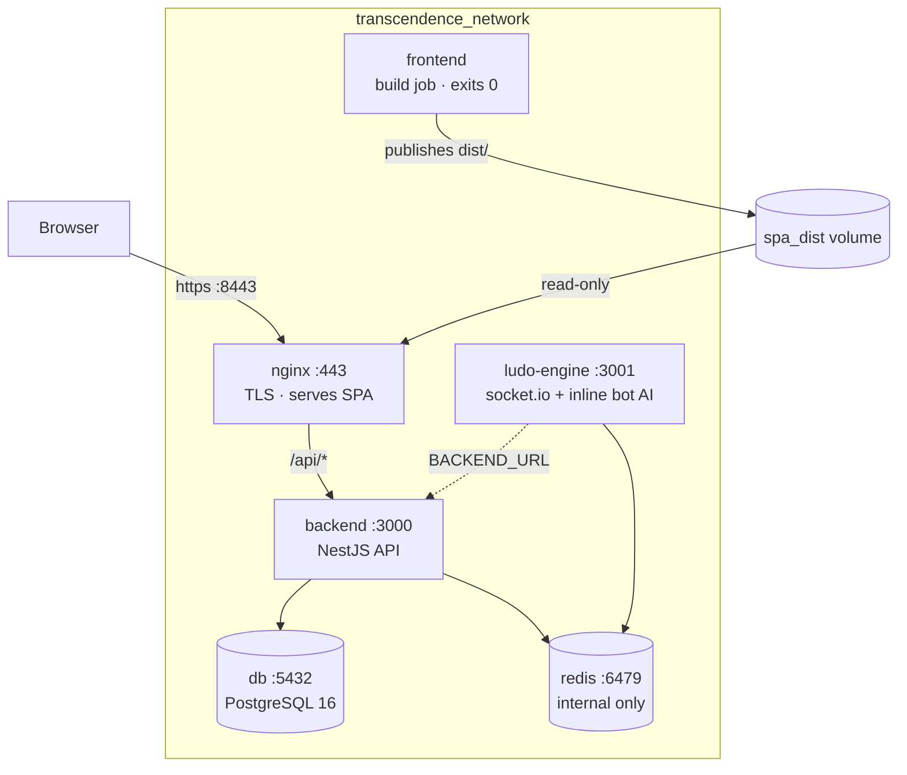

# Architecture

**Project:** ft_transcendence — RetroLudo '42
**Updated:** 2026-08-25

An eight-service Docker Compose stack: a React 19 SPA built by a one-shot job and
served over TLS by nginx, a NestJS REST API, a standalone real-time game engine
(with an inline bot AI), PostgreSQL, Redis, and a Prisma Studio DB browser. A
separate `frontend-dev` Vite HMR service is available for development only.

---

## Topology


```mermaid
graph TB
    Browser["Browser"]

    subgraph net["transcendence_network"]
        nginx["nginx :443<br/>TLS · serves SPA"]
        backend["backend :3000<br/>NestJS API"]
        engine["ludo-engine :3001<br/>socket.io + inline bot AI"]
        db[("db :5432<br/>PostgreSQL 16")]
        redis[("redis :6479<br/>internal only")]
        fe["frontend<br/>build job · exits 0"]
    end

    Browser -->|"https :8443"| nginx
    nginx -->|"/api/*"| backend
    fe -->|"publishes dist/"| spa[("spa_dist volume")]
    spa -->|"read-only"| nginx
    backend --> db
    backend --> redis
    engine --> redis
    engine -.->|"BACKEND_URL"| backend
```

> **Note:** Auth endpoints use `@Controller('api/auth')`, so they are proxied
> through nginx like all other API routes. There is no direct browser→backend
> path for auth.

---

## Services

External access URLs live in the [README](../README.md) **Access** section; the full
container / port / role breakdown is in the [Containers, images & volumes](#containers--images--volumes)
section below. This file keeps the deeper service notes:

Images are built from `Dockerfile`s in each service directory. `db` and `redis` wrap
their official images with an init script that reads secrets before `exec`ing the
real process (`backend/app/postgres_16_db/`, `backend/app/redis/`).

> **Note:** There is no separate `ludo-bot` container. The bot AI lives inside the
> `ludo-engine` process (`backend/app/ludo-engine/src/bot.ts`). The engine accepts
> a `bot` role in the JWT and can auto-fill slots with bot players.

---

## Containers, images & volumes

Everything is defined in the root `compose.yaml`. Image names are `<project>-<service>`
(e.g. `fixbugs-27thaug-backend`); every container attaches to the `transcendence_network`
bridge and reaches the others by service name.

### Containers

| Container | Image (base) | What runs inside | Host port → container port | Depends on |
|---|---|---|---|---|
| `db` | `…-db` (postgres:16-alpine) | `postgres_16_db-init.sh` validates `POSTGRES_PASSWORD`, then `exec`s the official postgres entrypoint → **PostgreSQL 16** | `127.0.0.1:5432 → 5432` | — |
| `redis` | `…-redis` (redis:7-alpine) | `redis-init.sh` writes `/tmp/redis.conf` (port 6479, AOF persistence, 256 MB LRU) then `exec redis-server … --requirepass` → **Redis 7** | `127.0.0.1:6479 → 6479` | — |
| `backend` | `…-backend` (node:22-alpine) | `docker-entrypoint.sh` validates env → `prisma db push --accept-data-loss` → `node dist/main.js` (**NestJS API** on 3000) | `127.0.0.1:3000 → 3000` | db (healthy), redis (healthy) |
| `studio` | `…-studio` (reuses the backend image) | `npx prisma studio --port 5555 --browser none` — **Prisma DB browser** over the `db` service (skips the backend entrypoint to avoid a `prisma db push` race) | `127.0.0.1:5555 → 5555` | db (healthy) |
| `ludo-engine` | `…-ludo-engine` (node:22-alpine) | `node dist/index.js` — **Socket.IO game engine + inline bot AI** on 3001 (not published; clients reach it same-origin via nginx) | — | redis (healthy) |
| `frontend` | `…-frontend` (node:22-alpine) | `publish.sh` — builds the **React SPA**, publishes it into the `spa_dist` volume, then watches `src/` and republishes on change (long-running build job) | — | — |
| `frontend-dev` *(profile: dev)* | `…-frontend-dev` (node:22-alpine, `Dockerfile.dev`) | `npm run dev` — **Vite dev server with HMR**, serves source from the bind mount | `8080 → 8080` | backend, ludo-engine |
| `nginx` | `…-nginx` (debian + nginx-extras) | `nginx.sh` waits for the backend health check, then `exec nginx -g "daemon off;"` — **TLS reverse proxy**: serves the SPA and proxies `/api/*` + `/socket.io/*` | `8443 → 443` | frontend (healthy), backend, ludo-engine |

### Volumes

| Volume | Mounted into | Purpose |
|---|---|---|
| `db_data` | `db → /var/lib/postgresql/data` | PostgreSQL data directory — survives container recreates |
| `redis_data` | `redis → /data` | Redis persistence (AOF + RDB snapshots) |
| `spa_dist` | `frontend → /export` (write), `nginx → /usr/share/nginx/html:ro` (read) | The SPA build handoff: `frontend` builds into it, `nginx` serves it read-only |

The compose file also uses **bind mounts** (host paths, not volumes): `./frontend → /app`
on `frontend` / `frontend-dev` so Vite watches live source, and
`./nginx/conf/nginx.conf` + `app.inc → /etc/nginx/*` so nginx config can be edited
without a rebuild.

### Network

`transcendence_network` (bridge) — all containers attach to it; `db`, `redis`,
`backend`, `ludo-engine`, and `nginx` resolve each other by service name.

---

## The SPA build handoff

The frontend is **not** a server. It is a one-shot job:

1. `frontend` builds the SPA (`tsc -b && vite build`) into `/app/dist`.
2. Its `CMD` copies that into `/export`, which is the `spa_dist` named volume, then exits 0.
3. `nginx` mounts `spa_dist` read-only at `/usr/share/nginx/html`.

`nginx` gates on `depends_on: frontend: condition: service_completed_successfully`,
so it cannot start against an empty document root on first boot.

> A single `📦 SPA published to spa_dist` log line followed by `exited (0)` is the
> success case for the `frontend` container, not a crash.

The nginx config is **bind-mounted** from `nginx/conf/nginx.conf`, so config edits
need only a container restart, not an image rebuild. The `Dockerfile` also `COPY`s it
as a fallback so the image stays runnable standalone.

---

## Request paths

**Static / SPA** — `https://localhost:8443/*` → nginx → `try_files $uri $uri/ /index.html`,
so client-side routing works on deep links. `frontend/src/router.tsx` is a custom
`window.location` router, not React Router.

**API** — `https://localhost:8443/api/*` → `proxy_pass http://backend:3000`. The `/api`
prefix is *preserved*, so controllers must include it themselves. There is no global
prefix in `backend/src/main.ts`; each controller carries `api/` in its own decorator.

**Auth** — `@Controller('api/auth')` includes the `api/` prefix, so `/api/auth/*`
is proxied through nginx to backend:3000. OAuth callback secrets point at
`http://localhost:3000` because the OAuth providers redirect back server-side.

**Game realtime** — the SPA connects to `socket.io` on its **own origin**: nginx
(and the Vite dev proxy) forwards `/socket.io/` to `ludo-engine:3001`
(`frontend/src/socket.ts` → `connectSocket`). The browser never needs to know the
engine's real hostname or port. The inline bot AI connects internally inside the
engine process.

---

## Data layer

### PostgreSQL

Prisma-managed, schema at `backend/prisma/schema.prisma`.

**Models:** `User` (account + per-user stats, avatar, counters), `Account` (OAuth provider links), `Achievement` (15 achievement flags), `Game`, `GameParticipant`, `Friendship`, `LeaderboardSnapshot`, `Notification`
**Enums:** `FriendshipStatus`, `PlayerColor`, `GameStatus`, `GameType`

Schema is applied with `npx prisma db push --accept-data-loss` from
`backend/docker-entrypoint.sh` on every boot. **There is no migration history** — this
is a deliberate project choice, so treat the schema file as the single source of truth
and never hand-edit the database.

`DATABASE_URL` is assembled at container start from `db_credentials.txt` +
`db_password.txt`, producing `@db:5432`. It is *not* read from `database_url.txt`,
which holds the host-side URL (`@localhost:5432`) for running the app outside Docker.
The two are not interchangeable.

### Redis

Several distinct uses:

- **Leaderboard cache** — `LeaderboardRedisService`, sorted sets keyed `leaderboard:{mode}`, with a PostgreSQL fallback on read failure.
- **Live game state** — `MatchService` (matchmaking, rematch, active games) and the engine's `RedisGameStore`.
- **Presence** — heartbeat keys per user for online/offline/playing status (`PresenceService`).
- **Notifications** — Redis Pub/Sub channels (`notify:<userId>`) bridge persisted notifications to the SSE stream (`NotificationService`).

Redis runs on the internal port **6479** with `requirepass` sourced from
`redis_password.txt`. The leaderboard, presence, session, two-factor, and
notification services all authenticate their Redis connections via
`secret('REDIS_PASSWORD')`. The matchmaking service and the engine's
`RedisGameStore` also authenticate.

---

## Backend modules

`backend/src/app.module.ts` composes **nine** feature modules:

| Module | Route prefix | Responsibility |
|---|---|---|
| `AuthModule` | `/api/auth` | Local + Google/GitHub/42 OAuth, 2FA, email verification, password reset, refresh tokens |
| `UserModule` | `/api/user` | Profile, avatar, game history |
| `FriendsModule` | `/api/friends` | Requests, accept/decline, block |
| `LeaderboardModule` | `/api/leaderboard` | Rankings, Redis-backed with Postgres fallback |
| `AchievementsModule` | `/api/achievements` | 15 Ludo achievements |
| `StatsModule` | `/api/stats` | Per-player aggregates |
| `MatchModule` | `/api/match`, `/api/game` | Matchmaking (PvP/PvE/hotseat), game lifecycle |
| `PresenceModule` | `/api/presence` | Online/offline/playing presence tracking |
| `NotificationModule` | `/api/notifications` | Persisted notifications + SSE stream (Redis pub/sub) |

### Auth flow

1. `GET /api/auth/{google,github,42}` → passport guard redirects to the provider.
2. Provider redirects to the callback URL from `secrets/{provider}_callback_url.txt`.
3. Strategy upserts `User` + `Account`, `AuthService` validates the user.
4. If the user has 2FA enabled, an email code is sent and the browser is redirected to `{FRONTEND_URL}/2fa?token={pendingToken}`.
5. If 2FA is disabled, a session is issued: a short-lived access token (15 min) and a long-lived refresh token (7 days) are set as `httpOnly`, `sameSite: lax` cookies named `token` and `refresh_token`.
6. Browser is redirected to `FRONTEND_URL` (`https://localhost:8443`).
7. `JwtStrategy` reads the access token from `req.cookies` — `cookieParser()` in `main.ts` is required for this.
8. When the access token expires, the SPA calls `POST /api/auth/refresh` with the `refresh_token` cookie to silently rotate the session.

---

## Configuration (.env)

See the [README](../README.md) **Configuration (.env)** section for the `.env` layout,
the `make env` pipeline, and the OAuth setup. This file keeps the implementation notes:

All configuration lives in the root `.env` (one `KEY=VALUE` per line). Containers load
it via compose's `env_file:`; host-side scripts load it through dotenv. `backend/src/secrets.ts`
is a single lookup point over `process.env`: `secret(name)` returns `undefined` when unset,
`requireSecret(name)` throws at boot on a missing value. The remaining `${...}` in
`compose.yaml` are non-secret topology values and all carry defaults.

---

## Dev vs. production paths

See the [README](../README.md) **Development mode** section for the two modes and
their URLs/ports. This file keeps the implementation note:

`frontend-dev` bind-mounts `./frontend:/app` with an anonymous volume over
`/app/node_modules` so the image's dependencies aren't shadowed by the host. Vite uses
`usePolling` when containerised — Docker Desktop on macOS does not deliver inotify
events through bind mounts, and HMR silently never fires without it.

`make dev` still brings up nginx, so the production path stays verifiable while you
iterate against HMR.

---

## Make targets

See the [README](../README.md) **Commands** section for the full list of make targets.

---

## Directory Layout

```
.
├── compose.yaml                  # Docker Compose — all 8 services
├── Makefile                      # Build / run / dev / secrets / tunnel targets
├── secrets/                      # File-based secrets (gitignored)
├── package.json                  # Root prisma dev dependency
├── unit-tests.sh                 # Backend + engine unit tests
├── unit-tests-achievements.sh    # Achievements-specific tests
│
├── backend/                      # NestJS REST API (port 3000)
│   ├── Dockerfile
│   ├── docker-entrypoint.sh      # Prisma push + app start
│   ├── package.json
│   ├── tsconfig.json
│   ├── nest-cli.json
│   ├── prisma.config.ts
│   │
│   ├── src/                      # NestJS feature modules (9)
│   │   ├── app.module.ts         # Root module (9 feature modules + throttler)
│   │   ├── main.ts               # Bootstrap, cookie-parser, CORS, /health
│   │   ├── prisma.service.ts     # Prisma client singleton
│   │   ├── secrets.ts            # File-based secret resolution
│   │   ├── common/               # Shared helpers
│   │   │   ├── scoring.ts        # ratingDeltaFor() — piece-based scoring
│   │   │   └── bot.ts            # isBotUserId() / BOT_PREFIX
│   │   │
│   │   ├── auth/                 # JWT + OAuth (Google, GitHub, 42) + 2FA + mail
│   │   │   ├── auth.controller.ts    # register, login, logout, me, 2FA, OAuth
│   │   │   ├── auth.service.ts       # Token signing, password hashing
│   │   │   ├── auth.module.ts
│   │   │   ├── twofactor.service.ts  # Email one-time-code 2FA (idempotent)
│   │   │   ├── session.service.ts    # Session/refresh concerns
│   │   │   ├── mail.service.ts       # SMTP mailer (nodemailer)
│   │   │   ├── jwt.strategy.ts       # Reads token from httpOnly cookie
│   │   │   ├── jwt-auth.guard.ts     # Route guard
│   │   │   ├── jwt-payload.ts        # Type definitions
│   │   │   ├── google.strategy.ts    # Google OAuth
│   │   │   ├── github.strategy.ts    # GitHub OAuth
│   │   │   ├── fortytwo.strategy.ts  # 42 (intra) OAuth
│   │   │   ├── ngrok_google_strategy.ts / ngrok_github_strategy.ts / ngrok_fortytwo_strategy.ts  # tunnel-mode OAuth
│   │   │   ├── oauth.guards.ts       # OAuth route guards
│   │   │   └── dto/                  # login, register, 2FA, password, profile DTOs
│   │   │
│   │   ├── user/                 # User profiles & game history
│   │   │   ├── user.controller.ts    # profile, games, avatar CRUD
│   │   │   ├── user.service.ts
│   │   │   └── user.module.ts
│   │   │
│   │   ├── friends/              # Friend system
│   │   │   ├── friends.controller.ts # request, accept, decline, remove, list, block
│   │   │   ├── friends.service.ts
│   │   │   └── friends.module.ts
│   │   │
│   │   ├── match/                # Matchmaking & game lifecycle
│   │   │   ├── match.controller.ts   # PvP/PvE/hotseat, rematch, game end
│   │   │   ├── match.service.ts      # Redis matchmaking, rating updates
│   │   │   ├── match.creator.service.ts  # game creation/join
│   │   │   ├── match.player.service.ts    # in-game actions
│   │   │   ├── match.query.service.ts     # active/lookup queries
│   │   │   ├── match.postgame.service.ts  # game-end scoring
│   │   │   └── match.module.ts
│   │   │
│   │   ├── leaderboard/          # Rankings
│   │   │   ├── leaderboard.controller.ts  # GET /api/leaderboard
│   │   │   ├── leaderboard.service.ts     # Postgres fallback
│   │   │   ├── leaderboard-redis.service.ts  # Redis sorted sets
│   │   │   └── leaderboard.module.ts
│   │   │
│   │   ├── achievements/         # 15 Ludo achievements
│   │   │   ├── achievements.controller.ts  # GET, POST /check
│   │   │   ├── achievements.service.ts
│   │   │   ├── achievements.registry.ts
│   │   │   └── achievements.module.ts
│   │   │
│   │   ├── player-stats/         # Per-player aggregates
│   │   │   ├── stats.controller.ts
│   │   │   ├── stats.service.ts
│   │   │   └── stats.module.ts
│   │   │
│   │   ├── presence/             # Online/offline/playing tracking
│   │   │   ├── presence.controller.ts  # heartbeat / clear
│   │   │   ├── presence.service.ts
│   │   │   ├── presence.module.ts
│   │   │   └── dto/heartbeat.dto.ts
│   │   │
│   │   └── notification/         # Notifications (SSE + Redis pub/sub)
│   │       ├── notification.controller.ts  # GET, PATCH /read, POST /read-all, SSE
│   │       ├── notification.service.ts
│   │       └── notification.module.ts
│   │
│   ├── app/
│   │   ├── ludo-engine/          # Standalone game engine (port 3001)
│   │   │   ├── Dockerfile
│   │   │   ├── package.json
│   │   │   ├── tsconfig.json
│   │   │   └── src/
│   │   │       ├── index.ts              # Entry point → SocketServer.start(3001)
│   │   │       ├── engine.ts             # LudoEngine orchestrator (roll, move, lock, events)
│   │   │       ├── clash-engine.ts       # ClashEngine — clash QTE orchestration
│   │   │       ├── turn.ts               # applyMoveOutcome — shared move completion
│   │   │       ├── move-validator.ts     # Legal move computation
│   │   │       ├── board-mapper.ts       # Board geometry (safe zones, tracks)
│   │   │       ├── clash.ts              # Clash constants + ClashManager
│   │   │       ├── bot.ts                # Heuristic bot AI
│   │   │       ├── player-handler.ts     # Disconnect/reconnect/exit/ready
│   │   │       ├── lobby.ts              # Lobby management (color selection)
│   │   │       ├── redis.ts              # RedisGameStore (persistence)
│   │   │       ├── types.ts              # GameState, PlayerColor, events
│   │   │       └── socket/
│   │   │           ├── server.ts             # SocketServer, engine-event routing + wiring
│   │   │           ├── socket-handlers.ts    # roll_dice, move_piece, clash_input, …
│   │   │           ├── join-manager.ts       # JoinManager — join_game flow
│   │   │           ├── bot-scheduler.ts      # BotTurnScheduler — bot turn timers
│   │   │           ├── post-game.ts          # PostGameManager — rematch / end_game
│   │   │           ├── auth.ts               # JWT middleware, GameSocket type
│   │   │           ├── event-publisher.ts    # Redis pub/sub → Socket.IO bridge
│   │   │           ├── redis-broadcaster.ts  # Room-based state broadcasts
│   │   │           └── result-submitter.ts   # POST /api/game/end to backend
│   │   │
│   │   ├── postgres_16_db/       # Custom PostgreSQL image
│   │   │   ├── Dockerfile
│   │   │   └── postgres_16_db-init.sh
│   │   └── redis/                # Custom Redis image (port 6479)
│   │       ├── Dockerfile
│   │       └── redis-init.sh
│   │
│   ├── prisma/
│   │   ├── schema.prisma         # DB schema (single source of truth)
│   │   ├── seed.ts               # Development seed data
│   │   ├── seed_friends.ts       # Friendship seed
│   │   ├── seed_user_profile.ts  # User profile seed
│   │   ├── sync_leaderboard.ts   # Leaderboard sync script
│   │   ├── drop-all.sql          # Drop-all script
│   │   ├── truncate-all.sql      # Truncate-all script
│   │   ├── migrations/           # Prisma migrations
│   │   └── ... (generated client output lives in backend/generated, gitignored)
│   │
│   └── scripts/
│       └── migrate-snapshot.sh
│
├── frontend/                     # React 19 SPA (Vite)
│   ├── Dockerfile                # Production build (publishes dist → spa_dist)
│   ├── Dockerfile.dev            # Vite HMR (dev profile)
│   ├── package.json
│   ├── vite.config.ts            # Dev proxies for /api and /socket.io
│   ├── tsconfig.json / tsconfig.app.json / tsconfig.node.json
│   ├── index.html
│   ├── .oxlintrc.json
│   ├── publish.sh
│   ├── public/                   # OAuth button images + logo
│   │
│   └── src/
│       ├── main.tsx              # React entry point
│       ├── App.tsx               # Root component (routes + auth guard)
│       ├── router.tsx            # Custom window.location router
│       ├── store.tsx             # React context + API + game/settings state
│       ├── api.ts                # Typed fetch wrapper (refresh + retry, ngrok)
│       ├── socket.ts             # Socket.IO client types + connectSocket()
│       ├── i18n.ts               # i18next init
│       ├── theme.ts              # Theme constants + bot pool
│       ├── index.css             # Global styles
│       ├── styles/retrowave.css  # Retro theme
│       ├── data.ts               # Mock/helper game data
│       ├── pages/                # Home, Login, Signup, TwoFactor, Forgot/ResetPassword,
│       │                         # LudoLobby, Lobby, Game, Results, Friends,
│       │                         # Leaderboard, Profile
│       ├── components/           # Shell, AuthLayout, RetroAuthLayout, RetroNavbar,
│       │                         # AccountMenu, NotificationBell/Toast, Board, Die,
│       │                         # JoinByCode, OAuthButtons, ProfileEditModal,
│       │                         # RankBadge, RulesModal, UserAvatar
│       ├── game/                 # reducer.ts, types.ts
│       ├── hooks/                # useNotifications.ts
│       ├── locales/              # en.ts, fr.ts, ms.ts
│       ├── utils/                # audio.ts, ranks.ts
│       └── assets/               # images/svg
│
├── nginx/                        # TLS termination & reverse proxy
│   ├── Dockerfile
│   ├── nginx.sh
│   └── conf/
│       ├── nginx.conf            # TLS server block
│       └── app.inc               # Shared routing (SPA, /api, /socket.io)
│
└── docs/                         # Documentation (local, gitignored)
    ├── architecture.md           # Full architecture reference (this file)
    ├── API-list.md               # Complete HTTP + WebSocket API reference
    ├── Ludo_Rules.md             # Classic Ludo rules
    ├── backend/                  # Backend module deep-dives (backend-*-module/system)
    ├── frontend/                 # Frontend deep-dives (frontend-*-module/system)
    └── ludo-engine/              # Engine internals (core, bot, lobby, socket, redis)
```
