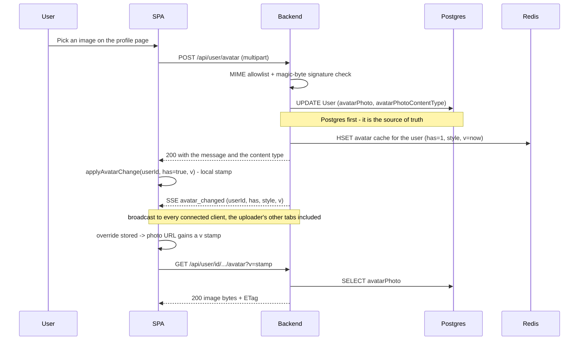
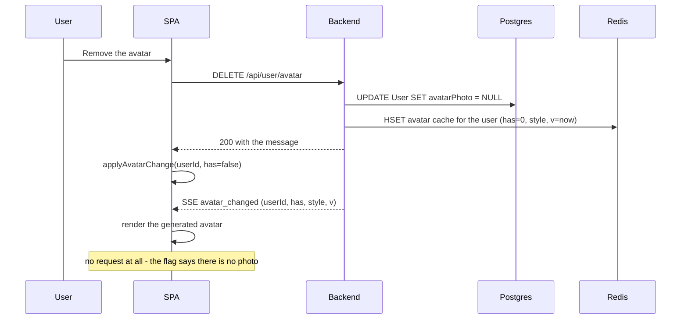
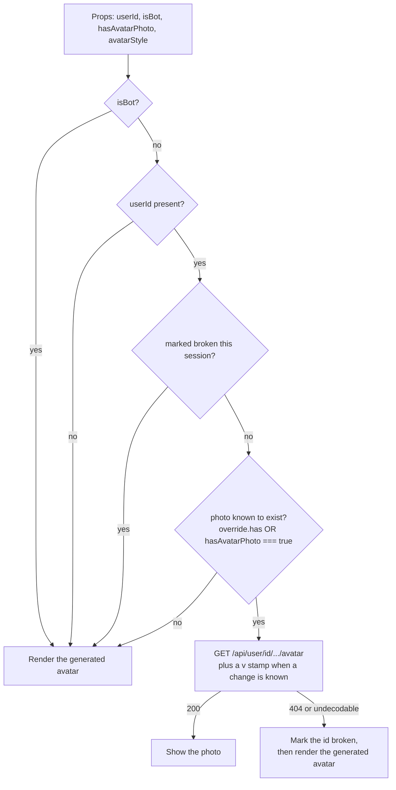
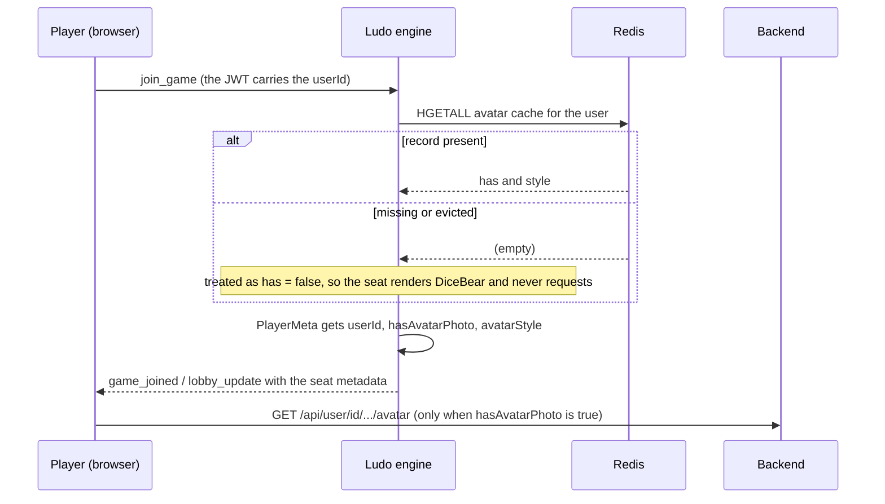
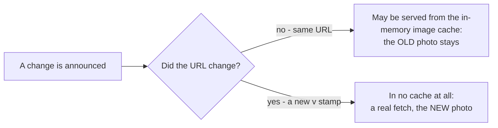

# Avatar System

## Table of Contents

- [Overview](#overview) — what the avatar system guarantees and how
- [Files](#files) — every file in the pipeline and its role
- [Storage & caching model](#storage--caching-model) — the four layers and which one is authoritative
- [Core Logic / Flow](#core-logic--flow) — Mermaid diagrams for upload, delete, rendering and game seats
- [Avatar system revamp policies](#avatar-system-revamp-policies) — rules the system depends on
- [Failure modes & guarantees](#failure-modes--guarantees) — what happens when a piece is missing
- [Verification](#verification) — how to check an avatar change end to end
- [Known limitations](#known-limitations) — accepted trade-offs and follow-ups

---

## Overview

Every account has one avatar. It is either a **photo the user uploaded** or a **generated DiceBear
image**. The system is built around four requirements:

1. A photo must appear, change or disappear on **every open client without a reload**.
2. A user with **no photo** must never cause a failed request (no 404s in the console).
3. A client must never keep showing a **stale photo** after a re-upload.
4. None of the above may depend on a **mutable identity** — display names are renameable.

The design in one line: **Postgres stores the bytes; a small Redis record stores the facts (does a
photo exist, which DiceBear style); the browser fetches the bytes over a URL it can revalidate; and a
stamped URL forces the re-fetch when something changes.**

Three properties make that work:

- **The immutable user id is the key everywhere** — the route, the Redis record, the SSE event, the
  engine's seat metadata and the client store. A display-name rename therefore cannot break a photo.
- **The flag is known before the request is made** — so a user without a photo is rendered from
  DiceBear and never fetched at all.
- **A change stamps the URL** (`?v=<stamp>`) — because React re-rendering alone cannot force a
  reload; a byte-identical URL can be answered from the browser's in-memory image cache with no
  request at all.

---

## Files

### Backend

| File | Role |
| --- | --- |
| `backend/src/avatar/avatar-meta.service.ts` | The Redis record `avatar:<userId>` → `{ has, style, v }`. `set()` writes it and returns the change stamp; `get()` reads it; `syncFromUser()` repairs it from a row the caller already loaded; `remove()` cleans up. |
| `backend/src/avatar/avatar-meta.module.ts` | Provides/exports `AvatarMetaService` (the same pattern as `NotificationService`). |
| `backend/src/avatar/image-signature.util.ts` | Magic-byte check so a mislabelled or truncated upload cannot be stored. |
| `backend/src/user/user.controller.ts` | `POST /api/user/avatar`, `DELETE /api/user/avatar`, `GET /api/user/id/:userId/avatar`. Owns the cache headers and the upload validation. |
| `backend/src/user/user.service.ts` | `getAvatarById()`; writes the Redis record **after** the Postgres commit in upload/delete; broadcasts `avatar_changed`; repairs the record on public-profile reads. |
| `backend/src/auth/auth.service.ts` | Seeds the record on register and on the OAuth creation path; repairs it on `/me`; removes it on account deletion. |
| `backend/src/notification/notification.controller.ts` | Transport for `avatar_changed`: the SSE stream plus its `SSE_HEARTBEAT_MS` keep-alive. |

### Ludo engine (reads the flag; has no database access)

| File | Role |
| --- | --- |
| `backend/app/ludo-engine/src/redis.ts` | `getAvatarMeta(userId)` — reads `avatar:<userId>`; `createGame` defaults `hasAvatarPhoto: false`. |
| `backend/app/ludo-engine/src/types.ts` | `PlayerMeta` carries `userId`, `hasAvatarPhoto`, `avatarStyle`. |
| `backend/app/ludo-engine/src/socket/join-manager.ts` | Fills those fields at join time (and `false` for bots). |
| `backend/app/ludo-engine/src/engine.ts` | `emitLobbyUpdate` sends the real values in the lobby roster. |

### Frontend

| File | Role |
| --- | --- |
| `frontend/src/components/UserAvatar.tsx` | The render decision: photo vs generated avatar, the bot guard, the `?v=` stamp, the `onError` fallback. |
| `frontend/src/avatarCache.ts` | Client avatar state: live overrides (`{ has, style, v }`), a per-user attempt stamp, and the `broken` set. |
| `frontend/src/hooks/useNotifications.tsx` | Applies the `avatar_changed` event to the store. |
| `frontend/src/pages/Profile.tsx` | Stamps the change locally on upload/delete, so the uploader's own view needs no SSE. |
| every `<UserAvatar>` call site | Passes `userId` (and `isBot` where the seat can be a bot). |

---

## Storage & caching model

The same avatar is represented in four places. Only the first is authoritative.

| # | Layer | Holds | Authoritative? | Lifetime |
| --- | --- | --- | --- | --- |
| 1 | **Postgres** — `User.avatarPhoto` (bytes) + `avatarPhotoContentType` | the image itself | **Yes** | durable |
| 2 | **Redis** — `avatar:<userId>` → `{ has, style, v }` | whether a photo exists, its DiceBear style, and a change stamp | No — a cache of Postgres | evictable (`allkeys-lru`, no AOF) |
| 3 | **HTTP** — `GET /api/user/id/:userId/avatar` | the image response body, plus `Cache-Control: public, no-cache, no-transform` and an `ETag` | No | browser cache, **revalidated on every use** |
| 4 | **Client memory** — `frontend/src/avatarCache.ts` | the last state the server announced per user, and which ids failed to load | No | this page session only |

Plus the **DiceBear fallback**, generated client-side from `username` + `avatarStyle` — it never
touches the network.

Why Redis exists at all: the **ludo engine has no database access**, so without a shared record it
cannot tell "this player has a photo" from "this player does not". Reading a miss as *maybe*
produces a 404 per seat; reading it as *no* hides real photos. The engine already shares the Redis
instance, so it reads the answer for free.

`v` is a change stamp (epoch ms). It is what the client turns into the photo URL's `?v=`.

### What an ETag is

An **ETag** is a short identifier the server sends with a response. It labels the exact version of
the bytes in that response. The next time the browser requests the same URL, it sends the identifier
back in an `If-None-Match` header:

| Server response | Browser action | Result |
| --- | --- | --- |
| `200` + `ETag: "abc"` | stores the image together with the identifier | the photo is shown |
| `304 Not Modified` (identifier unchanged) | reuses the stored copy | no image body is transferred |
| `200` with a new `ETag` (bytes changed) | replaces the stored copy | the new photo is shown |

Express sets the ETag itself from the response body on the avatar route. That is what makes the
stable URL work: an unchanged photo costs one small `304`, and a re-uploaded photo returns the new
bytes.

`no-cache` does not mean "do not store". It means "store, then check with the server before every
reuse". `no-store`, which the `404` for a user with no photo uses, means "do not store this at all".

---

## Avatar system revamp policies

1. **Postgres is written first; Redis is written second.** Writing Redis first could leave `has=1`
   with no bytes behind it — a guaranteed 404.
2. **A missing Redis record means "no photo".** Consumers must not guess *maybe*.
3. **Bots are never asked for a photo.** `UserAvatar` takes an explicit `isBot` guard regardless of
   what the flags say.
4. **Nothing is keyed by a display name.** Avatars use `userId` everywhere.
5. **A change stamps the URL.** React awareness alone cannot defeat the browser's in-memory image
   cache.
6. **The flag must be known before the request.** A client that asks anyway logs a 404.
7. **The SSE keep-alive must stay enabled.** SSE has no replay, so a stream that gets reset loses any
   `avatar_changed` event published during the drop.

---

## Core Logic / Flow

### 1. Upload



Two clients are satisfied by two different paths, and that is deliberate: **the uploader's own view
is updated locally** (`applyAvatarChange`, no network round trip for the decision), while **everyone
else learns from the SSE event**. Neither depends on the other.

### 2. Delete



`has: false` is why a delete produces **no 404s**: every client drops straight back to DiceBear
without asking for an image that no longer exists.

### 3. Render decision (`UserAvatar`)



Only the branch that knows a photo exists issues a request. Every other branch renders the generated
avatar directly and sends nothing, which is what keeps the console clean. A flag the client never
received is also treated as "no photo": showing the generated avatar is better than a 404 per seat.

### 4. Game seats (waiting room, live game)



The engine has no database access, so this read is its only source of the flag. A record that is
missing or was evicted falls back to the generated avatar — never to a 404 — and the backend repairs the record the next time it reads that user (`syncFromUser` on `/me` or a public profile).

### 5. Why the URL is stamped

This is the subtlest part of the system, and the reason `?v=` exists.

The photo URL is **stable** — `/api/user/id/{userId}/avatar`. The response is served
`Cache-Control: public, no-cache, no-transform`, which *should* mean "revalidate before reuse". But a
byte-identical URL can also be answered from the browser's **in-memory image cache without any
request being made at all**, in which case `no-cache` never gets the chance to revalidate and the
client keeps the old photo even though its store already knows about the change.



So whenever a change is known, the URL gains `?v=<stamp>`:

| Source of the stamp | When it applies |
| --- | --- |
| the SSE `avatar_changed` event's `v` | every other connected client |
| `Date.now()` in `Profile.tsx` | the uploader's own client, immediately and without SSE |

On a **fresh page load** there is nothing cached for the bare URL, so the base URL is fetched and
revalidated normally — the stamp is only needed once a change happens inside a session.

---

## Failure modes & guarantees

| What fails | What the user sees | Why it is safe |
| --- | --- | --- |
| The Redis record is missing or evicted | the generated avatar | Consumers read a miss as `has: false`, so nothing is requested; the backend repairs the record the next time it loads that user. |
| The SSE event is missed (stream reset) | the old image until the next mount or reload | The bare URL still revalidates on load, so the client self-corrects. Only the *instant* update is lost. |
| A stale `has: true` with no bytes behind it | one failed load, then the generated avatar | `onError` marks the id broken for the session, so it is not retried. |
| A corrupt or mislabelled upload | `400 Bad Request` | Magic-byte validation runs before anything is written, so an undecodable image never becomes the stored truth. |
| An image the browser cannot decode | the generated avatar | Same `onError` path as a 404 — the marker covers both. |
| Postgres is unavailable | the upload/delete fails with an error | Redis is only written after the Postgres write succeeds, so a `has: true` record with no stored photo cannot be created. |

---

## Verification

```bash
# 1. Headers + ETag on a user who has a photo
curl -skI https://localhost:8443/api/user/id/<userId>/avatar
#    expect 200, Content-Type: image/*, Cache-Control: public, no-cache, no-transform, ETag

# 2. Revalidation is a 304
curl -skI -H 'If-None-Match: <etag>' https://localhost:8443/api/user/id/<userId>/avatar

# 3. No photo -> 404 that can never be cached
curl -skI https://localhost:8443/api/user/id/<userId-without-photo>/avatar
#    expect 404 + Cache-Control: no-store

# 4. The Redis record
docker exec redis sh -c 'redis-cli -p 6479 -a "$REDIS_PASSWORD" --no-auth-warning \
  hgetall avatar:<userId>'
#    expect has / style / v, and v changing on each upload or delete
```

Then in the browser, with DevTools open:

1. Upload an avatar; **Network** must show `/api/user/id/…/avatar?v=…` returning `200` — **not**
   `(memory cache)`.
2. Reload the page; the photo is still correct and the bare URL is revalidated (`304`).
3. Delete the avatar; it falls back to DiceBear with **no image request at all**.
4. In a waiting room, watch the other player's seat update **without a reload**, and confirm the
   console has no avatar 404s.

---

## Known limitations

- **The Redis record can be evicted** (`allkeys-lru`, `appendonly no`). A miss shows the generated
  avatar, never a 404, and is repaired from Postgres on the next `/me` or public-profile read. The
  record carries no TTL, so repair is the only mechanism that corrects it.
- **`PlayerMeta` stores the flag at join time.** A change made while players sit in the room arrives
  through the SSE event. A client that misses that event shows the old image until the next mount,
  when the plain URL is revalidated. Reading the records again in `emitLobbyUpdate` would reduce that
  window.
- **`ResultsModal` shows no photos for opponents.** The client-side `LastResult` carries no ids, so
  opponents render the generated avatar.
- **Uploads are checked by MIME and magic bytes, not decoded.** An unusual image with a valid
  signature can still fail to decode in the browser; the `broken` marker handles that case instead of
  retrying it.
- **`PlayerMeta.username` is still the display name.** Avatars use `userId` and no longer depend on
  it, but other checks that compare `playerMeta.username` with `user?.username` break after a rename.
