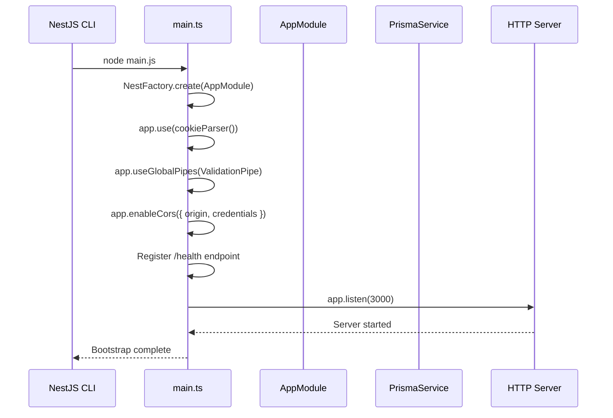
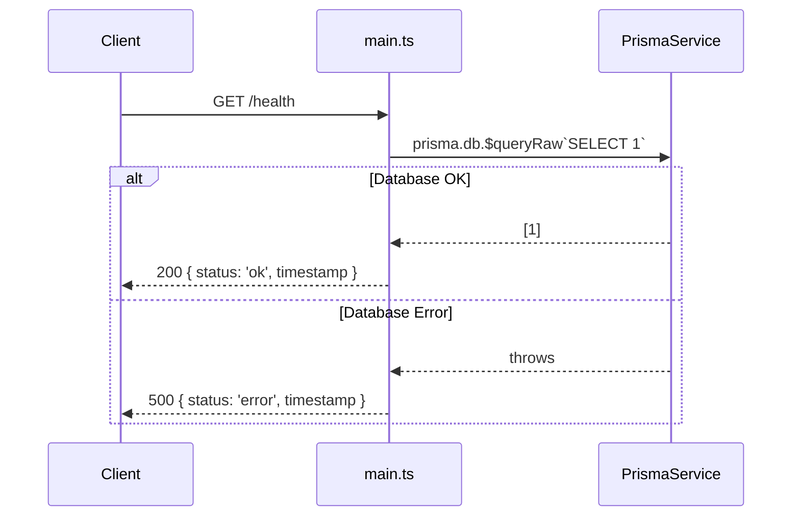
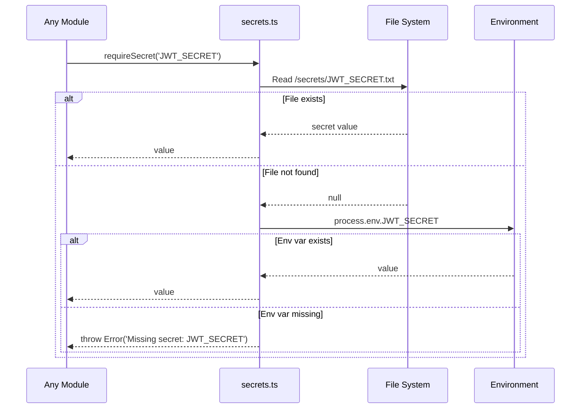
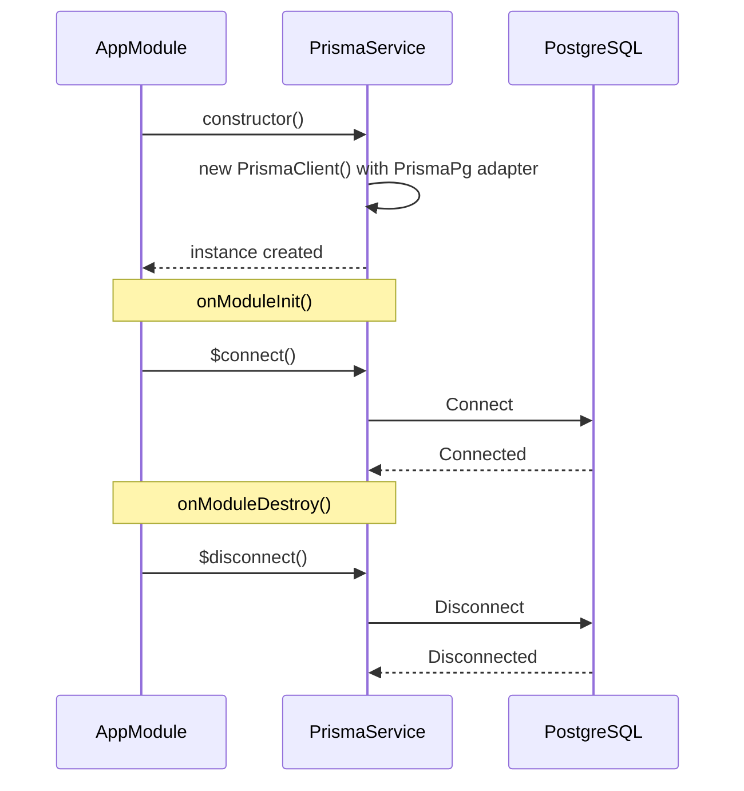

# App Bootstrap Module

## Table of Contents

- [Overview](#overview) — Application entry point, module wiring, and shared infrastructure
- [Files](#files) — Every source file in the module and its role
- [Key Types / Interfaces](#key-types--interfaces) — Configuration and service interfaces
- [API Endpoints](#api-endpoints) — Health check endpoint
- [Core Logic / Flow](#core-logic--flow) — Bootstrap sequence, health check flow, secret resolution
- [Logic Paths Summary](#logic-paths-summary) — Decision trees for bootstrap and health check
- [Dependencies](#dependencies) — npm packages and internal services this module relies on
- [Configuration / Environment](#configuration--environment) — Environment variables and secrets

---

## Overview

The App Bootstrap module is the root of the NestJS application. It:

1. **Bootstraps** the NestJS server via `main.ts` — configures CORS, cookie parsing, global validation pipes, and a health check endpoint.
2. **Wires modules** together via `app.module.ts` — imports all 7 feature modules and provides `PrismaService` globally.
3. **Provides database access** via `PrismaService` — a singleton wrapper around PrismaClient with PrismaPg adapter for PostgreSQL.
4. **Manages secrets** via `secrets.ts` — reads one-value-per-file from a configurable secrets directory with environment variable fallback.

---

## Files

| File | Role |
|------|------|
| `main.ts` | Application entry point — creates NestJS app, configures middleware, starts HTTP server on port 3000 |
| `app.module.ts` | Root module — imports all feature modules, registers PrismaService |
| `prisma.service.ts` | Injectable PrismaClient wrapper with `onModuleInit`/`onModuleDestroy` lifecycle hooks |
| `secrets.ts` | Utility functions `secret()` and `requireSecret()` for reading secrets from files or env vars |

---

## Key Types / Interfaces

### PrismaService

```typescript
class PrismaService implements OnModuleInit, OnModuleDestroy {
  db: PrismaClient;  // Exposes the PrismaClient instance
}
```

### Secret Functions

```typescript
function secret(key: string): string | undefined;       // Returns undefined if missing
function requireSecret(key: string): string;             // Throws if missing
```

---

## API Endpoints

| Method | Path | Auth | Description |
|--------|------|------|-------------|
| `GET` | `/health` | None | Database connectivity health check |

---

## Core Logic / Flow

### 1. Application Bootstrap Flow

Sequence of steps when the NestJS application starts up — middleware registration, module wiring, and server listen.


### 2. Health Check Flow

Sequence of steps when a client hits `GET /health` — verifies database connectivity and returns status.


### 3. Secret Resolution Flow

Sequence of steps when any module requests a secret — tries file system first, falls back to environment variables.


### 4. PrismaService Lifecycle

Sequence of steps during PrismaService construction, database connection (`onModuleInit`), and disconnection (`onModuleDestroy`).


---

## Logic Paths Summary

### Bootstrap Path
```
npm run start:dev (or node main.js)
  ├── NestFactory.create(AppModule)
  │   ├── Import AuthModule, UserModule, FriendsModule, LeaderboardModule,
  │   │       AchievementsModule, StatsModule, MatchModule
  │   └── Register PrismaService as provider + export
  ├── app.use(cookieParser())
  ├── app.useGlobalPipes(ValidationPipe { whitelist, transform })
  ├── app.enableCors({ origin, credentials })
  ├── Register GET /health handler
  └── app.listen(3000)
```

### Health Check Path
```
GET /health
  ├── prisma.db.$queryRaw`SELECT 1`
  │   ├── Success → 200 { status: 'ok', timestamp }
  │   └── Error   → 500 { status: 'error', timestamp }
```

### Secret Resolution Path
```
requireSecret(key) / secret(key)
  ├── Read /secrets/{key}.txt
  │   ├── File exists → return value
  │   └── File missing → fallback to process.env[key]
  │       ├── Env var exists → return value
  │       └── Env var missing
  │           ├── requireSecret() → throw Error
  │           └── secret() → return undefined
```

---

## Dependencies

| Dependency | Purpose |
|-----------|---------|
| `@nestjs/core` | NestJS framework core |
| `@nestjs/common` | Decorators, pipes, guards |
| `@nestjs/platform-express` | Express adapter |
| `cookie-parser` | Parse cookies from HTTP requests |
| `@prisma/client` | Prisma ORM client |
| `@prisma/adapter-pg` | Prisma PostgreSQL adapter (Prisma 7) |
| `reflect-metadata` | TypeScript decorator support |
| `rxjs` | Reactive extensions for NestJS |

---

## Configuration / Environment

| Variable | Default | Used By |
|----------|---------|---------|
| `NODE_ENV` | `development` | CORS origin selection, cookie `secure` flag |
| `DATABASE_URL` | (from secrets) | PrismaService database connection |
| `SECRETS_DIR` | `/secrets` → `../secrets` → `./secrets` | secrets.ts file lookup path |
| `PORT` | 3000 | HTTP server listen port (hardcoded in main.ts) |