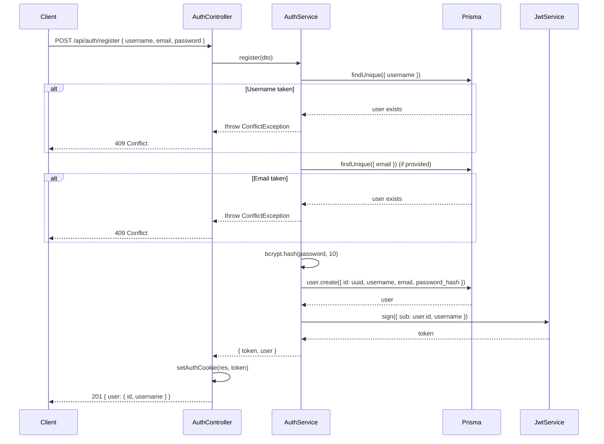
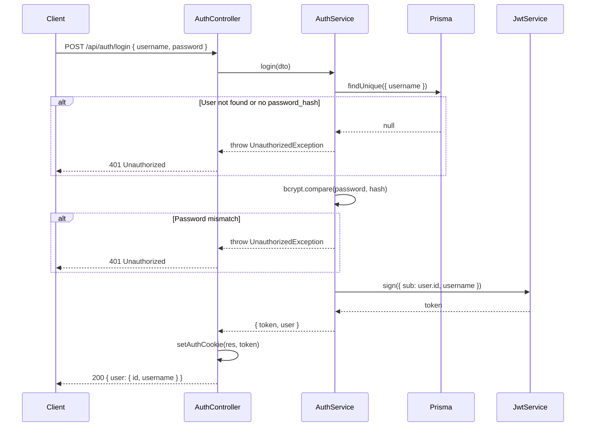
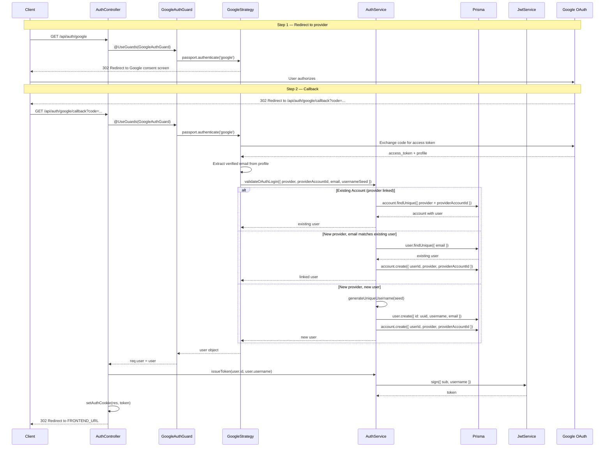
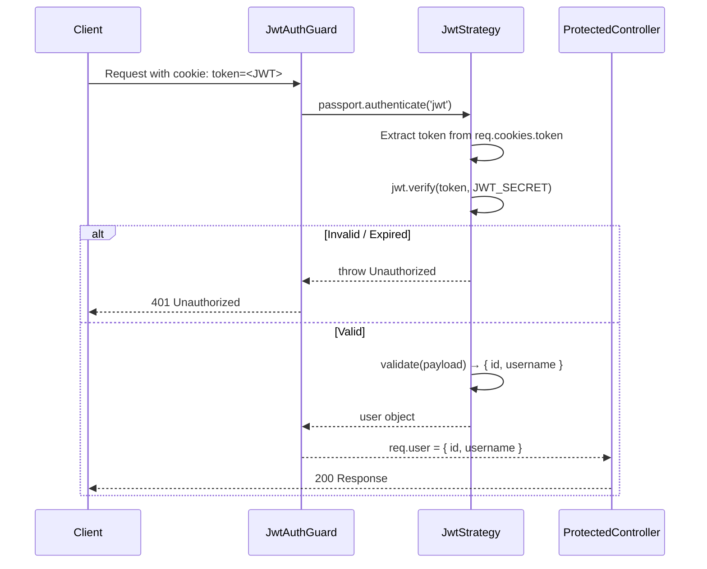
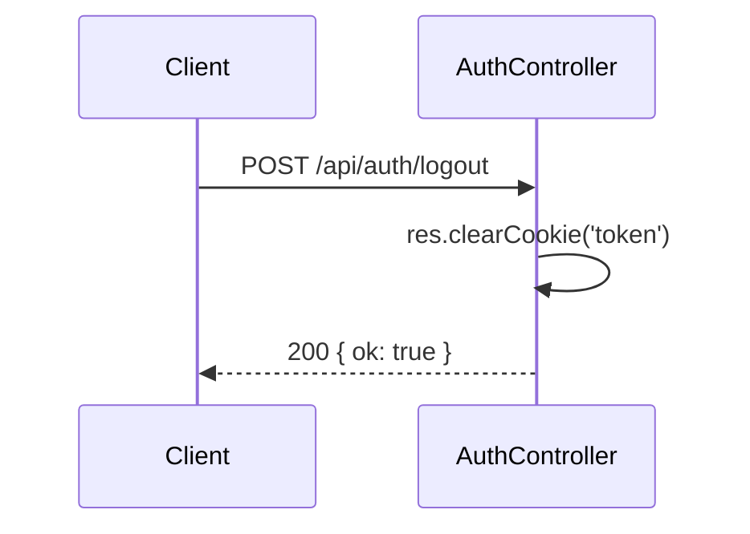

# Auth Module

## Table of Contents

- [Overview](#overview) — What the Auth module does and the two authentication flows it supports
- [Files](#files) — Every source file in the module and its role
- [Key Types / Interfaces](#key-types--interfaces) — DTOs, JWT payload, and validation constraints
- [API Endpoints](#api-endpoints) — All 10 routes with method, path, auth, and description
- [Core Logic / Flow](#core-logic--flow) — Mermaid sequence diagrams for registration, login, OAuth, JWT validation, and logout
- [Logic Paths Summary](#logic-paths-summary) — Plain-text decision trees for quick reference
- [Dependencies](#dependencies) — npm packages and internal services this module relies on
- [Configuration / Environment](#configuration--environment) — Secrets and environment variables used
- [Module Exports](#module-exports) — What AuthModule re-exports for other modules

---

## Overview

The Auth module handles all authentication concerns for the Ludo Transcendence application. It supports two authentication flows:

1. **Password-based auth** — users register with a username/email/password or log in with existing credentials. A JWT is issued and stored in an httpOnly cookie.
2. **OAuth 2.0** — users authenticate via Google, GitHub, or 42 (School 42 intra). On first login with a provider, a local user account is created or linked to an existing one by email.

The module also provides the `JwtAuthGuard` used by other modules to protect their endpoints.

---

## Files

| File | Role |
|------|------|
| `auth.module.ts` | NestJS module — registers Passport, JwtModule, all strategies, and exports them for other modules |
| `auth.controller.ts` | HTTP routes: register, login, logout, /me, and 3 OAuth flows |
| `auth.service.ts` | Core business logic: password hashing (bcrypt), JWT issuance, OAuth validation, unique username generation |
| `jwt.strategy.ts` | Passport strategy that extracts JWT from the `token` cookie |
| `jwt-auth.guard.ts` | `@UseGuards(JwtAuthGuard)` decorator — protects routes behind JWT |
| `jwt-payload.ts` | TypeScript interface for the JWT payload: `{ sub: string; username: string }` |
| `google.strategy.ts` | Passport strategy for Google OAuth 2.0 |
| `github.strategy.ts` | Passport strategy for GitHub OAuth (with `allRawEmails` for verified email detection) |
| `fortytwo.strategy.ts` | Passport strategy for 42 OAuth |
| `oauth.guards.ts` | Guard classes: `GoogleAuthGuard`, `GithubAuthGuard`, `FortyTwoAuthGuard` |
| `dto/register.dto.ts` | Validation schema for `POST /api/auth/register` |
| `dto/login.dto.ts` | Validation schema for `POST /api/auth/login` |

---

## Key Types / Interfaces

### JwtPayload

```typescript
interface JwtPayload {
  sub: string;    // user UUID
  username: string;
}
```

### RegisterDto

| Field | Type | Constraints |
|-------|------|-------------|
| `username` | string | 3–20 chars, alphanumeric + underscore only |
| `email` | string? | Optional, valid email format |
| `password` | string | 8–72 chars, must contain at least one letter and one digit |

### LoginDto

| Field | Type | Constraints |
|-------|------|-------------|
| `username` | string | Required |
| `password` | string | Required, min 1 char |

---

## API Endpoints

| Method | Path | Auth | Description |
|--------|------|------|-------------|
| `POST` | `/api/auth/register` | None | Create account, set JWT cookie |
| `POST` | `/api/auth/login` | None | Authenticate, set JWT cookie |
| `POST` | `/api/auth/logout` | None | Clear JWT cookie |
| `GET` | `/api/auth/me` | JWT | Return current user from cookie |
| `GET` | `/api/auth/google` | None | Redirect to Google OAuth |
| `GET` | `/api/auth/google/callback` | None | Google OAuth callback |
| `GET` | `/api/auth/github` | None | Redirect to GitHub OAuth |
| `GET` | `/api/auth/github/callback` | None | GitHub OAuth callback |
| `GET` | `/api/auth/42` | None | Redirect to 42 OAuth |
| `GET` | `/api/auth/42/callback` | None | 42 OAuth callback |

### Cookie Configuration

The JWT is stored in an httpOnly cookie named `token`:

| Property | Value |
|----------|-------|
| Name | `token` |
| httpOnly | `true` |
| sameSite | `lax` |
| secure | `true` in production |
| maxAge | 7 days (matches JWT expiry) |

---

## Core Logic / Flow

### 1. Password Registration Flow



### 2. Password Login Flow



### 3. OAuth Flow (Google / GitHub / 42)

All three providers follow the same pattern. The example below uses Google:



### 4. JWT Validation on Protected Routes



### 5. Logout



---

## Logic Paths Summary

Concise decision trees showing every code path through each auth operation, including error branches.

### Registration Path

Sequence of steps when a new user creates an account via `POST /api/auth/register`.
```
POST /api/auth/register
  ├── Validate RegisterDto (class-validator)
  ├── Check username uniqueness → 409 if taken
  ├── Check email uniqueness (if provided) → 409 if taken
  ├── bcrypt.hash(password, 10)
  ├── Prisma user.create()
  ├── Jwt.sign({ sub, username })
  ├── Set httpOnly cookie
  └── Return { user }
```

### Login Path

Sequence of steps when an existing user authenticates via `POST /api/auth/login`.
```
POST /api/auth/login
  ├── Validate LoginDto
  ├── Find user by username → 401 if not found
  ├── bcrypt.compare(password, hash) → 401 if mismatch
  ├── Jwt.sign({ sub, username })
  ├── Set httpOnly cookie
  └── Return { user }
```

### OAuth Path (Google / GitHub / 42)

Sequence of steps when a user authenticates via any of the three OAuth providers (Google, GitHub, or 42).
```
GET /api/auth/{provider}
  └── Redirect to provider consent screen

GET /api/auth/{provider}/callback
  ├── Exchange code for access token + profile
  ├── Extract verified email from profile
  ├── validateOAuthLogin():
  │   ├── Check existing Account → return linked user
  │   ├── Check email match → link provider to existing user
  │   └── Create new user + account
  ├── issueToken(user.id, user.username)
  ├── Set httpOnly cookie
  └── Redirect to FRONTEND_URL
```

### Authenticated Request Path

Sequence of steps when a client makes a request to a JWT-protected endpoint (e.g. `GET /api/auth/me`).
```
GET /api/auth/me (or any @UseGuards(JwtAuthGuard) route)
  ├── Extract token from cookie
  ├── jwt.verify(token, JWT_SECRET)
  │   ├── Invalid → 401
  │   └── Valid → attach { id, username } to req.user
  └── Execute handler
```

---

## Dependencies

| Dependency | Purpose |
|-----------|---------|
| `@nestjs/jwt` | JWT signing and verification |
| `@nestjs/passport` | Passport integration for NestJS |
| `passport` | Authentication middleware |
| `passport-jwt` | JWT extraction strategy |
| `passport-google-oauth20` | Google OAuth 2.0 |
| `passport-github2` | GitHub OAuth |
| `passport-42` | 42 School OAuth |
| `bcrypt` | Password hashing |
| `class-validator` | DTO validation |
| `PrismaService` | Database access (User, Account models) |
| `secrets.ts` | Reads JWT_SECRET, OAuth client IDs/secrets/callback URLs from `/secrets/` files |

---

## Configuration / Environment

Secrets are loaded from `/secrets/*.txt` files at runtime via `secrets.ts` (with environment variable fallback):

| Secret | Used By |
|--------|---------|
| `JWT_SECRET` | JwtModule, JwtStrategy |
| `GOOGLE_CLIENT_ID` | GoogleStrategy |
| `GOOGLE_CLIENT_SECRET` | GoogleStrategy |
| `GOOGLE_CALLBACK_URL` | GoogleStrategy |
| `GITHUB_CLIENT_ID` | GithubStrategy |
| `GITHUB_CLIENT_SECRET` | GithubStrategy |
| `GITHUB_CALLBACK_URL` | GithubStrategy |
| `FORTYTWO_CLIENT_ID` | FortyTwoStrategy |
| `FORTYTWO_CLIENT_SECRET` | FortyTwoStrategy |
| `FORTYTWO_CALLBACK_URL` | FortyTwoStrategy |
| `FRONTEND_URL` | AuthController (OAuth redirect target, defaults to `https://localhost:8443`) |

---

## Module Exports

The `AuthModule` re-exports `AuthService`, `JwtModule`, and `PassportModule` so that other feature modules (e.g. MatchModule, FriendsModule) can use `JwtAuthGuard` and `JwtService` without registering a second, secret-less JwtModule instance.