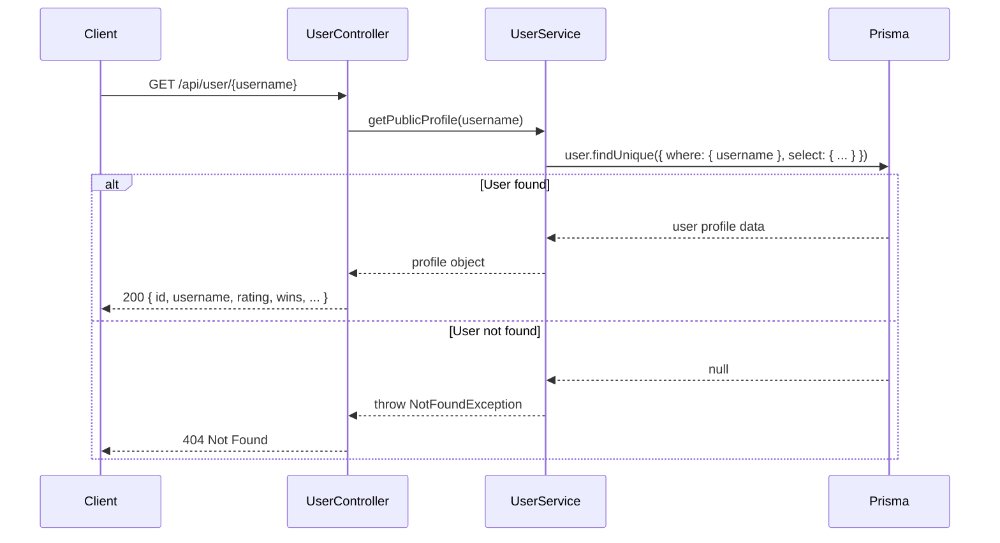
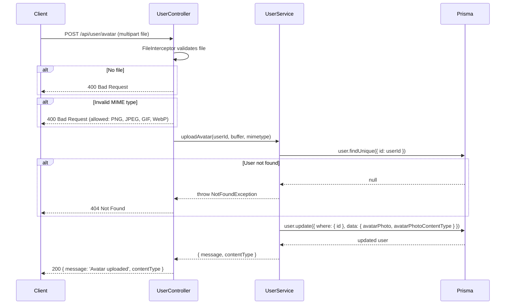
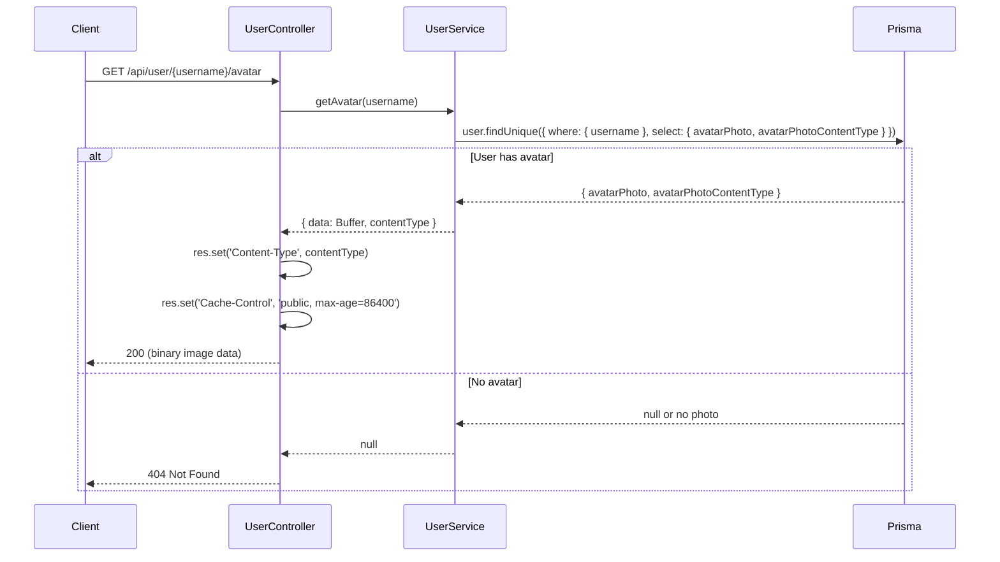
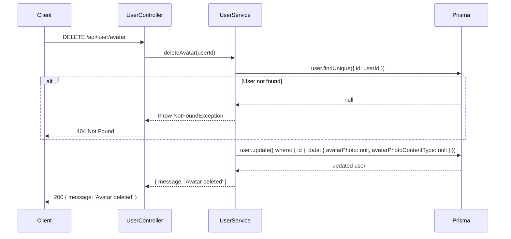
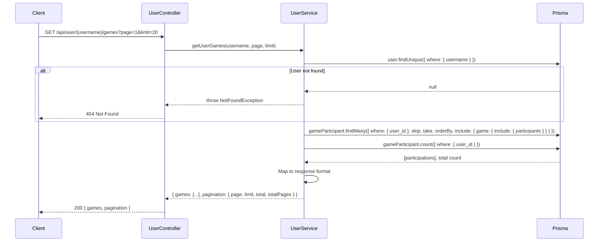

# User Module

## Table of Contents

- [Overview](#overview) — Public profile retrieval, avatar management, and game history
- [Files](#files) — Every source file in the module and its role
- [Key Types / Interfaces](#key-types--interfaces) — Profile data shape and query parameters
- [API Endpoints](#api-endpoints) — All 5 routes with method, path, auth, and description
- [Core Logic / Flow](#core-logic--flow) — Mermaid sequence diagrams for profile, avatar, and game history
- [Logic Paths Summary](#logic-paths-summary) — Decision trees for each operation
- [Dependencies](#dependencies) — Internal services this module relies on
- [Configuration / Environment](#configuration--environment) — Environment variables used

---

## Overview

The User module handles public user profiles, avatar upload/retrieval, and game history. It provides:

1. **Public profiles** — anyone can view a user's stats (rating, wins, streaks, etc.) by username.
2. **Avatar management** — authenticated users can upload, retrieve, and delete their avatar image.
3. **Game history** — paginated list of a user's past games with participant details.

---

## Files

| File | Role |
|------|------|
| `user.controller.ts` | HTTP routes: public profile, avatar CRUD, game history |
| `user.service.ts` | Business logic: Prisma queries for profile, avatar storage, game history pagination |
| `user.module.ts` | NestJS module — registers controller, service, and PrismaService |

---

## Key Types / Interfaces

### Public Profile Shape

```typescript
{
  id: string;
  username: string;
  avatarStyle: string | null;
  rating: number;
  highestRating: number;
  wins: number;
  losses: number;
  winStreak: number;
  bestWinStreak: number;
  botWins: number;
  humanWins: number;
  daysActive: number;
  loginStreak: number;
  createdAt: Date;
}
```

### Game History Response

```typescript
{
  games: Array<{
    gameId: string;
    status: GameStatus;
    color: PlayerColor;
    rank: number | null;
    piecesCaptured: number;
    piecesInGoal: number;
    startedAt: Date;
    endedAt: Date | null;
    participants: Array<{
      username: string;
      avatarStyle: string | null;
      color: PlayerColor;
      rank: number | null;
      piecesInGoal: number;
    }>;
  }>;
  pagination: {
    page: number;
    limit: number;
    total: number;
    totalPages: number;
  };
}
```

---

## API Endpoints

| Method | Path | Auth | Description |
|--------|------|------|-------------|
| `GET` | `/api/user/:username` | None | Get public profile by username |
| `GET` | `/api/user/:username/games` | None | Get paginated game history for a user |
| `POST` | `/api/user/avatar` | JWT | Upload avatar image (max 2MB, PNG/JPEG/GIF/WebP) |
| `GET` | `/api/user/:username/avatar` | None | Retrieve avatar image binary |
| `DELETE` | `/api/user/avatar` | JWT | Delete current user's avatar |

---

## Core Logic / Flow

### 1. Get Public Profile

Sequence of steps when a client requests a user's public profile by username.


### 2. Upload Avatar

Sequence of steps when an authenticated user uploads a new avatar image.


### 3. Get Avatar

Sequence of steps when a client retrieves a user's avatar image.


### 4. Delete Avatar

Sequence of steps when an authenticated user deletes their avatar.


### 5. Get Game History

Sequence of steps when a client requests a user's paginated game history.


---

## Logic Paths Summary

### Get Public Profile Path
```
GET /api/user/{username}
  ├── user.findUnique({ where: { username } })
  │   ├── Found → 200 { id, username, rating, wins, losses, ... }
  │   └── Not found → 404 Not Found
```

### Upload Avatar Path
```
POST /api/user/avatar (JWT required)
  ├── FileInterceptor validates file presence → 400 if missing
  ├── Validate MIME type (PNG/JPEG/GIF/WebP) → 400 if invalid
  ├── user.findUnique({ id: userId }) → 404 if not found
  ├── user.update({ avatarPhoto, avatarPhotoContentType })
  └── 200 { message: 'Avatar uploaded', contentType }
```

### Get Avatar Path
```
GET /api/user/{username}/avatar
  ├── user.findUnique({ where: { username }, select: { avatarPhoto, contentType } })
  │   ├── Has avatar → 200 with binary data + Content-Type header + Cache-Control
  │   └── No avatar → 404 Not Found
```

### Delete Avatar Path
```
DELETE /api/user/avatar (JWT required)
  ├── user.findUnique({ id: userId }) → 404 if not found
  ├── user.update({ avatarPhoto: null, avatarPhotoContentType: null })
  └── 200 { message: 'Avatar deleted' }
```

### Get Game History Path
```
GET /api/user/{username}/games?page=1&limit=20
  ├── user.findUnique({ where: { username } }) → 404 if not found
  ├── gameParticipant.findMany({ where: { user_id }, skip, take, orderBy, include })
  ├── gameParticipant.count({ where: { user_id } })
  └── 200 { games: [...], pagination: { page, limit, total, totalPages } }
```

---

## Dependencies

| Dependency | Purpose |
|-----------|---------|
| `PrismaService` | Database access (User, GameParticipant, Game models) |
| `JwtAuthGuard` | Protects avatar upload/delete endpoints |
| `@nestjs/platform-express` | FileInterceptor for multipart uploads |

---

## Configuration / Environment

| Variable | Default | Used By |
|----------|---------|---------|
| (none) | — | No module-specific environment variables |