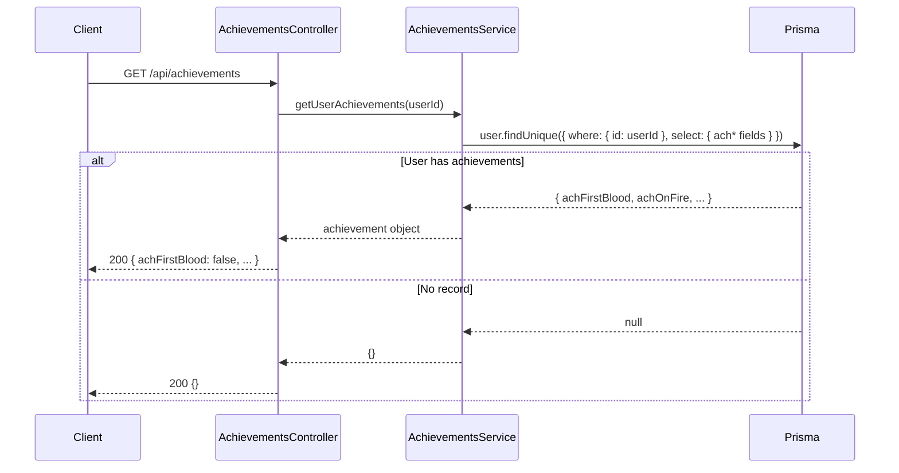
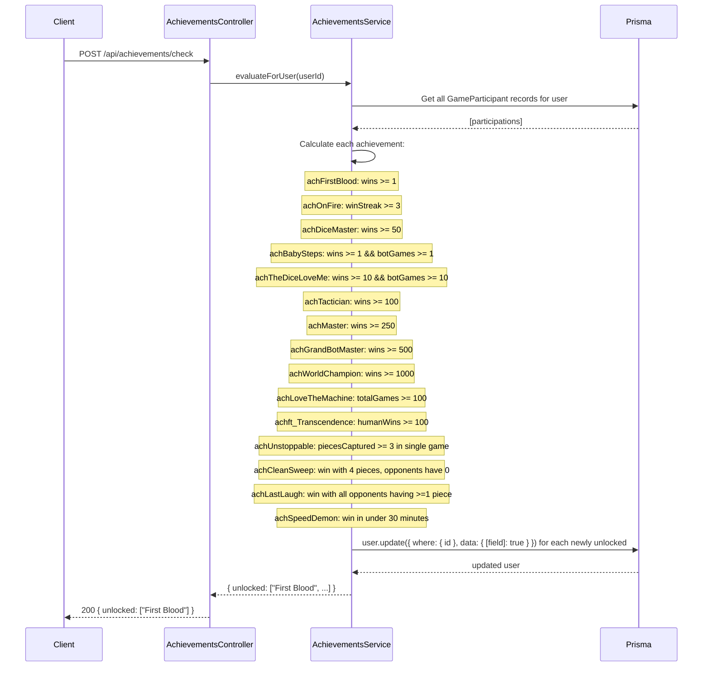

# Achievements Module

## Table of Contents

- [Overview](#overview) — Achievement evaluation and retrieval
- [Files](#files) — Every source file in the module and its role
- [Key Types / Interfaces](#key-types--interfaces) — Achievement list and response shape
- [API Endpoints](#api-endpoints) — Both routes with method, path, auth, and description
- [Core Logic / Flow](#core-logic--flow) — Mermaid sequence diagrams for get and check
- [Logic Paths Summary](#logic-paths-summary) — Decision trees for each operation
- [Dependencies](#dependencies) — Internal services this module relies on

---

## Overview

The Achievements module tracks 15 achievement badges that users can earn based on their game performance. It provides:

1. **Get achievements** — retrieve all 15 achievement booleans for the current user.
2. **Check achievements** — force re-evaluate all achievements based on current match stats, returns array of newly unlocked display names.

Achievements are evaluated from the user's `GameParticipant` records and stored as boolean columns on the `User` model.

---

## Files

| File | Role |
|------|------|
| `achievements.controller.ts` | HTTP routes: GET list, POST check |
| `achievements.service.ts` | Business logic: evaluate 15 achievement types from match stats |
| `achievements.module.ts` | NestJS module — registers controller, service, and PrismaService |

---

## Key Types / Interfaces

### Achievement List

The 15 tracked achievements (stored as boolean fields on the User model):

| # | Field | Display Name | Condition |
|---|-------|-------------|-----------|
| 1 | `achFirstBlood` | First Blood | Win 1 game |
| 2 | `achOnFire` | On Fire | 3 consecutive wins |
| 3 | `achDiceMaster` | Dice Master | 50 wins |
| 4 | `achBabySteps` | Baby Steps | Win 1st game vs bots |
| 5 | `achTheDiceLoveMe` | The Dice Love Me | Win 10 games vs bots |
| 6 | `achTactician` | Tactician | 100 wins |
| 7 | `achMaster` | Master | 250 wins |
| 8 | `achGrandBotMaster` | Grand Bot Master | 500 wins |
| 9 | `achWorldChampion` | World Champion | 1000 wins |
| 10 | `achLoveTheMachine` | Love The Machine | 100 games played |
| 11 | `achft_Transcendence` | FT Transcendence | 100 wins vs humans |
| 12 | `achUnstoppable` | Unstoppable | Capture 3 pieces in a single game |
| 13 | `achCleanSweep` | Clean Sweep | Win with 4 pieces, opponents have 0 |
| 14 | `achLastLaugh` | Last Laugh | Win while all opponents have ≥1 piece |
| 15 | `achSpeedDemon` | Speed Demon | Win in under 30 minutes |

### Response Shapes

```typescript
// GET /api/achievements returns:
{
  achFirstBlood: boolean;
  achOnFire: boolean;
  achDiceMaster: boolean;
  achBabySteps: boolean;
  achTheDiceLoveMe: boolean;
  achTactician: boolean;
  achMaster: boolean;
  achGrandBotMaster: boolean;
  achWorldChampion: boolean;
  achLoveTheMachine: boolean;
  achft_Transcendence: boolean;
  achUnstoppable: boolean;
  achCleanSweep: boolean;
  achLastLaugh: boolean;
  achSpeedDemon: boolean;
}

// POST /api/achievements/check returns:
{
  unlocked: string[];  // Display names of newly unlocked achievements
}
```

---

## API Endpoints

| Method | Path | Auth | Description |
|--------|------|------|-------------|
| `GET` | `/api/achievements` | JWT | Return all 15 achievement booleans for current user |
| `POST` | `/api/achievements/check` | JWT | Force re-evaluate achievements, return newly unlocked display names |

---

## Core Logic / Flow

### 1. Get Achievements

Sequence of steps when a user requests their current achievement badges.


### 2. Check Achievements

Sequence of steps when a user forces re-evaluation of all achievements.


---

## Logic Paths Summary

### Get Achievements Path
```
GET /api/achievements (JWT required)
  ├── user.findUnique({ where: { id }, select: { ach_* } })
  │   ├── Found → 200 { achFirstBlood, achOnFire, ... }
  │   └── Not found → 200 {}
```

### Check Achievements Path
```
POST /api/achievements/check (JWT required)
  ├── Get all GameParticipant records for user
  ├── Calculate each of 15 achievements from match stats
  ├── For each newly unlocked achievement:
  │   ├── user.update({ [field]: true })
  │   └── Push display name to unlocked array
  └── 200 { unlocked: ["First Blood", "On Fire", ...] }
```

---

## Dependencies

| Dependency | Purpose |
|-----------|---------|
| `PrismaService` | Database access (User, GameParticipant models) |
| `JwtAuthGuard` | Protects achievement endpoints |