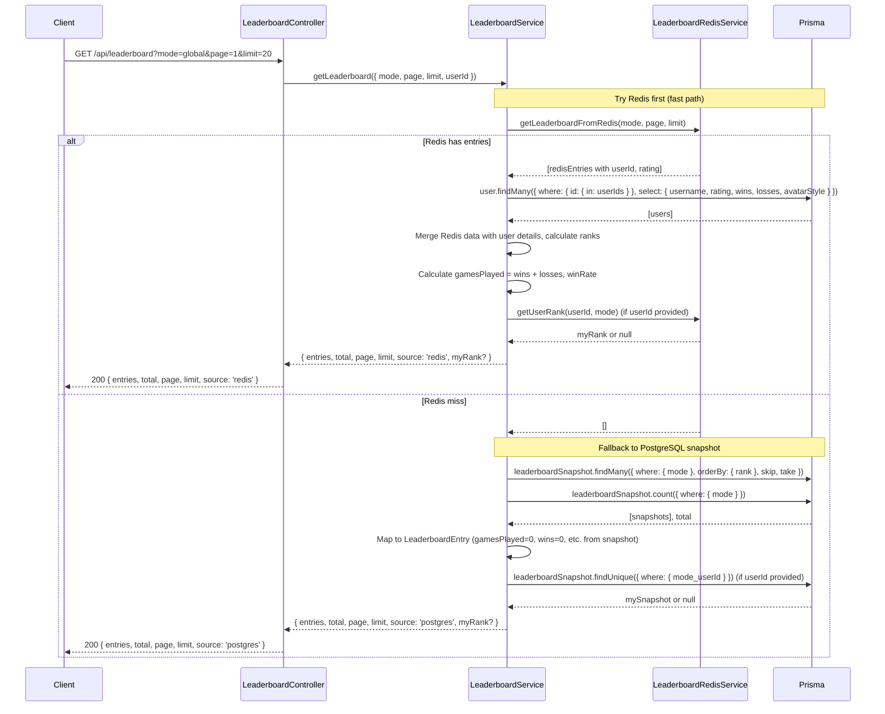

# Leaderboard Module

## Table of Contents

- [Overview](#overview) — Leaderboard querying with Redis caching
- [Files](#files) — Every source file in the module and its role
- [Key Types / Interfaces](#key-types--interfaces) — Query parameters and response shapes
- [API Endpoints](#api-endpoints) — All routes with method, path, auth, and description
- [Core Logic / Flow](#core-logic--flow) — Mermaid sequence diagrams for leaderboard query and cache flow
- [Logic Paths Summary](#logic-paths-summary) — Decision trees for each operation
- [Dependencies](#dependencies) — Internal services this module relies on
- [Configuration / Environment](#configuration--environment) — Environment variables used

---

## Overview

The Leaderboard module provides ranked player listings across multiple game modes. It supports:

1. **Leaderboard querying** — get paginated rankings for global, ranked, casual, or bot modes.
2. **Redis caching** — leaderboard data is cached in Redis sorted sets for fast retrieval, with PostgreSQL snapshot fallback.
3. **Current user position** — optionally highlights the requesting user's rank in the response via `myRank`.

---

## Files

| File | Role |
|------|------|
| `leaderboard.controller.ts` | HTTP route: GET with mode, page, limit query params |
| `leaderboard.service.ts` | Business logic: queries leaderboard from Redis cache with PostgreSQL fallback |
| `leaderboard-redis.service.ts` | Redis caching layer: stores/retrieves leaderboard data in Redis sorted sets |
| `leaderboard.module.ts` | NestJS module — registers controller, services, and PrismaService |

---

## Key Types / Interfaces

### Query Parameters

| Parameter | Type | Default | Description |
|-----------|------|---------|-------------|
| `mode` | `'global' \| 'ranked' \| 'casual' \| 'bot'` | `'global'` | Game mode to filter by |
| `page` | number (string) | `1` | Page number (1-indexed) |
| `limit` | number (string) | `20` | Items per page (max 100) |

### LeaderboardEntry Interface

```typescript
interface LeaderboardEntry {
  rank: number;
  username: string;
  rating: number;
  gamesPlayed: number;
  wins: number;
  losses: number;
  draws: number;       // Always 0 (not tracked)
  winRate: number;     // Percentage (0-100)
  avatarStyle: string | null;
}
```

### LeaderboardResponse Interface

```typescript
interface LeaderboardResponse {
  entries: LeaderboardEntry[];
  total: number;
  page: number;
  limit: number;
  myRank?: {           // Only included if userId provided
    rank: number;
    username: string;
    rating: number;
  } | null;
  source: 'redis' | 'postgres';  // Data source indicator
}
```

---

## API Endpoints

| Method | Path | Auth | Description |
|--------|------|------|-------------|
| `GET` | `/api/leaderboard?mode=global&page=1&limit=20` | None (optional JWT) | Get paginated leaderboard, includes `myRank` if token cookie is present |

---

## Core Logic / Flow

### 1. Get Leaderboard

Sequence of steps when a client requests the leaderboard with optional mode filtering.


---

## Logic Paths Summary

### Get Leaderboard Path
```
GET /api/leaderboard?mode=global&page=1&limit=20
  ├── Parse query params (mode, page, limit)
  ├── Try Redis cache:
  │   ├── Cache hit:
  │   │   ├── Fetch user details from PostgreSQL
  │   │   ├── Calculate gamesPlayed, winRate
  │   │   ├── Look up myRank if userId provided
  │   │   └── Return { entries, source: 'redis', myRank? }
  │   └── Cache miss:
  │       ├── Query PostgreSQL leaderboardSnapshot table
  │       ├── Map to entry format (limited stats from snapshot)
  │       ├── Look up myRank if userId provided
  │       └── Return { entries, source: 'postgres', myRank? }
  └── 200 { entries, total, page, limit, source, myRank? }
```

---

## Dependencies

| Dependency | Purpose |
|-----------|---------|
| `PrismaService` | Database access (User, LeaderboardSnapshot models) |
| `LeaderboardRedisService` | Redis caching layer for leaderboard data |
| `ioredis` | Redis client |

---

## Configuration / Environment

| Variable | Default | Used By |
|----------|---------|---------|
| `REDIS_URL` | (from secrets) | LeaderboardRedisService Redis connection |
| `REDIS_TTL` | `300` (5 min) | Leaderboard cache TTL in seconds |