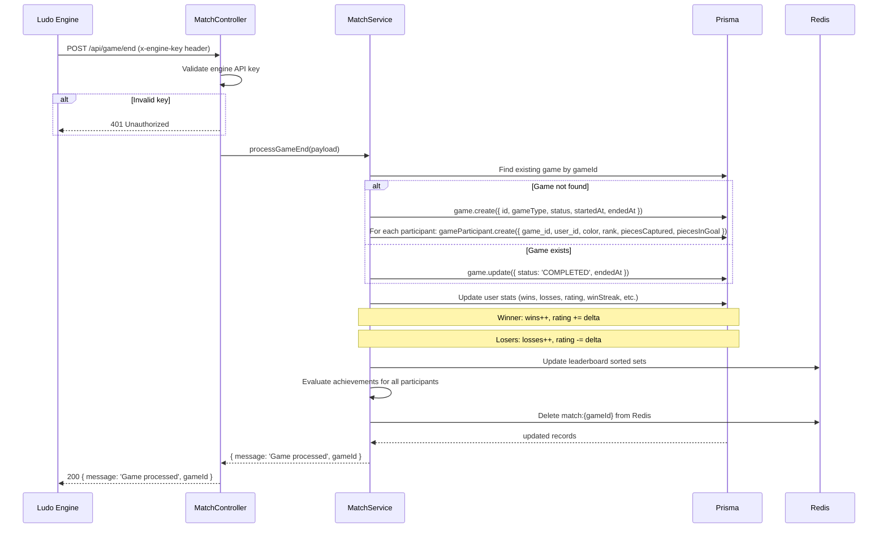

# Match Module

## Table of Contents

- [Overview](#overview) — Matchmaking, game lifecycle, and result recording
- [Files](#files) — Every source file in the module and its role
- [Key Types / Interfaces](#key-types--interfaces) — Game end payload and response shapes
- [API Endpoints](#api-endpoints) — All routes with method, path, auth, and description
- [Core Logic / Flow](#core-logic--flow) — Mermaid sequence diagrams for match creation, game actions, and result submission
- [Logic Paths Summary](#logic-paths-summary) — Decision trees for each operation
- [Dependencies](#dependencies) — Internal services this module relies on
- [Configuration / Environment](#configuration--environment) — Environment variables used

---

## Overview

The Match module handles game lifecycle events on the API side. It provides:

1. **Matchmaking** — random PvP matchmaking, invite codes, PvE (vs bot), and unified match creation.
2. **Game actions** — ready, resign, exit, abort, spectate, and active game listing.
3. **Result recording** — internal endpoint called by the Ludo Engine to record game results after a match ends.
4. **Rematch** — request a rematch after game ends.

---

## Files

| File | Role |
|------|------|
| `match.controller.ts` | HTTP routes: matchmaking, game actions, game end, spectate, rematch, cleanup |
| `match.service.ts` | Business logic: Redis-based matchmaking, game processing, rating updates, stale game cleanup |
| `match.module.ts` | NestJS module — registers controller, service, PrismaService, and JwtService |

---

## Key Types / Interfaces

### Game End Payload (from Ludo Engine)

```typescript
{
  gameId: string;
  participants: Array<{
    userId: string;          // User UUID or 'ludo-bot' for bot players
    color: 'RED' | 'GREEN' | 'YELLOW' | 'BLUE';
    rank: number;            // 1 = winner, 2 = 2nd, etc.
    piecesCaptured: number;
    piecesInGoal: number;    // 0-4
  }>;
}
```

### Match Endpoint Response Shape

All match creation endpoints return:
```json
{
  "gameId": "uuid",
  "token": "jwt-string",
  "engineUrl": "ws://ludo-engine:3001"
}
```

### Game History Response

```typescript
{
  games: Array<{
    gameId: string;
    gameType: GameType;
    status: GameStatus;
    color: PlayerColor;
    rank: number | null;
    piecesCaptured: number;
    piecesInGoal: number;
    startedAt: Date;
    endedAt: Date | null;
    participants: Array<{
      username: string;
      color: PlayerColor;
      rank: number | null;
      piecesInGoal: number;
    }>;
  }>;
  pagination: {
    page: number;
    limit: number;
    total: number;
    totalPages: number;
  };
}
```

---

## API Endpoints

| Method | Path | Auth | Description |
|--------|------|------|-------------|
| `POST` | `/api/match/pvp/random` | JWT | Find or create random PvP match |
| `POST` | `/api/match/pvp/invite` | JWT | Create invite game with shareable code |
| `POST` | `/api/match/join/:code` | JWT | Join PvP game by invite code |
| `POST` | `/api/match/pve` | JWT | Start PvE (vs bot) game |
| `POST` | `/api/match/create` | JWT | Unified match creation (pvp/pve/hotseat) |
| `POST` | `/api/match/rematch/:gameId` | JWT | Request rematch after game ends |
| `POST` | `/api/match/cleanup` | JWT | Clean up stale match data |
| `POST` | `/api/game/:id/ready` | JWT | Signal player ready |
| `POST` | `/api/game/:id/resign` | JWT | Forfeit the game |
| `POST` | `/api/game/:id/exit` | JWT | Acknowledge leaving ended game |
| `POST` | `/api/game/:id/abort` | JWT | Cancel unstarted game |
| `GET` | `/api/games/active` | JWT | List active games |
| `POST` | `/api/games/:id/spectate` | JWT | Get spectator token for active game |
| `POST` | `/api/game/end` | Engine API Key | Submit game results from Ludo Engine |

---

## Core Logic / Flow

### 1. Game End (Engine Callback)

Sequence of steps when the Ludo Engine submits game results after a match ends.


---

## Logic Paths Summary

### Get Game History Path
```
GET /api/game/history?page=1&limit=20 (JWT required)
  ├── gameParticipant.findMany({ where: { user_id }, skip, take, orderBy, include })
  ├── gameParticipant.count({ where: { user_id } })
  ├── Map to response format
  └── 200 { games: [...], pagination: { page, limit, total, totalPages } }
```

### Submit Game Result Path
```
POST /api/game/end (Engine API Key required)
  ├── Validate engine API key → 401 if invalid
  ├── Find or create game record
  │   ├── Not found → game.create + gameParticipant.create for each
  │   └── Found → game.update
  ├── Update user stats:
  │   ├── Winner: wins++, rating += delta
  │   ├── Losers: losses++, rating -= delta
  │   └── Update streaks, highestRating, etc.
  ├── Update Redis leaderboard
  ├── Evaluate achievements
  ├── Delete match key from Redis
  └── 200 { message: 'Game processed', gameId }
```

---

## Dependencies

| Dependency | Purpose |
|-----------|---------|
| `PrismaService` | Database access (Game, GameParticipant, User models) |
| `JwtService` | JWT token creation for match and spectator tokens |
| `JwtAuthGuard` | Protects game endpoints |
| `secrets.ts` | Reads ENGINE_API_KEY for validating engine callbacks |
| `ioredis` | Redis client for matchmaking data |

---

## Configuration / Environment

| Variable | Default | Used By |
|----------|---------|---------|
| `ENGINE_API_KEY` | (from secrets) | Validates POST /api/game/end requests from Ludo Engine |
| `REDIS_URL` | (from secrets) | Redis connection for matchmaking data |