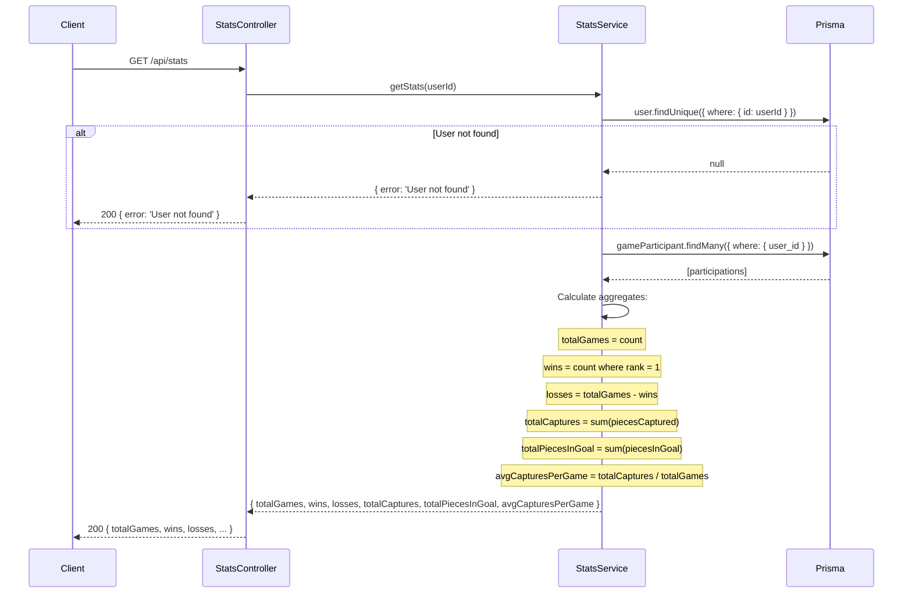

# Player Stats Module

## Table of Contents

- [Overview](#overview) — Aggregate player statistics from match history
- [Files](#files) — Every source file in the module and its role
- [Key Types / Interfaces](#key-types--interfaces) — Stats response shape
- [API Endpoints](#api-endpoints) — All routes with method, path, auth, and description
- [Core Logic / Flow](#core-logic--flow) — Mermaid sequence diagrams for stats retrieval
- [Logic Paths Summary](#logic-paths-summary) — Decision trees for each operation
- [Dependencies](#dependencies) — Internal services this module relies on

---

## Overview

The Player Stats module provides aggregated statistics computed from a user's `GameParticipant` records. It supports:

1. **Own stats** — authenticated user retrieves their own aggregate stats.

Stats include: total games, wins, losses, total captures, total pieces in goal, and average captures per game.

---

## Files

| File | Role |
|------|------|
| `stats.controller.ts` | HTTP route: GET own stats |
| `stats.service.ts` | Business logic: aggregate stats from GameParticipant records |
| `stats.module.ts` | NestJS module — registers controller, service, and PrismaService |

---

## Key Types / Interfaces

### Stats Response Shape

```typescript
{
  totalGames: number;
  wins: number;
  losses: number;
  totalCaptures: number;
  totalPiecesInGoal: number;
  avgCapturesPerGame: number;  // Rounded to 1 decimal place
}
```

---

## API Endpoints

| Method | Path | Auth | Description |
|--------|------|------|-------------|
| `GET` | `/api/stats` | JWT | Get aggregate stats for the current authenticated user |

---

## Core Logic / Flow

### 1. Get Own Stats

Sequence of steps when the authenticated user requests their own stats.


---

## Logic Paths Summary

### Get Own Stats Path
```
GET /api/stats (JWT required)
  ├── user.findUnique({ where: { id: userId } })
  │   ├── Not found → { error: 'User not found' }
  │   └── Found → continue
  ├── gameParticipant.findMany({ where: { user_id } })
  ├── Calculate aggregates:
  │   ├── totalGames = count
  │   ├── wins = count where rank = 1
  │   ├── losses = totalGames - wins
  │   ├── totalCaptures = sum(piecesCaptured)
  │   ├── totalPiecesInGoal = sum(piecesInGoal)
  │   └── avgCapturesPerGame = totalCaptures / totalGames
  └── 200 { totalGames, wins, losses, totalCaptures, totalPiecesInGoal, avgCapturesPerGame }
```

---

## Dependencies

| Dependency | Purpose |
|-----------|---------|
| `PrismaService` | Database access (User, GameParticipant models) |
| `JwtAuthGuard` | Protects stats endpoint |