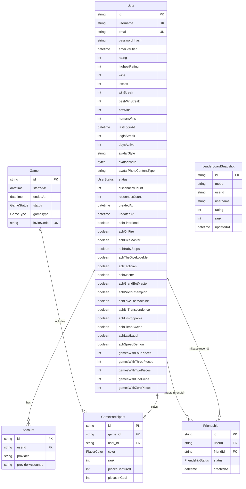

# Database Schema

## Table of Contents

- [Overview](#overview) — Prisma ORM schema for PostgreSQL
- [Enums](#enums) — All enum types used in the database
- [Models](#models) — All 6 models with fields, types, and relations
- [Entity Relationships](#entity-relationships) — ER diagram showing model relations
- [Indexes](#indexes) — Database indexes for query performance

---

## Overview

The database uses PostgreSQL 16 with Prisma ORM (Prisma 7). The schema defines 6 models and 5 enums covering users, authentication, games, friendships, and leaderboard snapshots.

---

## Enums

### FriendshipStatus

```prisma
enum FriendshipStatus {
  pending
  accepted
  blocked
}
```

### UserStatus

```prisma
enum UserStatus {
  online
  playing
  offline
}
```

### PlayerColor

```prisma
enum PlayerColor {
  RED
  GREEN
  YELLOW
  BLUE
}
```

### GameStatus

```prisma
enum GameStatus {
  COMPLETED
  ABANDONED
}
```

### GameType

```prisma
enum GameType {
  PVP
  PVE
}
```

---

## Models

### User

The core user model with profile data, game stats, and 15 achievement booleans.

| Field | Type | Attributes | Description |
|-------|------|------------|-------------|
| `id` | String | UUID, PK | Unique user identifier |
| `username` | String | Unique | Display name (3-20 chars, alphanumeric + underscore) |
| `email` | String? | Unique | Email address |
| `password_hash` | String? | | bcrypt hash (null for OAuth-only users) |
| `emailVerified` | DateTime? | | When email was verified |
| `rating` | Int | Default: 0 | Elo-like rating |
| `highestRating` | Int | Default: 0 | Peak rating achieved |
| `wins` | Int | Default: 0 | Total games won |
| `losses` | Int | Default: 0 | Total games lost |
| `winStreak` | Int | Default: 0 | Current consecutive wins |
| `bestWinStreak` | Int | Default: 0 | Best consecutive wins |
| `botWins` | Int | Default: 0 | Games won against bots |
| `humanWins` | Int | Default: 0 | Games won against humans |
| `lastLoginAt` | DateTime? | | Last login timestamp |
| `loginStreak` | Int | Default: 0 | Consecutive days logged in |
| `daysActive` | Int | Default: 0 | Total days with activity |
| `avatarStyle` | String | Default: `"bottts"` | Avatar style identifier |
| `avatarPhoto` | Bytes? | | Binary avatar image data |
| `avatarPhotoContentType` | String? | | MIME type of avatar photo |
| `status` | UserStatus | Default: `offline` | Current online status |
| `disconnectCount` | Int | Default: 0 | Number of disconnects |
| `reconnectCount` | Int | Default: 0 | Number of reconnects |
| `createdAt` | DateTime | Auto | Account creation timestamp |
| `updatedAt` | DateTime | Auto | Last update timestamp |
| `achFirstBlood` | Boolean | Default: false | Win 1 game |
| `achOnFire` | Boolean | Default: false | 3 consecutive wins |
| `achDiceMaster` | Boolean | Default: false | 50 wins |
| `achBabySteps` | Boolean | Default: false | Win 1st game vs bots |
| `achTheDiceLoveMe` | Boolean | Default: false | Win 10 games vs bots |
| `achTactician` | Boolean | Default: false | 100 wins |
| `achMaster` | Boolean | Default: false | 250 wins |
| `achGrandBotMaster` | Boolean | Default: false | 500 wins |
| `achWorldChampion` | Boolean | Default: false | 1000 wins |
| `achLoveTheMachine` | Boolean | Default: false | 100 games played |
| `achft_Transcendence` | Boolean | Default: false | 100 wins vs humans |
| `achUnstoppable` | Boolean | Default: false | Capture 3 pieces in a single game |
| `achCleanSweep` | Boolean | Default: false | Win with 4 pieces, opponents have 0 |
| `achLastLaugh` | Boolean | Default: false | Win while all opponents have ≥1 piece |
| `achSpeedDemon` | Boolean | Default: false | Win in under 30 minutes |
| `gamesWithFourPieces` | Int | Default: 0 | Games finishing with 4 pieces |
| `gamesWithThreePieces` | Int | Default: 0 | Games finishing with 3 pieces |
| `gamesWithTwoPieces` | Int | Default: 0 | Games finishing with 2 pieces |
| `gamesWithOnePiece` | Int | Default: 0 | Games finishing with 1 piece |
| `gamesWithZeroPieces` | Int | Default: 0 | Games finishing with 0 pieces |

**Relations:**
- Has many `Account` records (OAuth provider links)
- Has many `GameParticipant` records (games played)
- Has many `Friendship` records (as `userId` or `friendId`)

### Account

Links a user to an OAuth provider (Google, GitHub, or 42).

| Field | Type | Attributes | Description |
|-------|------|------------|-------------|
| `id` | String | UUID, PK | Unique account identifier |
| `userId` | String | FK → User.id | Owner of this account link |
| `provider` | String | | OAuth provider name (google, github, 42) |
| `providerAccountId` | String | | User's ID on the provider |

**Unique constraint:** `(provider, providerAccountId)` — one link per provider+account combination.

**Index:** `userId`

**Relations:**
- Belongs to `User` (cascade delete)

### Game

Represents a single Ludo game session (historical results only — matchmaking lives in Redis).

| Field | Type | Attributes | Description |
|-------|------|------------|-------------|
| `id` | String | UUID, PK | Unique game identifier |
| `startedAt` | DateTime | | When the game started |
| `endedAt` | DateTime | | When the game ended |
| `status` | GameStatus | Default: `COMPLETED` | Current game state |
| `gameType` | GameType | Default: `PVP` | PVP or PVE |
| `inviteCode` | String? | Unique | Shareable invite code |

**Relations:**
- Has many `GameParticipant` records (cascade delete)

### GameParticipant

Links a user to a game with their in-game stats.

| Field | Type | Attributes | Description |
|-------|------|------------|-------------|
| `id` | String | UUID, PK | Unique participant identifier |
| `game_id` | String | FK → Game.id | The game |
| `user_id` | String | FK → User.id | The player |
| `color` | PlayerColor | | Assigned color (RED, GREEN, YELLOW, BLUE) |
| `rank` | Int | | Final rank (1st, 2nd, 3rd, 4th place) |
| `piecesCaptured` | Int | Default: 0 | Opponent pieces captured |
| `piecesInGoal` | Int | Default: 0 | Own pieces that reached goal (0-4) |

**Unique constraints:** `(game_id, user_id)`, `(game_id, color)`

**Relations:**
- Belongs to `Game` (cascade delete)
- Belongs to `User` (cascade delete)

### Friendship

Represents a friend request, established friendship, or blocked relationship between two users.

| Field | Type | Attributes | Description |
|-------|------|------------|-------------|
| `id` | String | UUID, PK | Unique friendship identifier |
| `userId` | String | FK → User.id | User who initiated |
| `friendId` | String | FK → User.id | Target user |
| `status` | FriendshipStatus | Default: `pending` | pending, accepted, or blocked |
| `createdAt` | DateTime | Auto | When the request was sent |

**Unique constraint:** `(userId, friendId)`

**Relations:**
- Belongs to `User` (as `userId`, cascade delete)
- Belongs to `User` (as `friendId`, cascade delete)

### LeaderboardSnapshot

Mirror of Redis sorted sets, written on every game end to serve as a fast fallback when Redis is down.

| Field | Type | Attributes | Description |
|-------|------|------------|-------------|
| `id` | String | UUID, PK | Unique snapshot identifier |
| `mode` | String | | "global" \| "ranked" \| "casual" \| "bot" |
| `userId` | String | | The player's ID |
| `username` | String | | The player's username |
| `rating` | Int | | Rating at snapshot time |
| `rank` | Int | | Rank at snapshot time |
| `updatedAt` | DateTime | Auto | When the snapshot was taken |

**Unique constraint:** `(mode, userId)`
**Index:** `(mode, rank)`

**Relations:**
- None (denormalized snapshot, no FK constraint)

---

## Entity Relationships



---

## Indexes

| Model | Field(s) | Type | Purpose |
|-------|----------|------|---------|
| User | `username` | Unique | Fast lookup by username |
| User | `email` | Unique | Fast lookup by email |
| Account | `(provider, providerAccountId)` | Unique | Fast OAuth lookup |
| Account | `userId` | Index | Fast user account lookup |
| Game | `inviteCode` | Unique | Fast invite code lookup |
| GameParticipant | `(game_id, user_id)` | Unique | Prevent duplicate entries |
| GameParticipant | `(game_id, color)` | Unique | Prevent duplicate colors |
| Friendship | `(userId, friendId)` | Unique | Prevent duplicate friendships |
| LeaderboardSnapshot | `(mode, userId)` | Unique | One snapshot per user per mode |
| LeaderboardSnapshot | `(mode, rank)` | Index | Fast leaderboard query by mode+rank |