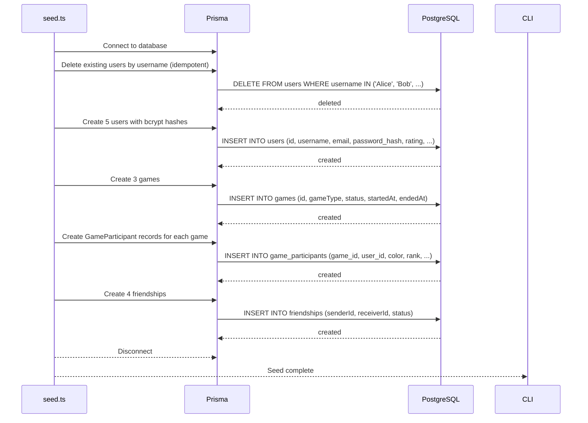

# Seeding

## Table of Contents

- [Overview](#overview) — Test data generation for development
- [Files](#files) — Every source file and its role
- [Seed Data](#seed-data) — Users, games, and friendships created
- [Core Logic / Flow](#core-logic--flow) — Mermaid sequence diagram of seed execution
- [Idempotency](#idempotency) — How the seed script handles re-runs

---

## Overview

The seed script populates the database with test data for development and testing. It creates:

1. **5 users** — Alice, Bob, Carol, Dave, Eve with various stats.
2. **3 games** — a completed 4-player game, a completed 3-player game, and an abandoned invite game.
3. **4 friendships** — various friend request states.

The script is idempotent — it can be run multiple times without creating duplicate records.

---

## Files

| File | Role |
|------|------|
| `prisma/seed.ts` | Seed script — creates users, games, and friendships |
| `prisma/drop-all.sql` | SQL script to drop all tables (for clean reset) |
| `prisma/truncate-all.sql` | SQL script to truncate all tables (for clean reseed) |

---

## Seed Data

### Users

| Username | Email | Rating | Wins | Losses | Notes |
|----------|-------|--------|------|--------|-------|
| Alice | alice@example.com | 1200 | 5 | 2 | Has password hash |
| Bob | bob@example.com | 1100 | 3 | 3 | Has password hash |
| Carol | carol@example.com | 1050 | 2 | 4 | Has password hash |
| Dave | dave@example.com | 1000 | 1 | 2 | Has password hash |
| Eve | eve@example.com | 950 | 0 | 1 | Has password hash |

### Games

| Game | Type | Status | Participants | Winner |
|------|------|--------|-------------|--------|
| Game 1 | ranked | completed | Alice (red), Bob (blue), Carol (green), Dave (yellow) | Alice (rank 1) |
| Game 2 | casual | completed | Alice (red), Bob (blue), Carol (green) | Bob (rank 1) |
| Game 3 | ranked | abandoned | Alice (red), Eve (blue) | — (abandoned) |

### Friendships

| Sender | Receiver | Status |
|--------|----------|--------|
| Alice | Bob | accepted |
| Alice | Carol | accepted |
| Bob | Carol | pending |
| Dave | Alice | rejected |

---

## Core Logic / Flow

### Seed Execution Flow

Sequence of steps when the seed script runs.


---

## Idempotency

The seed script uses `deleteMany` on users by username before creating new records:

```
Before creating users:
  user.deleteMany({ where: { username: { in: ['Alice', 'Bob', 'Carol', 'Dave', 'Eve'] } } })

This cascades to delete:
  ├── Associated Account records
  ├── Associated GameParticipant records
  ├── Associated Friendship records (sender or receiver)
  └── Associated LeaderboardSnapshot records
```

This ensures that running `npx prisma db seed` multiple times produces the same result without duplicate key errors.

---

## Usage

```bash
# Run seed
npx prisma db seed

# Full reset (drop all tables, run migrations, seed)
npx prisma migrate reset

# Truncate all tables (for clean reseed without migration)
psql -d transcendence -f prisma/truncate-all.sql
npx prisma db seed