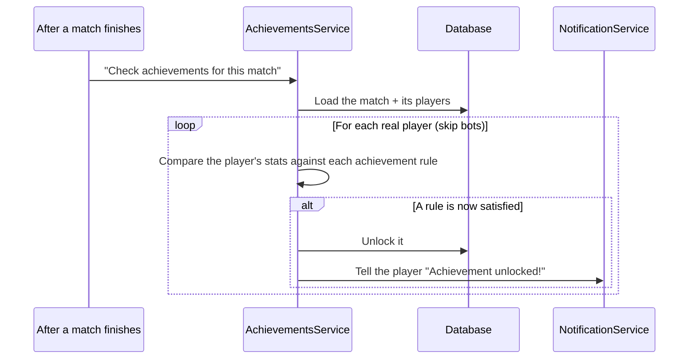

# Achievements Module

## Table of Contents

- [Overview](#overview) — Achievement evaluation and retrieval
- [Files](#files) — Source file inventory
- [Key Types / Interfaces](#key-types--interfaces) — The 13 achievements and response shape
- [API Endpoints](#api-endpoints) — Both routes
- [Core Logic / Flow](#core-logic--flow) — Mermaid sequence diagram of check flow
- [Logic Paths Summary](#logic-paths-summary) — Decision trees
- [Dependencies](#dependencies) — Internal and external dependencies

---

## Overview

The Achievements module tracks 13 achievement badges earned from match performance. Achievements are stored as true/false columns on the 1:1 `Achievement` model (see `backend-database-schema-system.md`). They are evaluated in two ways:

1. **Automatically after a game** — `evaluateAfterGame(gameId)` runs after every PvP/PvE game ends, checks each real (non-bot) player, and sends a notification when an achievement unlocks.
2. **On demand** — `POST /api/achievements/check` re-evaluates the current user silently (no notifications), which is useful after a rule change.

Hotseat games never reach the backend, so they are not counted. Bots (`user_id` starting `bot-`) are never evaluated.

---

## Files

| File | Role |
|------|------|
| `achievements.controller.ts` | HTTP routes: GET list, POST check |
| `achievements.service.ts` | Business logic: evaluate rules, unlock flags, fire notifications |
| `achievements.registry.ts` | Single source of truth: 13 rules with keys, types, and thresholds |
| `achievements.module.ts` | NestJS module — registers controller, service, PrismaService |

---

## Key Types / Interfaces

### The 13 Achievements

The registry (`achievements.registry.ts`) defines two rule types:
- **`lifetime`** — cumulative thresholds over PvP/PvE history.
- **`per-game`** — single-game conditions evaluated per game.

| # | Key (field) | Name (display) | Type | Condition | Source |
|---|-------------|----------------|------|-----------|--------|
| 1 | `achFirstBlood` | First Blood | lifetime | 1 win | total wins (PVP+PVE) |
| 2 | `achOnFire` | On Fire | lifetime | 2-game win streak | `User.winStreak` |
| 3 | `achDiceMaster` | Dice Master | lifetime | 3 wins | total wins (PVP+PVE) |
| 4 | `achBabySteps` | Baby Steps | lifetime | 1 bot win | PVE wins |
| 5 | `achTheDiceLoveMe` | The Dice Love Me | lifetime | 3 bot wins | PVE wins |
| 6 | `achTactician` | Tactician | lifetime | 5 wins | total wins (PVP+PVE) |
| 7 | `achMaster` | Master | lifetime | 8 wins | total wins (PVP+PVE) |
| 8 | `achGrandBotMaster` | Grand Bot Master | lifetime | 12 wins | total wins (PVP+PVE) |
| 9 | `achWorldChampion` | World Champion | lifetime | 15 wins | total wins (PVP+PVE) |
| 10 | `achft_Transcendence` | FT Transcendence | lifetime | 10 human wins | PVP wins |
| 11 | `achLoveTheMachine` | Love The Machine | lifetime | 3-game PvE streak | `User.pveGameStreak` |
| 12 | `achSpeedDemon` | Speed Demon | per-game | Win in under 30 minutes | rank 1 + game duration (`Game.startedAt` / `Game.endedAt`) |
| 13 | `achUnstoppable` | Unstoppable | per-game | Capture ≥ 3 pieces in one game | `GameParticipant.piecesCaptured` |

> **Lifetime rule sources** (`wins`, `botWins`, `humanWins`) come from `LifecycleCounts`, computed once per evaluation from the user's `COMPLETED` PVP/PVE participations (`rank === 1`). The streak inputs (`winStreak`, `pveGameStreak`) live on the **`User`** model, not on `Achievement` — the `Achievement` row stores only the 13 unlocked flags. In-app display copy for each name/description lives in `frontend/src/locales/en.ts` (`achXxx` / `achXxxDesc` keys).

To add or tweak an achievement, edit `ACHIEVEMENT_KEYS` / `ACHIEVEMENT_RULES` in `achievements.registry.ts` — no new endpoints or logic are needed.

### Response Shapes

```typescript
// GET /api/achievements returns a registry-driven report per key:
{
  achFirstBlood: { unlocked: boolean; progress: number; target: number };  // First Blood achievement (1 win)
  achOnFire: { unlocked: boolean; progress: number; target: number };  // On Fire achievement (2 wins in a row)
  achDiceMaster: { unlocked: boolean; progress: number; target: number };  // Dice Master achievement (3 wins)
  achBabySteps: { unlocked: boolean; progress: number; target: number };  // Baby Steps achievement (1 bot win)
  achTheDiceLoveMe: { unlocked: boolean; progress: number; target: number };  // The Dice Love Me achievement (3 bot wins)
  achTactician: { unlocked: boolean; progress: number; target: number };  // Tactician achievement (5 wins)
  achMaster: { unlocked: boolean; progress: number; target: number };  // Master achievement (8 wins)
  achGrandBotMaster: { unlocked: boolean; progress: number; target: number };  // Grand Bot Master achievement (12 wins)
  achWorldChampion: { unlocked: boolean; progress: number; target: number };  // World Champion achievement (15 wins)
  achft_Transcendence: { unlocked: boolean; progress: number; target: number };  // FT Transcendence achievement (10 human wins)
  achLoveTheMachine: { unlocked: boolean; progress: number; target: number };  // Love The Machine achievement (3 PvE streak)
  achSpeedDemon: { unlocked: boolean; progress: number; target: number };  // Speed Demon achievement (win under 30 min)
  achUnstoppable: { unlocked: boolean; progress: number; target: number };  // Unstoppable achievement (3 captures in a game)
}

// POST /api/achievements/check returns:
{
  unlocked: string[];  // registry keys of newly-unlocked achievements (e.g. ["achFirstBlood"])
}
```

---

## API Endpoints

| Method | Path | Auth | Description |
|--------|------|------|-------------|
| `GET` | `/api/achievements` | JWT | Report for all 13 achievements: `{ unlocked, progress, target }` per key |
| `POST` | `/api/achievements/check` | JWT | Force re-evaluate (silent backfill), return newly-unlocked keys |

---

## Core Logic / Flow

### 1. Post-Game Auto-Evaluation

Sequence of steps after a game ends (called by `MatchPostgameService`).


### 2. Manual Check

`POST /api/achievements/check` runs a retroactive loop over the user's completed games (so historical games can unlock per-game achievements), with `announce=false` (silent).

---

## Logic Paths Summary

### Get Achievements Path
```
GET /api/achievements (JWT)
  └── Walk the achievement registry for the user's Achievement row
       ├── Found → 200 { achFirstBlood: { unlocked, progress, target }, ..., achUnstoppable: { ... } }
       └── Not found → 200 {}
```

### Check Achievements Path
```
POST /api/achievements/check (JWT)
  ├── Compute lifecycle counts (wins, botWins, humanWins, streaks) from PvP/PvE participations
  ├── Evaluate lifetime rules against counts
  ├── Retroactively evaluate per-game rules across completed games
  ├── For each newly-unlocked achievement: achievement.update({ field: true })
  └── 200 { unlocked: ["achFirstBlood", ...] }
```

---

## Notes / Gotchas

- **Only `COMPLETED` PVP/PVE games count.** `computeLifecycleCounts` filters participations to `game.status === 'COMPLETED'` and `gameType` PVP/PVE. ABANDONED games have no definitive result and are excluded; hotseat never reaches the backend (demo-and-forget).
- **Fire-once semantics.** Once an `Achievement` flag is `true` it is never re-evaluated — `evaluateRule` skips already-unlocked rules, and `unlock()` returns `false` for an already-true flag, so no duplicate notifications.
- **`wins` is a shared counter across 6 achievements.** `achFirstBlood` (1), `achDiceMaster` (3), `achTactician` (5), `achMaster` (8), `achGrandBotMaster` (12), `achWorldChampion` (15) — they unlock in sequence as `wins` climbs, not independently.
- **`botWins` and `humanWins` are subsets of `wins`** (every win is either PVP or PVE), not separate counters.
- **`achTheDiceLoveMe` (`botWins >= 3`) is unreachable from `seed.ts` alone** — seeded `botWins` caps at 2 by design; only real PvE play (or the `POST /check` backfill) can unlock it.
- **`achLoveTheMachine` depends on `User.pveGameStreak`**, which increments on any PVE game (any rank) and resets to 0 on a PVP game (`match.postgame.service.ts`). It is not derivable from lifetime win/loss counts, so seed data approximates it rather than guaranteeing it.
- **`achSpeedDemon` needs both `startedAt` and `endedAt`** on the game; if either is missing, progress is 0 (no unlock) — it does not error.
- **`POST /achievements/check`** runs the same rules with `announce: false` — a silent backfill pass useful after schema/seed changes. Because no single game is passed in, it replays the user's full `COMPLETED` game history so per-game rules can unlock from historical games, not just the latest one.
- **Frontend badge counter** (`achievementsBadge` / `achievementsTab`) is `unlocked / 13`.

## Dependencies

| Dependency | Purpose |
|-----------|---------|
| `PrismaService` | Database access (Achievement, Game, GameParticipant models) |
| `NotificationService` | Push an `achievement` notification on unlock |
| `JwtAuthGuard` | Protects achievement endpoints |
