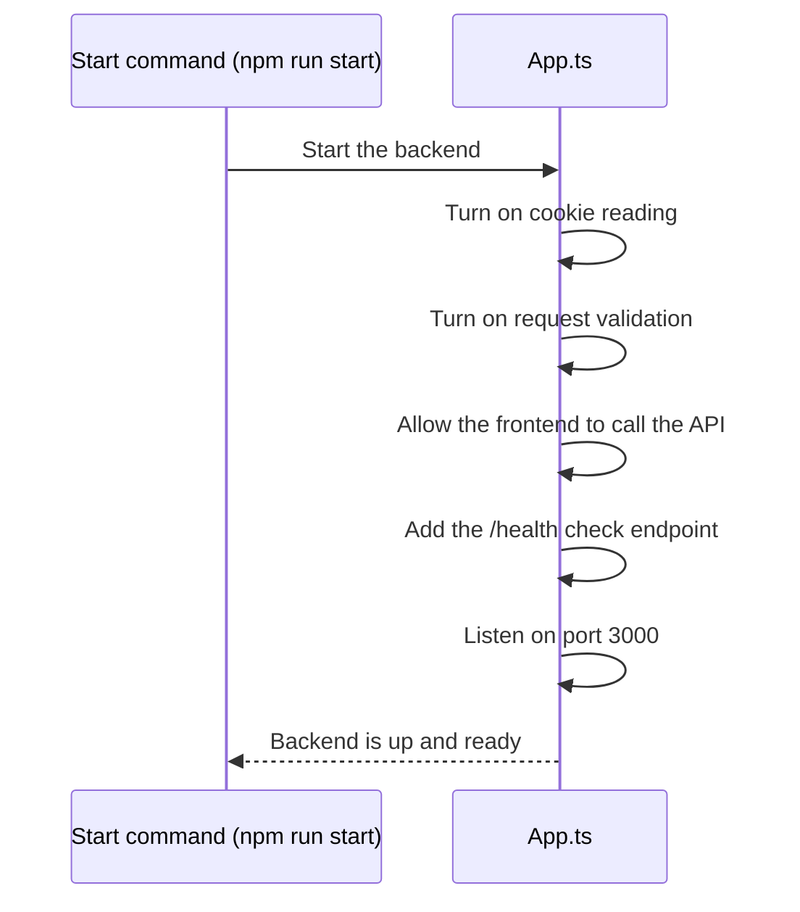
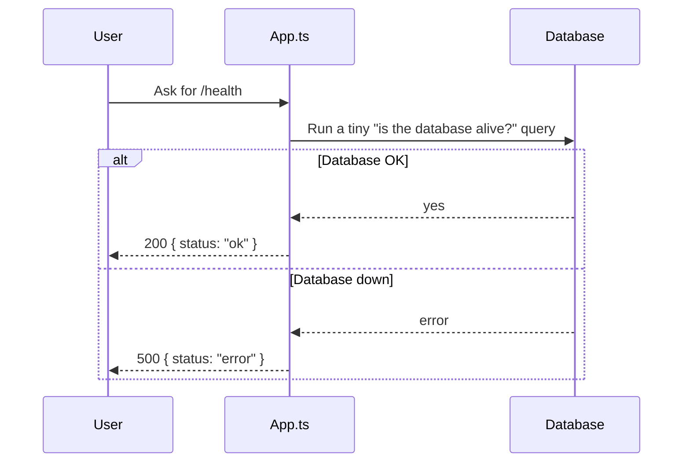
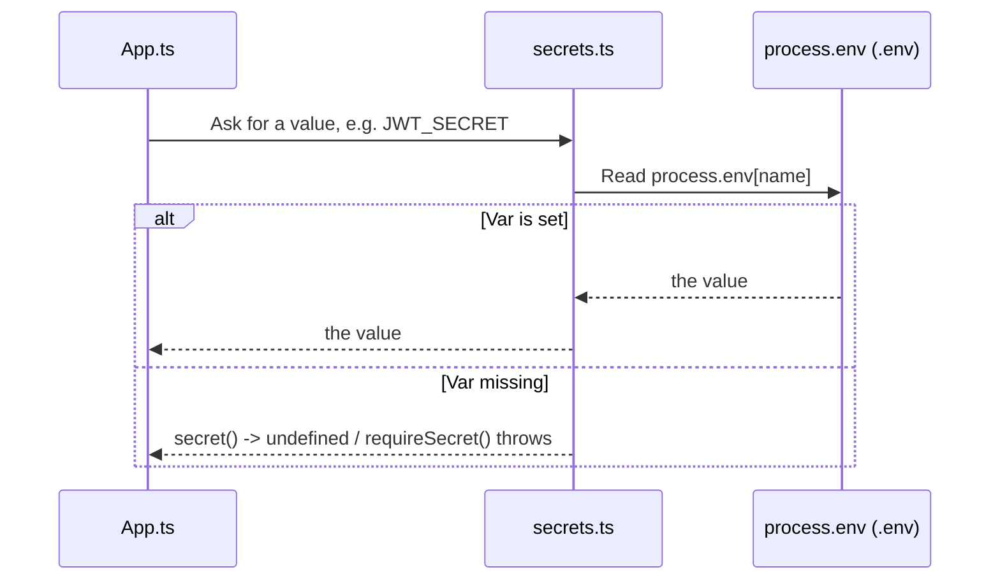
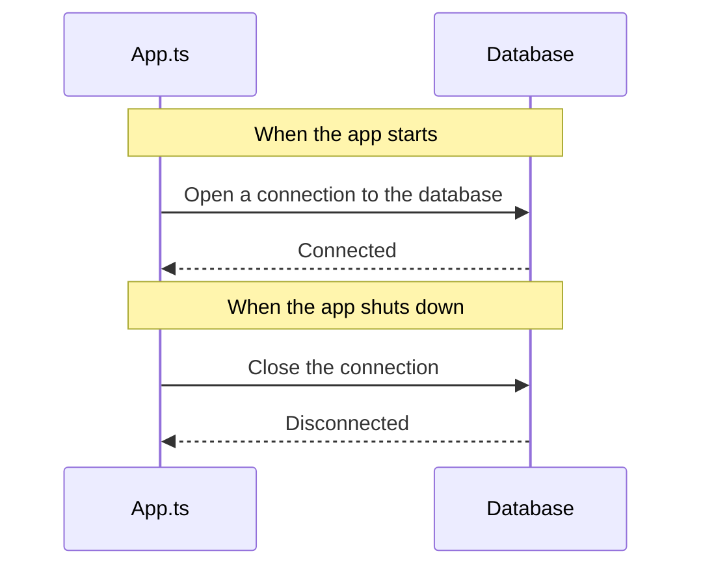

# App Bootstrap Module

## Table of Contents

- [Overview](#overview) — Application entry point, module wiring, and shared infrastructure
- [Files](#files) — Every source file in the module and its role
- [Key Types / Interfaces](#key-types--interfaces) — Configuration and service interfaces
- [API Endpoints](#api-endpoints) — Health check endpoint
- [Core Logic / Flow](#core-logic--flow) — Bootstrap sequence, health check flow, secret resolution
- [Logic Paths Summary](#logic-paths-summary) — Decision trees for bootstrap and health check
- [Dependencies](#dependencies) — npm packages and internal services this module relies on
- [Configuration / Environment](#configuration--environment) — Environment variables and secrets

---

## Overview

The App Bootstrap module is the root of the NestJS application. It does three things:

1. **Starts the server** via `main.ts` — turns on cookie reading, request validation, CORS rules, and a health check endpoint.
2. **Loads every feature module** via `app.module.ts` — imports all 9 feature modules and makes `PrismaService` available to the whole app:
   - `AuthModule` — registration, login, OAuth, 2FA, sessions
   - `UserModule` — user profiles, avatars, game history
   - `FriendsModule` — friends list, requests, presence integration
   - `LeaderboardModule` — ratings and rankings
   - `AchievementsModule` — achievement rules and evaluation
   - `StatsModule` — player statistics
   - `MatchModule` — matchmaking, rooms, ludo-engine callbacks
   - `PresenceModule` — online/offline presence
   - `NotificationModule` — notifications
3. **Reads configuration** via `secrets.ts` — every value is read straight from environment variables. Containers get the root `.env` through `compose.yaml`'s `env_file`; host-side scripts load it with `dotenv` (no mounted secret files anymore).

---

## Files

| File | Role |
|------|------|
| `main.ts` | Application entry point — creates NestJS app, configures middleware, starts HTTP server on port 3000 |
| `app.module.ts` | Root module — imports all feature modules, registers PrismaService |
| `prisma.service.ts` | Injectable PrismaClient wrapper with `onModuleInit`/`onModuleDestroy` lifecycle hooks |
| `secrets.ts` | Utility functions `secret()`, `requireSecret()` and `isTunnelRequest()` for reading configuration from environment variables |

---

## Key Types / Interfaces

### PrismaService

```typescript
class PrismaService implements OnModuleInit, OnModuleDestroy {
  db: PrismaClient;  // Exposes the PrismaClient instance
}
```

### Secret Functions

```typescript
function secret(key: string): string | undefined;       // Returns undefined if missing
function requireSecret(key: string): string;             // Throws if missing
```

---

## API Endpoints

| Method | Path | Auth | Description |
|--------|------|------|-------------|
| `GET` | `/health` | None | Database connectivity health check |

---

## Core Logic / Flow

### 1. Application Bootstrap Flow

Sequence of steps when the NestJS application starts up — middleware registration, module wiring, and server listen.


### 2. Health Check Flow

Sequence of steps when a client hits `GET /health` — verifies database connectivity and returns status.


### 3. Configuration Resolution Flow

Sequence of steps when any module asks `secrets.ts` for a value — it is a single lookup against the process environment (the root `.env`, injected by `compose.yaml`'s `env_file` in containers and by `dotenv` for host-side scripts).


### 4. PrismaService Lifecycle

Sequence of steps during PrismaService construction, database connection (`onModuleInit`), and disconnection (`onModuleDestroy`).


---

## Logic Paths Summary

### Bootstrap Path
```
npm run start:dev (or node main.js)
  ├── NestFactory.create(AppModule)
    │   ├── Import AuthModule, UserModule, FriendsModule, LeaderboardModule,
    │   │       AchievementsModule, StatsModule, MatchModule, PresenceModule,
    │   │       NotificationModule
  │   └── Register PrismaService as provider + export
  ├── app.use(cookieParser())
  ├── app.useGlobalPipes(ValidationPipe { whitelist, transform })
  ├── app.enableCors({ origin, credentials })
  ├── Register GET /health handler
  └── app.listen(3000)
```

### Health Check Path
```
GET /health
  ├── prisma.db.$queryRaw`SELECT 1`
  │   ├── Success → 200 { status: 'ok', timestamp }
  │   └── Error   → 500 { status: 'error', timestamp }
```

### Secret Resolution Path
```
secret(name)        → process.env[name]  // undefined when unset
requireSecret(name) → process.env[name]  // throws when unset
```

---

## Dependencies

| Dependency | Purpose |
|-----------|---------|
| `@nestjs/core` | NestJS framework core |
| `@nestjs/common` | Decorators, pipes, guards |
| `@nestjs/platform-express` | Express adapter |
| `cookie-parser` | Parse cookies from HTTP requests |
| `@prisma/client` | Prisma ORM client |
| `@prisma/adapter-pg` | Prisma PostgreSQL adapter (Prisma 7) |
| `reflect-metadata` | TypeScript decorator support |
| `rxjs` | Reactive extensions for NestJS |

---

## Configuration / Environment

| Variable | Default | Used By |
|----------|---------|---------|
| `NODE_ENV` | `development` | CORS origin selection, cookie `secure` flag |
| `DATABASE_URL` | (from `.env`) | PrismaService database connection |
| *(no secret files)* | — | Config values come from environment variables only (root `.env`); there is no `SECRETS_DIR` or mounted secret file anymore |
| `PORT` | 3000 | HTTP server listen port (hardcoded in main.ts) |