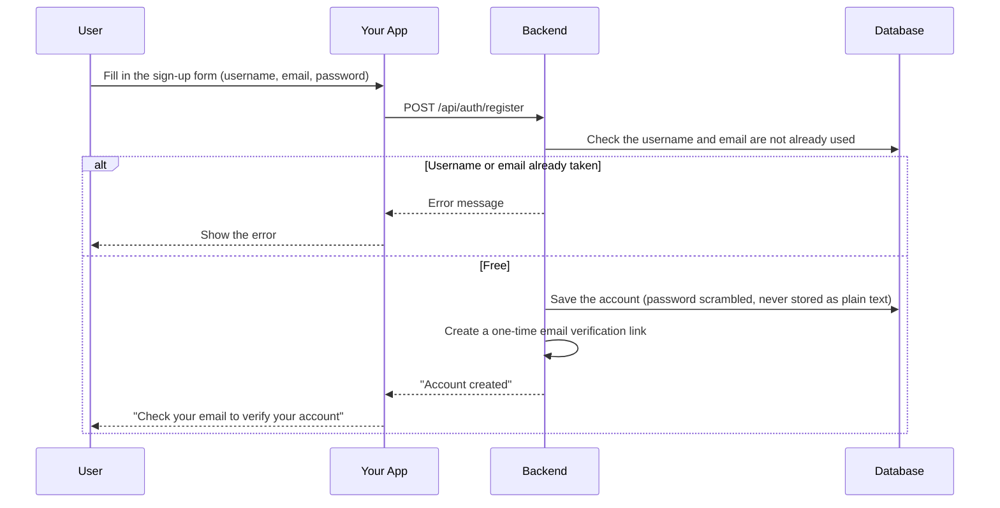
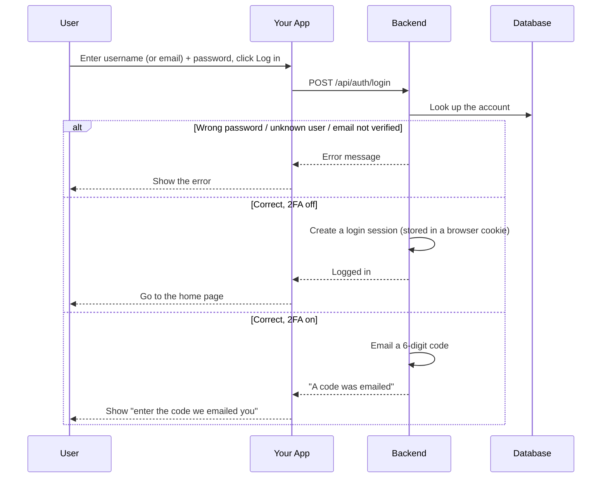
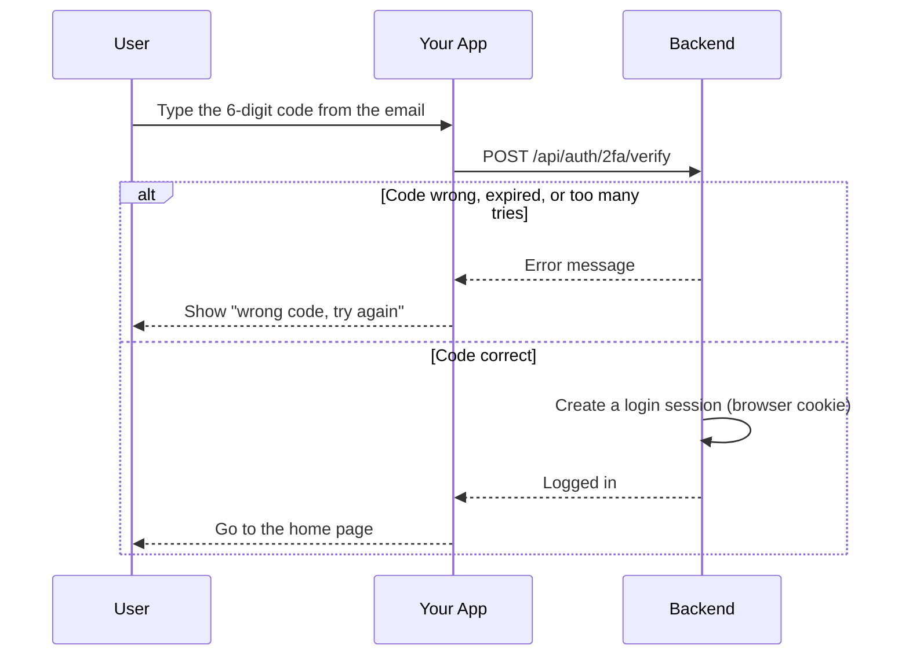
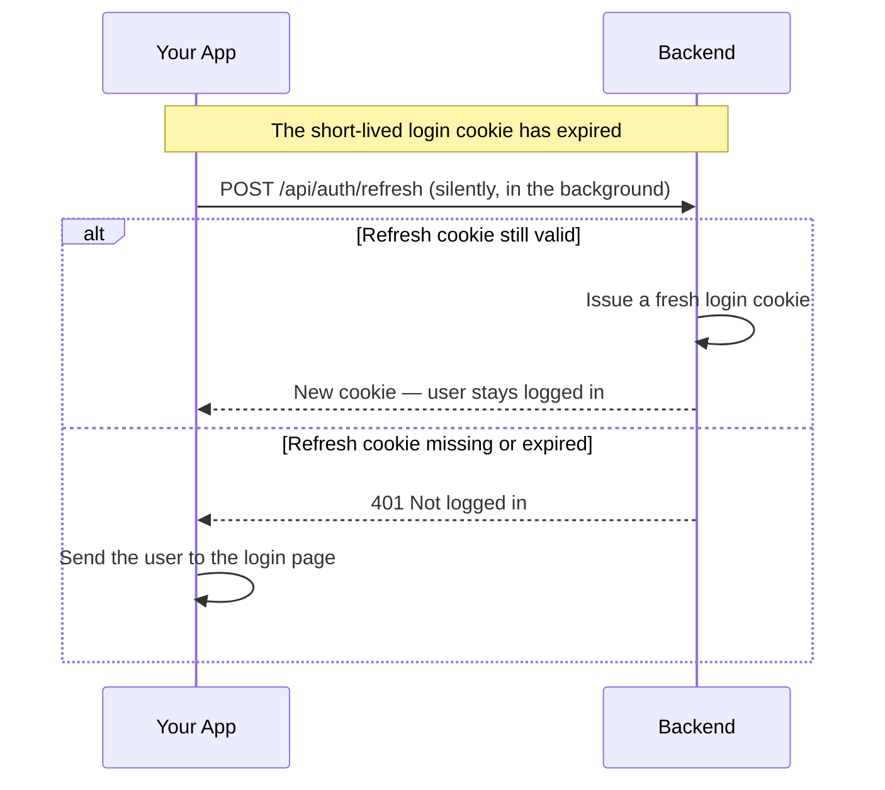
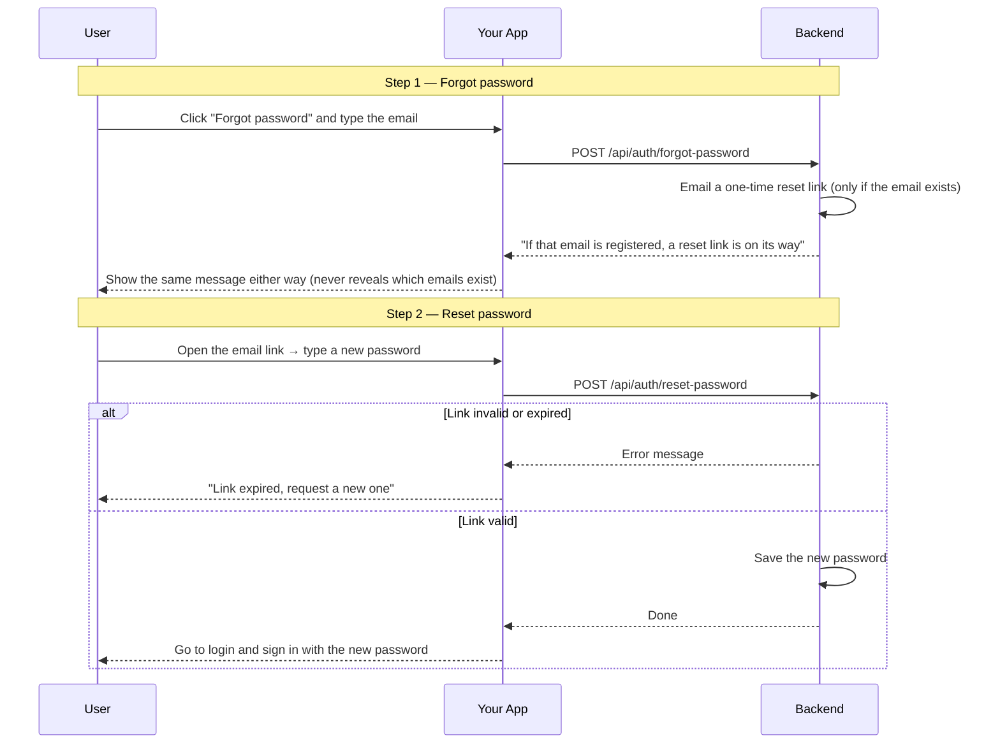
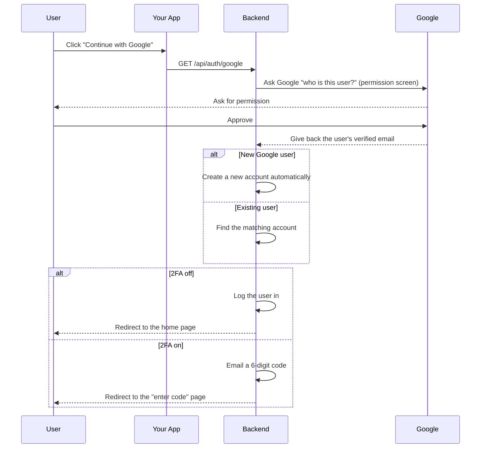
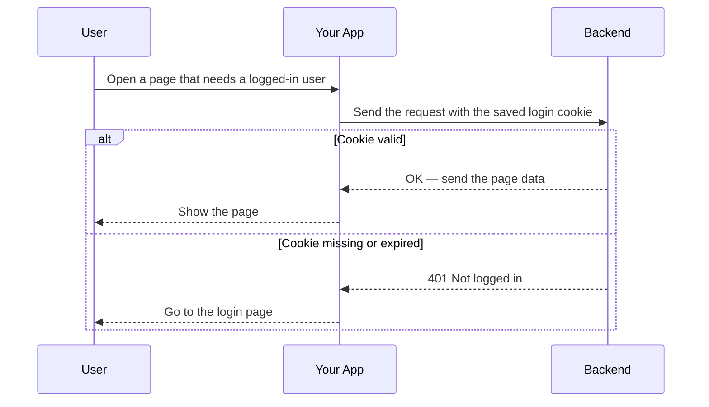
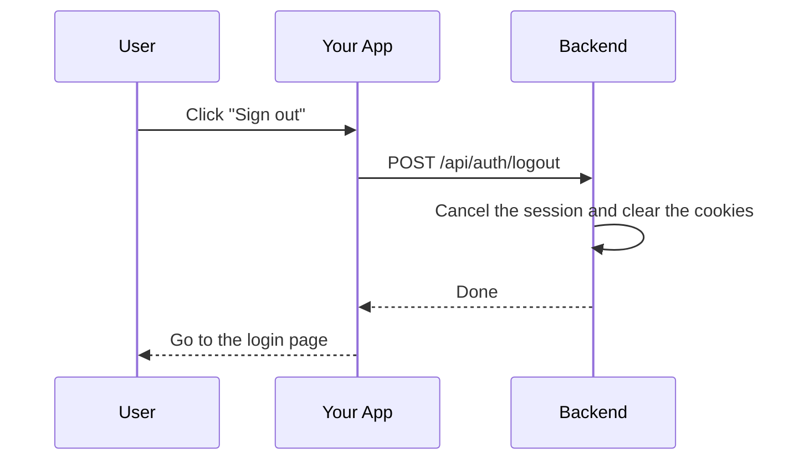

# Auth Module

## Table of Contents

- [Overview](#overview) — What the Auth module does and the authentication flows it supports
- [Files](#files) — Every source file in the module and its role
- [Key Types / Interfaces](#key-types--interfaces) — DTOs, JWT payload, and validation constraints
- [API Endpoints](#api-endpoints) — All routes with method, path, auth, and description
- [Core Logic / Flow](#core-logic--flow) — Mermaid sequence diagrams for registration, login, 2FA, OAuth, JWT validation, and logout
- [Logic Paths Summary](#logic-paths-summary) — Plain-text decision trees for quick reference
- [Dependencies](#dependencies) — npm packages and internal services this module relies on
- [Configuration / Environment](#configuration--environment) — Secrets and environment variables used
- [Module Exports](#module-exports) — What AuthModule re-exports for other modules

---

## Overview

The Auth module handles all authentication concerns for the Ludo Transcendence application. It supports the following flows:

1. **Password-based auth with email verification** — users register with a username/email/password. No session is created until the email verification link is clicked. Login requires either no 2FA or an emailed code.
2. **Two-factor authentication (2FA)** — email-code-based 2FA. When enabled, login requires a password (factor one) plus a 6-digit emailed code (factor two).
3. **Refresh-token sessions** — a short-lived access token (15 min) plus a long-lived, revocable refresh token (7 days) stored in an httpOnly cookie, with silent rotation via a `/refresh` endpoint.
4. **Password reset** — forgot-password emails a one-time link; reset-password redeems it with a new password.
5. **OAuth 2.0** — users authenticate via Google, GitHub, or 42 (School 42 intra). On first login with a provider, a local user account is created or linked to an existing one by email.

The module also provides the `JwtAuthGuard` used by other modules to protect their endpoints.

---

## Files

| File | Role |
|------|------|
| `auth.module.ts` | NestJS module — registers Passport, JwtModule, all strategies, and exports them for other modules |
| `auth.controller.ts` | HTTP routes: register, verify-email, login, 2fa/verify, refresh, forgot-password, reset-password, logout, me, 2FA settings, and 3 OAuth flows |
| `auth.service.ts` | Core business logic: password hashing (bcrypt), JWT issuance, OAuth validation, 2FA orchestration, email verification |
| `jwt.strategy.ts` | Passport strategy that extracts JWT from the `token` cookie |
| `jwt-auth.guard.ts` | `@UseGuards(JwtAuthGuard)` decorator — protects routes behind JWT |
| `jwt-payload.ts` | TypeScript interface for the JWT payload: `{ sub: string; username: string }` |
| `google.strategy.ts` | Passport strategy for Google OAuth 2.0 |
| `github.strategy.ts` | Passport strategy for GitHub OAuth (with `allRawEmails` for verified email detection) |
| `fortytwo.strategy.ts` | Passport strategy for 42 OAuth |
| `ngrok_google_strategy.ts` | Google OAuth variant used in tunnel mode (`TUNNEL_MODE=true`) |
| `ngrok_github_strategy.ts` | GitHub OAuth variant used in tunnel mode |
| `ngrok_fortytwo_strategy.ts` | 42 OAuth variant used in tunnel mode |
| `oauth.guards.ts` | Guard classes: `GoogleAuthGuard`, `GithubAuthGuard`, `FortyTwoAuthGuard` — pick strategy per request host |
| `mail.service.ts` | SMTP email sending — verification links, 2FA codes, password-reset links (degrades to console logging without SMTP config) |
| `session.service.ts` | Redis-backed refresh-token management with rotation and revocation |
| `twofactor.service.ts` | Redis-backed 2FA challenge management: signup verification tokens, password-reset tokens, login codes. Idempotent — a live challenge is reused (no duplicate email) |
| `dto/register.dto.ts` | Validation schema for `POST /api/auth/register` |
| `dto/login.dto.ts` | Validation schema for `POST /api/auth/login` |
| `dto/forgot-password.dto.ts` | Validation schema for `POST /api/auth/forgot-password` |
| `dto/reset-password.dto.ts` | Validation schema for `POST /api/auth/reset-password` |
| `dto/twofactor.dto.ts` | Validation schema for `POST /api/auth/2fa/verify` |
| `dto/two-factor-setting.dto.ts` | Validation schema for `GET/PATCH /api/auth/2fa` |
| `dto/password.rules.ts` | Shared password policy constants used by RegisterDto and ResetPasswordDto |
| `dto/update-profile.dto.ts` | Validation schema for profile updates |
| `dto/change-password.dto.ts` | Validation schema for `PATCH /api/auth/profile/password` |

---

## Key Types / Interfaces

### JwtPayload

```typescript
interface JwtPayload {
  sub: string;    // user UUID
  username: string;  // Player's username
}
```

### RegisterDto

| Field | Type | Constraints |
|-------|------|-------------|
| `username` | string | 3–20 chars, alphanumeric + underscore only |
| `email` | string | **Required** — used for verification link and 2FA codes |
| `password` | string | 12–72 chars, must contain uppercase, lowercase, number, and special character |

### LoginDto

| Field | Type | Constraints |
|-------|------|-------------|
| `identifier` | string | Required — accepts either a username or an email address |
| `password` | string | Required, min 1 char |

### ForgotPasswordDto

| Field | Type | Constraints |
|-------|------|-------------|
| `email` | string | Valid email format |

### ResetPasswordDto

| Field | Type | Constraints |
|-------|------|-------------|
| `token` | string | Exactly 64 chars (hex-encoded random bytes) |
| `password` | string | 12–72 chars, same policy as registration |

### TwoFactorDto

| Field | Type | Constraints |
|-------|------|-------------|
| `pendingToken` | string | Exactly 64 chars (hex-encoded random bytes) |
| `code` | string | Exactly 6 digits |

### TwoFactorSettingDto

| Field | Type | Constraints |
|-------|------|-------------|
| `enabled` | boolean | Required |

### Password Policy (password.rules.ts)

```typescript
export const PASSWORD_MIN = 12;
export const PASSWORD_MAX = 72; // bcrypt ignores bytes past 72
export const PASSWORD_REGEX = /^(?=.*[a-z])(?=.*[A-Z])(?=.*\d)(?=.*[^A-Za-z0-9]).+$/;
```

---

## API Endpoints

| Method | Path | Auth | Description |
|--------|------|------|-------------|
| `POST` | `/api/auth/register` | None | Create account, send verification email (no session set) |
| `GET` | `/api/auth/verify-email` | None | Redeem emailed verification link, redirect to SPA |
| `POST` | `/api/auth/login` | None | Authenticate — returns `{ twoFactorRequired }` or sets session |
| `POST` | `/api/auth/2fa/verify` | None | Redeem 2FA code + pendingToken for session |
| `POST` | `/api/auth/refresh` | None (refresh cookie) | Rotate refresh token, issue fresh access token |
| `POST` | `/api/auth/forgot-password` | None | Email reset link (generic response — no enumeration) |
| `POST` | `/api/auth/reset-password` | None | Redeem reset token with new password |
| `POST` | `/api/auth/logout` | None | Revoke refresh token, clear both cookies |
| `GET` | `/api/auth/me` | JWT | Return current user from cookie |
| `GET` | `/api/auth/profile` | JWT | Full profile for the Edit-Profile card (email, providers, hasPassword) |
| `PATCH` | `/api/auth/profile` | JWT | Update profile (username, display name, email) |
| `PATCH` | `/api/auth/profile/password` | JWT | Change password while logged in (needs current password) |
| `GET` | `/api/auth/2fa` | JWT | Get current user's 2FA preference |
| `PATCH` | `/api/auth/2fa` | JWT | Toggle the user's 2FA preference |
| `GET` | `/api/auth/google` | None | Redirect to Google OAuth |
| `GET` | `/api/auth/google/callback` | None | Google OAuth callback |
| `GET` | `/api/auth/github` | None | Redirect to GitHub OAuth |
| `GET` | `/api/auth/github/callback` | None | GitHub OAuth callback |
| `GET` | `/api/auth/42` | None | Redirect to 42 OAuth |
| `GET` | `/api/auth/42/callback` | None | 42 OAuth callback |

### Cookie Configuration

Two httpOnly cookies are used:

| Property | Access Cookie | Refresh Cookie |
|----------|--------------|----------------|
| Name | `token` | `refresh_token` |
| httpOnly | `true` | `true` |
| sameSite | `lax` | `lax` |
| secure | `true` in production | `true` in production |
| path | `/` | `/api/auth` |
| maxAge | 15 minutes (`ACCESS_MAX_AGE_MS`) | 7 days (`REFRESH_MAX_AGE_MS` / `REFRESH_TTL_S`) |

### Tunable constants

Edit these module-level constants to tweak auth behaviour (all defined in `backend/src/auth/`):

| Constant | File | Default | What it controls |
|----------|------|---------|------------------|
| `SALT_ROUNDS` | `auth.service.ts` | 10 | bcrypt cost for password hashing |
| `DISPLAY_NAME_CHANGE_COOLDOWN_S` | `auth.service.ts` | 2 h | Min time between display-name changes |
| `ACCESS_MAX_AGE_MS` | `auth.controller.ts` | 15 min | Access-cookie lifetime (keep in sync with `JwtModule expiresIn`) |
| `REFRESH_MAX_AGE_MS` | `auth.controller.ts` | 7 days | Refresh-cookie lifetime |
| `REFRESH_TTL_S` | `session.service.ts` | 7 days | Refresh-token Redis TTL |
| `VERIFY_TOKEN_TTL_S` | `twofactor.service.ts` | 24 h | Email-verification link lifetime |
| `RESET_TOKEN_TTL_S` | `twofactor.service.ts` | 1 h | Password-reset link lifetime |
| `CODE_TTL_S` | `twofactor.service.ts` | 5 min | 2FA login-code lifetime |
| `MAX_ATTEMPTS` | `twofactor.service.ts` | 5 | 2FA / reset attempt limit |
| `PASSWORD_MIN` / `PASSWORD_MAX` | `auth/dto/password.rules.ts` | 12 / 72 | Password length bounds (mirrored in `frontend/src/validatePassword.ts`) |

---

## Core Logic / Flow

### 1. Password Registration Flow



### 2. Password Login Flow (with 2FA)



### 3. Two-Factor Verification



### 4. Refresh Token Rotation



### 5. Forgot / Reset Password Flow



### 6. OAuth Flow (Google / GitHub / 42)

All three providers follow the same pattern. The example below uses Google:



### 7. JWT Validation on Protected Routes



### 8. Logout



---

## Logic Paths Summary

Concise decision trees showing every code path through each auth operation, including error branches.

### Registration Path

```
POST /api/auth/register
  ├── Validate RegisterDto (class-validator)
  ├── Check username uniqueness → 409 if taken
  ├── Check email uniqueness → 409 if taken
  ├── bcrypt.hash(password, 10)
  ├── Prisma user.create() — with nested achievement.create (1:1 flags row)
  ├── TwoFactorService.createVerifyToken(userId)
  ├── MailService.sendVerification(email, ...)
  └── Return { message: 'Account created — check your email...' }
```

### Login Path

```
POST /api/auth/login
  ├── Validate LoginDto
  ├── Find user by username OR email → 401 if not found
  ├── bcrypt.compare(password, hash) → 401 if mismatch
  ├── Check emailVerified → 403 if not verified
  ├── If 2FA enabled:
  │   ├── TwoFactorService.startChallenge(userId)  // returns { pendingToken, code, fresh }
  │   ├── MailService.send2faCode(email, code)     // only if fresh — no duplicate email
  │   └── Return { twoFactorRequired: true, pendingToken }
  └── If 2FA disabled:
      ├── SessionService.issue(userId) → refreshToken
      ├── Jwt.sign({ sub, username }) → accessToken
      ├── Set both cookies
      └── Return { twoFactorRequired: false, user }
```

### 2FA Verify Path

```
POST /api/auth/2fa/verify
  ├── Validate TwoFactorDto
  ├── TwoFactorService.verifyChallenge(pendingToken, code)
  │   ├── Invalid/expired/max attempts → 401
  │   └── Valid → issueSession → set cookies → return { user }
```

### Refresh Path

```
POST /api/auth/refresh
  ├── Extract refresh_token cookie
  ├── SessionService.rotate(token)
  │   ├── Invalid/expired → 401
  │   └── Valid → issue new access token + rotated refresh token → set cookies → return { user }
```

### Forgot Password Path

```
POST /api/auth/forgot-password
  ├── Validate ForgotPasswordDto
  ├── Find user by email
  ├── If user has password_hash:
  │   ├── TwoFactorService.createResetToken(userId)
  │   └── MailService.sendPasswordReset(email, ...)
  └── Return generic { message } (always identical)
```

### Reset Password Path

```
POST /api/auth/reset-password
  ├── Validate ResetPasswordDto
  ├── TwoFactorService.consumeResetToken(token)
  │   ├── Invalid/expired → 401
  │   └── Valid → bcrypt.hash(newPassword)
  ├── Prisma user.update({ password_hash, emailVerified: now })
  ├── SessionService.revokeAll(userId)
  └── Return { message: 'Password updated...' }
```

### OAuth Path (Google / GitHub / 42)

```
GET /api/auth/{provider}
  └── Redirect to provider consent screen

GET /api/auth/{provider}/callback
  ├── Exchange code for access token + profile
  ├── Extract verified email from profile
  ├── validateOAuthLogin():
  │   ├── Check existing Account → return linked user
  │   ├── Check email match → link provider to existing user
  │   └── Create new user + account
  ├── If no verified email → redirect to /login?error=no-verified-email
  ├── If 2FA disabled → issueSession → set cookies → redirect to {FRONTEND_URL}/home
  └── If 2FA enabled → startTwoFactor → send code → redirect to {FRONTEND_URL}/2fa?token=...
```

### Authenticated Request Path

```
GET /api/auth/me (or any @UseGuards(JwtAuthGuard) route)
  ├── Extract token from cookie
  ├── jwt.verify(token, JWT_SECRET)
  │   ├── Invalid → 401
  │   └── Valid → attach { id, username } to req.user
  └── Execute handler
```

---

## Dependencies

| Dependency | Purpose |
|-----------|---------|
| `@nestjs/jwt` | JWT signing and verification |
| `@nestjs/passport` | Passport integration for NestJS |
| `passport` | Authentication middleware |
| `passport-jwt` | JWT extraction strategy |
| `passport-google-oauth20` | Google OAuth 2.0 |
| `passport-github2` | GitHub OAuth |
| `passport-42` | 42 School OAuth |
| `bcrypt` | Password hashing |
| `class-validator` | DTO validation |
| `nodemailer` | SMTP email delivery (verification, 2FA, password reset) |
| `ioredis` | Redis client (SessionService, TwoFactorService) |
| `PrismaService` | Database access (User, Account models) |
| `secrets.ts` | Reads JWT_SECRET, OAuth client IDs/secrets/callback URLs, SMTP credentials from `/secrets/` files |

---

## Configuration / Environment

Secrets are loaded from `/secrets/*.txt` files at runtime via `secrets.ts` (with environment variable fallback):

| Secret | Used By |
|--------|---------|
| `JWT_SECRET` | JwtModule, JwtStrategy |
| `GOOGLE_CLIENT_ID` | GoogleStrategy |
| `GOOGLE_CLIENT_SECRET` | GoogleStrategy |
| `GOOGLE_CALLBACK_URL` | GoogleStrategy |
| `GITHUB_CLIENT_ID` | GithubStrategy |
| `GITHUB_CLIENT_SECRET` | GithubStrategy |
| `GITHUB_CALLBACK_URL` | GithubStrategy |
| `FORTYTWO_CLIENT_ID` | FortyTwoStrategy |
| `FORTYTWO_CLIENT_SECRET` | FortyTwoStrategy |
| `FORTYTWO_CALLBACK_URL` | FortyTwoStrategy |
| `FRONTEND_URL` | AuthController (OAuth redirect target, defaults to `https://localhost:8443`) |
| `SMTP_CREDENTIALS` | MailService (format: `[smtp.gmail.com]:587 address@gmail.com:app-password`) |
| `REDIS_PASSWORD` | SessionService, TwoFactorService |

### Environment Variables

| Variable | Default | Used By |
|----------|---------|---------|
| `REDIS_HOST` | `redis` | SessionService, TwoFactorService |
| `REDIS_PORT` | `6479` | SessionService, TwoFactorService |

---

## Module Exports

The `AuthModule` re-exports `AuthService`, `JwtModule`, and `PassportModule` so that other feature modules (e.g. MatchModule, FriendsModule) can use `JwtAuthGuard` and `JwtService` without registering a second, secret-less JwtModule instance.