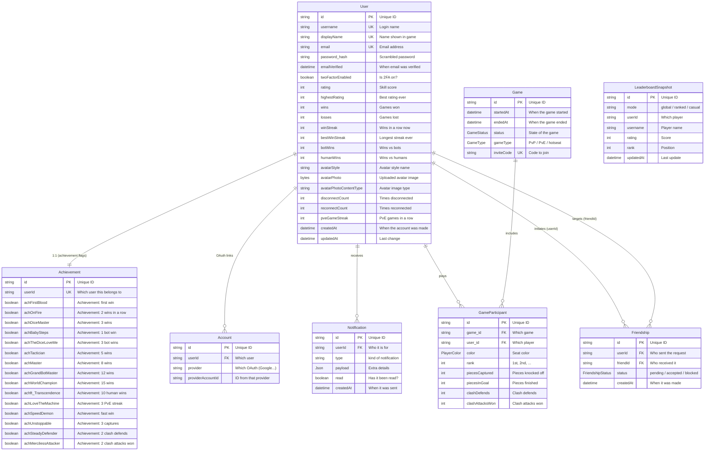

# Database Schema

## Table of Contents

- [Overview](#overview) — Prisma ORM schema for PostgreSQL
- [Enums](#enums) — All enum types used in the database
- [Models](#models) — All 8 models with fields, types, and relations
- [Entity Relationships](#entity-relationships) — ER diagram showing model relations
- [Indexes](#indexes) — Database indexes for query performance

---

## Overview

The database uses PostgreSQL 16 with Prisma ORM (Prisma 7, `@prisma/adapter-pg`). The schema defines **8 models** and **4 enums** covering users, achievements, OAuth accounts, games, friendships, leaderboard snapshots, and notifications. The Prisma client is generated into `backend/generated` (gitignored).

> **Notable shift:** The `Achievement` model now holds **only the achievement
> flags**. All per-user stats (rating, wins, streaks), avatar data, and
> disconnect/reconnect counters live directly on **`User`**.

---

## Enums

### FriendshipStatus

```prisma
enum FriendshipStatus {
  pending
  accepted
  blocked
}
```

### PlayerColor

```prisma
enum PlayerColor {
  RED
  GREEN
  YELLOW
  BLUE
}
```

### GameStatus

```prisma
enum GameStatus {
  COMPLETED
  ABANDONED
}
```

### GameType

```prisma
enum GameType {
  PVP
  PVE
}
```

> There is no `UserStatus` enum — presence is a runtime Redis concern (see `backend-presence-module.md`), with `'online' | 'playing' | 'offline'` derived from the presence key TTL.

---

## Models

### User

The main account record. Holds login info plus all per-user stats, avatar
data, and disconnect/reconnect counters.

| Field | Type | Attributes | Description |
|-------|------|------------|-------------|
| `id` | String | UUID, PK | Unique user identifier |
| `username` | String | Unique | Login name (3-20 chars, alphanumeric + underscore) |
| `displayName` | String | Unique | Display name shown in-game |
| `email` | String? | Unique | Email address (nullable for OAuth-only edge cases) |
| `password_hash` | String? | | bcrypt hash (null for OAuth-only users) |
| `emailVerified` | DateTime? | | When email was verified |
| `twoFactorEnabled` | Boolean | Default: false | Whether email-code 2FA is required at login |
| `rating` | Int | Default: 0 | Elo-like rating |
| `highestRating` | Int | Default: 0 | Peak rating achieved |
| `wins` | Int | Default: 0 | Total games won |
| `losses` | Int | Default: 0 | Total games lost |
| `winStreak` | Int | Default: 0 | Current consecutive wins |
| `bestWinStreak` | Int | Default: 0 | Best consecutive wins |
| `botWins` | Int | Default: 0 | Games won against bots |
| `humanWins` | Int | Default: 0 | Games won against humans |
| `avatarStyle` | String | Default: `"bottts"` | DiceBear avatar style identifier |
| `avatarPhoto` | Bytes? | | Binary custom avatar image data |
| `avatarPhotoContentType` | String? | | MIME type of custom avatar |
| `disconnectCount` | Int | Default: 0 | Number of disconnects |
| `reconnectCount` | Int | Default: 0 | Number of reconnects |
| `pveGameStreak` | Int | Default: 0 | Consecutive PvE games (any outcome) |
| `createdAt` | DateTime | Auto | Account creation timestamp |
| `updatedAt` | DateTime | Auto | Last update timestamp |

**Relations:** `accounts`, `notifications`, `achievement` (1:1), `gameParticipants`, `sentFriendships`, `receivedFriendships`

---

### Achievement

1:1 with `User`. Holds **only the achievement flags** — no stats, rating, or
avatar data (those live on `User`).

| Field | Type | Attributes | Description |
|-------|------|------------|-------------|
| `id` | String | UUID, PK | Unique identifier |
| `userId` | String | Unique, FK | Owning user |
| `achFirstBlood` … `achUnstoppable`, `achSteadyDefender`, `achMercilessAttacker` | Boolean | Default: false | 15 achievement flags (incl. the clash-mode `achSteadyDefender` / `achMercilessAttacker`; see `backend-achievements-module.md`) |

**Relations:** `user` (1:1, back-reference)

---

### Account

OAuth provider links, one row per provider per user.

| Field | Type | Attributes | Description |
|-------|------|------------|-------------|
| `id` | String | UUID, PK | Unique identifier |
| `userId` | String | FK | Owning user |
| `provider` | String | | Provider name (`google`, `github`, `42`) |
| `providerAccountId` | String | | Provider-side account id |

**Relations:** `user` (back-reference)

---

### Game

Historical results only — live matchmaking state lives in Redis, not here.

| Field | Type | Attributes | Description |
|-------|------|------------|-------------|
| `id` | String | UUID, PK | Unique game identifier |
| `startedAt` | DateTime | | When the game started |
| `endedAt` | DateTime | | When the game ended |
| `status` | GameStatus | Default: COMPLETED | Completion state |
| `gameType` | GameType | Default: PVP | PvP or PvE |
| `inviteCode` | String? | Unique | Join code for invite games |

**Relations:** `participants` (GameParticipant[])

---

### GameParticipant

One row per player per game.

| Field | Type | Attributes | Description |
|-------|------|------------|-------------|
| `id` | String | UUID, PK | Unique identifier |
| `game_id` | String | FK | Owning game |
| `user_id` | String | FK | Player (bots use `bot-<color>` synthetic ids) |
| `color` | PlayerColor | | Seat color |
| `rank` | Int | | Final placement (1st-4th) |
| `piecesCaptured` | Int | Default: 0 | Pieces knocked off |
| `piecesInGoal` | Int | Default: 0 | Pieces finished (0-4) |
| `clashDefends` | Int | Default: 0 | Clash-mode: times defended a clash |
| `clashAttacksWon` | Int | Default: 0 | Clash-mode: times won a clash as attacker |

**Relations:** `game`, `user`

---

### Friendship

| Field | Type | Attributes | Description |
|-------|------|------------|-------------|
| `id` | String | UUID, PK | Unique identifier |
| `userId` | String | FK | Sender/initiator |
| `friendId` | String | FK | Target user |
| `status` | FriendshipStatus | Default: pending | pending/accepted/blocked |
| `createdAt` | DateTime | Auto | When created |

**Relations:** `user` (SentFriendships), `friend` (ReceivedFriendships)

---

### LeaderboardSnapshot

Denormalized mirror of Redis leaderboard sorted sets, written on game end as a fallback for when Redis is down.

| Field | Type | Attributes | Description |
|-------|------|------------|-------------|
| `id` | String | UUID, PK | Unique identifier |
| `mode` | String | | `global` \| `ranked` \| `casual` \| `bot` |
| `userId` | String | | Player id |
| `username` | String | | Player username |
| `rating` | Int | | Rating at snapshot time |
| `rank` | Int | | Rank at snapshot time |
| `updatedAt` | DateTime | Auto | When written |

**Relations:** None (denormalized snapshot, no FK)

---

### Notification

Persisted notifications backing the SSE stream and the bell dropdown.

| Field | Type | Attributes | Description |
|-------|------|------------|-------------|
| `id` | String | UUID, PK | Unique identifier |
| `userId` | String | FK | Recipient |
| `type` | String | | `friend_request` \| `friend_accepted` \| `game_invite` \| `achievement` |
| `payload` | Json | | Flexible per-type data |
| `read` | Boolean | Default: false | Read state |
| `createdAt` | DateTime | Auto | When created |

**Relations:** `user` (back-reference)

---

## Entity Relationships



---

## Indexes

| Model | Field(s) | Type | Purpose |
|-------|----------|------|---------|
| User | `username` | Unique | Fast lookup by username |
| User | `displayName` | Unique | Fast lookup by display name |
| User | `email` | Unique | Fast lookup by email |
| Achievement | `userId` | Unique | 1:1 lookup by user |
| Account | `(provider, providerAccountId)` | Unique | Fast OAuth lookup |
| Account | `userId` | Index | Fast user account lookup |
| Game | `inviteCode` | Unique | Fast invite code lookup |
| GameParticipant | `(game_id, user_id)` | Unique | Prevent duplicate entries |
| GameParticipant | `(game_id, color)` | Unique | Prevent duplicate colors |
| Friendship | `(userId, friendId)` | Unique | Prevent duplicate friendships |
| LeaderboardSnapshot | `(mode, userId)` | Unique | One snapshot per user per mode |
| LeaderboardSnapshot | `(mode, rank)` | Index | Fast leaderboard query by mode+rank |
| Notification | `(userId, read)` | Index | Fast unread-lookup per user |
