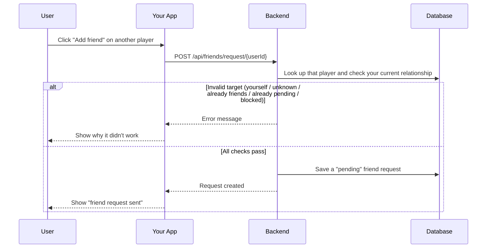
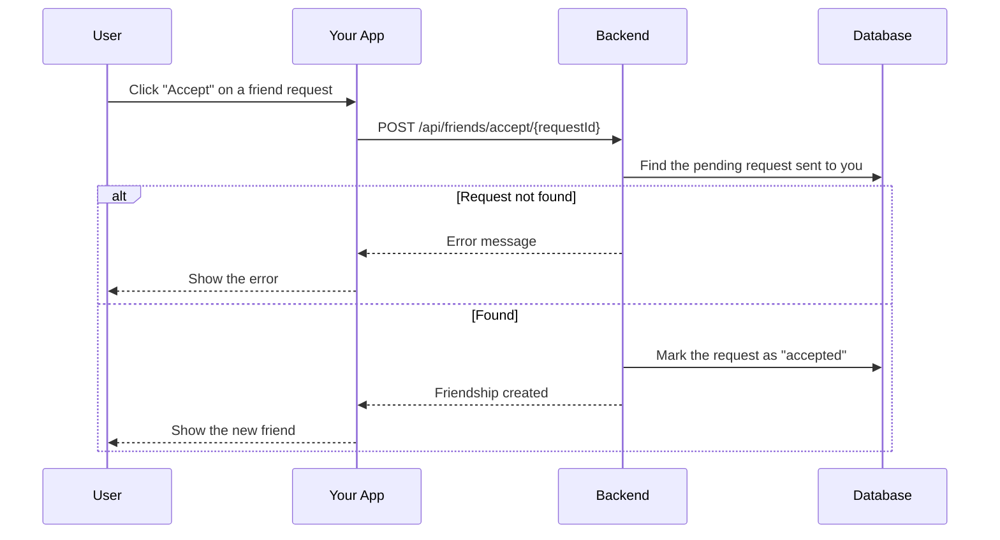
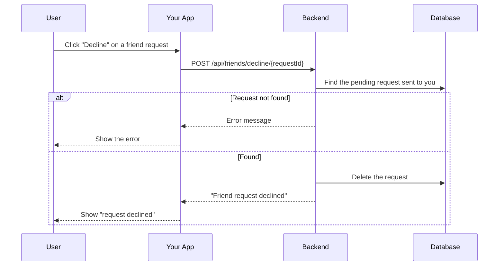
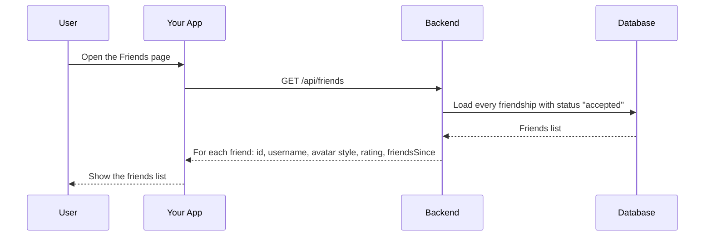
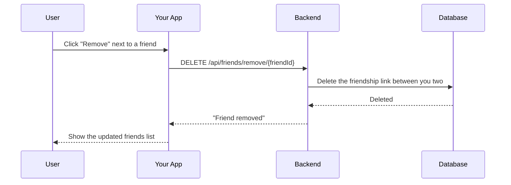
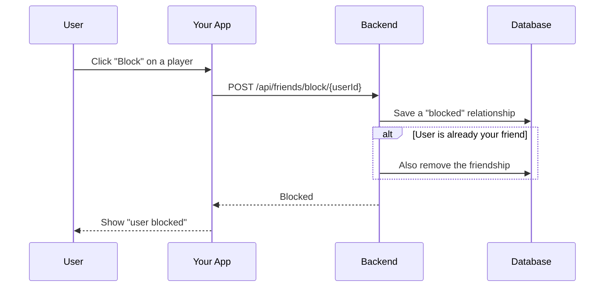

# Friends Module

## Table of Contents

- [Overview](#overview) — Friend request lifecycle and relationship management
- [Files](#files) — Every source file in the module and its role
- [Key Types / Interfaces](#key-types--interfaces) — Friendship status enum and response shapes
- [API Endpoints](#api-endpoints) — All 7 routes with method, path, auth, and description
- [Core Logic / Flow](#core-logic--flow) — Mermaid sequence diagrams for send, accept, decline, list, requests, remove, and block
- [Logic Paths Summary](#logic-paths-summary) — Decision trees for each operation
- [Dependencies](#dependencies) — Internal services this module relies on

---

## Overview

The Friends module manages the friendship lifecycle between users. It supports:

1. **Friend requests** — send a request to another user.
2. **Accept/Decline** — the recipient can accept or decline a pending request.
3. **Listing** — view all friends with their rating and friendsSince date.
4. **Pending requests** — view sent and received pending requests.
5. **Removal** — remove a friend.
6. **Blocking** — block a user.

Friendships have a status field: `pending`, `accepted`, or `blocked`.

---

## Files

| File | Role |
|------|------|
| `friends.controller.ts` | HTTP routes: send, accept, decline, list, requests, remove, block |
| `friends.service.ts` | Business logic: Prisma queries for friendship CRUD |
| `friends.module.ts` | NestJS module — registers controller, service, and PrismaService |

---

## Key Types / Interfaces

### FriendshipStatus Enum

```prisma
enum FriendshipStatus {
  pending    // Request sent, awaiting response
  accepted   // Both users are friends
  blocked    // User has blocked the other
}
```

### Friendship Model

```typescript
{
  id: string;        // Composite ID (e.g. "userId-friendId")
  userId: string;    // User who initiated
  friendId: string;  // Target user
  status: FriendshipStatus;  // Current status
  createdAt: Date;  // When the record was created
}
```

### Friends List Response Shape

```typescript
{
  id: string;  // Unique ID
  username: string;  // Player's username
  avatarStyle: string | null;  // Avatar style name
  rating: number;  // Player's rating (score)
  friendsSince: Date;  // When the friendship started
}
```

### Friend Requests Response Shape

```typescript
{
  sent: Array<{  // Requests I sent
    id: string;  // Unique ID
    userId: string;  // ID of the user this belongs to
    username: string;  // Player's username
    avatarStyle: string | null;  // Avatar style name
    createdAt: Date;  // When the record was created
  }>;
  received: Array<{  // Requests sent to me
    id: string;  // Unique ID
    userId: string;  // ID of the user this belongs to
    username: string;  // Player's username
    avatarStyle: string | null;  // Avatar style name
    createdAt: Date;  // When the record was created
  }>;
}
```

---

## API Endpoints

| Method | Path | Auth | Description |
|--------|------|------|-------------|
| `POST` | `/api/friends/request/:userId` | JWT | Send friend request to target user |
| `POST` | `/api/friends/accept/:requestId` | JWT | Accept a pending friend request |
| `POST` | `/api/friends/decline/:requestId` | JWT | Decline a pending friend request |
| `DELETE` | `/api/friends/remove/:friendId` | JWT | Remove a friend by friend's user ID |
| `GET` | `/api/friends` | JWT | List all friends (optional `?username=` filter) |
| `GET` | `/api/friends/requests` | JWT | List pending sent and received requests |
| `GET` | `/api/friends/blocked` | JWT | List users I have blocked |
| `POST` | `/api/friends/block/:userId` | JWT | Block a user |
| `POST` | `/api/friends/unblock/:userId` | JWT | Unblock a user |
| `POST` | `/api/friends/:friendId/invite` | JWT | Invite a friend to a PvP game (creates a room + seats them) |
| `GET` | `/api/friends/invites/pending` | JWT | Get my pending game invite |
| `POST` | `/api/friends/invites/dismiss` | JWT | Dismiss a pending game invite |

> **Real-time touches:** friend requests and accepted friendships fire a `NotificationService.notify()` push (bell + SSE), and friend lists show live presence status via `PresenceService.getStatuses()`. Game invites create a room and send a `game_invite` notification.

---

## Core Logic / Flow

### 1. Send Friend Request

Sequence of steps when a user sends a friend request to another user.


### 2. Accept Friend Request

Sequence of steps when a user accepts a pending friend request.


### 3. Decline Friend Request

Sequence of steps when a user declines a pending friend request.


### 4. List Friends

Sequence of steps when a user lists their friends.


### 5. Remove Friend

Sequence of steps when a user removes a friend.


### 6. Block User

Sequence of steps when a user blocks another user.


---

## Logic Paths Summary

### Send Friend Request Path
```
POST /api/friends/request/{userId} (JWT required)
  ├── Check target is self → 400 Bad Request
  ├── Check target exists → 404 Not Found
  ├── Check existing friendship:
  │   ├── Accepted → 400 Already friends
  │   ├── Pending → 400 Request already pending
  │   └── Blocked → 403 Cannot send
  ├── friendship.create({ userId, friendId, status: 'pending' })
  └── 201 (friendship object)
```

### Accept Friend Request Path
```
POST /api/friends/accept/{requestId} (JWT required)
  ├── friendship.findFirst({ id, friendId: userId, status: 'pending' }) → 404 Not Found
  ├── friendship.update({ status: 'accepted' })
  └── 200 (friendship object)
```

### Decline Friend Request Path
```
POST /api/friends/decline/{requestId} (JWT required)
  ├── friendship.findFirst({ id, friendId: userId, status: 'pending' }) → 404 Not Found
  ├── friendship.delete({ id })
  └── 200 { message: 'Friend request declined' }
```

### List Friends Path
```
GET /api/friends (JWT required)
  ├── Find friendships where userId or friendId matches, status = 'accepted'
  ├── Map to { id, username, avatarStyle, rating, friendsSince }
  └── 200 [{ id, username, avatarStyle, rating, friendsSince }]
```

### Remove Friend Path
```
DELETE /api/friends/remove/{friendId} (JWT required)
  ├── Find friendship by (userId, friendId) or (friendId, userId), status = 'accepted' → 404 Not Found
  ├── friendship.delete()
  └── 200 { message: 'Friend removed' }
```

### Block User Path
```
POST /api/friends/block/{userId} (JWT required)
  ├── Check target is self → 400 Bad Request
  ├── Find existing friendship:
  │   ├── Found → update status to 'blocked'
  │   └── Not found → create new with status 'blocked'
  └── 200 (friendship object)
```

---

## Dependencies

| Dependency | Purpose |
|-----------|---------|
| `PrismaService` | Database access (Friendship, User models) |
| `PresenceService` | Live status in friend lists |
| `MatchService` | Create/join rooms for game invites |
| `NotificationService` | Push `friend_request` / `friend_accepted` / `game_invite` notifications |
| `Redis` (ioredis) | Pending game-invite records (`invite:<userId>`) |
| `JwtAuthGuard` | Protects all friend endpoints |