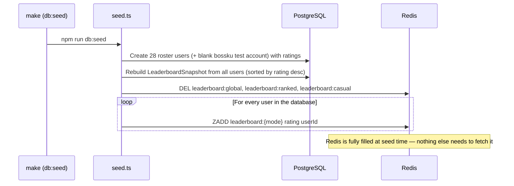
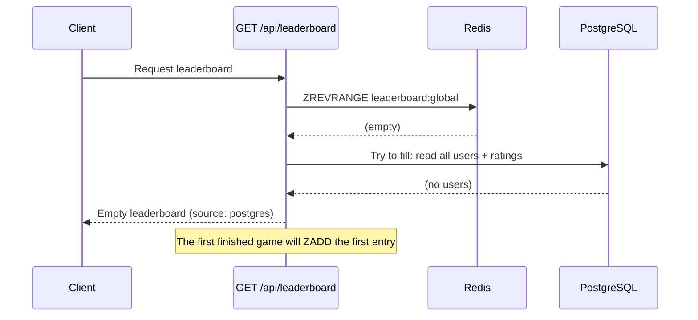
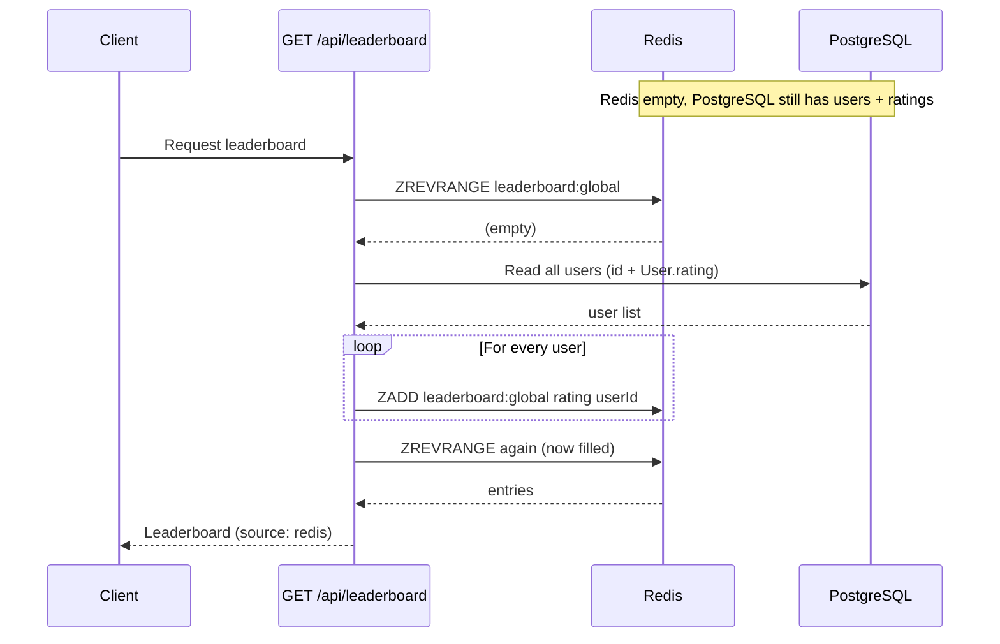
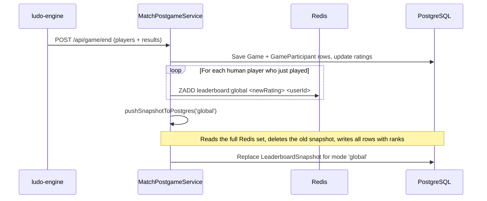
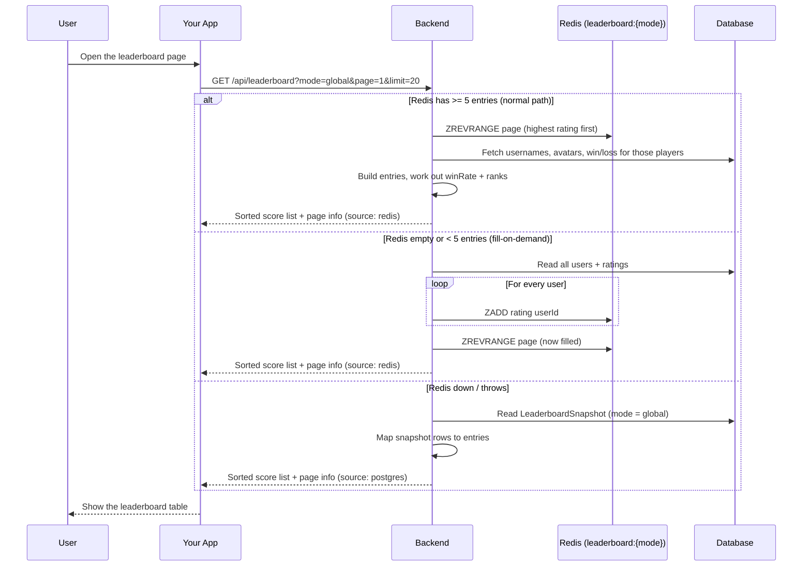

# Leaderboard Module

## Table of Contents

- [Overview](#overview) — What the leaderboard does
- [Data Flow & Population](#data-flow--population) — How the leaderboard gets filled and read
- [Files](#files) — Every source file in the module and its role
- [Key Types / Interfaces](#key-types--interfaces) — Query options and response shapes
- [API Endpoints](#api-endpoints) — All routes with method, path, auth, and description
- [Core Logic / Flow](#core-logic--flow) — Mermaid diagrams for the leaderboard flow
- [Logic Paths Summary](#logic-paths-summary) — Step-by-step paths for each operation
- [Dependencies](#dependencies) — Other services this module relies on
- [Configuration / Environment](#configuration--environment) — Environment variables used

---

## Overview

The Leaderboard module shows a **ranked list of players**, sorted by rating
(their score). It supports:

1. **Leaderboard querying** — get the list, split into pages, for global, ranked, casual, or bot modes.
2. **Redis sorted sets** — the ranking is stored in Redis as a sorted set
   (`leaderboard:{mode}`), so it is always sorted by rating and fast to read.
3. **PostgreSQL backup table** — a copy of the ranking (`LeaderboardSnapshot`)
   is written after every game, so the leaderboard still works if Redis is down.
4. **Your own rank** — the request can also return the logged-in user's position via `myRank`.

---

## Data Flow & Population

### Where the data lives

| Store | What it holds | Role |
|-------|---------------|------|
| **Redis sorted set** `leaderboard:{mode}` | each player = `userId`, each rating = `rating` | The normal, fast way to read the leaderboard; always sorted by rating |
| **PostgreSQL `LeaderboardSnapshot`** | one row per player per mode: `{ mode, userId, username, rating, rank }` | Backup copy — only used if Redis is empty or down |
| **PostgreSQL `User`** | the real ratings (`User.rating`) | Where the real ratings live — Redis and the snapshot are built from this |

### How Redis sorted sets rank players

Redis keeps one **sorted set** per mode:

| Redis command | What it does | Where it is used |
|---------------|--------------|------------------|
| `ZADD leaderboard:global <rating> <userId>` | Add a player, or update their score | seed, game end, fill-on-demand |
| `ZREVRANGE key start stop WITHSCORES` | Read one page, **highest rating first** | `getLeaderboardFromRedis` |
| `ZREVRANK key userId` | A player's position (starts at 0, so add 1) | `getUserRank` (the `myRank` highlight) |
| `ZCARD key` | How many players are in the set | `getLeaderboardCount` |

The set is always in rating order, so reading the top N players is just one
`ZREVRANGE` call — no sorting needed in the app.

### Scenario 1 — First startup with seeded data

When the stack first starts with `make` (which runs `db:seed`), the seed script
fills **both** Redis and the PostgreSQL backup table at the same time:



> **Wait — isn't the seed only for the database?** The command is called `db:seed`
> (run as `npm run db:seed` → `prisma generate && prisma db seed`), and yes, its
> main job is filling PostgreSQL. But the seed script **also connects to Redis
> directly** and fills the leaderboard there. It does not rely on the backend
> API at all:
>
> 1. `seed.ts` connects straight to Redis with `ioredis`, using the same
>    `REDIS_HOST` / `REDIS_PORT` / `REDIS_PASSWORD` values the backend uses
>    (from env or the secrets files).
> 2. It clears the old sorted sets first: `DEL leaderboard:global`,
>    `leaderboard:ranked`, `leaderboard:casual`.
> 3. It reads every user + rating from PostgreSQL (`allPilots`, sorted by rating
>    descending) and writes each one into all three sets with
>    `ZADD leaderboard:{mode} <rating> <userId>`.
> 4. If Redis is unreachable at seed time, the script **does not fail** — it
>    logs a warning and skips the Redis part, so the PostgreSQL seed still
>    completes. The leaderboard then gets filled later by the fill-on-demand
>    path (Scenario 3b) or by game-end updates (Scenario 4).
>
> **How often does the leaderboard check the backend?** At seed time it is
> filled **once**, right away. After that there is **no polling, no cron, and no
> scheduled sync** — the ranking is updated a little at a time after every game
> (see Scenario 4) and fills itself back up on the first read if Redis is empty
> (see Scenario 3b).

### Scenario 2 — Nothing in the database

If PostgreSQL has **zero users** (fresh DB, no seed, no sign-ups yet):



Result: an **empty leaderboard**. It stays empty until the first real game
finishes, because the only things that write to it are the seed script and
game-end scoring.

### Scenario 3 — Redis was shut down and brought back up

#### 3a. Redis still has its data (normal restart)

Redis keeps its data in the `redis_data` Docker volume, so a container restart
**keeps the sorted sets**. After a restart the leaderboard is served straight
from Redis — nothing needs to be filled again. The PostgreSQL backup table is
left alone.

#### 3b. Redis is empty (volume wiped / flushed) but PostgreSQL has users

The first read **rebuilds Redis on demand** from PostgreSQL:



This is triggered by the check in `getLeaderboard`: if Redis returns **no
entries** or **fewer than 5 total**, the service reads every player's rating
from PostgreSQL and writes them into Redis before answering. This only happens
**when someone actually asks for the leaderboard** — nothing runs in the
background.

#### 3c. Redis is completely down

The Redis read is wrapped in `try/catch`. If it fails, the service falls back
to the `LeaderboardSnapshot` table in PostgreSQL (`source: 'postgres'`), so the
page still shows the last saved ranking from the most recent game end.

### Scenario 4 — Live updates after every game

The leaderboard does **not** go stale between seeds: every finished game
updates it.



> Note: game-end scoring only writes the **`global`** mode. The `ranked` and
> `casual` sets are created by the seed and the fill-on-demand, but only
> `global` is updated after every game.

---

## Files

| File | Role |
|------|------|
| `leaderboard.controller.ts` | HTTP route: GET with mode, page, limit query params (needs login) |
| `leaderboard.service.ts` | Business logic: reads Redis, fills it from PostgreSQL when empty, falls back to the backup table |
| `leaderboard-redis.service.ts` | Redis layer: ZADD / ZREVRANGE / ZREVRANK / ZCARD, snapshot push, full rebuild helper |
| `leaderboard.module.ts` | NestJS module — registers controller, services, and PrismaService |

---

## Key Types / Interfaces

### Query Options

| Parameter | Type | Default | Description |
|-----------|------|---------|-------------|
| `mode` | `'global' \| 'ranked' \| 'casual' \| 'bot'` | `'global'` | Which game mode to show |
| `page` | number (string) | `1` | Page number (starts at 1) |
| `limit` | number (string) | `20` | Players per page (max 100) |

### LeaderboardEntry Interface

```typescript
interface LeaderboardEntry {
  rank: number;  // Position in the ranking
  username: string;  // Player's username
  rating: number;  // Player's rating (score)
  gamesPlayed: number;  // Games played
  wins: number;  // Games won
  losses: number;  // Games lost
  draws: number;       // Always 0 (not tracked)
  winRate: number;     // Win percentage (0-100)
  avatarStyle: string | null;  // Avatar style name
}
```

### LeaderboardResponse Interface

```typescript
interface LeaderboardResponse {
  entries: LeaderboardEntry[];  // The leaderboard rows
  total: number;  // Total number of players
  page: number;  // Page number
  limit: number;  // Players per page
  myRank?: {           // Only included if a userId is given
    rank: number;  // Position in the ranking
    username: string;  // Player's username
    rating: number;  // Player's rating (score)
  } | null;
  source: 'redis' | 'postgres';  // Where the data came from
}
```

---

## API Endpoints

| Method | Path | Auth | Description |
|--------|------|------|-------------|
| `GET` | `/api/leaderboard?mode=global&page=1&limit=20` | JWT (required) | Get the leaderboard; includes `myRank` for the logged-in user |

---

## Core Logic / Flow

### 1. Get Leaderboard

What happens when a client asks for the leaderboard.



---

## Logic Paths Summary

### Get Leaderboard Path

```
GET /api/leaderboard?mode=global&page=1&limit=20
  ├── Read the query options (mode, page, limit)
  ├── Try Redis:
  │   ├── ZREVRANGE leaderboard:{mode} page → entries
  │   ├── ZCARD leaderboard:{mode} → total
  │   ├── If entries empty OR total < 5:
  │   │   └── Fill on demand: read all users (id + User.rating) from PostgreSQL
  │   │       └── ZADD each into leaderboard:{mode}, then read again
  │   ├── Fetch user details from PostgreSQL, work out gamesPlayed/winRate/ranks
  │   ├── myRank = ZREVRANK(userId) + 1 (if userId given)
  │   └── Return { entries, source: 'redis', myRank? }
  └── If Redis fails (catch):
      ├── Query the LeaderboardSnapshot table (mode)
      ├── Map rows to entries (stats from snapshot + user table)
      ├── myRank from the snapshot row
      └── Return { entries, source: 'postgres', myRank? }
```

### Population Paths (summary)

```
SEED (make → db:seed)
  ├── Create seed users with ratings
  ├── Rebuild LeaderboardSnapshot for all users
  ├── DEL leaderboard:global / ranked / casual
  └── ZADD every user into each sorted set

GAME END (MatchPostgameService.processGameEnd)
  ├── For each human player: ZADD leaderboard:global <newRating> <userId>
  └── pushSnapshotToPostgres('global'): delete + recreate LeaderboardSnapshot

FILL ON DEMAND (first read after Redis is empty)
  ├── GET /api/leaderboard finds Redis empty or < 5 entries
  └── Reads all users from PostgreSQL and ZADDs them into leaderboard:{mode}
```

---

## Dependencies

| Dependency | Purpose |
|-----------|---------|
| `PrismaService` | Database access (User, LeaderboardSnapshot models) |
| `LeaderboardRedisService` | Redis layer: sorted-set reads/writes, snapshot push, rebuild helper |
| `ioredis` | Redis client |

---

## Configuration / Environment

| Variable | Default | Used By |
|----------|---------|---------|
| `REDIS_HOST` | `redis` | LeaderboardRedisService Redis connection |
| `REDIS_PORT` | `6479` | LeaderboardRedisService Redis connection |
| `REDIS_PASSWORD` | (from secrets) | LeaderboardRedisService Redis authentication |
