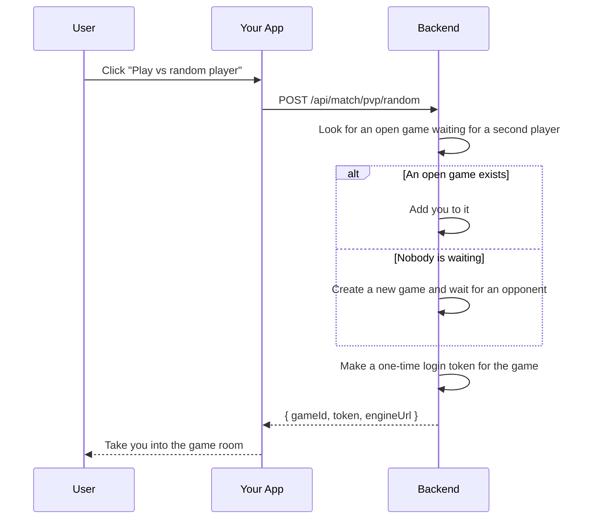
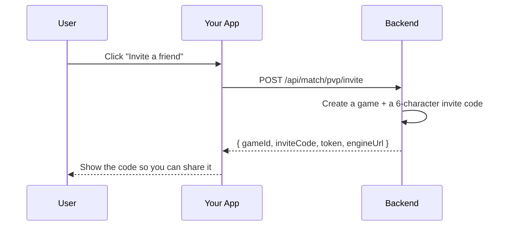
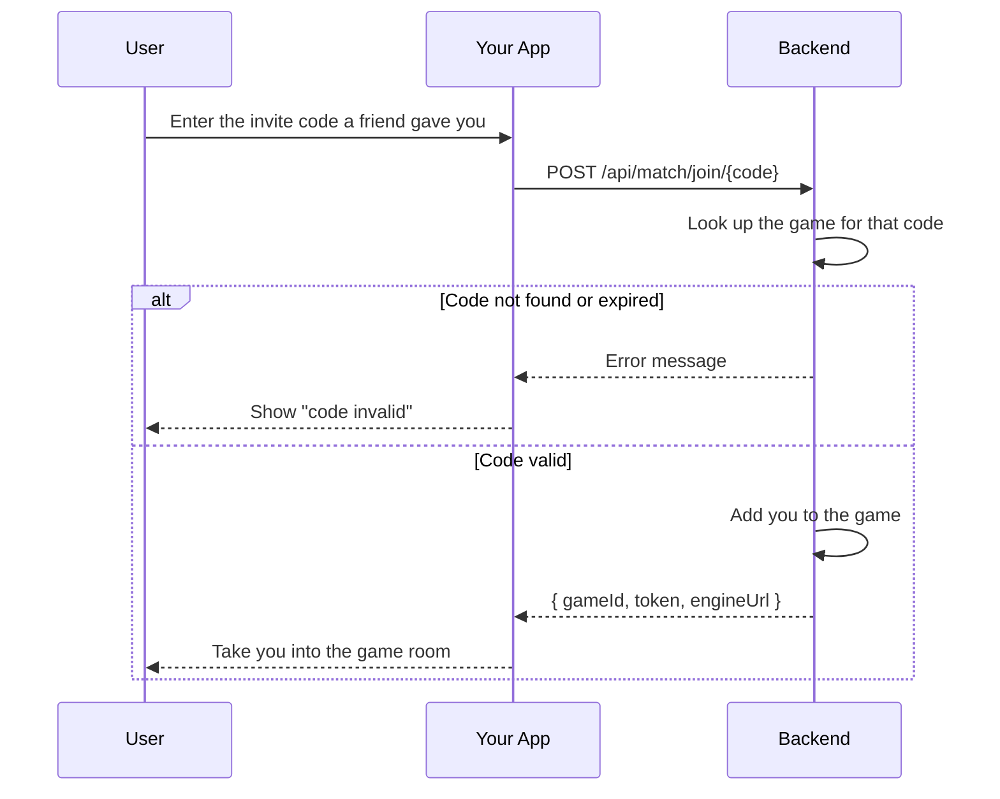
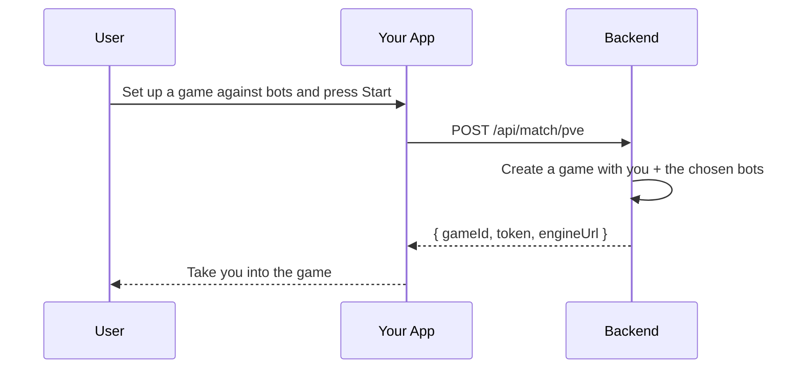
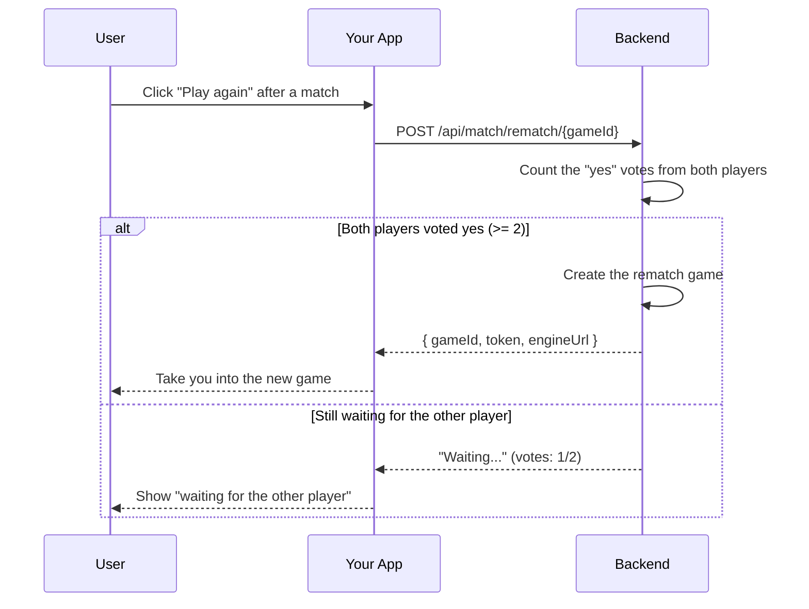

# Match Module

## Table of Contents

- [Overview](#overview) — Matchmaking, game lifecycle, and active-game tracking
- [Files](#files) — Every source file in the module and its role
- [Key Types / Interfaces](#key-types--interfaces) — Match creation DTOs and response shapes
- [API Endpoints](#api-endpoints) — Matchmaking endpoints and in-game actions
- [Core Logic / Flow](#core-logic--flow) — Mermaid sequence diagrams for match flows
- [Logic Paths Summary](#logic-paths-summary) — Decision trees for each operation
- [Dependencies](#dependencies) — Internal services this module relies on
- [Configuration / Environment](#configuration--environment) — Redis and engine configuration

---

## Overview

The Match module is the bridge between the REST API and the real-time ludo-engine. It handles:

1. **Matchmaking** — creates or joins PvP, PvE, or invite games.
2. **Game lifecycle** — transitions games from `waiting` → `active` → `completed`, handles rematch votes.
3. **Active-game tracking** — `GET /api/games/active` lists currently running games.
4. **Cleanup** — periodic cleanup of stale Redis match data.

The module uses Redis for short-lived match data (queues, active games, rematch votes) and lets the ludo-engine own the actual game logic over Socket.IO.

---

## Files

| File | Role |
|------|------|
| `match.controller.ts` | HTTP routes: matchmaking, game actions, browse games, engine callbacks, cleanup |
| `match.service.ts` | Facade — composes the four split services (`MatchCreatorService`, `MatchPlayerService`, `MatchQueryService`, `MatchPostgameService`) and re-exports `ENGINE_WS_URL` |
| `match.creator.service.ts` | Match creation: PvP/PvE/hotseat, invite codes, random match, bot seeding |
| `match.player.service.ts` | In-game actions: join, rejoin, invite friend, ready, exit, cancel, resign |
| `match.query.service.ts` | Browse queries: active games, open rooms, my rooms |
| `match.postgame.service.ts` | `POST /api/game/end` processing (scoring, ratings, achievements), rematch votes, stale-game cleanup |
| `match.module.ts` | NestJS module — registers all services, PrismaService |

---

## Key Types / Interfaces

### MatchMode

```typescript
type MatchMode = 'pvp' | 'pve' | 'hotseat'
```

### CreateMatchBody

```typescript
{
  mode: 'pvp' | 'pve' | 'hotseat';  // REQUIRED — no silent fallback
  playerCount?: number;      // 1-4 (2 or 4 for PvE)
  botCount?: number;         // 0 - (playerCount-1), PvE only
  clashEnabled?: boolean;    // Clash-mode QTE (default true)
  safeZones?: boolean;       // Safe-zone squares (default true)
  botColors?: string[];      // Optional per-bot slot colors
  seatColors?: string[];     // Optional human seat colors
}
```

### MatchResponse

```typescript
{
  gameId: string;            // UUID of the match
  token: string;             // JWT for Socket.IO handshake
  engineUrl: string;         // "ws://localhost:8443" (derived from FRONTEND_URL)
  color: string;             // Assigned seat color (server-chosen)
  mode: 'pvp' | 'pve' | 'hotseat';  // Game mode (persisted for refresh/rejoin)
  playerCount: number;       // How many players/seats
  inviteCode?: string;       // 6-char code (invite games only)
}
```

---

## API Endpoints

| Method | Path | Auth | Description |
|--------|------|------|-------------|
| `POST` | `/api/match/pvp/random` | JWT | Find or create random PvP match |
| `POST` | `/api/match/pvp/invite` | JWT | Create invite-only PvP match (body: `clashEnabled`, `safeZones`) |
| `POST` | `/api/match/join/:code` | JWT | Join PvP match by invite code |
| `POST` | `/api/match/pve` | JWT | Start PvE (vs bot) game |
| `POST` | `/api/match/create` | JWT | Unified match creation (mode required: pvp/pve/hotseat; body supports `clashEnabled`, `safeZones`, `botColors`, `seatColors`) |
| `POST` | `/api/match/rematch/:gameId` | JWT | Vote for rematch after game ends |
| `POST` | `/api/match/cleanup` | JWT | Clean up stale match data |
| `POST` | `/api/game/:id/ready` | JWT | Signal player is ready |
| `POST` | `/api/game/:id/resign` | JWT | Forfeit the game |
| `POST` | `/api/game/:id/exit` | JWT | Acknowledge leaving post-game |
| `POST` | `/api/game/:id/abort` | JWT | Cancel unstarted game |
| `POST` | `/api/game/:id/rejoin` | JWT | Rejoin a room after refresh |
| `POST` | `/api/game/:id/invite` | JWT | Invite a friend into a WAITING PvP room |
| `GET` | `/api/games/active` | JWT | List all active games |
| `GET` | `/api/games/rooms` | JWT | List open (WAITING PvP) rooms |
| `GET` | `/api/games/mine` | JWT | List rooms the user is seated in |
| `POST` | `/api/game/end` | engine key | Engine callback — process game end (scoring/achievements) |
| `POST` | `/api/game/:id/started` | engine key | Engine callback — mark game started |

---

## Core Logic / Flow

### 1. Create Random PvP Match



### 2. Create Invite Match



### 3. Join by Invite Code



### 4. Start PvE Game



### 5. Rematch Flow



---

## Logic Paths Summary

### Random PvP Path
```
POST /api/match/pvp/random
  ├── Redis: Get waiting PvP with open slot
  │   ├── Found → add player, update Redis
  │   └── Not found → create new WAITING game
  ├── issueEngineToken(gameId, userId, role, color)
  └── Return { gameId, token, engineUrl }
```

### Invite Path
```
POST /api/match/pvp/invite
  ├── Generate inviteCode
  ├── Redis: SET match:{gameId} + invite:{code}, EX 24h
  ├── issueEngineToken(...)
  └── Return { gameId, inviteCode, token, engineUrl }

POST /api/match/join/:code
  ├── Redis: GET invite:{code}
  │   ├── null → 404
  │   └── found → add player, DEL invite:{code}, return { gameId, token, engineUrl }
```

### PvE Path
```
POST /api/match/pve
  ├── Create game with player + bots
  ├── Redis: SET match:{gameId}, status = ACTIVE
  ├── issueEngineToken(...)
  └── Return { gameId, token, engineUrl }
```

### Rematch Path
```
POST /api/match/rematch/:gameId
  ├── Redis: SADD rematch:{gameId}, userId
  ├── SCARD rematch:{gameId}
  │   ├── >= 2 → create new game, issue tokens, DEL rematch key → return { gameId, token, engineUrl }
  │   └── < 2 → return { message, confirmed, required }
```

### In-Game Actions Path
```
POST /api/game/:id/ready
  └── Mark player ready → return { message, gameId }

POST /api/game/:id/resign
  └── Mark player resigned, notify engine → return { message, gameId }

POST /api/game/:id/exit
  └── Acknowledge post-game exit → return { message, gameId }

POST /api/game/:id/abort
  └── Cancel WAITING game, notify engine → return { message, gameId }
```

### Active Games Path
```
GET /api/games/active
  └── Redis: Get all active games → return array
```

---

## Dependencies

| Dependency | Purpose |
|-----------|---------|
| `LeaderboardRedisService` | Reads/writes Redis sorted sets for rating updates |
| `PresenceService` | Updates player presence when entering/leaving games |
| `Redis` (ioredis) | Match state, invite codes, rematch votes |
| `PrismaService` | Game history, rating updates, achievement evaluation |
| `JwtService` | Issue JWTs for Socket.IO engine handshake |
| `secrets.ts` | `ENGINE_API_KEY` for validating engine callbacks |

---

## Configuration / Environment

| Variable | Default | Used By |
|----------|---------|---------|
| `REDIS_HOST` | `redis` | Redis connection for match state |
| `REDIS_PORT` | `6479` | Redis port |
| `REDIS_PASSWORD` | (from secrets) | Redis authentication |
| `ENGINE_API_KEY` | (from secrets) | Validates `POST /api/game/end` and `/api/game/:id/started` from engine |

### Tunable constants

| Constant | File | Default | What it controls |
|----------|------|---------|------------------|
| `SLOT_COLORS` | `match.creator.service.ts`, `match.player.service.ts` | blue, red, green, yellow | Seat order used when creating/joining rooms |
| `ENGINE_WS_URL` | `match.creator.service.ts` | derived from `FRONTEND_URL` | WebSocket URL handed to clients for the ludo-engine |
| `POINTS_PER_PIECE` | `common/scoring.ts` | 2 | Rating points per piece brought home (halved for PvE) |
| `WIN_BONUS_PIECE` | `common/scoring.ts` | 1 | Extra "piece" counted for the winner when scoring |
| `FRONTEND_URL` | `https://localhost:8443` | Derives `ENGINE_WS_URL` (same origin, `ws://`) returned to clients |