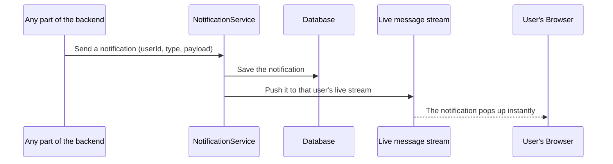

# Notification Module

## Table of Contents

- [Overview](#overview) — Real-time notifications via SSE + Redis pub/sub
- [Failure contract](#failure-contract) — notifications never throw; delivery is best-effort
- [Files](#files) — Source file inventory
- [Key Types / Interfaces](#key-types--interfaces) — NotificationType, NotificationPayload
- [API Endpoints](#api-endpoints) — REST + SSE routes
- [Core Logic / Flow](#core-logic--flow) — Mermaid sequence diagram of notify → SSE delivery
- [Logic Paths Summary](#logic-paths-summary) — Decision trees
- [Dependencies](#dependencies) — Internal and external dependencies

---

## Overview

The Notification module delivers real-time, persisted notifications to users. It combines two mechanisms:

1. **Persistence** — every notification is written to the `Notification` table (PostgreSQL), so missed notifications appear in the bell dropdown on next page load.
2. **Real-time push** — a Server-Sent Events (SSE) stream (`/api/notifications/stream`) delivers new notifications instantly to open tabs, bridged via Redis Pub/Sub.

Notification types: `friend_request`, `friend_accepted`, `game_invite`, `achievement`.

> The module is imported by `FriendsModule`, `MatchModule`, and `AchievementsModule`, which inject `NotificationService` and call `notify()`. It exports `NotificationService` so any module can send a notification.

---

## Failure contract

Notifications are a **non-critical side effect** of the actions that trigger them
(friend request/accept/decline/remove, game invite, game end, achievement unlock,
avatar update, …). A notification failure must never make a successful action look
failed, and must never partially fail the action it accompanies. The service
therefore guarantees:

- **`notify()`, `broadcast()` and `notifyTransient()` never throw.** No caller
  needs a try/catch around them; any existing `.catch()` is defensive only.
- **`notify()` persists to Postgres first.** If the persist fails, the
  notification is dropped and logged (`[notifications] persist failed …`) — the
  caller's action is unaffected. If only the live Redis publish fails, the
  persisted row is kept: the recipient still sees it in the bell on their next
  page load, just without a real-time toast (`[notifications] live push
  failed …`).
- **`broadcast()` / `notifyTransient()` are purely ephemeral** (SSE toast only,
  nothing persisted). A failed publish logs a warning and nothing is lost —
  there was nothing to persist in the first place.
- **SSE connection teardown is wired for real.** `subscribe()` returns the
  per-tab Subject wrapped in `finalize(() => subject.complete())`. When NestJS
  unsubscribes on a closed connection (tab close, navigation, network drop) —
  it does *not* complete the observable — the finalize completes the Subject,
  which fires the service's `complete` handler → `removeClient()` removes the
  Subject from the in-memory maps and unsubscribes from Redis when the last tab
  for a user closes. No dead Subjects accumulate.

---

## Files

| File | Role |
|------|------|
| `notification.controller.ts` | HTTP routes: SSE stream, list unread, mark read / all read |
| `notification.service.ts` | Redis pub/sub bridging, per-user SSE Subjects, persistence, `notify()` helper |
| `notification.module.ts` | NestJS module — registers controller/service, exports `NotificationService` |

---

## Key Types / Interfaces

### NotificationType

```typescript
export type NotificationType =
  | 'friend_request'
  | 'friend_accepted'
  | 'game_invite'
  | 'achievement';
```

### NotificationPayload

```typescript
export interface NotificationPayload {
  id: string;  // Unique ID
  type: NotificationType;  // Type of notification
  payload: Record<string, unknown>; // per-type data (e.g. { fromUsername, gameId, ... })
  read: boolean;  // Whether it has been read
  createdAt: string; // ISO string
}
```

---

## API Endpoints

| Method | Path | Auth | Description |
|--------|------|------|-------------|
| `GET` | `/api/notifications/stream` | JWT | SSE stream — pushes new notifications in real time |
| `GET` | `/api/notifications` | JWT | List unread notifications (for the bell dropdown on load) |
| `PATCH` | `/api/notifications/:id/read` | JWT | Mark one notification read |
| `POST` | `/api/notifications/read-all` | JWT | Mark all notifications read |

---

## Core Logic / Flow

### 1. Notify → SSE Delivery

Sequence of steps when any service calls `notificationService.notify(userId, type, payload)`.


### 2. SSE Subscribe

When a client opens `/api/notifications/stream`, the service creates an rxjs `Subject`, adds it to a per-user array (supporting multiple tabs), and — on first tab for a user — subscribes to `notify:<userId>` on Redis. Closing the last tab unsubscribes.

---

## Logic Paths Summary

### Open SSE Stream
```
GET /api/notifications/stream (JWT)
  ├── Look up in-memory clients map for userId
  │   ├── First tab → subscribe to notify:<userId> on Redis
  │   └── Existing → append Subject to the user's array
  └── Pipe Subject into SSE response; push each event as a data frame
```

### List Unread / Mark Read
```
GET /api/notifications (JWT)
  └── notification.findMany({ userId, read: false }, take 50, by createdAt desc)

PATCH /api/notifications/:id/read (JWT)
  └── notification.updateMany({ id, userId }, { read: true })

POST /api/notifications/read-all (JWT)
  └── notification.updateMany({ userId, read: false }, { read: true })
```

---

## Dependencies

| Dependency | Purpose |
|-----------|---------|
| `PrismaService` | Persist notifications (Notification model) |
| `ioredis` | Pub/Sub bridging (publish + subscribe) |
| `@nestjs/sse` via `@Sse` decorator | SSE stream controller |
| `rxjs` | Observable/Subject streaming |
| `secrets.ts` | Redis password (`REDIS_PASSWORD`) |
| `JwtAuthGuard` | Protects all notification endpoints |

---

## Configuration / Environment

| Variable | Default | Used By |
|----------|---------|---------|
| `REDIS_HOST` | `redis` | Pub/Sub connection |
| `REDIS_PORT` | `6479` | Pub/Sub connection |
| `REDIS_PASSWORD` | (from secrets) | Redis authentication |
