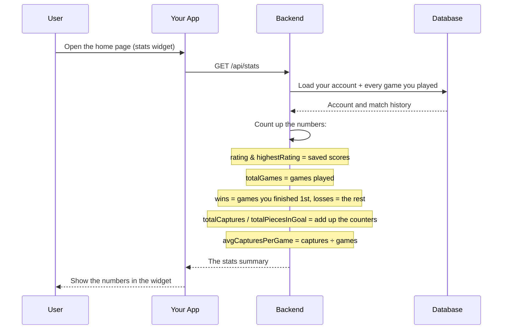

# Player Stats Module

## Table of Contents

- [Overview](#overview) — Aggregate player statistics from match history
- [Files](#files) — Every source file in the module and its role
- [Key Types / Interfaces](#key-types--interfaces) — Stats response shape and the rating delta formula
- [API Endpoints](#api-endpoints) — All routes with method, path, auth, and description
- [Core Logic / Flow](#core-logic--flow) — Mermaid sequence diagrams for stats retrieval
- [Logic Paths Summary](#logic-paths-summary) — Decision trees for each operation
- [Dependencies](#dependencies) — Internal services this module relies on

---

## Overview

The Player Stats module works out aggregate statistics from a user's `GameParticipant` records. It supports:

1. **Own stats** — an authenticated user fetches their own totals.

Stats include: total games, wins, losses, total captures, total pieces in goal, and average captures per game.

---

## Files

| File | Role |
|------|------|
| `stats.controller.ts` | HTTP route: GET own stats |
| `stats.service.ts` | Business logic: aggregate stats from GameParticipant records |
| `stats.module.ts` | NestJS module — registers controller, service, and PrismaService |

---

## Key Types / Interfaces

### Stats Response Shape

```typescript
{
  rating: number;             // From the User model
  highestRating: number;      // Peak rating from the User model
  totalGames: number;  // Total games played
  wins: number;  // Games won
  losses: number;  // Games lost
  totalCaptures: number;  // Total pieces captured
  totalPiecesInGoal: number;  // Total pieces that reached home
  avgCapturesPerGame: number;  // Rounded to 1 decimal place
}
```

### Rating Delta (`ratingDeltaFor`)

`backend/src/common/scoring.ts` converts one finished game into the rating change
shown on a profile and applied after a match. Two constants drive it, and
`ratingDeltaFor()` is the only code that reads them:

| Constant | Value | Meaning |
|----------|-------|---------|
| `POINTS_PER_PIECE` | 2 | Rating per piece that reached the goal |
| `WIN_BONUS_PIECE` | 1 | Extra piece credited to the rank-1 player |

```typescript
const effectivePieces = piecesInGoal + (rank === 1 ? WIN_BONUS_PIECE : 0);
const perPiece = gameType === 'PVE' ? POINTS_PER_PIECE / 2 : POINTS_PER_PIECE;
return effectivePieces * perPiece;
```

A PvP player who finished 1st with 3 pieces gains `(3 + 1) * 2 = 8`; the same
result in PvE gains `(3 + 1) * 1 = 4`.

| Caller | Use |
|--------|-----|
| `match.postgame.service.ts` | Applies the delta to `User.rating` when a real match ends (bots are skipped) |
| `user.service.ts` | Derives the same per-game `ratingDelta` for the profile and game-history payloads, so clients can show how much a match moved the rating |

---

## API Endpoints

| Method | Path | Auth | Description |
|--------|------|------|-------------|
| `GET` | `/api/stats` | JWT | Get aggregate stats for the current authenticated user |

---

## Core Logic / Flow

### 1. Get Own Stats

Sequence of steps when the authenticated user requests their own stats.


---

## Logic Paths Summary

### Get Own Stats Path
```
GET /api/stats (JWT required)
  ├── user.findUnique({ where: { id: userId } })
  │   ├── Not found → { error: 'User not found' }
  │   └── Found → continue
  ├── gameParticipant.findMany({ where: { user_id } })
  ├── Calculate aggregates:
  │   ├── rating = user.rating
  │   ├── highestRating = user.highestRating
  │   ├── totalGames = count
  │   ├── wins = count where rank = 1
  │   ├── losses = totalGames - wins
  │   ├── totalCaptures = sum(piecesCaptured)
  │   ├── totalPiecesInGoal = sum(piecesInGoal)
  │   └── avgCapturesPerGame = totalCaptures / totalGames
  └── 200 { rating, highestRating, totalGames, wins, losses, totalCaptures, totalPiecesInGoal, avgCapturesPerGame }
```

---

## Dependencies

| Dependency | Purpose |
|-----------|---------|
| `PrismaService` | Database access (User, GameParticipant models) |
| `JwtAuthGuard` | Protects stats endpoint |