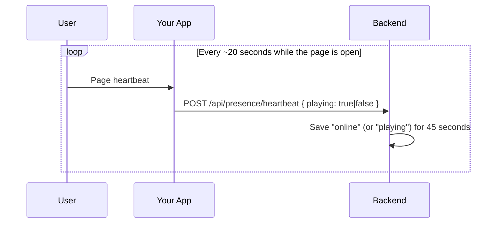
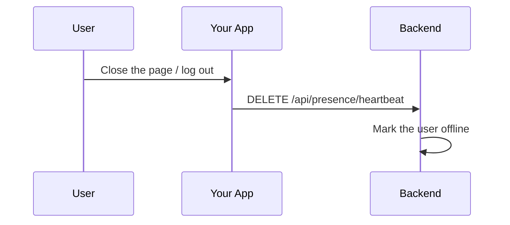

# Presence Module

## Table of Contents

- [Overview](#overview) — Online/offline presence tracking for the application
- [Files](#files) — Every source file in the module and its role
- [Key Types / Interfaces](#key-types--interfaces) — Heartbeat DTO and response shapes
- [API Endpoints](#api-endpoints) — Heartbeat endpoints
- [Core Logic / Flow](#core-logic--flow) — Mermaid sequence diagrams for heartbeat send and clear
- [Logic Paths Summary](#logic-paths-summary) — Decision trees for each operation
- [Dependencies](#dependencies) — Internal services this module relies on
- [Configuration / Environment](#configuration--environment) — Redis connection settings

---

## Overview

The Presence module tracks whether a user is currently online, offline, or playing. It stores each user's status in Redis with a short time-to-live (TTL), so a stale entry disappears on its own when a client stops sending heartbeats (for example, after a browser crash or network drop).

The module provides:

1. **Heartbeat** — a client sends `POST /api/presence/heartbeat` every ~20 seconds while the app is open (`PRESENCE_HEARTBEAT_MS` / `sendPresenceHeartbeat()` in `frontend/src/store.tsx`).
2. **Playing flag** — the same endpoint accepts an optional `playing` boolean to advertise "playing" instead of "online" while inside a match.
3. **Clear** — a client calls `DELETE /api/presence/heartbeat` on logout to read as offline immediately instead of waiting out the TTL.
4. **Online count** — `GET /api/presence/online-count` returns the site-wide number of online users for the homepage badge bar.
5. **Presence broadcasts** — the first heartbeat after the key lapses (or the logout clear) pushes a transient `friend_online` / `friend_offline` notification to every accepted friend.

> **Which direction this is.** Everything in this module is the **client → server** heartbeat: an
> ordinary `POST /api/presence/heartbeat` request that proves the browser is still there, and whose
> per-user Redis key (45 s TTL) *is* the online state. It is unrelated to the **server → client**
> keep-alive that stops ngrok resetting the idle notification SSE stream (`SSE_HEARTBEAT_MS` in
> `notification.controller.ts`). The two are named apart on purpose and neither substitutes for the
> other — see [`../architecture.md`](../architecture.md) → Connection liveness (two-direction
> heartbeats).

---

## Files

| File | Role |
|------|------|
| `presence.controller.ts` | HTTP routes: heartbeat POST/DELETE, online-count GET |
| `presence.service.ts` | Business logic: Redis presence state management, batched status lookup |
| `presence.module.ts` | NestJS module — registers controller and service |
| `dto/heartbeat.dto.ts` | Validation schema for the heartbeat request body |

---

## Key Types / Interfaces

### HeartbeatDto

```typescript
class HeartbeatDto {
  playing?: boolean;  // When true, status reads as "playing" instead of "online"
}
```

### Presence Status Values

Presence is a runtime Redis concept, not a database enum. `PresenceStatus` is a TypeScript type alias:

```typescript
export type PresenceStatus = 'online' | 'playing' | 'offline';
```

A missing Redis presence key *is* the offline state. The heartbeat TTL (45s, covering two missed ~20s beats) expires stale entries automatically.

---

## API Endpoints

| Method | Path | Auth | Description |
|--------|------|------|-------------|
| `POST` | `/api/presence/heartbeat` | JWT | Send presence heartbeat (with optional `playing` flag) |
| `DELETE` | `/api/presence/heartbeat` | JWT | Clear presence (logout) |
| `GET` | `/api/presence/online-count` | JWT | Site-wide online user count (homepage badge) |

---

## Core Logic / Flow

### 1. Heartbeat

Sequence of steps when a client sends a presence heartbeat.



### 2. Clear Presence

Sequence of steps when a user logs out.



---

## Logic Paths Summary

### Heartbeat Path
```
POST /api/presence/heartbeat (JWT required)
  ├── Set presence:{userId} with TTL
  │   ├── playing=true → status 'playing'
  │   └── playing=false → status 'online'
  └── 200 { ok: true }
```

### Clear Path
```
DELETE /api/presence/heartbeat (JWT required)
  ├── Delete presence:{userId} from Redis
  └── 200 { ok: true }
```

### Online Count Path
```
GET /api/presence/online-count (JWT required)
  ├── SCAN presence:* keys (the same idiom as MatchQueryService)
  └── 200 { count: <number of live presence keys> }
```

---

## Additional Service Methods

The `PresenceService` also provides read methods used by other parts of the application:

| Method | Signature | Purpose |
|--------|-----------|---------|
| `getStatus` | `getStatus(userId: string): Promise<PresenceStatus>` | Single-user lookup — e.g. profile pages |
| `getStatuses` | `getStatuses(userIds: string[]): Promise<Record<string, PresenceStatus>>` | Batched lookup for friends lists |
| `getOnlineCount` | `getOnlineCount(): Promise<number>` | Site-wide online count via SCAN |

`PresenceStatus` is a type alias: `'online' | 'playing' | 'offline'`. A missing Redis key *is* the offline state — the TTL handles cleanup automatically.

---

## Dependencies

| Dependency | Purpose |
|-----------|---------|
| `Redis` (ioredis) | Presence state store with 45s TTL |
| `PrismaService` | Look up the user's accepted friends for presence broadcasts |
| `NotificationService` | Push transient `friend_online` / `friend_offline` toasts |
| `JwtAuthGuard` | Protects all three presence endpoints |

---

## Configuration / Environment

| Variable | Default | Used By |
|----------|---------|---------|
| `REDIS_HOST` | `redis` | Redis host for presence state |
| `REDIS_PORT` | `6479` | Redis port |
| `REDIS_PASSWORD` | (from secrets) | Redis password |