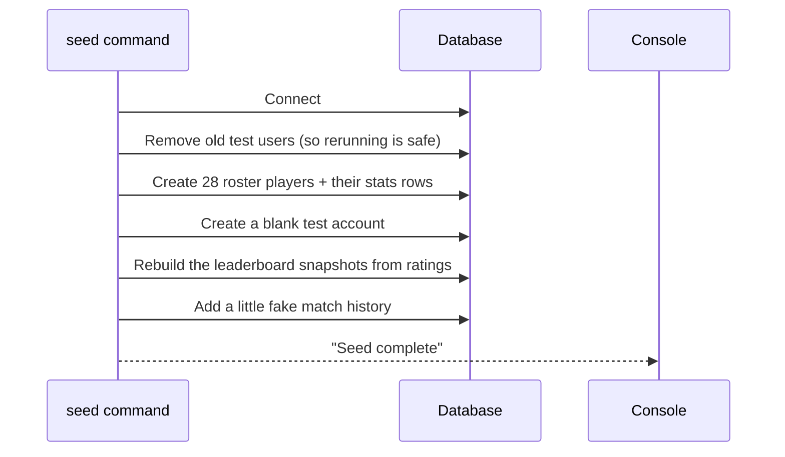

# Seeding

## Table of Contents

- [Overview](#overview) — Test data generation for development
- [Files](#files) — Every source file and its role
- [Seed Data](#seed-data) — Users, games, and friendships created
- [Core Logic / Flow](#core-logic--flow) — Mermaid sequence diagram of seed execution
- [Idempotency](#idempotency) — How the seed scripts handle re-runs
- [Usage](#usage) — Commands

---

## Overview

The seed pipeline populates the database with a full test roster for development. It creates:

1. **28 seed players** (a "Cyber Roster") — themed usernames spanning the rating ladder (Viper_X 1650 down to NeonSprout 650), each with rating/win/loss counters on `User`, an `avatarStyle`, and achievement flags on the nested `Achievement` row consistent with the current thresholds.
2. **1 blank test account** — `bossku` / `password`, deliberately empty (no flags, no history) for testing brand-new accounts.
3. **Global leaderboard snapshots** — one `LeaderboardSnapshot` row per user, ranked by rating, plus a Redis sorted-set sync (`leaderboard:global|ranked|casual`).
4. **Friendships and friend requests** — a rich social graph seeded by `seed_friends.ts`.
5. **User profiles** — avatar-style/profile tweaks from `seed_user_profile.ts`.

`db:seed` is invoked by `make all` after the stack is up.

---

## Files

| File | Role |
|------|------|
| `prisma/seed.ts` | Main seed — 28-player roster, blank `bossku` account, leaderboard snapshot, Redis sync, game history |
| `prisma/seed_friends.ts` | Friendship graph + incoming friend requests |
| `prisma/seed_user_profile.ts` | Per-user profile extras (avatar styles, display names) |
| `prisma/sync_leaderboard.ts` | Standalone leaderboard snapshot + Redis sync script |
| `prisma/drop-all.sql` | SQL script to drop all tables (clean reset) |
| `prisma/truncate-all.sql` | SQL script to truncate all tables (clean reseed) |
| `prisma.config.ts` | Prisma 7 config — declares the seed command (`ts-node ... prisma/seed.ts`) |

---

## Seed Data

### Users

The main roster (`SEED_PLAYERS`) has 28 players with themed names, each given:

- `username`, `displayName`, email `{username}@transcendence.cyber`
- `password_hash` (all share `password`, bcrypt'd)
- `emailVerified` (staggered dates), `twoFactorEnabled: false`
- Direct `User` stats: `rating`, `highestRating`, `wins`, `losses`, `botWins`, `humanWins`, `winStreak`, `bestWinStreak`, `pveGameStreak`, `avatarStyle`
- A nested `Achievement` row holding only the lifetime achievement flags matching the roster's win counts

| Username | Rating | Wins | Losses | Notes |
|----------|-------|------|--------|-------|
| Viper_X | 1650 | 34 | 6 | Top of the ladder |
| NeonKnight | 1540 | 28 | 9 | |
| Alice | 1480 | 25 | 10 | |
| ShadowFox | 1440 | 22 | 11 | |
| CyberSamurai | 1410 | 20 | 12 | |
| HyperNova | 1390 | 19 | 11 | |
| GhostRunner | 1370 | 18 | 13 | |
| AeroBlade | 1355 | 17 | 12 | |
| StarLord | 1340 | 16 | 14 | |
| PixelMage | 1320 | 15 | 13 | |
| QuantumVolt | 1290 | 14 | 12 | |
| Bob | 1270 | 13 | 13 | |
| CircuitBreaker | 1250 | 12 | 14 | |
| SolarFlare | 1220 | 11 | 15 | |
| LaserFang | 1205 | 10 | 14 | |
| CheeseRing | 1180 | 10 | 16 | |
| NightOwl | 1150 | 9 | 16 | |
| Carol | 1120 | 8 | 15 | |
| RetroRider | 1090 | 7 | 16 | |
| TurboSnack | 1060 | 6 | 15 | |
| VortexRogue | 1030 | 5 | 16 | |
| MechaPawn | 1005 | 5 | 18 | |
| ChocoRookie | 980 | 4 | 18 | |
| Dave | 920 | 3 | 19 | |
| BitDrifter | 860 | 2 | 20 | |
| Eve | 780 | 1 | 22 | |
| ZeroCool | 720 | 1 | 25 | |
| NeonSprout | 650 | 0 | 24 | Bottom of the ladder |
| bossku | 0 | 0 | 0 | **Blank test account** (password) — no flags/history |

### Games

Sample game history is created for a subset of the roster so profile history pages and stats have data.

### Friendships

`seed_friends.ts` builds a connected social graph — accepted friendships plus pending incoming requests — so the Friends pages and notification flows have realistic data.

---

## Core Logic / Flow

### Seed Execution Flow

Sequence of steps when the main seed runs.


### Secondary Seed Scripts

- `seed_friends.ts` — deletes existing friendships for seed users, then creates the friend graph + requests.
- `seed_user_profile.ts` — applies per-user profile extras.
- `sync_leaderboard.ts` — standalone re-sync of snapshots + Redis (idempotent).

---

## Idempotency

The seed scripts are safe to re-run. The main script:

```
user.deleteMany({ where: { username: { in: SEED_PLAYERS.map(p => p.username) } } })
game.deleteMany({ where: { participants: { none: {} } } })
leaderboardSnapshot.deleteMany({})
friendShip.deleteMany({})
```

Cascading deletes (User → Account / GameParticipant / Friendship / Notification) keep re-runs clean, so `npx prisma db seed` multiple times produces the same state without duplicate-key errors. Redis sorted sets are reset (`DEL leaderboard:global|ranked|casual`) before re-adding.

---

## Usage

```bash
# Run main seed (prisma generate first)
npm run db:seed            # = prisma generate && prisma db seed

# Full reset (truncate all tables, then seed)
npm run db:reset           # = npm run db:truncate && npm run db:seed

# Truncate all tables without migrating
npm run db:fresh           # prisma db execute --file ./prisma/drop-all.sql

# Friends + profile extras
npx ts-node --transpile-only prisma/seed_friends.ts
npx ts-node --transpile-only prisma/seed_user_profile.ts
```
