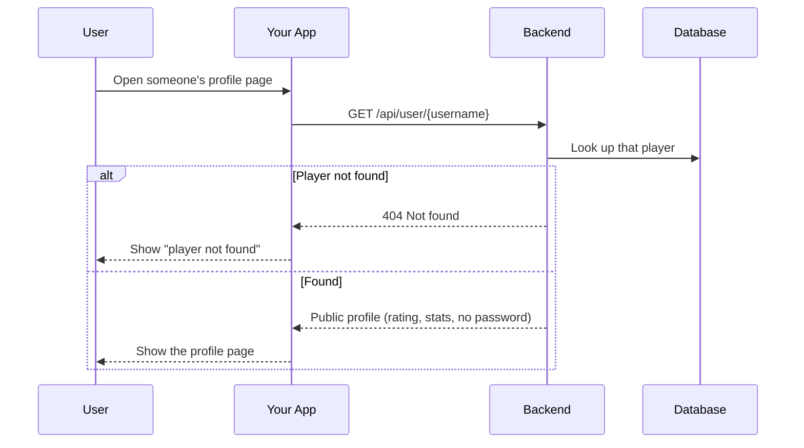
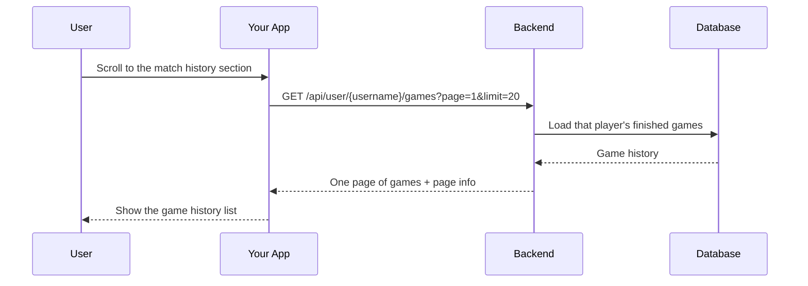
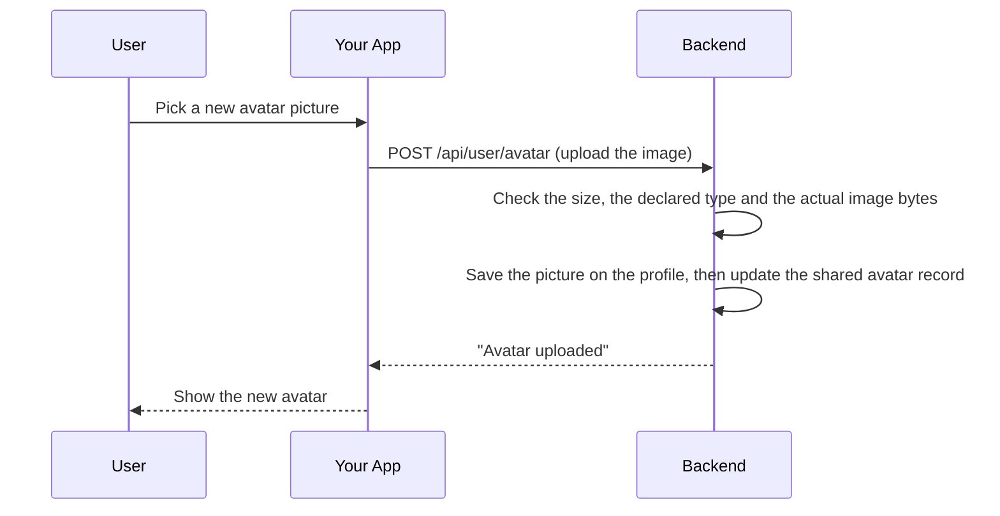
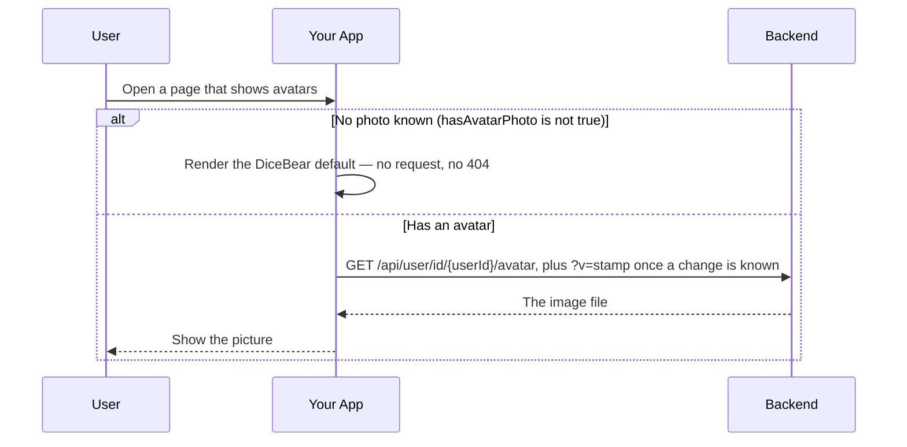
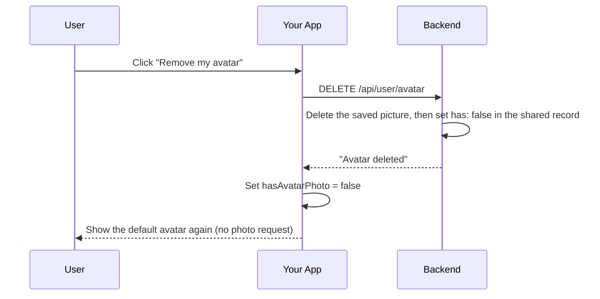

# User Module

## Table of Contents

- [Overview](#overview) — User profiles, game history, and avatar management
- [Files](#files) — Every source file in the module and its role
- [Key Types / Interfaces](#key-types--interfaces) — Response shapes
- [API Endpoints](#api-endpoints) — Profile, games, avatar CRUD
- [Core Logic / Flow](#core-logic--flow) — Mermaid sequence diagrams
- [Logic Paths Summary](#logic-paths-summary) — Decision trees
- [Dependencies](#dependencies) — Internal services this module relies on

---

## Overview

The User module manages public user profiles, game history, and avatar images.

1. **Public profile** — `GET /api/user/:username` returns profile stats.
2. **Game history** — `GET /api/user/:username/games` returns paginated past games.
3. **Avatar upload** — `POST /api/user/avatar` accepts a multipart image (max 2 MB, PNG/JPEG/GIF/WebP).
4. **Avatar retrieval** — `GET /api/user/id/:userId/avatar` returns the binary image (keyed by the immutable user id, so a rename cannot break it).
5. **Avatar deletion** — `DELETE /api/user/avatar` removes the custom avatar.

> The avatar pipeline — where the bytes live, the shared Redis record the engine reads, the caching
> and freshness rules, and how a failed load is handled — is described in full in
> [`avatar-system.md`](../avatar-system.md).

---

## Files

| File | Role |
|------|------|
| `user.controller.ts` | HTTP routes: profile, games, avatar CRUD |
| `user.service.ts` | Business logic: Prisma queries for user data |
| `user.module.ts` | NestJS module — registers controller and service |

---

## Key Types / Interfaces

### PublicProfileResponse

```typescript
{
  id: string;  // Unique ID
  username: string;  // Player's username
  displayName: string;  // Name shown in the game
  avatarStyle: string;      // Avatar style (from User)
  rating: number;           // Rating (from User)
  highestRating: number;    // Peak rating (from User)
  wins: number;  // Games won
  losses: number;  // Games lost
  winStreak: number;  // Wins in a row right now
  bestWinStreak: number;  // Longest winning streak ever
  botWins: number;  // Wins against bots
  humanWins: number;  // Wins against humans
  hasAvatarPhoto: boolean;  // Whether a custom photo is set (from avatarPhotoContentType)
  createdAt: string;  // When the record was created
  status: 'online' | 'playing' | 'offline';  // From PresenceService (Redis)
}
```

### GameHistoryItem

```typescript
{
  gameId: string;  // ID of the game
  status: 'COMPLETED' | 'ABANDONED';  // Current status
  gameType: 'PVP' | 'PVE';  // Game mode
  color: 'RED' | 'GREEN' | 'YELLOW' | 'BLUE';  // Seat color
  rank: number;  // Position in the ranking
  piecesCaptured: number;  // Pieces knocked off
  piecesInGoal: number;  // Pieces finished (0-4)
  ratingDelta: number;  // Rating earned for this game (never negative)
  startedAt: string;  // When the game started
  endedAt: string | null;  // When the game ended
  participants: Array<{  // Everyone who played
    username: string;  // Player's username
    displayName: string;  // Player's display name
    avatarStyle: string;  // Avatar style name
    hasAvatarPhoto: boolean;  // Whether the player has a custom avatar photo
    color: string;  // Seat color
    rank: number;  // Position in the ranking
    piecesInGoal: number;  // Pieces finished (0-4)
  }>;
}
```

---

## API Endpoints

| Method | Path | Auth | Description |
|--------|------|------|-------------|
| `GET` | `/api/user/:username` | None | Get public profile by username |
| `GET` | `/api/user/:username/games` | None | Get paginated game history |
| `POST` | `/api/user/avatar` | JWT | Upload avatar image |
| `GET` | `/api/user/id/:userId/avatar` | None | Retrieve avatar image by user id |
| `DELETE` | `/api/user/avatar` | JWT | Delete current user's avatar |

---

## Core Logic / Flow

### 1. Get Public Profile



### 2. Get Game History



### 3. Upload Avatar



### 4. Get Avatar



### 5. Delete Avatar



---

## Logic Paths Summary

### Get Public Profile Path
```
GET /api/user/:username
  ├── user.findUnique({ username })
  │   ├── null → 404
  │   └── found → return profile (exclude password_hash)
```

### Get Game History Path
```
GET /api/user/:username/games?page=&limit=
  ├── gameParticipant.findMany({ where: { user: { username } }, include: [game, user] })
  ├── Map to GameHistoryItem[] (each includes gameType, rank, piecesCaptured,
  │   piecesInGoal, ratingDelta, participants with avatarStyle from user)
  └── Return { games, pagination: { page, limit, total, totalPages } }
```

### Upload Avatar Path
```
POST /api/user/avatar (JWT)
  ├── FileInterceptor('avatar') — max 2MB, allowed: png/jpeg/gif/webp
  ├── user.update({ avatarPhoto: buffer, avatarPhotoContentType: mime })
  └── 200 { message: 'Avatar uploaded', contentType }
```

### Get Avatar Path
```
GET /api/user/id/:userId/avatar
  ├── getAvatarById(userId) via User.avatarPhoto
  │   ├── null → 404 (Cache-Control: no-store, so it is never cached)
  │   └── found → res.set(Content-Type), send binary
  │              (Cache-Control: public, no-cache, no-transform + ETag)
  └── Note: the base URL is stable (Express answers 304 when the bytes are
      unchanged). After a change the client appends `?v=<stamp>` : a
      byte-identical URL can otherwise be served from the browser's in-memory
      image cache with no request at all, so `no-cache` alone never revalidates.
  └── Note: a client only calls this route when it knows a photo exists
      (AvatarMetaService's Redis record, surfaced in payloads and in the
      engine's PlayerMeta), so a photo-less user produces no 404 at all.
```

### Avatar Metadata Cache (AvatarMetaService)
```
avatar:<userId>  →  { has: '0'|'1', style: '<dicebear style>', v: '<epoch ms>' }

  ├── Written AFTER the Postgres write in register / OAuth-create / upload /
  │   delete (Redis-first could leave has=1 with no bytes → a guaranteed 404).
  ├── Read by the ludo-engine, which has no database access of its own, at
  │   join time : that is how a seat knows whether its player has a photo.
  ├── Repaired from Postgres on /me and public-profile reads (syncFromUser),
  │   so a missed write or an eviction converges instead of drifting.
  └── Redis is a cache, never the truth : a miss means has=false, and Postgres
      stays authoritative for the bytes.
```

### Delete Avatar Path
```
DELETE /api/user/avatar (JWT)
  ├── user.update({ avatarPhoto: null, avatarPhotoContentType: null })
  └── 200 { message: 'Avatar deleted' }
```

---

## Dependencies

| Dependency | Purpose |
|-----------|---------|
| `PrismaService` | Database access (User, GameParticipant, Game models) |
| `JwtAuthGuard` | Protects avatar write/delete endpoints |