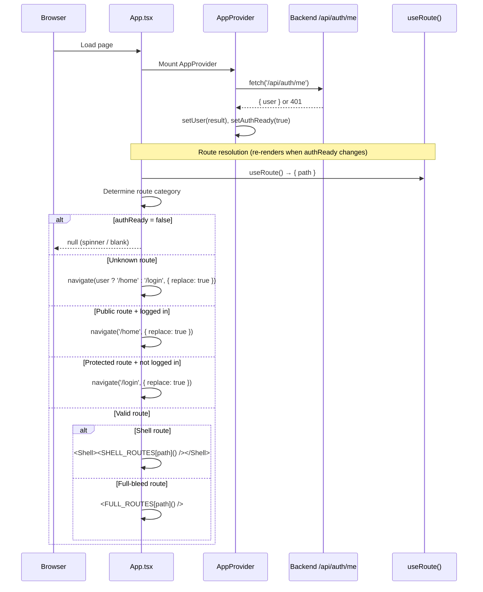

# Frontend — App Bootstrap

## Table of Contents

- [Overview](#overview) — Root app component, route categories, and auth guard logic
- [Files](#files) — Source file inventory
- [Key Types / Interfaces](#key-types--interfaces) — Route categories and AppProvider shape
- [Core Logic / Flow](#core-logic--flow) — Mermaid sequence diagram of bootstrap and routing flow
- [Logic Paths Summary](#logic-paths-summary) — Decision trees for route rendering and redirects
- [Dependencies](#dependencies) — Internal and external dependencies

---

## Overview

The app bootstrap layer is responsible for:

1. **Route categories** — splits pages into `SHELL_ROUTES` (wrapped in sidebar + header) and `FULL_ROUTES` (no shell).
2. **Auth guard** — redirects unauthenticated users to `/login`, authenticated users away from public routes.
3. **Session bootstrap** — `AppProvider` fetches `/api/auth/me` on mount to hydrate the auth context.
4. **Shell rendering** — wraps shell routes in `Shell` component; full-bleed routes render directly.

---

## Files

| File | Role |
|------|------|
| `src/App.tsx` | Root component — route maps, auth guard, AppProvider wrapper |
| `src/store.tsx` | `AppProvider` context — auth session, login/register/logout actions |

---

## Key Types / Interfaces

### Route Categories

```typescript
/** Screens that render inside the app shell (rail + header). */
const SHELL_ROUTES: Record<string, () => ReactNode> = {
  '/home': () => <Home />,
  '/dashboard': () => <Dashboard />,
  '/leaderboard': () => <Leaderboard />,
  '/friends': () => <Friends />,
  '/settings': () => <Settings />,
}

/** Full-bleed screens (no shell). */
const FULL_ROUTES: Record<string, () => ReactNode> = {
  '/login': () => <Login />,
  '/signup': () => <Signup />,
  '/lobby': () => <Lobby />,
  '/game': () => <Game />,
  '/results': () => <Results />,
}

/** Public routes, can be reached without a session */
const PUBLIC_ROUTES = new Set(['/login', '/signup'])
```

### AppProvider State

```typescript
type AppState = {
  user: AuthUser | null
  authReady: boolean
  login: (username: string, password: string) => Promise<string | null>
  register: (username: string, password: string, email?: string) => Promise<string | null>
  logout: () => Promise<void>
  // ... game state fields (see 03-store.md)
}
```

---

## Core Logic / Flow

### Bootstrap and Routing

Sequence of steps from page load to rendered route.


---

## Logic Paths Summary

### Initial Load Path
```
Browser load
  └── App mounts AppProvider
       └── fetch('/api/auth/me')
            ├── 200 → setUser(user), setAuthReady(true)
            └── 401 → setUser(null), setAuthReady(true)
```

### Route Guard Path
```
useEffect([authReady, known, user, isPublic])
  ├── authReady = false → return null
  ├── !known → navigate(user ? '/home' : '/login')
  ├── !user && !isPublic → navigate('/login')
  ├── user && isPublic → navigate('/home')
  └── else → render route component
```

---

## Dependencies

| Dependency | Purpose |
|-----------|---------|
| `store.tsx` | `AppProvider`, `useApp`, `AuthUser`, login/register/logout actions |
| `router.tsx` | `useRoute`, `navigate` |
| Shell pages | `Home`, `Dashboard`, `Leaderboard`, `Friends`, `Settings` |
| Full-bleed pages | `Login`, `Signup`, `Lobby`, `Game`, `Results` |