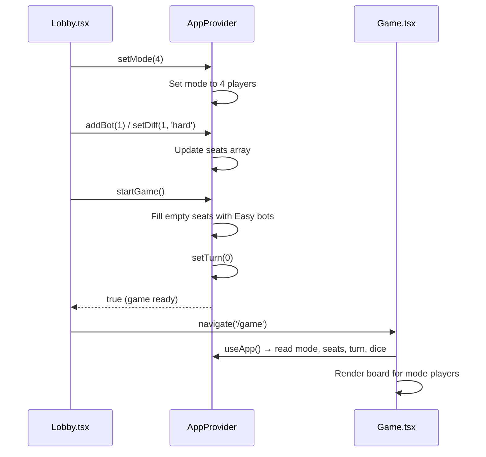

# Frontend — Store (Global State)

## Table of Contents

- [Overview](#overview) — React Context global state: auth, game setup, settings
- [Files](#files) — Source file inventory
- [Key Types / Interfaces](#key-types--interfaces) — AuthUser, Seat, Mode, Difficulty, AppState
- [Core Logic / Flow](#core-logic--flow) — Mermaid sequence diagrams for auth lifecycle and game setup
- [Logic Paths Summary](#logic-paths-summary) — Decision trees for auth and game state mutations
- [Dependencies](#dependencies) — Internal and external dependencies

---

## Overview

The store is a single React Context provider (`AppProvider`) that holds all global UI state. It provides:

1. **Auth session** — `user` object, `authReady` flag, `login`, `register`, `logout` actions.
2. **Game setup state** — `mode` (2 or 4 players), `seats` array (you, bot, empty), `dice`, `rolling`, `turn`.
3. **Settings** — toggleable booleans keyed by string, with defaults.
4. **Helpers** — `addBot`, `removeBot`, `setDiff`, `startGame`, `roll`, `endTurn`, `settingOn`, `toggleSetting`.

---

## Files

| File | Role |
|------|------|
| `src/store.tsx` | `AppProvider`, `useApp` hook, all state and actions |

---

## Key Types / Interfaces

### AuthUser

```typescript
export type AuthUser = { id: string; username: string }
```

### Seat

```typescript
export type Seat =
  | { type: 'you' }
  | { type: 'bot'; name: string; diff: Difficulty }
  | { type: 'empty' }
```

### Difficulty

```typescript
export type Difficulty = 'easy' | 'medium' | 'hard'
```

### Mode

```typescript
export type Mode = 2 | 4
```

### AppState (partial)

```typescript
type AppState = {
  user: AuthUser | null
  authReady: boolean
  login: (username: string, password: string) => Promise<string | null>
  register: (username: string, password: string, email?: string) => Promise<string | null>
  logout: () => Promise<void>
  mode: Mode
  seats: Seat[]
  dice: number
  rolling: boolean
  turn: number
  settings: Record<string, boolean>
  setMode: (m: Mode) => void
  addBot: (i: number) => void
  removeBot: (i: number) => void
  setDiff: (i: number, diff: Difficulty) => void
  startGame: () => boolean
  roll: () => void
  endTurn: () => void
  settingOn: (key: string) => boolean
  toggleSetting: (key: string) => void
}
```

### SETTING_DEFAULTS

```typescript
export const SETTING_DEFAULTS: Record<string, boolean> = {
  '0-0': true,  // Sound effects
  '0-1': true,  // Music
  '1-0': true,  // Auto-roll
  '1-1': false, // Fast animations
  '1-2': true,  // Move hints
  '2-0': true,  // Friend invites
  '2-1': false, // Weekly recap
}
```

---

## Core Logic / Flow

### 1. Auth Lifecycle

Sequence of steps from page load to authenticated session.

```mermaid
sequenceDiagram
    participant App as App.tsx
    participant Provider as AppProvider
    participant API as Backend /api/auth/me
    participant Store as React State

    App->>Provider: Mount
    Provider->>Store: setAuthReady(false)
    Provider->>API: fetch('/api/auth/me')

    alt 200 OK
        API-->>Provider: { user: { id, username } }
        Provider->>Store: setUser(user)
    else 401 / error
        API-->>Provider: null
        Provider->>Store: setUser(null)
    end
    Provider->>Store: setAuthReady(true)

    Note over App,Store: Login action
    App->>Provider: login(username, password)
    Provider->>API: POST /api/auth/login
    API-->>Provider: { user }
    Provider->>Store: setUser(user)
    Provider-->>App: null (success)

    Note over App,Store: Logout action
    App->>Provider: logout()
    Provider->>API: POST /api/auth/logout
    Provider->>Store: setUser(null)
```


### 2. Game Setup Flow

Sequence of steps from selecting mode to starting a game.


---

## Logic Paths Summary

### Auth Lifecycle Path
```
Mount
  └── fetch('/api/auth/me')
       ├── 200 → setUser(user), setAuthReady(true)
       └── error → setUser(null), setAuthReady(true)

login(username, password)
  └── POST /api/auth/login
       ├── 200 → setUser(user), return null
       └── error → return error message

register(username, password, email?)
  └── POST /api/auth/register
       ├── 200 → setUser(user), return null
       └── error → return error message

logout()
  └── POST /api/auth/logout → setUser(null)
```

### Game Setup Path
```
setMode(mode)
  └── setMode(mode) → update state

addBot(i)
  └── Find unused bot name from BOT_POOL → replace seat[i] with { type: 'bot', name, diff: 'medium' }

setDiff(i, diff)
  └── If seat[i] is bot → update difficulty

startGame()
  ├── Count bots in seats[0..mode)
  ├── If bots < 1 → return false
  ├── Fill remaining empty seats with Easy bots
  ├── setTurn(0)
  └── return true

roll()
  └── If not already rolling → setRolling(true) → setTimeout(650ms) → setDice(1-6), setRolling(false)

endTurn()
  └── setTurn((t + 1) % mode)
```

### Settings Path
```
settingOn(key)
  └── Return settings[key] ?? SETTING_DEFAULTS[key] ?? false

toggleSetting(key)
  └── Flip current value (settings or default)
```

---

## Dependencies

| Dependency | Purpose |
|-----------|---------|
| `theme.ts` | `BOT_POOL` constant for bot name selection |
| `router.tsx` | `navigate` for `/game` redirect after start |
| `API` | `/api/auth/me`, `/api/auth/login`, `/api/auth/register`, `/api/auth/logout` |