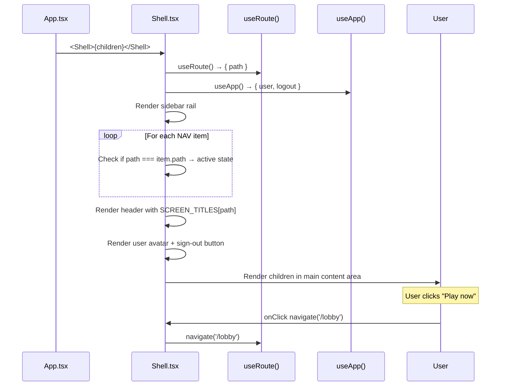

# Frontend — Shell (Layout)

## Table of Contents

- [Overview](#overview) — Sidebar rail, header, and authenticated layout wrapper
- [Files](#files) — Source file inventory
- [Key Types / Interfaces](#key-types--interfaces) — NAV items, SCREEN_TITLES
- [Core Logic / Flow](#core-logic--flow) — Mermaid sequence diagram of shell rendering
- [Logic Paths Summary](#logic-paths-summary) — Decision trees for navigation
- [Dependencies](#dependencies) — Internal and external dependencies

---

## Overview

The Shell is the authenticated layout wrapper. It provides:

1. **Sidebar rail** — vertical nav with glyph icons for Home, Dashboard, Leaderboard, Friends, Settings.
2. **Header** — screen title, user avatar, gold coin/rating display, sign-out action.
3. **Play button** — navigates to `/lobby` to start a new game.
4. **User card** — shows current user initials and sign-out link.

---

## Files

| File | Role |
|------|------|
| `src/components/Shell.tsx` | Shell layout — sidebar rail, header, Play button, user card |

---

## Key Types / Interfaces

### NAV

```typescript
const NAV: Array<{ path: string; glyph: string; title: string }> = [
  { path: '/home', glyph: '⌂', title: 'Home' },
  { path: '/dashboard', glyph: '▦', title: 'Dashboard' },
  { path: '/leaderboard', glyph: '♟', title: 'Leaderboard' },
  { path: '/friends', glyph: '♟', title: 'Friends' },
  { path: '/settings', glyph: '⚙', title: 'Settings' },
]
```

### SCREEN_TITLES

```typescript
export const SCREEN_TITLES: Record<string, string> = {
  '/home': 'Home',
  '/dashboard': 'Player Dashboard',
  '/leaderboard': 'Leaderboard',
  '/friends': 'Friends',
  '/settings': 'Settings',
}
```

---

## Core Logic / Flow

### Shell Rendering

Sequence of steps when a shell route is rendered.


---

## Logic Paths Summary

### Shell Render Path
```
<Shell>{children}</Shell>
  ├── useRoute() → path
  ├── useApp() → user, logout
  ├── Render sidebar rail
  │   └── For each NAV item: active = (path === item.path)
  ├── Render header
  │   ├── Title = SCREEN_TITLES[path] || ''
  │   ├── Gold coin badge (hardcoded 2,450)
  │   ├── Rating badge (hardcoded 1,540)
  │   └── User avatar (initials)
  ├── Render Play now button → navigate('/lobby')
  └── Render children in main content area
```

### Sign Out Path
```
onSignOut()
  └── logout() → POST /api/auth/logout
       └── navigate('/login')
```

---

## Dependencies

| Dependency | Purpose |
|-----------|---------|
| `router.tsx` | `useRoute`, `navigate` |
| `store.tsx` | `useApp` for user and logout |
| `theme.ts` | `avatarBlue`, `btnGold`, `goldText` style helpers |