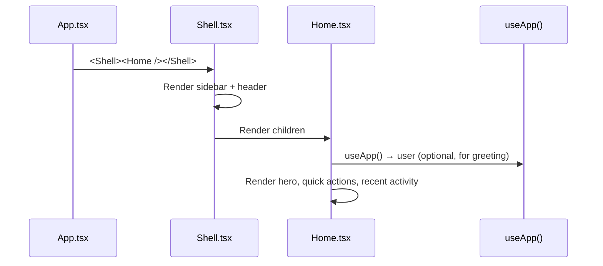

# Frontend — Home Page

## Table of Contents

- [Overview](#overview) — Landing page for authenticated users
- [Files](#files) — Source file inventory
- [Key Types / Interfaces](#key-types--interfaces) — Component props and data shapes
- [Core Logic / Flow](#core-logic--flow) — Mermaid sequence diagram of home page rendering
- [Logic Paths Summary](#logic-paths-summary) — Decision trees for content display
- [Dependencies](#dependencies) — Internal and external dependencies

---

## Overview

The Home page is the main landing page after login. It provides:

1. **Welcome section** — hero area with user greeting and call-to-action.
2. **Quick actions** — buttons to start a game, view leaderboard, or invite friends.
3. **Recent activity** — summary of recent matches or notifications (UI placeholders).

The Home page is a shell route (`/home`) rendered inside the `Shell` layout.

---

## Files

| File | Role |
|------|------|
| `src/pages/Home.tsx` | Home page component |

---

## Key Types / Interfaces

### Home Page

No specific TypeScript interfaces — renders static UI with navigation links.

---

## Core Logic / Flow

### Home Page Render

Sequence of steps when the home page loads.

---

## Dependencies

| Dependency | Purpose |
|-----------|---------|
| `store.tsx` | `useApp` for optional user greeting |
| `router.tsx` | `navigate` for CTA buttons |
| `theme.ts` | Inline styles |