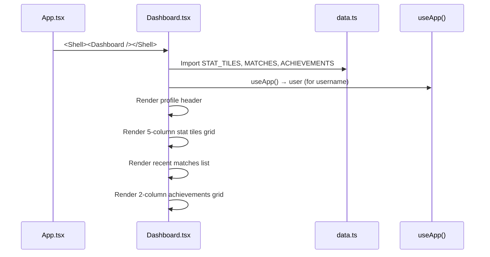

# Frontend — Dashboard

## Table of Contents

- [Overview](#overview) — Player stats, recent matches, and achievements grid
- [Files](#files) — Source file inventory
- [Key Types / Interfaces](#key-types--interfaces) — Data shapes from data.ts
- [Core Logic / Flow](#core-logic--flow) — Mermaid sequence diagram of dashboard rendering
- [Logic Paths Summary](#logic-paths-summary) — Decision trees for data display
- [Dependencies](#dependencies) — Internal and external dependencies

---

## Overview

The Dashboard is the main player hub after login. It provides:

1. **Profile header** — avatar, username, rank, member since, season rank.
2. **Stat tiles** — 5-column grid of key stats (wins, losses, win rate, etc.) from `STAT_TILES`.
3. **Recent matches** — list of last 5 matches with win/loss indicator, mode, opponent, date, rating delta.
4. **Achievements grid** — 2-column grid of achievement badges with locked/unlocked states.

> **Note:** The Dashboard currently uses **mock data** from `data.ts`. It does not yet fetch from the backend API.

---

## Files

| File | Role |
|------|------|
| `src/pages/Dashboard.tsx` | Dashboard page — profile header, stat tiles, matches, achievements |
| `src/data.ts` | Mock data: `STAT_TILES`, `MATCHES`, `ACHIEVEMENTS` |

---

## Key Types / Interfaces

### STAT_TILES

```typescript
export const STAT_TILES = [
  { label: 'Wins', value: 142 },
  { label: 'Win rate', value: '68%' },
  { label: 'Matches', value: 210 },
  { label: 'Avg rank', value: '2.1' },
  { label: 'Win streak', value: 5 },
]
```

### MATCHES

```typescript
export const MATCHES = [
  {
    mode: 'Ranked PvP',
    opp: 'Rook (hard)',
    when: '2 hours ago',
    win: boolean,
    delta: '+42',
  },
  // ...
]
```

### ACHIEVEMENTS

```typescript
export const ACHIEVEMENTS = [
  {
    name: 'First Blood',
    glyph: '★',
    unlocked: boolean,
  },
  // ...
]
```

---

## Core Logic / Flow

### Dashboard Rendering

Sequence of steps when the dashboard loads.


---

## Logic Paths Summary

### Dashboard Render Path
```
<Dashboard />
  ├── Import STAT_TILES, MATCHES, ACHIEVEMENTS from data.ts
  ├── useApp() → user (for greeting)
  ├── Render profile header (hardcoded: "You", Silver III, 1,540 rating)
  ├── Render stat tiles (5-column grid)
  ├── Render recent matches (left column)
  └── Render achievements (2-column grid, right column)
```

---

## Dependencies

| Dependency | Purpose |
|-----------|---------|
| `data.ts` | Mock data for STAT_TILES, MATCHES, ACHIEVEMENTS |
| `store.tsx` | `useApp` for user greeting |
| `theme.ts` | `avatarBlue`, `card` style helpers |