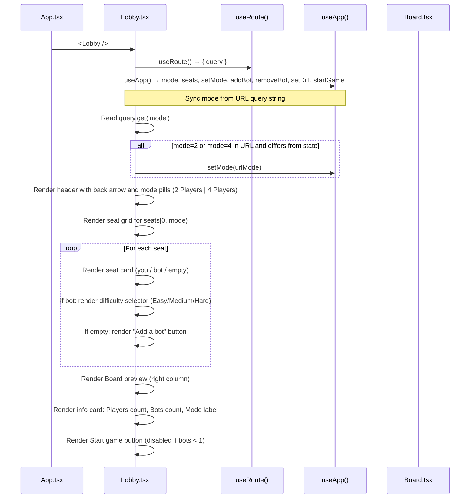
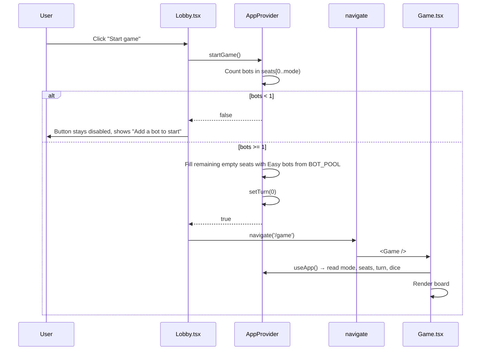

# Frontend — Lobby

## Table of Contents

- [Overview](#overview) — Pre-game lobby for seat setup, bot configuration, and mode selection
- [Files](#files) — Source file inventory
- [Key Types / Interfaces](#key-types--interfaces) — Seat, Mode, Difficulty types
- [Core Logic / Flow](#core-logic--flow) — Mermaid sequence diagrams for lobby setup and game start
- [Logic Paths Summary](#logic-paths-summary) — Decision trees for seat management and game start
- [Dependencies](#dependencies) — Internal and external dependencies

---

## Overview

The Lobby is a full-bleed page (`/lobby`) where players configure their game before starting. It provides:

1. **Seat setup** — 2 or 4 player slots. One slot is always "you", others can be bots or empty.
2. **Bot configuration** — add/remove bots, set difficulty (easy/medium/hard) per bot.
3. **Mode selection** — toggle between 2-player and 4-player games.
4. **Game start** — validates at least 1 bot is seated, fills remaining empty slots with Easy bots, then navigates to `/game`.

> **Note:** The Lobby is UI-only. It does not yet call the backend matchmaking API (`POST /api/match/pve`). Game state is local via `AppProvider`.

---

## Files

| File | Role |
|------|------|
| `src/pages/Lobby.tsx` | Lobby page — seat grid, bot controls, mode toggle, start button |

---

## Key Types / Interfaces

### Seat

```typescript
export type Seat =
  | { type: 'you' }
  | { type: 'bot'; name: string; diff: Difficulty }
  | { type: 'empty' }
```

### Difficulty

```typescript
export type Difficulty = 'easy' | 'medium' | 'hard'
```

### Mode

```typescript
export type Mode = 2 | 4
```

### BOT_POOL

```typescript
// From theme.ts
export const BOT_POOL = ['Rook', 'Bishop', 'Knight', 'Queen', 'King', 'Pawn']
```

---

## Core Logic / Flow

### 1. Lobby Rendering

Sequence of steps when the lobby page loads.


### 2. Start Game Flow

Sequence of steps when the user clicks "Start Game".


---

## Logic Paths Summary

### Lobby Render Path
```
<Lobby />
  ├── useRoute() → query
  │   └── If ?mode=2|4 in URL and differs from state → setMode(urlMode)
  ├── useApp() → mode, seats, setMode, addBot, removeBot, setDiff, startGame
  ├── Render header (back arrow, title "Table Setup", mode pills)
  ├── Render seat grid for seats[0..mode)
  │   ├── type = 'you' → render "You HOST" + color + "✓ Ready"
  │   ├── type = 'bot' → render bot name + "BOT" + difficulty pills (Easy/Medium/Hard) + remove button
  │   └── type = 'empty' → render dashed "+ Add a bot" card
  ├── Render Board preview (right column, sticky)
  ├── Render info card: Players count, Bots count, Mode label ("Casual · Unranked")
  └── Render Start game button (disabled if bots < 1)
```

### Seat Management Path
```
addBot(i)
  └── Find unused bot name from BOT_POOL → seats[i] = { type: 'bot', name, diff: 'medium' }

removeBot(i)
  └── seats[i] = { type: 'empty' }

setDiff(i, diff)
  └── If seats[i].type === 'bot' → seats[i].diff = diff
```

### Game Start Path
```
startGame()
  ├── Count bots in seats[0..mode)
  ├── bots < 1 → return false (button disabled)
  ├── Fill empty seats[0..mode) with Easy bots from BOT_POOL
  ├── setTurn(0)
  └── return true → navigate('/game')
```

### Mode Selection Path
```
pickMode(m)
  ├── setMode(m)
  └── navigate(`/lobby?mode=${m}`, { replace: true })
```

---

## Dependencies

| Dependency | Purpose |
|-----------|---------|
| `store.tsx` | `useApp` for mode, seats, and game actions |
| `router.tsx` | `navigate('/game')` on start |
| `theme.ts` | `BOT_POOL` constant, inline styles |