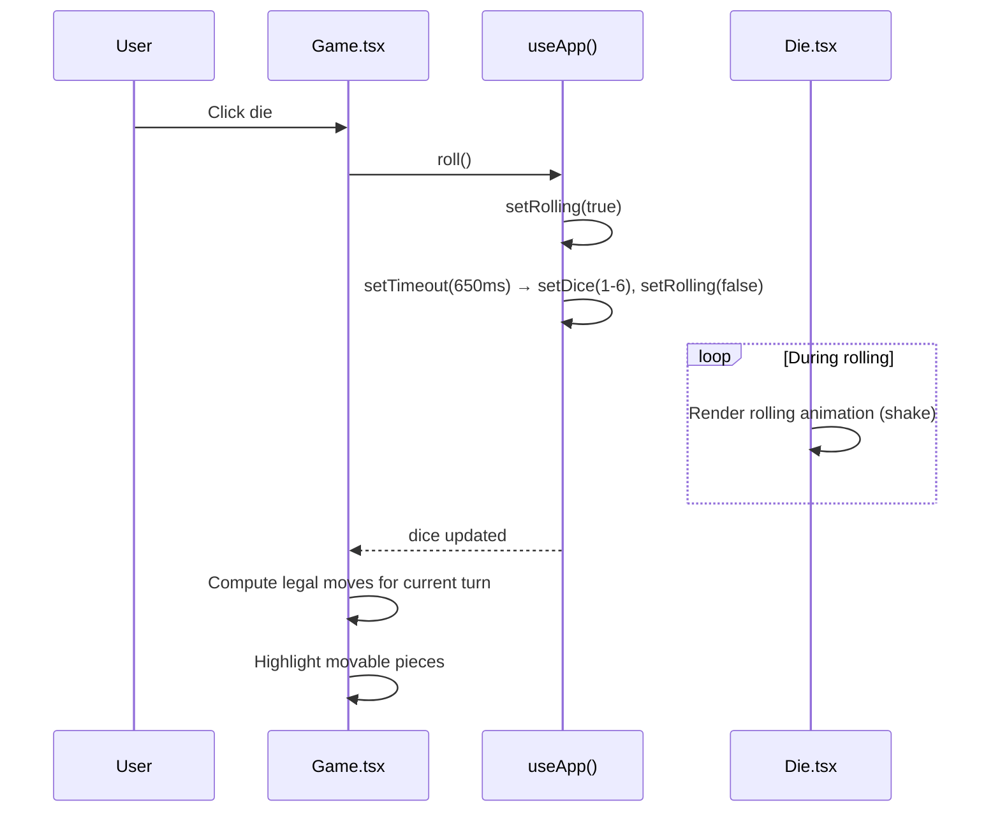
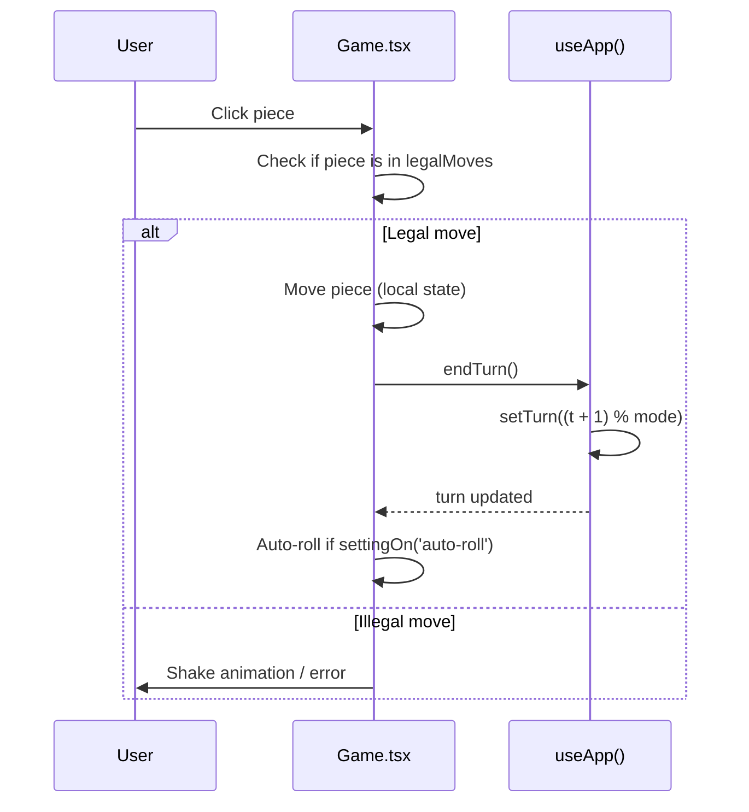
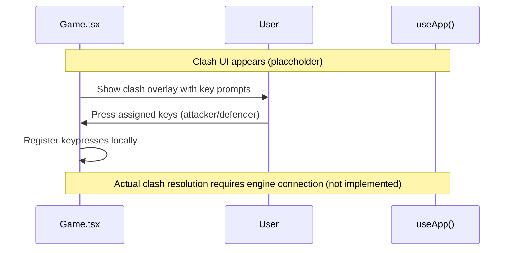

# Frontend — Game

## Table of Contents

- [Overview](#overview) — Ludo board UI with dice rolling and piece movement
- [Files](#files) — Source file inventory
- [Key Types / Interfaces](#key-types--interfaces) — Component props and state shapes
- [Core Logic / Flow](#core-logic--flow) — Mermaid sequence diagrams for game interaction
- [Logic Paths Summary](#logic-paths-summary) — Decision trees for dice roll and piece selection
- [Dependencies](#dependencies) — Internal and external dependencies

---

## Overview

The Game page (`/game`) is the main gameplay screen. It provides:

1. **Ludo board** — rendered using the `Board` component with the four colored tracks.
2. **Dice roller** — `Die` component with rolling animation, displays 1-6.
3. **Piece interaction** — pieces rendered on the board, clickable when it's the player's turn.
4. **Clash input** — keyboard input for the clash minigame (UI placeholder).
5. **Turn management** — turn indicator, pass turn button.

> **Note:** The Game page is currently UI-only. It does not connect to the Ludo Engine via WebSocket. All game state is local via `AppProvider`.

---

## Files

| File | Role |
|------|------|
| `src/pages/Game.tsx` | Game page — board, dice, pieces, turn management |
| `src/components/Board.tsx` | Board component — renders Ludo track, pieces, bases |
| `src/components/Die.tsx` | Die component — dice face rendering with roll animation |

---

## Key Types / Interfaces

### Game State (from AppProvider)

```typescript
mode: Mode           // 2 or 4 players
seats: Seat[]        // Player assignments
dice: number         // Current dice value (0 = not rolled)
rolling: boolean     // Dice animation in progress
turn: number         // Current turn index (0..mode-1)
```

### Seat

```typescript
type Seat =
  | { type: 'you' }
  | { type: 'bot'; name: string; diff: Difficulty }
  | { type: 'empty' }
```

### Difficulty

```typescript
type Difficulty = 'easy' | 'medium' | 'hard'
```

---

## Core Logic / Flow

### 1. Dice Roll

Sequence of steps when the player clicks the die.


### 2. Turn Progression

Sequence of steps after a piece is moved.


### 3. Clash Input (Placeholder)

Sequence of steps when a clash is triggered.


---

## Logic Paths Summary

### Dice Roll Path
```
User clicks die
  └── roll()
       ├── If already rolling → return
       ├── setRolling(true)
       └── setTimeout(650ms)
            ├── setDice(1 + Math.floor(Math.random() * 6))
            └── setRolling(false)
```

### Piece Move Path
```
User clicks piece
  ├── Check if piece is in legalMoves for current dice
  │   ├── Yes → execute move locally
  │   │   └── endTurn() → advance turn
  │   └── No → show invalid feedback
```

### Auto-Roll Path
```
After endTurn()
  └── If settingOn('auto-roll'): true
       └── setTimeout(500ms) → roll()
```

---

## Dependencies

| Dependency | Purpose |
|-----------|---------|
| `store.tsx` | `useApp` for dice, rolling, turn, seats, roll, endTurn, settingOn |
| `components/Board.tsx` | Renders Ludo board track, pieces, bases |
| `components/Die.tsx` | Dice face rendering and roll animation |
| `theme.ts` | `COL`, `avatarBlue`, inline styles, keyframe CSS |