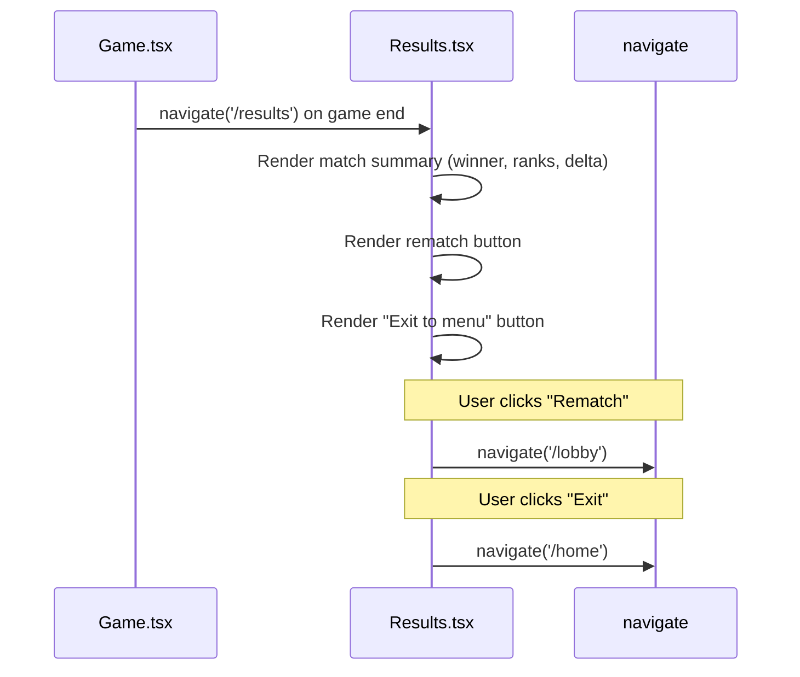

# Frontend — Results

## Table of Contents

- [Overview](#overview) — Post-game results summary and rematch prompt
- [Files](#files) — Source file inventory
- [Key Types / Interfaces](#key-types--interfaces) — Component props and data shapes
- [Core Logic / Flow](#core-logic--flow) — Mermaid sequence diagrams for results display
- [Logic Paths Summary](#logic-paths-summary) — Decision trees for post-game actions
- [Dependencies](#dependencies) — Internal and external dependencies

---

## Overview

The Results page (`/results`) is shown after a game ends. It provides:

1. **Match summary** — winner, final ranks, rating delta.
2. **Rematch prompt** — button to request a rematch (voting placeholder).
3. **Exit button** — leaves the post-game lobby and returns to `/home`.

The Results page is a full-bleed route (no shell) rendered after the game ends.

> **Note:** The Results page is currently a UI placeholder. It does not yet receive game results from the backend or WebSocket.

---

## Files

| File | Role |
|------|------|
| `src/pages/Results.tsx` | Results page — match summary, rematch button, exit action |

---

## Key Types / Interfaces

### Results Page

No specific TypeScript interfaces — renders static UI with navigation actions.

---

## Core Logic / Flow

### Results Rendering

Sequence of steps when the results page loads.


---

## Logic Paths Summary

### Results Render Path
```
<Results />
  ├── Render match summary (winner, ranks, rating delta)
  ├── Render rematch button → navigate('/lobby')
  └── Render exit button → navigate('/home')
```

---

## Dependencies

| Dependency | Purpose |
|-----------|---------|
| `router.tsx` | `navigate` for rematch and exit actions |
| `theme.ts` | Inline styles |