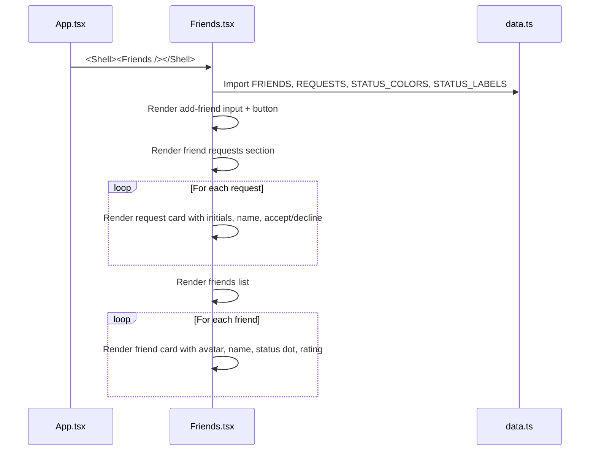

# Frontend — Friends

## Table of Contents

- [Overview](#overview) — Friends list, friend requests, and online status
- [Files](#files) — Source file inventory
- [Key Types / Interfaces](#key-types--interfaces) — Data shapes from data.ts
- [Core Logic / Flow](#core-logic--flow) — Mermaid sequence diagrams for friends rendering
- [Logic Paths Summary](#logic-paths-summary) — Decision trees for friend list display
- [Dependencies](#dependencies) — Internal and external dependencies

---

## Overview

The Friends page (`/friends`) is a shell route that displays the user's social connections. It provides:

1. **Add friend input** — text field to add a friend by username or invite code (UI placeholder).
2. **Friend requests** — list of pending sent/received requests with accept/decline actions.
3. **Friends list** — list of accepted friends with avatar, username, and online status.
4. **Online status** — color-coded status indicators (online, playing, offline).

> **Note:** The Friends page currently uses **mock data** from `data.ts`. It does not yet fetch from the backend API.

---

## Files

| File | Role |
|------|------|
| `src/pages/Friends.tsx` | Friends page — request list, friends list, add friend input |
| `src/data.ts` | Mock data: `FRIENDS`, `REQUESTS`, `STATUS_COLORS`, `STATUS_LABELS` |

---

## Key Types / Interfaces

### Friend Status

```typescript
export type FriendStatus = 'online' | 'playing' | 'offline'

export const STATUS_COLORS: Record<FriendStatus, string> = {
  online: '#4fd08a',  // Green
  playing: '#f0c24e', // Gold
  offline: '#a99a83', // Gray
}

export const STATUS_LABELS: Record<FriendStatus, string> = {
  online: 'Online',
  playing: 'In game',
  offline: 'Offline',
}
```

### FRIENDS (mock)

```typescript
export const FRIENDS = [
  {
    id: string;
    name: string;
    initials: string;
    status: FriendStatus;
    rating: number;
  },
  // ...
]
```

### REQUESTS (mock)

```typescript
export const REQUESTS = [
  {
    id: string;
    name: string;
    initials: string;
    status: 'pending' | 'received';
  },
  // ...
]
```

---

## Core Logic / Flow

### Friends Rendering

Sequence of steps when the Friends page loads.


---

## Logic Paths Summary

### Friends Render Path
```
<Friends />
  ├── Import FRIENDS, REQUESTS, STATUS_COLORS, STATUS_LABELS from data.ts
  ├── Render add-friend input (placeholder)
  ├── Render requests section
  │   └── For each request: render card with accept/decline buttons
  └── Render friends list
      └── For each friend: render avatar, name, status dot (color = STATUS_COLORS[status]), rating
```

---

## Dependencies

| Dependency | Purpose |
|-----------|---------|
| `data.ts` | Mock data for FRIENDS, REQUESTS, STATUS_COLORS, STATUS_LABELS |
| `theme.ts` | `avatarDim`, `btnGoldSmall`, `card`, `input` style helpers |
| `router.tsx` | `navigate` (not currently used, but available) |