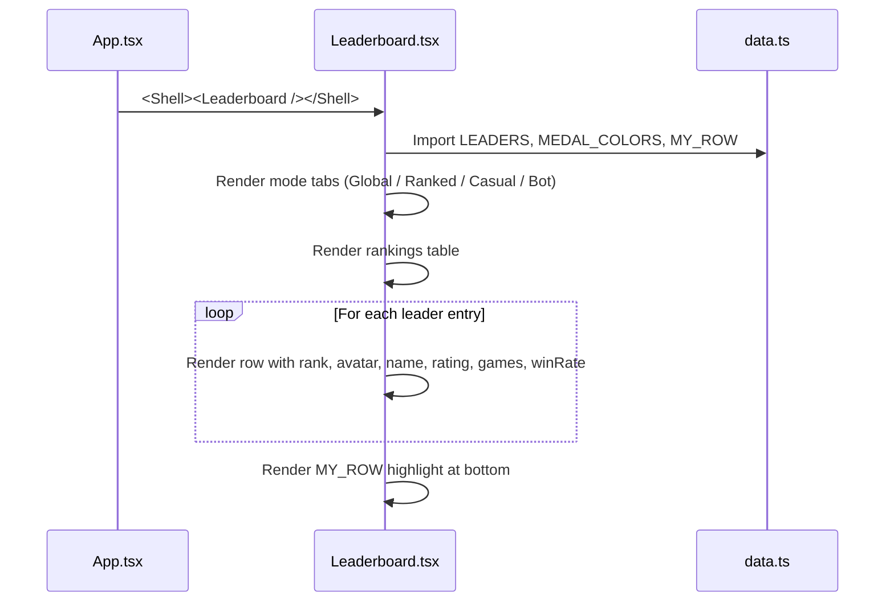

# Frontend — Leaderboard

## Table of Contents

- [Overview](#overview) — Global and mode-filtered rankings table
- [Files](#files) — Source file inventory
- [Key Types / Interfaces](#key-types--interfaces) — Component props and data shapes
- [Core Logic / Flow](#core-logic--flow) — Mermaid sequence diagrams for leaderboard rendering
- [Logic Paths Summary](#logic-paths-summary) — Decision trees for mode switching and pagination
- [Dependencies](#dependencies) — Internal and external dependencies

---

## Overview

The Leaderboard page (`/leaderboard`) is a shell route that displays ranked player listings. It provides:

1. **Mode tabs** — switch between global, ranked, casual, and bot leaderboards.
2. **Rankings table** — columns for rank, username, rating, games played, win rate, and avatar.
3. **Current user highlight** — indicates the logged-in user's position in the rankings.
4. **Pagination** — page through results (UI placeholder).

> **Note:** The Leaderboard page currently uses **mock data** from `data.ts`. It does not yet fetch from the backend API (`GET /api/leaderboard`).

---

## Files

| File | Role |
|------|------|
| `src/pages/Leaderboard.tsx` | Leaderboard page — mode tabs, rankings table, pagination |
| `src/data.ts` | Mock data: `LEADERS`, `MEDAL_COLORS`, `MY_ROW` |

---

## Key Types / Interfaces

### LEADERS (mock)

```typescript
export const LEADERS = [
  {
    rank: 1,
    name: string,
    initials: string,
    rating: number,
    games: number,
    winRate: number,
    avatarStyle: string,
  },
  // ...
]
```

### MEDAL_COLORS

```typescript
export const MEDAL_COLORS = ['#f0c24e', '#c0c0c0', '#cd7f32'] // Gold, Silver, Bronze for top 3
```

### MY_ROW

```typescript
export const MY_ROW = {
  rank: 12,
  name: string,
  initials: string,
  rating: number,
  games: number,
  winRate: number,
}
```

---

## Core Logic / Flow

### Leaderboard Rendering

Sequence of steps when the Leaderboard page loads.


---

## Logic Paths Summary

### Leaderboard Render Path
```
<Leaderboard />
  ├── Import LEADERS, MEDAL_COLORS, MY_ROW from data.ts
  ├── Render mode tabs (Global | Ranked | Casual | Bot)
  ├── Render table header (Rank, Player, Rating, Games, Win rate)
  ├── Render leader rows
  │   └── For top 3: apply MEDAL_COLORS to rank badge
  ├── Render MY_ROW (current user highlight)
  └── Render pagination placeholder
```

---

## Dependencies

| Dependency | Purpose |
|-----------|---------|
| `data.ts` | Mock data for LEADERS, MEDAL_COLORS, MY_ROW |
| `theme.ts` | `avatarDim`, `card`, inline styles |
| `router.tsx` | Not directly used (mode state is local) |