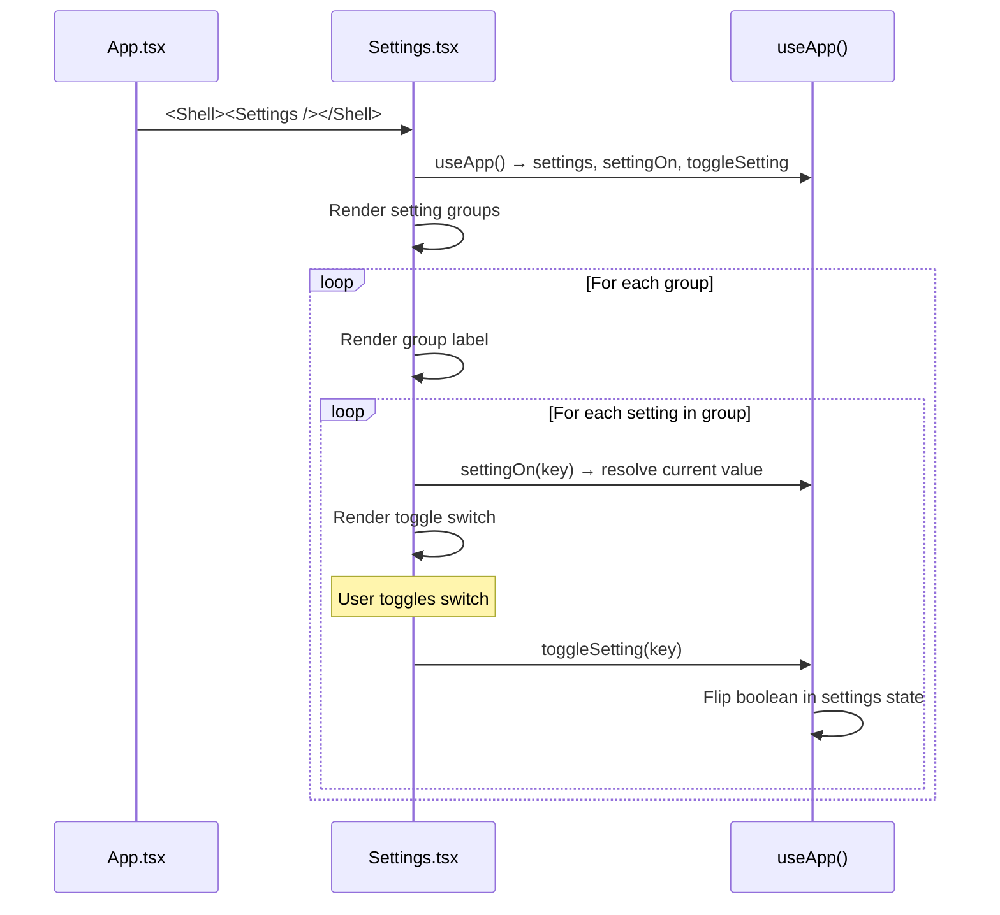

# Frontend — Settings

## Table of Contents

- [Overview](#overview) — User settings and preferences
- [Files](#files) — Source file inventory
- [Key Types / Interfaces](#key-types--interfaces) — Setting keys and defaults
- [Core Logic / Flow](#core-logic--flow) — Mermaid sequence diagrams for settings management
- [Logic Paths Summary](#logic-paths-summary) — Decision trees for toggle behavior
- [Dependencies](#dependencies) — Internal and external dependencies

---

## Overview

The Settings page (`/settings`) is a shell route that allows users to configure their preferences. It provides:

1. **Sound effects** — toggle game sound effects on/off.
2. **Music** — toggle background music on/off.
3. **Auto-roll** — automatically roll the dice when it's your turn.
4. **Fast animations** — speed up dice roll and piece movement animations.
5. **Move hints** — highlight legal moves on the board.
6. **Friend invites** — allow friends to invite you to games.
7. **Weekly recap** — receive a weekly summary email (UI toggle only).

Settings are stored in React state (not persisted to backend yet).

---

## Files

| File | Role |
|------|------|
| `src/pages/Settings.tsx` | Settings page — toggle switches for all preferences |

---

## Key Types / Interfaces

### SETTING_DEFAULTS

```typescript
export const SETTING_DEFAULTS: Record<string, boolean> = {
  '0-0': true,   // Sound effects
  '0-1': true,   // Music
  '1-0': true,   // Auto-roll
  '1-1': false,  // Fast animations
  '1-2': true,   // Move hints
  '2-0': true,   // Friend invites
  '2-1': false,  // Weekly recap
}
```

### Setting Groups

| Group Key | Settings |
|-----------|----------|
| `0-0` | Sound effects |
| `0-1` | Music |
| `1-0` | Auto-roll |
| `1-1` | Fast animations |
| `1-2` | Move hints |
| `2-0` | Friend invites |
| `2-1` | Weekly recap |

### Setting State

```typescript
settings: Record<string, boolean>  // Override values; falls back to SETTING_DEFAULTS
```

---

## Core Logic / Flow

### Settings Rendering

Sequence of steps when the Settings page loads.


---

## Logic Paths Summary

### Settings Render Path
```
<Settings />
  ├── useApp() → settings, settingOn, toggleSetting
  ├── For each setting group
  │   ├── Render group label
  │   └── For each setting in group
  │       ├── settingOn(key) → current value
  │       ├── Render toggle switch (on/off)
  │       └── onToggle → toggleSetting(key)
  └── (No save button — changes apply immediately)
```

### Toggle Path
```
toggleSetting(key)
  └── Flip settings[key]
       └── If key not in settings, initialize from SETTING_DEFAULTS[key]
```

---

## Dependencies

| Dependency | Purpose |
|-----------|---------|
| `store.tsx` | `useApp` for `settings`, `settingOn`, `toggleSetting` |
| `theme.ts` | Inline styles for toggle switches |