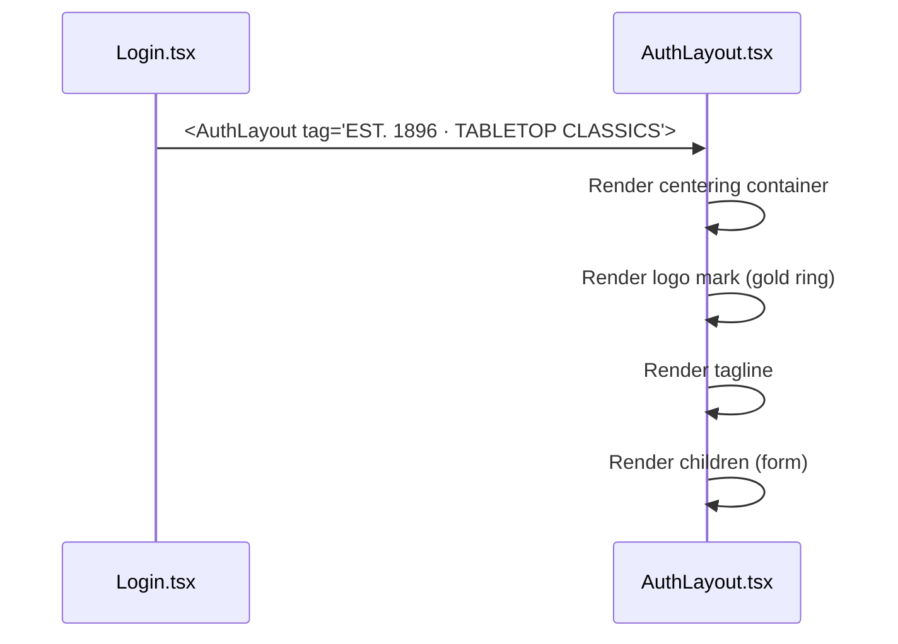
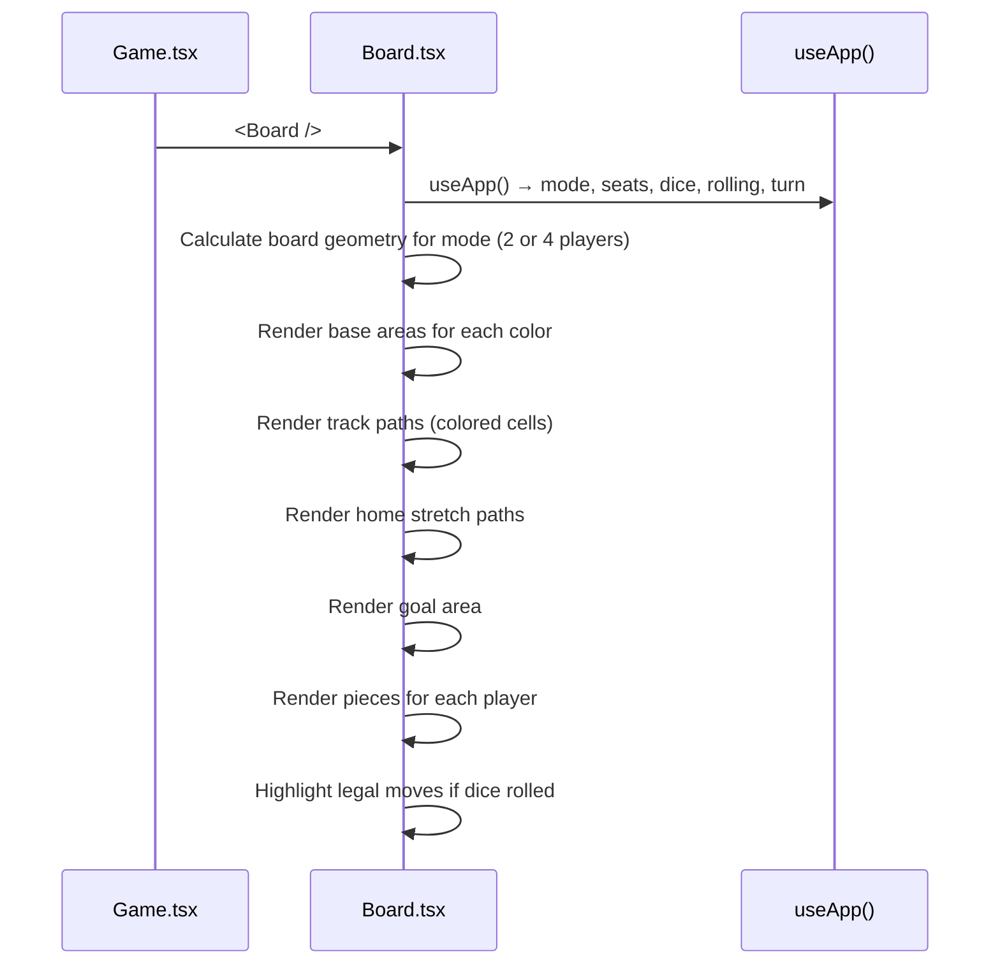
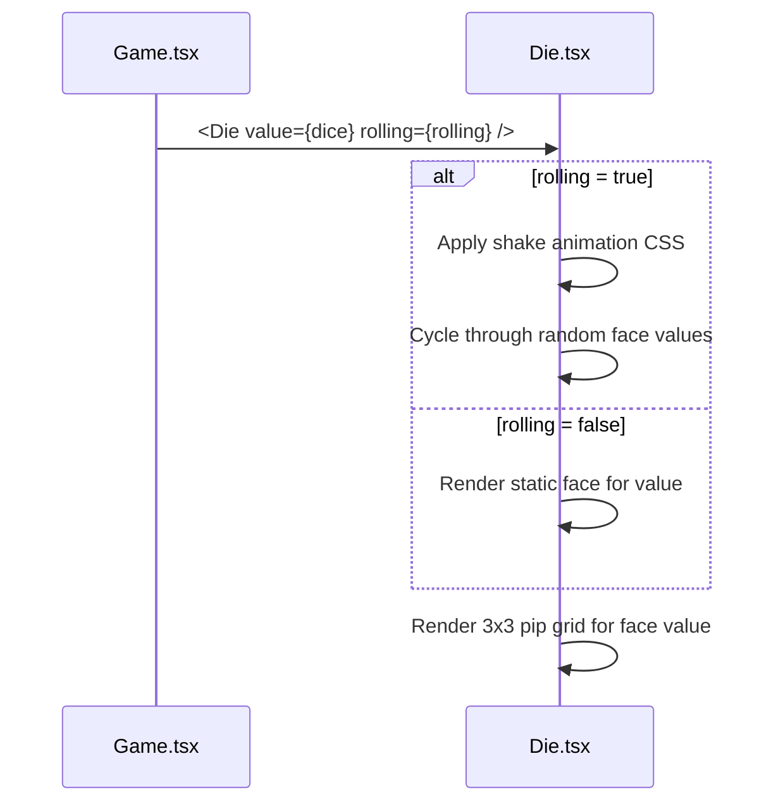
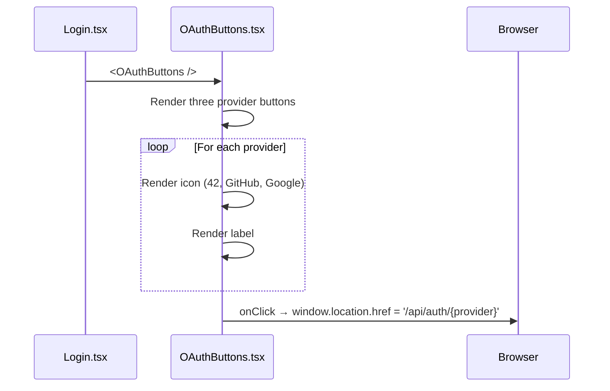

# Frontend — Shared Components

## Table of Contents

- [Overview](#overview) — Reusable UI components used across pages
- [Files](#files) — Source file inventory
- [Key Types / Interfaces](#key-types--interfaces) — Component props and shared helpers
- [Core Logic / Flow](#core-logic--flow) — Mermaid sequence diagrams for each component
- [Logic Paths Summary](#logic-paths-summary) — Decision trees for rendering
- [Dependencies](#dependencies) — Internal and external dependencies

---

## Overview

The shared components are reusable UI primitives used across multiple pages. They include:

1. **AuthLayout** — centered card layout for login/signup pages with logo and tagline.
2. **Board** — the Ludo game board with tracks, bases, and pieces.
3. **Die** — animated dice component with rolling animation.
4. **OAuthButtons** — row of Google, GitHub, and 42 OAuth provider buttons.

---

## Files

| File | Role |
|------|------|
| `src/components/AuthLayout.tsx` | Centered auth page wrapper with logo and tagline |
| `src/components/Board.tsx` | Ludo board component — tracks, bases, pieces |
| `src/components/Die.tsx` | Dice component — face rendering with roll animation |
| `src/components/OAuthButtons.tsx` | OAuth provider buttons (42, GitHub, Google) |

---

## Key Types / Interfaces

### AuthLayout Props

```typescript
type AuthLayoutProps = {
  tag?: string;          // Optional tagline displayed above the form
  children: ReactNode;   // Form content
}
```

### Board Component

No specific props — reads game state from `useApp()` internally.

### Die Component

```typescript
type DieProps = {
  value: number;         // 1-6
  rolling?: boolean;     // If true, shows rolling animation
}
```

### OAuthButtons

No props — renders three provider buttons.

---

## Core Logic / Flow

### 1. AuthLayout

Sequence of steps when an auth page is rendered.


### 2. Board

Sequence of steps when the game board is rendered.


### 3. Die

Sequence of steps when the die is rendered.


### 4. OAuthButtons

Sequence of steps when OAuth buttons are rendered.


---

## Logic Paths Summary

### AuthLayout Path
```
<AuthLayout tag={tag}>
  └── Render centered container
       ├── Logo mark (CSS gradient ring)
       ├── Tagline text
       └── {children}
```

### Board Path
```
<Board />
  └── useApp() → mode, seats, dice, rolling, turn
       ├── Calculate geometry for mode
       ├── Render base areas (4 corners)
       ├── Render track cells (colored paths)
       ├── Render home stretches
       ├── Render goal area
       ├── Render pieces
       └── Highlight legal moves
```

### Die Path
```
<Die value={dice} rolling={rolling} />
  ├── rolling = true → shake animation, cycle faces
  └── rolling = false → render static face
       └── Render 3x3 pip grid for value
```

### OAuthButtons Path
```
<OAuthButtons />
  ├── Render 42 button → onClick → '/api/auth/42'
  ├── Render GitHub button → onClick → '/api/auth/github'
  └── Render Google button → onClick → '/api/auth/google'
```

---

## Dependencies

| Component | Depends On | Purpose |
|-----------|-----------|---------|
| `AuthLayout` | `theme.ts` | `goldText`, inline styles |
| `Board` | `store.tsx` | `useApp` for game state |
| `Board` | `theme.ts` | `COL`, inline styles |
| `Die` | `theme.ts` | Keyframe CSS for shake animation, gradient backgrounds |
| `OAuthButtons` | `theme.ts` | `btnOutline` style |