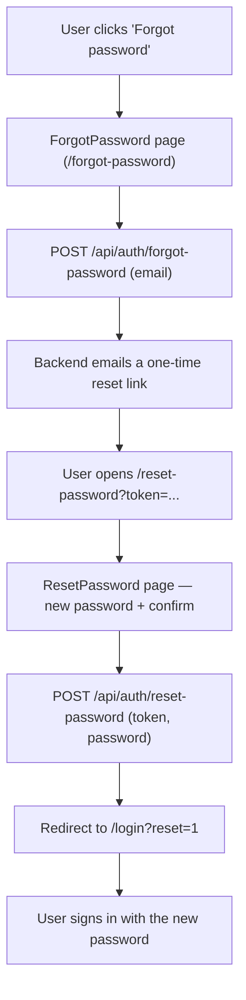
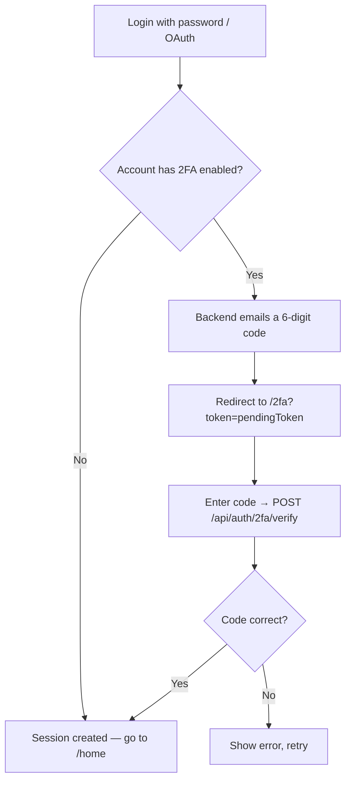

# Frontend — Auth Extras (2FA, Password Reset)

## Table of Contents

- [Overview](#overview) — Two-factor authentication and password reset pages
- [Files](#files) — Source file inventory
- [Pages](#pages) — Individual page descriptions

---

## Overview

These pages handle the steps that happen after the password check:

1. **TwoFactor** (`/2fa`) — 6-digit code entry after password login or OAuth (Open Authorization), when two-factor authentication (2FA) is enabled.
2. **ForgotPassword** (`/forgot-password`) — password reset step one: collect an email and request a reset link.
3. **ResetPassword** (`/reset-password`) — password reset step two: use the emailed token to set a new password.

All three are full-bleed routes (no side rail) and are public, so no session is required.

---

## Files

| File | Role |
|------|------|
| `src/pages/TwoFactor.tsx` | 2FA code entry page |
| `src/pages/ForgotPassword.tsx` | Password reset step 1 — email input |
| `src/pages/ResetPassword.tsx` | Password reset step 2 — new password form |
| `src/components/RetroAuthLayout.tsx` | Layout container for all auth pages |
| `src/store.tsx` | `verify2fa`, `forgotPassword`, `resetPassword` actions |
| `src/validatePassword.ts` | Client-side password validation (mirrors backend policy) |

---

## Pages

### TwoFactor (`/2fa`)

Reached with `?token=<pendingToken>` after password login or OAuth when the account has 2FA enabled.

- Shows a 6-digit code input (numeric, focused automatically).
- Calls `POST /api/auth/2fa/verify` with `pendingToken` and `code`.
- On success, navigates to `/home`.
- On failure, shows an error message.

**Route params:** the `token` query parameter holds the `pendingToken` from the login response.

### Password reset flow



### 2FA flow



---

### ForgotPassword (`/forgot-password`)

Step one of password reset.

- Email input with validation.
- Calls `POST /api/auth/forgot-password` with the email.
- Always shows the same success message, so it never reveals whether an address is registered.
- On success, shows "check your inbox" confirmation with a link back to `/login`.

---

### ResetPassword (`/reset-password`)

Step two of password reset.

- Reached from the emailed link: `?token=<resetToken>`.
- New password + confirm password fields.
- Validates password against the same policy as signup (12+ chars, upper, lower, number, special).
- Calls `POST /api/auth/reset-password` with `token` and `password`.
- On success, navigates to `/login?reset=1`.
- If no `token` query param, shows an "invalid reset link" error.

**Route params:** the `token` query parameter holds the 64-character hexadecimal reset token from the email.

---

## Password Policy

Both pages enforce the same policy as registration:

```typescript
// frontend/src/validatePassword.ts
export function passwordError(password: string): string | null {
  if (password.length < 12 || password.length > 72) return 'Password must be 12-72 characters'
  if (!/[a-z]/.test(password)) return 'Password must contain a lowercase letter'
  if (!/[A-Z]/.test(password)) return 'Password must contain an uppercase letter'
  if (!/\d/.test(password)) return 'Password must contain a number'
  if (!/[^A-Za-z0-9]/.test(password)) return 'Password must contain a special character'
  return null
}
```

---

## Page Notes

- **ForgotPassword** collects an email and asks the backend to send a reset link. The confirmation screen always appears: the backend never reveals whether the address is registered, and neither does the page.
- **ResetPassword** is reached from the emailed link, which carries `?token=<resetToken>`. It validates the new password against the same policy as signup (`validatePassword.ts`); on success it sends the user to `/login`.
- **TwoFactor** is reached in two ways, both with `?token=<pendingToken>`: from `Login.tsx` after the password step succeeds, or from the backend's OAuth callback after it emails the code.

---

## Dependencies

| Dependency | Purpose |
|-----------|---------|
| `store.tsx` | `verify2fa`, `forgotPassword`, `resetPassword` actions |
| `router.tsx` | `navigate`, `useRoute` for token query params |
| `validatePassword.ts` | Client-side password validation |
| `RetroAuthLayout.tsx` | Centered card layout wrapper |
| `theme.ts` | `btnGold`, `goldText`, `input`, `label` styles |