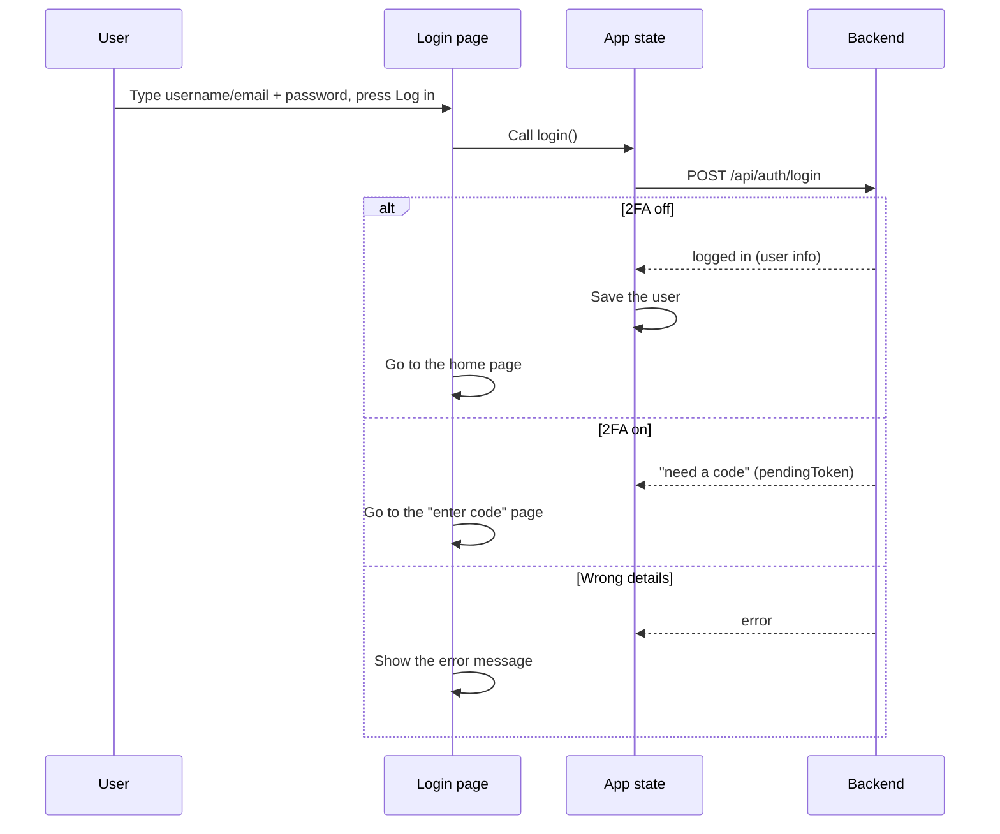
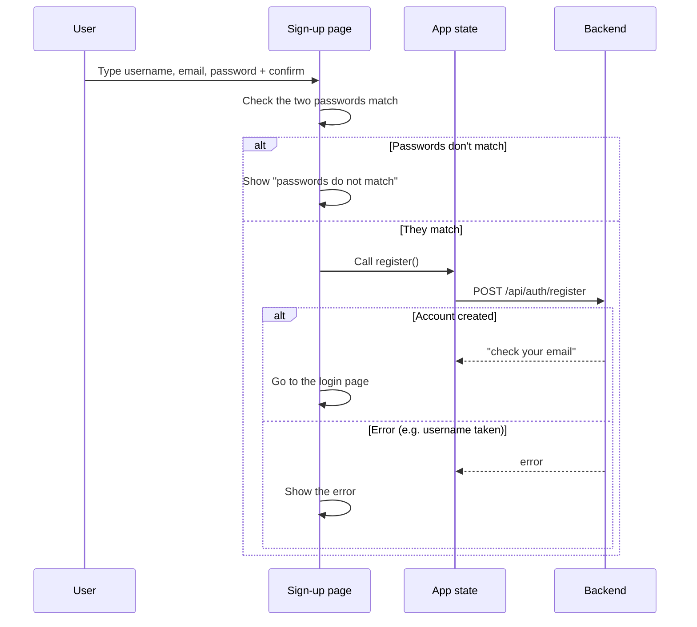
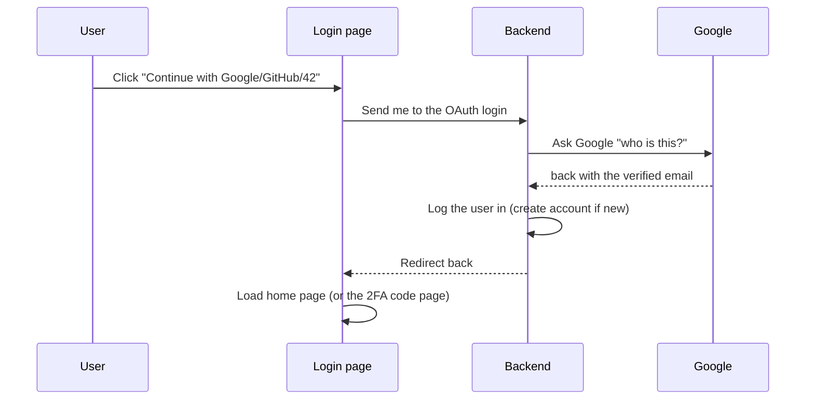

# Frontend — Auth Pages (Login & Signup)

## Table of Contents

- [Overview](#overview) — Login and signup forms with OAuth integration and 2FA
- [Files](#files) — Source file inventory
- [Key Types / Interfaces](#key-types--interfaces) — Form state and validation shapes
- [Core Logic / Flow](#core-logic--flow) — Mermaid sequence diagrams for login and signup flows
- [Logic Paths Summary](#logic-paths-summary) — Decision trees for form submission
- [Dependencies](#dependencies) — Internal and external dependencies

---

## Overview

The auth pages provide the entry point to the application. They include:

1. **Login** — identifier (username or email), password, OAuth buttons, and 2FA support.
2. **Signup** — username, email, password, and confirm password fields with match validation.

Both pages use the `RetroAuthLayout` wrapper and share the same visual style (retro/cyber theme, OAuth provider buttons).

---

## Files

| File | Role |
|------|------|
| `src/pages/Login.tsx` | Login form — identifier, password, OAuth buttons, 2FA redirect |
| `src/pages/Signup.tsx` | Signup form — username, email, password, confirm password |
| `src/pages/TwoFactor.tsx` | 2FA code entry |
| `src/pages/ForgotPassword.tsx` | Password reset — step 1 (request link) |
| `src/pages/ResetPassword.tsx` | Password reset — step 2 (set new password) |
| `src/components/RetroAuthLayout.tsx` | Layout wrapper — logo, tagline, centered card |
| `src/components/OAuthButtons.tsx` | 42, GitHub, Google provider buttons |

---

## Key Types / Interfaces

### Login Form State

```typescript
const [identifier, setIdentifier] = useState('')
const [password, setPassword] = useState('')
const [error, setError] = useState<string | null>(null)
const [submitting, setSubmitting] = useState(false)
```

### Signup Form State

```typescript
const [username, setUsername] = useState('')
const [email, setEmail] = useState('')
const [password, setPassword] = useState('')
const [confirm, setConfirm] = useState('')
const [error, setError] = useState<string | null>(null)
const [submitting, setSubmitting] = useState(false)
```

### Validation Rules

| Field | Rule |
|-------|------|
| Username | Required, 3-20 chars, alphanumeric + underscore only |
| Email | Required, valid email format (used for verification and 2FA) |
| Password | Required, 12-72 chars, must contain uppercase, lowercase, number, and special character |
| Confirm | Must match password |

---

## Core Logic / Flow

### 1. Login Flow

Sequence of steps when a user logs in. Supports password-only or password + 2FA.


### 2. Signup Flow

Sequence of steps when a user creates an account. Sends verification email; no session is created until email is verified.


### 3. OAuth Flow

Sequence of steps when a user clicks an OAuth button.


---

## Logic Paths Summary

### Login Path
```
onSubmit(e)
  ├── e.preventDefault()
  ├── If submitting → return
  ├── login(identifier, password)
  │   ├── POST /api/auth/login
  │   │   ├── 200 + twoFactorRequired=false → setUser(user), navigate('/home')
  │   │   ├── 200 + twoFactorRequired=true → navigate('/2fa?token=' + pendingToken)
  │   │   └── error → setError(message)
  └── setSubmitting(false)
```

### Signup Path
```
onSubmit(e)
  ├── e.preventDefault()
  ├── If submitting → return
  ├── If password !== confirm → setError('Passwords do not match')
  ├── register(username, password, email)
  │   ├── POST /api/auth/register
  │   │   ├── 200 → navigate('/login?verified=1')
  │   │   └── error → setError(message)
  └── setSubmitting(false)
```

### OAuth Path
```
onClick provider button
  └── window.location.href = '/api/auth/{provider}'
       └── Full OAuth redirect loop handled by backend
```

---

## Dependencies

| Dependency | Purpose |
|-----------|---------|
| `store.tsx` | `useApp()` for login/register actions, returns `{ error, pendingToken }` |
| `router.tsx` | `navigate` for post-auth redirect |
| `theme.ts` | `btnGold`, `goldText`, `input`, `label` styles |
| `AuthLayout.tsx` | Centered card layout wrapper |
| `OAuthButtons.tsx` | Provider button row |