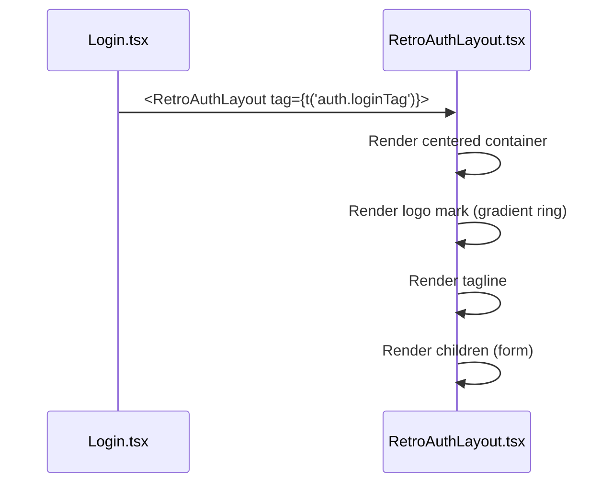
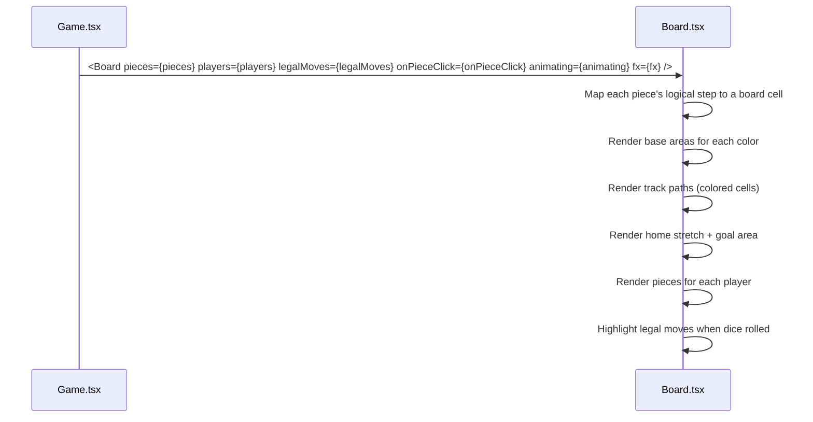
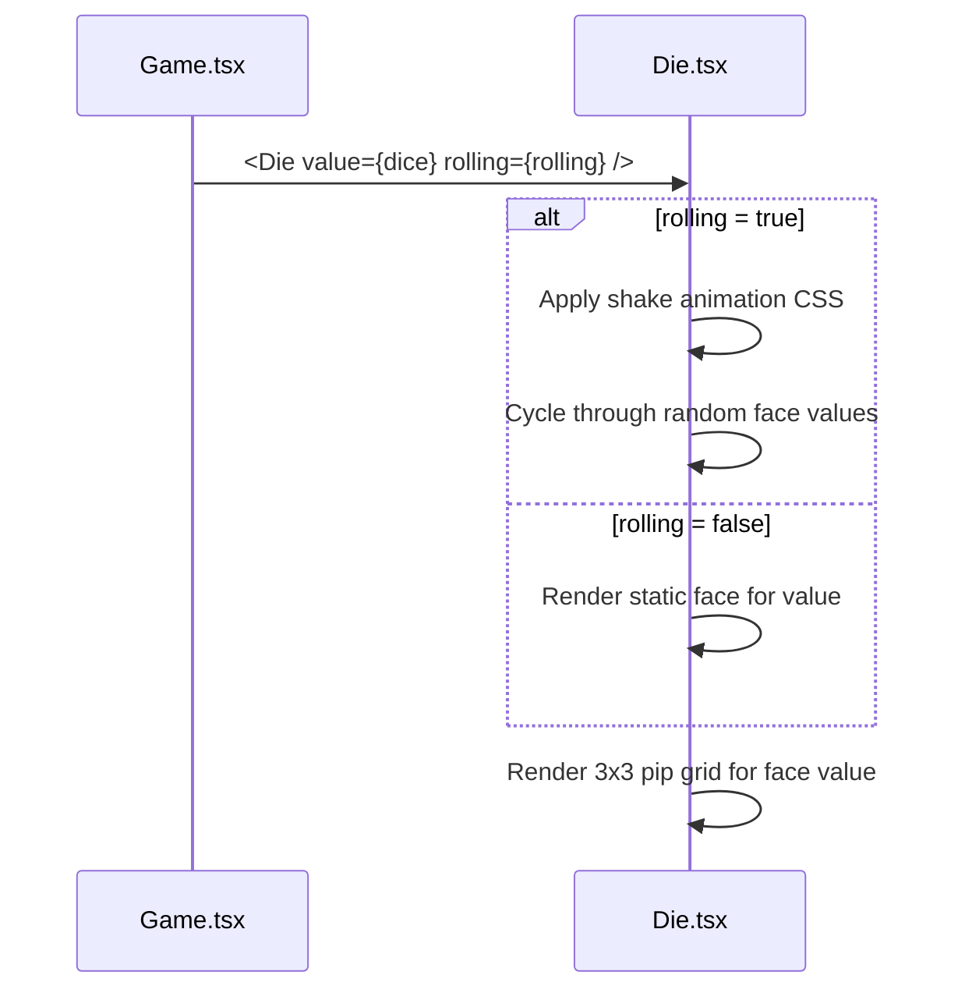
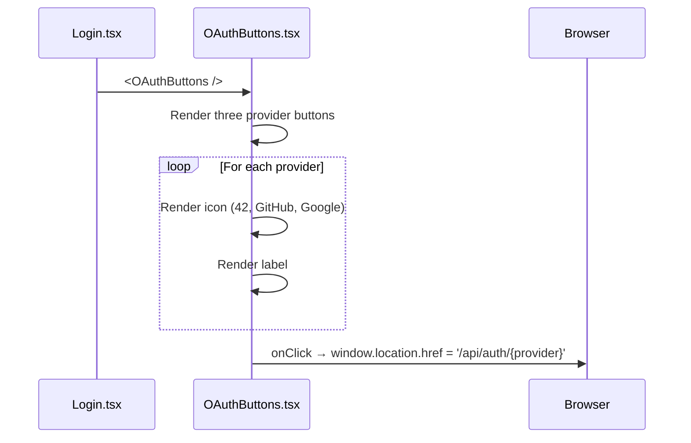

# Frontend — Shared Components

## Table of Contents

- [Overview](#overview) — Reusable UI (user interface) components used across pages
- [Files](#files) — Source file inventory
- [Key Types / Interfaces](#key-types--interfaces) — Component props and shared helpers
- [Core Logic / Flow](#core-logic--flow) — Mermaid sequence diagrams for each component
- [Logic Paths Summary](#logic-paths-summary) — Decision trees for rendering
- [Rank Tiers (`utils/ranks.ts`)](#rank-tiers-utilsranksts) — Rating to tier mapping used by `RankBadge`
- [Theme-aware Tailwind Utilities (`styles/tw.ts`)](#theme-aware-tailwind-utilities-stylestwts) — The shared utility-class constants
- [Implementation Notes](#implementation-notes) — Portals, compact mode, avatar attributes, CJK (Chinese, Japanese and Korean) text sizing
- [Dependencies](#dependencies) — Internal and external dependencies

---

## Overview

The shared components are reusable UI (user interface) building blocks used on several pages. They are:

1. **RetroNavbar** — top navigation bar used by the full-bleed pages.
2. **Shell** — layout container with a side rail and a header (no route uses it yet).
3. **AccountMenu** — user menu dropdown (language, 2FA, sign out).
4. **RetroAuthLayout** — centered layout for the authentication pages (login, signup, 2FA, forgot/reset password).
5. **Board / Die** — the Ludo board and the animated die.
6. **UserAvatar / RankBadge** — avatar rendering and rank tier badges.
7. **OAuthButtons** — Google, GitHub and 42 provider buttons.
8. **NotificationBell / NotificationToast** — the notification bell and toasts.
9. **JoinByCode** — invite-code input for joining a game.
10. **ProfileEditModal / RulesModal** — edit-profile dialog and rules popup.
11. **CyberModal / ResultsModal** — cyber-styled modal base and the post-game results overlay.

---

## Files

| File | Role |
|------|------|
| `src/components/RetroNavbar.tsx` | Top navigation bar — logo, nav links, user menu, theme switcher (used by full-bleed pages) |
| `src/components/Shell.tsx` | Layout container — side rail, header, `AccountMenu` (no route uses it yet) |
| `src/components/AccountMenu.tsx` | Account menu dropdown (language, 2FA, sign out) |
| `src/components/RetroAuthLayout.tsx` | Retro-styled authentication page container (`tag` + `children`, plus the `NeonCheck` glyph) |
| `src/components/Board.tsx` | Ludo board — tracks, bases, pieces, legal-move highlights |
| `src/components/Die.tsx` | Dice component — face rendering with roll animation |
| `src/components/UserAvatar.tsx` | Avatar image — shows the uploaded photo only when `hasAvatarPhoto` is `true`, otherwise the DiceBear default; a failed load quietly switches to the default (no retry, no error state) |
| `src/dicebear.ts` | DiceBear helper — generates an avatar data URI (Uniform Resource Identifier) (`avataaars`/`bottts`/`identicon`) |
| `src/components/RankBadge.tsx` | Rank tier badge based on rating |
| `src/components/OAuthButtons.tsx` | OAuth provider buttons (42, GitHub, Google) |
| `src/components/NotificationBell.tsx` | Bell icon, unread badge and dropdown |
| `src/components/NotificationToast.tsx` | Toast notifications |
| `src/components/JoinByCode.tsx` | Invite-code input for joining a game |
| `src/components/ProfileEditModal.tsx` | Edit-profile dialog |
| `src/components/DeleteAccountModal.tsx` | Delete-account dialog (sets a password first for OAuth-only accounts) |
| `src/components/RulesModal.tsx` | "How to Play" rules popup |
| `src/components/LegalModal.tsx` | Privacy Policy / Terms of Service popup |
| `src/components/MarkdownViewer.tsx` | Renders the markdown legal documents |
| `src/components/CyberModal.tsx` | Cyber-styled modal base (`CyberButton`, `CyberModal`) used for confirmations and dialogs |
| `src/components/ResultsModal.tsx` | Post-game results overlay — podium, rank badges, outcome title, return-to-lobby |
| `src/avatarCache.ts` | Per-user avatar cache-buster store — `useAvatarVersion`, `bumpAvatarVersion`, driven by the SSE (Server-Sent Events) `avatar_changed` event |

---

## Key Types / Interfaces

### RetroAuthLayout Props

```typescript
type RetroAuthLayoutProps = {
  tag?: string;          // Optional tagline displayed above the form
  children: ReactNode;   // Form content
}
```

### Board Component

No props of its own; it reads the game state from `useApp()`.

### Die Component

```typescript
type DieProps = {
  value: number;         // 1-6
  rolling?: boolean;     // If true, shows rolling animation
}
```

### OAuthButtons

No props; it renders the three provider buttons.

---

### AccountMenu

Dropdown menu that opens when you click the user avatar in the Shell header. It has:

- **Language selector** — switch between English, Malay and French.
- **2FA toggle** — turn two-factor authentication on or off by calling `PATCH /api/auth/2fa`.
- **Sign out** — calls `POST /api/auth/logout`, then navigates to `/login`.

```typescript
type AccountMenuProps = {
  // No explicit props — reads user from useApp()
}
```

The menu uses the `Menu` component from the theme library, positioned directly below the avatar button. It closes when you click outside it or pick an action.

---

## Core Logic / Flow

### 1. RetroAuthLayout

Sequence of steps when an authentication page renders.


### 2. Board

Sequence of steps when the game board renders.


### 3. Die

Sequence of steps when the die renders.


### 4. OAuthButtons

Sequence of steps when the provider buttons render.


---

## Logic Paths Summary

### RetroAuthLayout Path
```
<RetroAuthLayout tag={tag}>
  └── Render centered container
       ├── Logo mark (CSS gradient ring)
       ├── Tagline text
       └── {children}
```

### Board Path
```
<Board />
  └── useApp() → mode, seats, dice, rolling, turn
       ├── Calculate geometry for mode
       ├── Render base areas (4 corners)
       ├── Render track cells (colored paths)
       ├── Render home stretches
       ├── Render goal area
       ├── Render pieces
       └── Highlight legal moves
```

### Die Path
```
<Die value={dice} rolling={rolling} />
  ├── rolling = true → shake animation, cycle faces
  └── rolling = false → render static face
       └── Render 3x3 pip grid for value
```

### OAuthButtons Path
```
<OAuthButtons />
  ├── Render 42 button → onClick → '/api/auth/42'
  ├── Render GitHub button → onClick → '/api/auth/github'
  └── Render Google button → onClick → '/api/auth/google'
```

### AccountMenu Path
```
<AccountMenu />
  ├── Render avatar button with initials
  ├── onClick → toggle dropdown
  ├── Language option → setLang(lang)
  ├── 2FA option → toggleTwoFactor() → PATCH /api/auth/2fa
  └── Sign out → logout() → POST /api/auth/logout → navigate('/login')
```

---

## Rank Tiers (`utils/ranks.ts`)

`getRankTier(rating, boardRank?)` maps a rating (plus an optional leaderboard position) to one of five tier objects that `RankBadge` renders. Home, Leaderboard, Friends and Profile use it.

| Tier | Constant | Requirement |
|------|----------|-------------|
| MAMEE MONSTER | `RANK_MAMEE` | Top 3 on the leaderboard — a *position* rule that takes precedence over rating |
| MILO DINOSAUR | `RANK_MILO` | rating >= 1350 |
| PADDLE POP | `RANK_PADDLE` | rating 1200-1349 |
| HONEY STARS | `RANK_HONEY` | rating 1000-1199 |
| CHOKI CHOKI | `RANK_CHOKI` | rating < 1000 |

The top tier depends on position, not on points: a player is MAMEE only while they hold a podium spot. The mamee and milo aura glows come from the `BADGE_*_AURA` constants in `styles/tw.ts`.

---

## Theme-aware Tailwind Utilities (`styles/tw.ts`)

`src/styles/tw.ts` holds Tailwind class strings that several components share, so the same long list of utility classes is not written out at every place it is used. Each constant replaces one `retrowave.css` rule exactly; nothing was redesigned.

Rules that apply to the whole file:

- **Themes are handled in CSS, not in JavaScript.** The `[data-theme]` custom properties live in `retrowave.css`. Each theme change here is an arbitrary `&`-selector variant such as `[[data-theme=win95]_&]:...`. No JavaScript checks the theme.
- **`!` (the important modifier) marks a real specificity conflict.** This happens when the code using the class sets its own inline `background`, `border` or `box-shadow`, or when two utilities of the same specificity depend on stylesheet order (Tailwind does not guarantee that its generated order matches the order inside the className). Every `!` is present because the version without it was tested and did not work.
- **`@keyframes` and custom easing curves** (`--flicker`) cannot be written as utility classes, so they stay in `retrowave.css` and are referenced with `var()` or arbitrary `animation:` values.
- **State controlled by JavaScript** (open/closed, glitching, an active LED) is written as a literal or conditional class, or as a `data-*` attribute read through a `group-data-` variant. The earlier design toggled a CSS class such as `.is-open` or `.active` instead.
- **CSS found to be unused was deleted rather than converted** — rules that nothing referenced, or rules that a more specific rule made unreachable.

Per-constant notes:

| Constant | Notes |
|---|---|
| `THEME_TRIGGER_BTN_BASE` | The code using this class sets inline background, border and shadow, so the theme variants need `!`. The original CSS had two theme rule sets for it; only the one scoped to `.retro-floating-dock` could apply (the general one lost on specificity), so only that one is ported. Its hover rules were less specific than the base rule, so they never applied, and `.active .theme-chevron` had no users. `active` stays a literal class set by JavaScript, so `&.active` can still match it. |
| `THEME_POPOVER_MENU_BASE` | The `--fs-*` custom properties cover the colours, but win95 and terminal also change the radius, shadow and blur, so those need their own variants with `!`. Open/closed/up/down is JavaScript state (`THEME_POPOVER_MENU_HIDDEN` / `_ACTIVE_DOWN` / `_ACTIVE_UP`); `@keyframes popover-slide-*` stay in CSS. |
| `RETRO_FLOATING_DOCK` | RetroNavbar's `#mainNav`. This element has no inline background, border or shadow, so no `!` is needed — the arbitrary variants already have higher specificity. |
| `CRT_SCREEN` | The "page shell" shared by Home, Profile, Leaderboard, Friends, Lobby, Game and LudoLobby. Every value comes from a custom property, so it follows the theme with no theme logic here. The duplicate win95/terminal `.retro-window`, `.window-header` and `.window-body` overrides are intentionally left in the CSS. |
| `GRID_BACKGROUND` | The animated 3D synthwave grid and sun, shared by RetroAuthLayout and the dashboard pages. The theme `display:none` rules become `&` variants; `@keyframes grid-scroll` stays in CSS. |
| `WINDOW_HEADER` | The theme reskin applies to *all* pages again. The literal `window-header` class had been removed from the call sites of every page except Game.tsx in an earlier change, which silently dropped the reskin there. `!` is required to break the tie with `GAME_WINDOW_HEADER_EXTRA` on Game.tsx. |
| `GAME_WINDOW_HEADER_EXTRA` | The Game.tsx-only header look, identical in every theme until a theme reskin replaces parts of it. In the original CSS the game rule and the theme rule had equal specificity, and the theme rule won because it came later in the file. Here `!bg-[#140a35]` beats `WINDOW_HEADER`'s plain default, while `WINDOW_HEADER`'s `!`-marked theme variants (which have higher specificity) still win on win95 and terminal. |
| `RETRO_TICKET_PASS` | LudoLobby's quick-deploy tickets. The CSS had two win95/terminal override blocks that applied one property at a time; the values here are the combined result (the later block wins for each property it sets), not a copy of either block. |
| `ARCADE_START_TITLE` | `whitespace-nowrap` fixes a bug that already existed in the CSS: at 1.5px letter-spacing the heading and its spaced arrows are wider than the overlay, so the arrows wrapped onto their own lines. |
| `CYBER_CASSETTE_CHASSIS` | Home's "CYBERSOUND DECK" widget. The theme overrides become `&` variants; the `.lit-*` LED classes are utility strings chosen in JavaScript; `.cyber-deck-key-play.active` is a conditional class. The unused `.tape-reel.active`, `@keyframes reelSpin` and `.track-matrix-btn.active` were deleted. |
| `CYBER_MODAL_OVERLAY` | The most involved conversion. CyberModal's state has to reach many descendants, so the overlay carries `data-modal-state` and `data-glitching`, and the constants read them with `group-data-` variants. The overlay's group is **named** (`group/modal`) because `CyberButton`, which renders inside it, has its own unnamed `group`/`group-hover:` for a separate hover glitch, and an unnamed group matches *any* ancestor. While it was unnamed, hovering anywhere over the modal triggered the button's glitch and the label became garbled; this was confirmed by taking a screenshot, not assumed. `:root { --flicker }` and the three `@keyframes` stay in CSS. The `:not(:disabled)` guard on the hover rules was dropped because no call site passes `disabled`. |
| `CYBER_BTN_PINK` / `_YELLOW` / `_DANGER` | Need `!` on their `--btn-accent`/`--btn-shadow` overrides: `CYBER_BTN_BASE` sets defaults of the same specificity, and those defaults otherwise win no matter what order the classes are joined in. |
| `CYBER_BTN_BACKDROP_SHARED` | `before:!mask-clip-*` / `before:!mask-composite-*` need `!` because the `mask` shorthand utility resets its longhand properties, and Tailwind placed the shorthand after them. Without `!` the bevel cut turned back into a solid fill and the label became unreadable. |
| `TICKET_CONTAINER` / `RESULTS_INVOICE` / `INVOICE_VALUE` | ResultsModal's "vending machine ticket". The CSS held two copies of the widget. The older "receipt printer" slot and hole rules were unused and were deleted, but selectors it shared with the current design applied as well. The values were read with `getComputedStyle()` on the live modal in all three themes, so a few properties came from the old block: `top-6`, `z-5`, Share Tech Mono, VT323, and the win95/terminal title colour plus the terminal value's text-shadow and font-size. |
| `PAY_TAG_BASE` | win95 and terminal override the border, background and colour regardless of rank, so the order relative to the rank modifiers does not matter (the theme selector has higher specificity than the rank modifier). |
| `BADGE_*_AURA` | RankBadge's fire/plasma glow for the mamee and milo tiers: static `::before`/`::after` layers with their own always-running animation. A previous session hit a Tailwind JIT (just-in-time) scanner bug that silently dropped rules for this very long combined class string, so the conversion was checked against the compiled CSS. The difference in the CSS — mamee's `before:` has no `pointer-events-none` and the other three do — is copied from the original, not a mistake. |

---

## Implementation Notes

- **Overlays rendered through a portal.** `NotificationBell`'s dropdown and `RetroNavbar`'s account popover both render into `<body>`. A high `z-index` cannot escape an ancestor's stacking context (the sticky sidebar's `position: sticky` creates one, which traps even very large z-indices), so the overlays render outside it. Their position comes from the trigger's current `getBoundingClientRect()` instead of CSS anchoring.
- **Avatar photo flags.** `UserAvatar` requests `/api/user/<name>/avatar` only when `hasAvatarPhoto === true`; any other value (including `undefined`) renders the DiceBear default, because a failed photo request produces a 404 that the browser logs regardless of `onError`. `ResultsModal` therefore passes `false` for opponents (the client-side `LastResult` never carries the flag) and `user?.hasAvatarPhoto ?? false` for the viewer.
- **`DeleteAccountModal` is a two-step dialog.** Accounts created through a provider have no password, so they set one first, because deletion always requires the password. They then confirm with that password and an acknowledgement checkbox. On success the store's `logout()` clears the session and the user lands on `/login`.
- **CJK label sizing (`AccountMenu`).** CJK (Chinese, Japanese and Korean) glyphs fill the em box, while Latin letters take up roughly half of it, so Latin labels use a smaller px value and look the same size.
- **RetroNavbar compact mode.** Below Tailwind's `xl` breakpoint (1280px) the sidebar collapses to an icon-only rail. The labels are hidden from JavaScript rather than by CSS, because parts of the bar are plain inline styles. Every page that renders the bar uses the same threshold with `w-[88px] xl:w-[270px]`.
- **RetroNavbar track layout.** The nav track uses `overflow-y: auto` only as a fallback. An earlier version also shifted the track vertically to move the active item nearer the centre, and that shift was removed: at short window heights it pushed the last item over the theme button.

---

## Dependencies

| Component | Depends On | Purpose |
|-----------|-----------|---------|
| `RetroAuthLayout` | `theme.ts` | `goldText`, inline styles |
| `Board` | `store.tsx` | `useApp` for game state |
| `Board` | `theme.ts` | `COL`, inline styles |
| `Die` | `theme.ts` | Keyframe CSS for the shake animation, gradient backgrounds |
| `OAuthButtons` | `theme.ts` | `btnOutline` style |
| `AccountMenu` | `store.tsx` | `useApp` for `user`, `lang`, `setLang`, `toggleTwoFactor`, `logout` |
