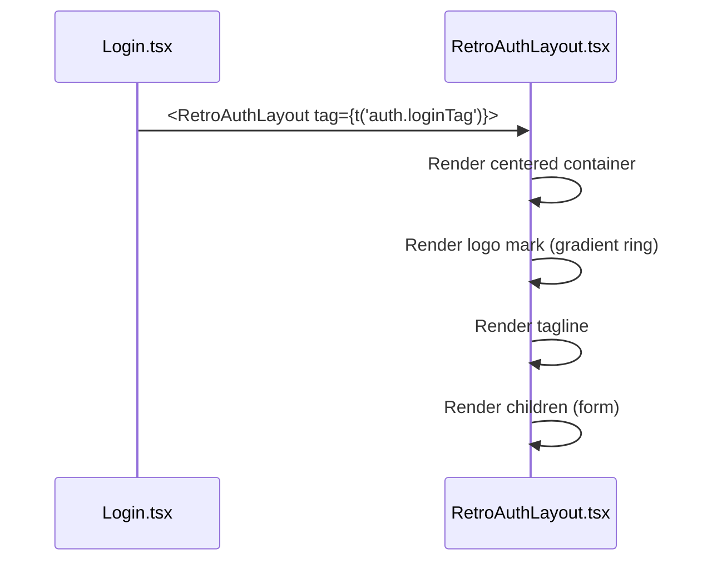
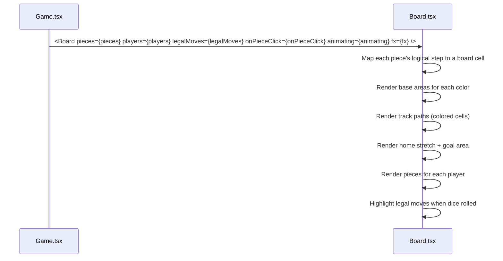
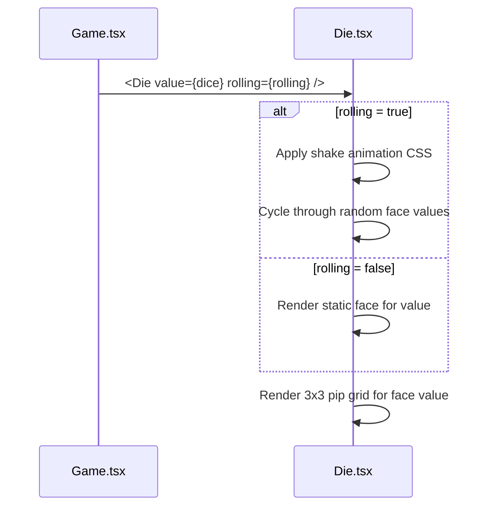
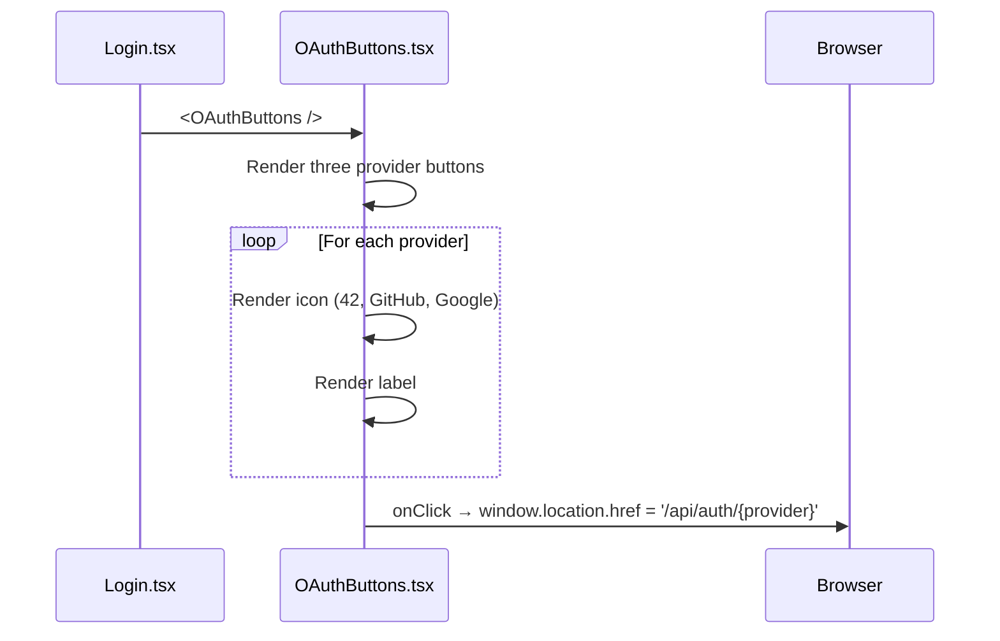

# Frontend — Shared Components

## Table of Contents

- [Overview](#overview) — Reusable UI components used across pages
- [Files](#files) — Source file inventory
- [Key Types / Interfaces](#key-types--interfaces) — Component props and shared helpers
- [Core Logic / Flow](#core-logic--flow) — Mermaid sequence diagrams for each component
- [Logic Paths Summary](#logic-paths-summary) — Decision trees for rendering
- [Dependencies](#dependencies) — Internal and external dependencies

---

## Overview

The shared components are reusable UI primitives used across multiple pages. They include:

1. **RetroNavbar** — top navigation bar used by the full-bleed pages.
2. **Shell** — layout wrapper with side rail + header (not currently wrapping any route).
3. **AccountMenu** — user menu dropdown (language, 2FA, sign out).
4. **RetroAuthLayout** — centered layout for the auth pages (login, signup, 2FA, forgot/reset password).
5. **Board / Die** — the Ludo board and the animated die.
6. **UserAvatar / RankBadge** — avatar rendering and rank tier badges.
7. **OAuthButtons** — Google, GitHub, and 42 login buttons.
8. **NotificationBell / NotificationToast** — the notifications UI.
9. **JoinByCode** — invite-code input for joining a game.
10. **ProfileEditModal / RulesModal** — edit-profile dialog and rules popup.
11. **CyberModal / ResultsModal** — cyber-styled modal base and the post-game results overlay.

---

## Files

| File | Role |
|------|------|
| `src/components/RetroNavbar.tsx` | Top navigation bar — logo, nav links, user menu, theme switcher (used by full-bleed pages) |
| `src/components/Shell.tsx` | Layout wrapper — side rail, header, `AccountMenu` (not currently wrapping any route) |
| `src/components/AccountMenu.tsx` | Account menu dropdown (language, 2FA, sign out) |
| `src/components/RetroAuthLayout.tsx` | Retro-styled auth page wrapper (`tag` + `children`, plus the `NeonCheck` glyph) |
| `src/components/Board.tsx` | Ludo board — tracks, bases, pieces, legal-move highlights |
| `src/components/Die.tsx` | Dice component — face rendering with roll animation |
| `src/components/UserAvatar.tsx` | Avatar image — shows the uploaded photo only when `hasAvatarPhoto` is `true`, otherwise the DiceBear default; a failed load silently swaps to the default (no retry, no error state) |
| `src/dicebear.ts` | DiceBear helper — generates avatar data-URI (`avataaars`/`bottts`/`identicon`) |
| `src/components/RankBadge.tsx` | Rank tier badge based on rating |
| `src/components/OAuthButtons.tsx` | OAuth provider buttons (42, GitHub, Google) |
| `src/components/NotificationBell.tsx` | Bell icon + unread badge + dropdown |
| `src/components/NotificationToast.tsx` | Toast notifications |
| `src/components/JoinByCode.tsx` | Invite-code input for joining a game by code |
| `src/components/ProfileEditModal.tsx` | Edit-profile dialog |
| `src/components/DeleteAccountModal.tsx` | Delete-account dialog (sets a password first for OAuth-only accounts) |
| `src/components/RulesModal.tsx` | "How to Play" rules popup |
| `src/components/LegalModal.tsx` | Privacy Policy / Terms of Service popup |
| `src/components/MarkdownViewer.tsx` | Renders the markdown legal documents |
| `src/components/CyberModal.tsx` | Cyber-styled modal base (`CyberButton`, `CyberModal`) used for confirmations and dialogs |
| `src/components/ResultsModal.tsx` | Post-game results overlay — podium, rank badges, outcome title, return-to-lobby |
| `src/avatarCache.ts` | Per-user avatar cache-buster store — `useAvatarVersion`, `bumpAvatarVersion` (SSE `avatar_changed`) |

---

## Key Types / Interfaces

### RetroAuthLayout Props

```typescript
type RetroAuthLayoutProps = {
  tag?: string;          // Optional tagline displayed above the form
  children: ReactNode;   // Form content
}
```

### Board Component

No specific props — reads game state from `useApp()` internally.

### Die Component

```typescript
type DieProps = {
  value: number;         // 1-6
  rolling?: boolean;     // If true, shows rolling animation
}
```

### OAuthButtons

No props — renders three provider buttons.

---

### AccountMenu

Dropdown menu displayed when clicking the user avatar in the Shell header. Provides:

- **Language selector** — toggle between English, Malay, and French.
- **2FA toggle** — enable/disable two-factor authentication (calls `PATCH /api/auth/2fa`).
- **Sign out** — calls `POST /api/auth/logout` and navigates to `/login`.

```typescript
type AccountMenuProps = {
  // No explicit props — reads user from useApp()
}
```

The menu is rendered as a `Menu` component from the theme library, positioned absolutely below the avatar button. It closes on outside click or after selecting an action.

---

## Core Logic / Flow

### 1. RetroAuthLayout

Sequence of steps when an auth page is rendered.


### 2. Board

Sequence of steps when the game board is rendered.


### 3. Die

Sequence of steps when the die is rendered.


### 4. OAuthButtons

Sequence of steps when OAuth buttons are rendered.


---

## Logic Paths Summary

### RetroAuthLayout Path
```
<RetroAuthLayout tag={tag}>
  └── Render centered container
       ├── Logo mark (CSS gradient ring)
       ├── Tagline text
       └── {children}
```

### Board Path
```
<Board />
  └── useApp() → mode, seats, dice, rolling, turn
       ├── Calculate geometry for mode
       ├── Render base areas (4 corners)
       ├── Render track cells (colored paths)
       ├── Render home stretches
       ├── Render goal area
       ├── Render pieces
       └── Highlight legal moves
```

### Die Path
```
<Die value={dice} rolling={rolling} />
  ├── rolling = true → shake animation, cycle faces
  └── rolling = false → render static face
       └── Render 3x3 pip grid for value
```

### OAuthButtons Path
```
<OAuthButtons />
  ├── Render 42 button → onClick → '/api/auth/42'
  ├── Render GitHub button → onClick → '/api/auth/github'
  └── Render Google button → onClick → '/api/auth/google'
```

### AccountMenu Path
```
<AccountMenu />
  ├── Render avatar button with initials
  ├── onClick → toggle dropdown
  ├── Language option → setLang(lang)
  ├── 2FA option → toggleTwoFactor() → PATCH /api/auth/2fa
  └── Sign out → logout() → POST /api/auth/logout → navigate('/login')
```

---

## Dependencies

| Component | Depends On | Purpose |
|-----------|-----------|---------|
| `RetroAuthLayout` | `theme.ts` | `goldText`, inline styles |
| `Board` | `store.tsx` | `useApp` for game state |
| `Board` | `theme.ts` | `COL`, inline styles |
| `Die` | `theme.ts` | Keyframe CSS for shake animation, gradient backgrounds |
| `OAuthButtons` | `theme.ts` | `btnOutline` style |
| `AccountMenu` | `store.tsx` | `useApp` for `user`, `lang`, `setLang`, `toggleTwoFactor`, `logout` |
