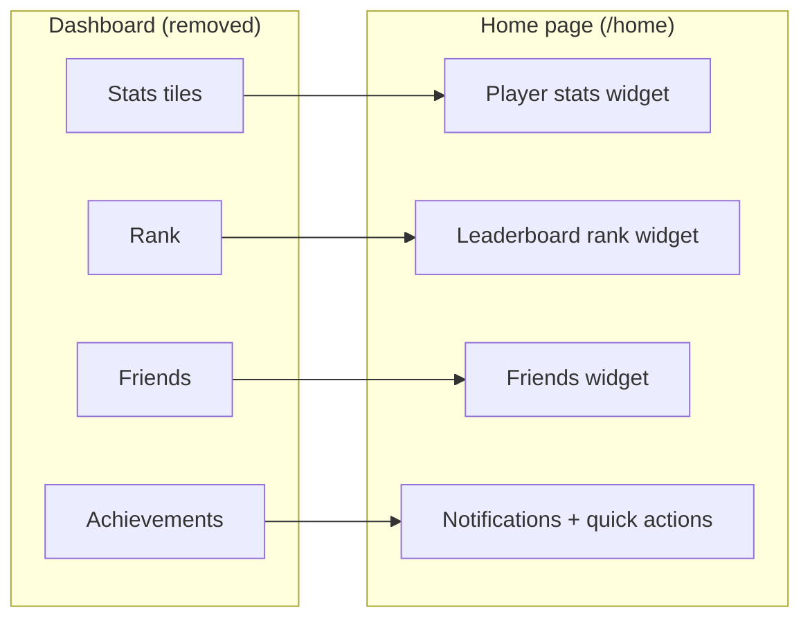

# Frontend — Dashboard

## Status: Superseded by the Home page

> **The standalone `Dashboard` page no longer exists.** Its functionality — player stats, leaderboard rank, friends list, achievements, and recent activity — was folded into the **Home page** (`/home`, `src/pages/Home.tsx`). See [frontend-home-module.md](frontend-home-module.md) for the current implementation.

There is no `src/pages/Dashboard.tsx` in the codebase. The Home page now renders the dashboard-style widgets natively:

1. **Player stats** — fetched from `GET /api/stats` (rating, highestRating, totalGames, wins, losses, captures, …).
2. **Leaderboard rank** — fetched from `GET /api/leaderboard?mode=global&limit=50` (`myRank` + a username → rank map).
3. **Friends widget** — fetched from `GET /api/friends` and `GET /api/friends/requests`, polled every ~12s.
4. **Notifications** — bell + toasts via `useNotifications()` (SSE stream).
5. **Quick actions** — start a game (`navigate('/gamelobby')`), leaderboard, friends.

---

## Files (current)

| File | Role |
|------|------|
| `src/pages/Home.tsx` | Home page — the former dashboard widgets, now API-driven |
| `src/hooks/useNotifications.ts` | Notification bell + toasts (SSE) |
| `src/api.ts` | Typed `getApi`/`postApi` fetchers |

---

## Dependencies

| Dependency | Purpose |
|-----------|---------|
| `api.ts` | `getApi` for `/api/stats`, `/api/leaderboard`, `/api/friends` |
| `store.tsx` | `useApp` for user, settings, presence |
| `hooks/useNotifications.ts` | Real-time notifications |
| `router.tsx` | `navigate` for quick actions |
| `utils/ranks.ts` | `getRankTier` rank badges |
