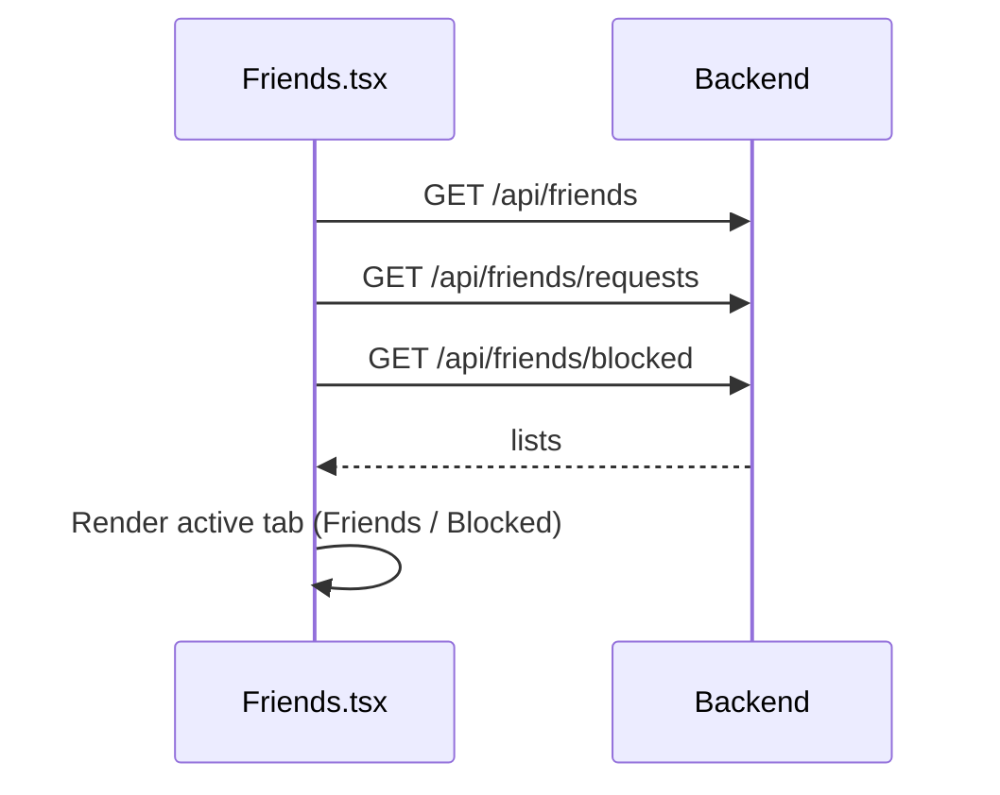

# Frontend — Friends

## Table of Contents

- [Overview](#overview) — Friends list, requests, blocked users, invites
- [Files](#files) — Source file inventory
- [Key Types / Interfaces](#key-types--interfaces) — Data shapes
- [Core Logic / Flow](#core-logic--flow) — Mermaid sequence diagrams
- [Logic Paths Summary](#logic-paths-summary) — Decision trees
- [Dependencies](#dependencies) — Internal and external dependencies

---

## Overview

The Friends page (`/friends`, full-bleed) manages friendships. It has:

1. **Friends list** — accepted friends with avatar, username, rating, and live presence status.
2. **Friend requests** — requests you have received and not yet answered, each with accept and decline actions; you can also send a request by username.
3. **Blocked list** — users you have blocked, each with an unblock action. The two lists are separate tabs: Friends and Blocked.
4. **Game invite** — invite a friend to a PvP (player versus player) game with `POST /api/friends/:friendId/invite`, which returns the match credentials.

> **Note:** The Friends page reads all of its data from the backend API (Application Programming Interface). It calls the endpoints below and refreshes the lists every 15 seconds.

---

## Files

| File | Role |
|------|------|
| `src/pages/Friends.tsx` | Friends page — lists, requests, blocked, invite, actions |
| `src/components/UserAvatar.tsx` | Player avatars |
| `src/components/RankBadge.tsx` | Rank badges |

---

## Key Types / Interfaces

```typescript
type Friend = {
  id: string  // Unique ID
  username: string  // Player's username
  displayName?: string  // Name shown in the game
  avatarStyle?: any  // Avatar style name
  hasAvatarPhoto?: boolean  // Whether a custom photo is uploaded
  rating?: number  // Player's rating (score)
  friendsSince?: string  // When the friendship started
  status?: 'online' | 'playing' | 'offline'  // Online status
}

type FriendRequest = {
  id: string  // Unique ID
  userId: string  // ID of the user this belongs to
  username: string  // Player's username
  avatarStyle?: any  // Avatar style name
  hasAvatarPhoto?: boolean  // Whether a custom photo is uploaded
  createdAt: string  // When the record was created
}

type BlockedUser = {
  id: string  // Unique ID
  username: string  // Player's username
  displayName?: string  // Name shown in the game
  avatarStyle?: any  // Avatar style name
  hasAvatarPhoto?: boolean  // Whether a custom photo is uploaded
  rating?: number  // Player's rating (score)
  blockedSince: string  // When the user was blocked
}
```

---

## Core Logic / Flow

### Friends Page Load



---

## Logic Paths Summary

```
Add friend → GET /api/user/{username} → POST /api/friends/request/{userId}
Accept → POST /api/friends/accept/{requestId}
Decline → POST /api/friends/decline/{requestId}
Remove → DELETE /api/friends/remove/{friendId}
Block  → POST /api/friends/block/{friendId}
Unblock→ POST /api/friends/unblock/{userId}
Invite → POST /api/friends/{friendId}/invite → store activeMatch → navigate('/gamelobby/table')
```

---

## Dependencies

| Dependency | Purpose |
|-----------|---------|
| `api.ts` | `postApi` and `fetch` request helpers |
| `store.tsx` | `useApp` for user, setActiveMatch (invite flow) |
| `router.tsx` | `navigate` |
| `i18n.ts` | `useTranslation` (`friends.*` keys) |
| `utils/ranks.ts` | Rank badges |
