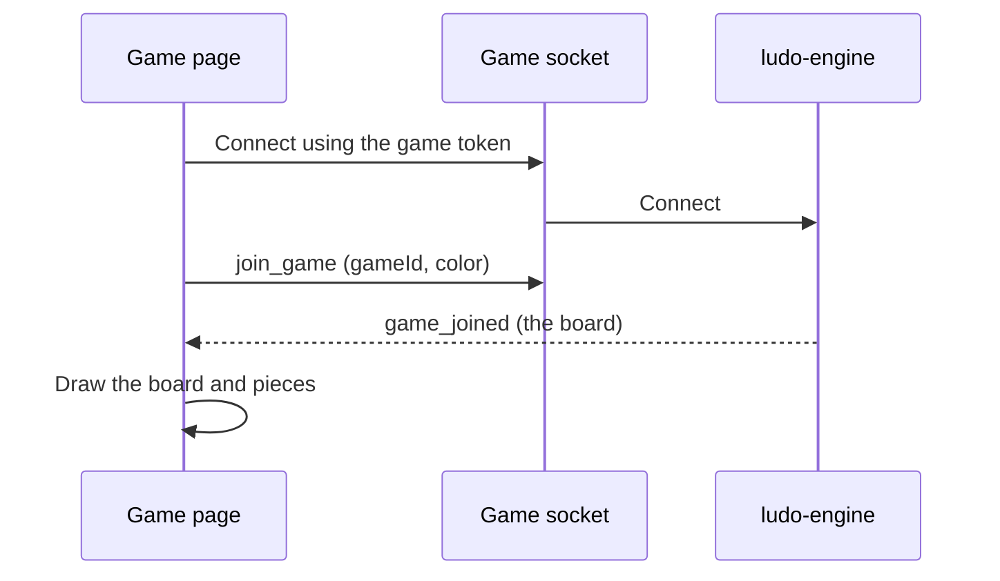
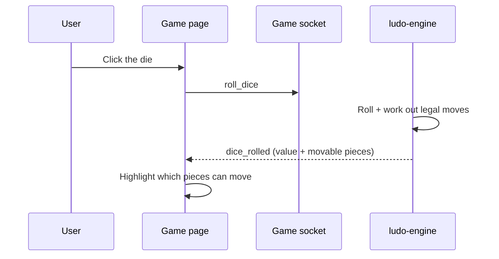
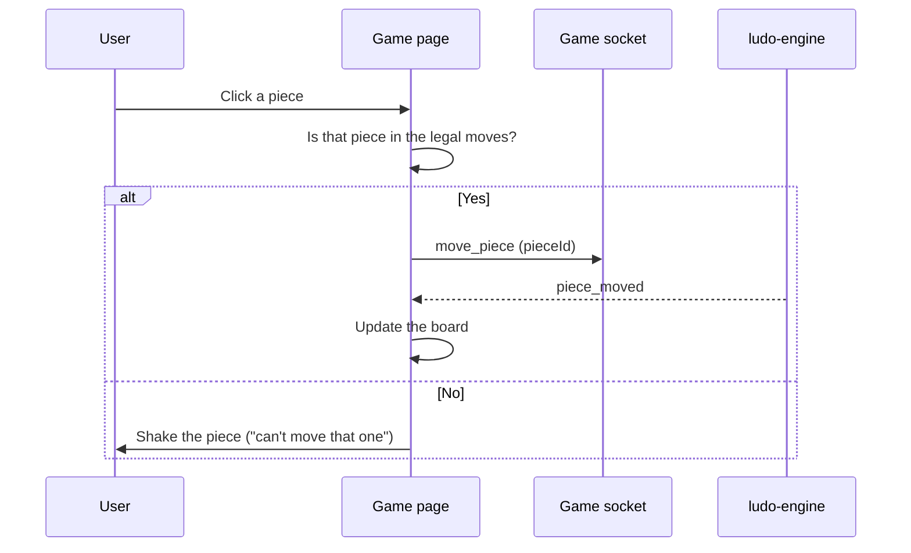

# Frontend — Game

## Table of Contents

- [Overview](#overview) — Ludo board UI with dice rolling and piece movement
- [Files](#files) — Source file inventory
- [Key Types / Interfaces](#key-types--interfaces) — Component props and state shapes
- [Core Logic / Flow](#core-logic--flow) — Mermaid sequence diagrams for game interaction
- [Logic Paths Summary](#logic-paths-summary) — Decision trees for dice roll and piece selection
- [Dependencies](#dependencies) — Internal and external dependencies

---

## Overview

The Game page (`/game`) is the real-time gameplay screen. It provides:

1. **Ludo board** — rendered using the `Board` component with the four colored tracks.
2. **Dice roller** — `Die` component with rolling animation, displays 1-6.
3. **Piece interaction** — pieces rendered on the board, clickable when it's the player's turn.
4. **Real-time engine connection** — connects to the Ludo Engine via Socket.IO (`connectSocket`), joined with the match token from `activeMatch`.

> **Note:** The Game page is fully real-time. It connects to the engine on the page's own origin (`/socket.io/`), emits `join_game`, `roll_dice`, and `move_piece`, and renders engine-driven state updates (`game_joined`, `dice_rolled`, `piece_moved`, `game_ended`, …). Game state is dispatched into `game/reducer.ts` — see `socket.ts` for the full event contract.

---

## Files

| File | Role |
|------|------|
| `src/pages/Game.tsx` | Game page — engine socket connection, board, dice, pieces |
| `src/components/Board.tsx` | Board component — renders Ludo track, pieces, bases |
| `src/components/Die.tsx` | Die component — dice face rendering with roll animation |
| `src/game/reducer.ts` | Pure reducer translating engine events into local view state |
| `src/game/types.ts` | GameState, PlayerColor, LegalMove, MoveResult, etc. |
| `src/socket.ts` | Socket.IO client — `connectSocket()`, typed Server/Client event maps |

---

## Key Types / Interfaces

### Game State (engine-driven)

```typescript
// The authoritative state comes from the engine over Socket.IO
// (socket.ts ServerEvents). Local view state is derived in game/reducer.ts.
gameId: string            // activeMatch.gameId
color: PlayerColor        // activeMatch.color
state: GameState          // from 'game_joined' / 'state_update'
dice: number              // from 'dice_rolled'
legalMoves: LegalMove[]   // from 'dice_rolled'
```

### Seat

```typescript
type Seat =
  | { type: 'you' }
  | { type: 'bot'; name: string }
  | { type: 'player'; name: string }
  | { type: 'empty' }
```

### PlayerColor

```typescript
type PlayerColor = 'red' | 'green' | 'yellow' | 'blue'
```

---

## Core Logic / Flow

### 1. Engine Connection & Join

Sequence of steps when the Game page mounts with an active match.


### 2. Dice Roll

Sequence of steps when the player clicks the die.


### 3. Piece Movement

Sequence of steps after the player clicks a movable piece.


---

## Logic Paths Summary

### Connect & Join Path
```
Game mounts with activeMatch
  ├── connectSocket(activeMatch.token)
  ├── on 'connect' → emit('join_game', gameId, color, userId, displayName)
  ├── on 'game_joined' → dispatch into reducer
  └── Reconnect: on reconnect → re-emit join_game
```

### Dice Roll Path
```
User clicks die
  └── emit('roll_dice')
       └── on 'dice_rolled' → dispatch { value, legalMoves, bonusRoll, currentTurn } → highlight pieces
```

### Piece Move Path
```
User clicks piece
  ├── Check if piece is in legalMoves for current dice
  │   ├── Yes → emit('move_piece', pieceId)
  │   │   └── on 'piece_moved' → dispatch → update board
  │   └── No → show invalid feedback
```

### Game End Path
```
on 'game_ended' { winner, resultDetail }
  ├── setLastResult({ winner, resultDetail, mode, playerCount, players })
  └── Open the ResultsModal overlay in-game
```

---

## Dependencies

| Dependency | Purpose |
|-----------|---------|
| `store.tsx` | `useApp` for activeMatch, lastResult, settings, setLastResult |
| `socket.ts` | `connectSocket` + typed Socket.IO event maps |
| `game/reducer.ts` | Pure state reducer for engine events |
| `components/Board.tsx` | Renders Ludo board track, pieces, bases |
| `components/Die.tsx` | Dice face rendering and roll animation |
| `theme.ts` | `SEAT_COLORS`, inline styles, keyframe CSS |
| `utils/audio.ts` | `retroAudio` sound effects |