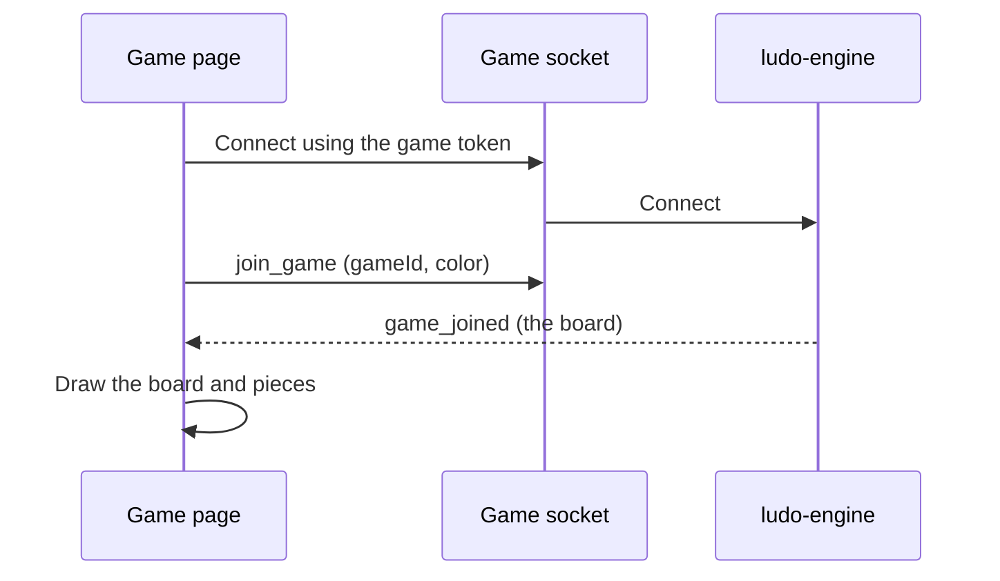
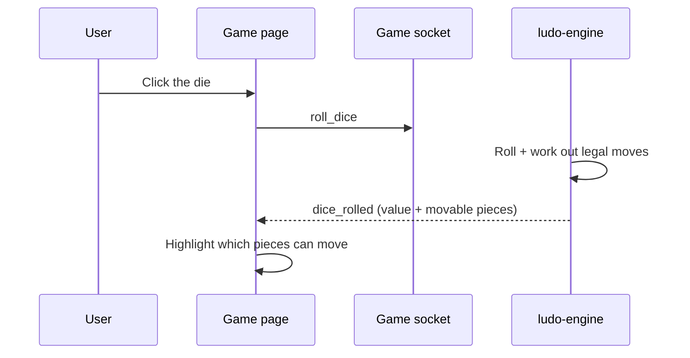
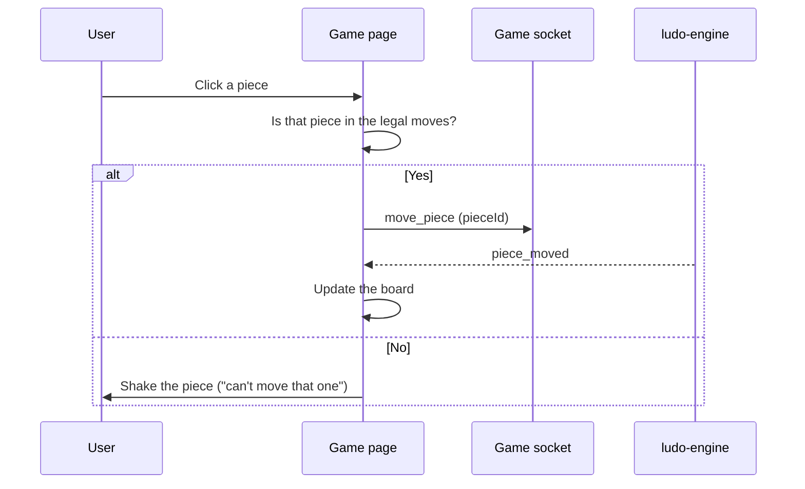

# Frontend — Game

## Table of Contents

- [Overview](#overview) — Ludo board screen with dice rolling and piece movement
- [Files](#files) — Source file inventory
- [Key Types / Interfaces](#key-types--interfaces) — Component props and state shapes
- [Core Logic / Flow](#core-logic--flow) — Mermaid sequence diagrams for game interaction
- [Logic Paths Summary](#logic-paths-summary) — Decision trees for dice roll and piece selection
- [Dependencies](#dependencies) — Internal and external dependencies

---

## Overview

The Game page (`/game`) is the real-time gameplay screen. It has:

1. **Ludo board** — drawn by the `Board` component, with the four colored tracks.
2. **Dice roller** — the `Die` component, which animates the roll and shows 1-6.
3. **Piece interaction** — pieces drawn on the board; you can click them when it is your turn.
4. **Real-time engine connection** — connects to the Ludo Engine through Socket.IO (`connectSocket`), using the match token from `activeMatch`.

> **Note:** The Game page is fully real-time. It connects to the engine on the page's own origin (`/socket.io/`), sends `join_game`, `roll_dice` and `move_piece`, and renders state updates from the engine (`game_joined`, `dice_rolled`, `piece_moved`, `game_ended` and others). Game state is dispatched into `game/reducer.ts`; see `socket.ts` for the complete event contract.

---

## Files

| File | Role |
|------|------|
| `src/pages/Game.tsx` | Game page — engine socket connection, board, dice, pieces |
| `src/components/Board.tsx` | Board component — renders Ludo track, pieces, bases |
| `src/components/Die.tsx` | Die component — dice face rendering with roll animation |
| `src/game/reducer.ts` | Pure reducer that turns engine events into local view state |
| `src/game/types.ts` | GameState, PlayerColor, LegalMove, MoveResult and others |
| `src/socket.ts` | Socket.IO client — `connectSocket()`, typed Server/Client event maps |

---

## Key Types / Interfaces

### Game State (engine-driven)

```typescript
// The engine owns the real state, delivered over Socket.IO (socket.ts
// ServerEvents); game/reducer.ts derives the local view state.
gameId: string            // activeMatch.gameId
color: PlayerColor        // activeMatch.color
state: GameState          // from 'game_joined' / 'state_update'
dice: number              // from 'dice_rolled'
legalMoves: LegalMove[]   // from 'dice_rolled'
```

### Seat

```typescript
type Seat =
  | { type: 'you' }
  | { type: 'bot'; name: string }
  | { type: 'player'; name: string }
  | { type: 'empty' }
```

### PlayerColor

```typescript
type PlayerColor = 'red' | 'green' | 'yellow' | 'blue'
```

---

## Core Logic / Flow

### 1. Engine Connection & Join

Sequence of steps when the Game page mounts with an active match.


### 2. Dice Roll

Sequence of steps when the player clicks the die.


### 3. Piece Movement

Sequence of steps after the player clicks a movable piece.


---

## Logic Paths Summary

### Connect & Join Path
```
Game mounts with activeMatch
  ├── connectSocket(activeMatch.token)
  ├── on 'connect' → emit('join_game', gameId, color, userId, displayName)
  │    └── Hotseat: one join_game per local seat (a single socket owns every seat)
  ├── on 'game_joined' → dispatch into reducer
  ├── Hotseat turn rotation → re-emit join_game for the now-current seat so the
  │    engine's turn validation follows the seat actually being played
  └── Reconnect: on reconnect → re-emit join_game
```

### Dice Roll Path
```
User clicks die
  └── emit('roll_dice')
       └── on 'dice_rolled' → dispatch { value, legalMoves, bonusRoll, currentTurn } → highlight pieces
```

### Piece Move Path
```
User clicks piece
  ├── Check if piece is in legalMoves for current dice
  │   ├── Yes → emit('move_piece', pieceId)
  │   │   └── on 'piece_moved' → dispatch → update board
  │   └── No → show invalid feedback
```

### Game End Path
```
on 'game_ended' { winner, resultDetail }
  ├── setLastResult({ winner, resultDetail, mode, playerCount, players })
  └── Open the ResultsModal overlay in-game
```

---

## Implementation Notes

- **The socket effect depends on identity fields only.** The connect effect watches `activeMatch.gameId` and `.token`, never the whole `activeMatch` object. Changing `.mode`, `.color` or `.playerCount` after connect (a lobby seat or colour change) therefore cannot close and reopen the socket during the handshake. Long-lived handlers read the current value through `activeMatchRef`, so they never hold a stale `activeMatch`.
- **Duplicate-move guard.** `pendingMoveRef` is set as soon as `move_piece` is sent, and cleared when the server replies with `piece_moved` or a rejection. Without it, a second click on a piece that still looks legal, before the reply arrives, sends a duplicate `move_piece` that the engine rejects with "Invalid turn phase".
- **`canRoll` also requires `status === 'active'`.** This closes a short race at the end of a game: the winning move can leave the other roll inputs looking usable for one render before `game_ended` arrives, which would let a click through as a "Game not active" rejection.
- **Seat identity on the first render.** For a PvP (player versus player) joiner, `ck === view.myColor` can be out of date until the server replies: the engine assigns the seat through `lobby_update` → `my_color_changed`, which may arrive after the first render, so the seat briefly appears to belong to someone else. The page also accepts a direct `playerMeta.username === user.username` match (the same check the active-game pilot card uses) so it recognises the seat immediately.
- **Refresh safety for cached matches.** After a browser refresh, a very old cached `activeMatch` (saved before `mode` and `playerCount` were part of the create response) can arrive with no `mode`. The page reads it again from `GET /api/games/mine`, so a hotseat or PvE (player versus environment) game can never be treated as a plain PvP rejoin.
- **`dice_rolled` is matched to the turn before the event** (`game/reducer.ts`). On the no-move and third-six-forfeit paths the engine advances `currentTurn` before it emits, so the event's own `currentTurn` can already name the *next* player while the rolled value belongs to the player who rolled.
- **Bot names are translated.** Engine bots are named `bot-<color>`; `localizedBotName(t, name)` turns that into a translated "bot-<colour>", so rosters and results never show a raw English bot id (names that do not match are returned unchanged). Used by this page and `ResultsModal`.

---

## Dependencies

| Dependency | Purpose |
|-----------|---------|
| `store.tsx` | `useApp` for activeMatch, lastResult, settings, setLastResult |
| `socket.ts` | `connectSocket` and the typed Socket.IO event maps |
| `game/reducer.ts` | Pure state reducer for engine events |
| `components/Board.tsx` | Renders Ludo board track, pieces, bases |
| `components/Die.tsx` | Renders the dice face and the roll animation |
| `theme.ts` | `SEAT_COLORS`, inline styles, keyframe CSS |
| `utils/audio.ts` | `retroAudio` sound effects |