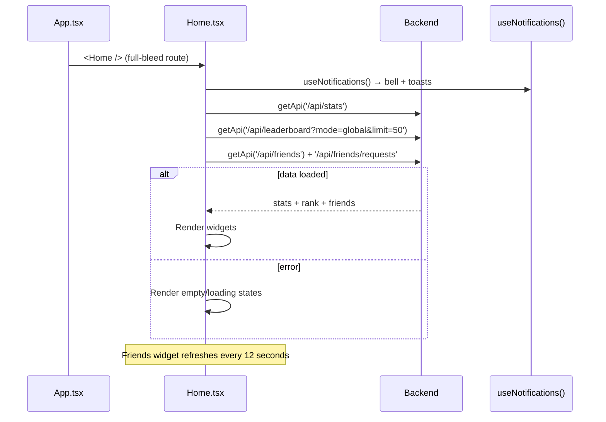

# Frontend — Home Page

## Table of Contents

- [Overview](#overview) — Main landing page for signed-in users
- [Files](#files) — Source file inventory
- [Key Types / Interfaces](#key-types--interfaces) — Data shapes
- [Core Logic / Flow](#core-logic--flow) — Mermaid sequence diagram of home rendering
- [Logic Paths Summary](#logic-paths-summary) — Decision trees for content display
- [Dependencies](#dependencies) — Internal and external dependencies

---

## Overview

The Home page is the main landing page after login (`/home`, full-bleed). It also acts as the player dashboard, and shows:

1. **Player stats widget** — read from the backend API (Application Programming Interface) at `GET /api/stats` (rating, games, wins, losses, captures).
2. **Leaderboard rank widget** — read from `GET /api/leaderboard?mode=global&limit=50`, using `myRank` plus a username-to-rank map.
3. **Friends widget** — read from `GET /api/friends` + `GET /api/friends/requests`, refreshed every 12 seconds; shows live presence status.
4. **Notifications** — bell icon and toasts from `useNotifications()`, which uses an SSE (Server-Sent Events) stream.
5. **Quick actions** — start a game (navigates to `/gamelobby`), leaderboard, friends.
6. **Global hotkeys** — keyboard shortcuts registered when the page mounts (for example, quick navigation).

> The Home page reads all of its data from the API; there is no mock data. It uses the retro/cyber styling (`RetroNavbar`, `retrowave.css`).

---

## Files

| File | Role |
|------|------|
| `src/pages/Home.tsx` | Home page — stats, leaderboard rank, friends, notifications, quick actions |
| `src/hooks/useNotifications.tsx` | Notification bell + toasts (SSE) |
| `src/components/UserAvatar.tsx` | Avatar rendering |
| `src/components/RankBadge.tsx` | Rank tier badge |
| `src/components/RetroNavbar.tsx` | Top navigation bar |
| `src/components/NotificationToast.tsx` | Toast notifications |

---

## Key Types / Interfaces

```typescript
type Friend = {
  id: string  // Unique ID
  username: string  // Player's username
  displayName?: string  // Name shown in the game
  avatarStyle?: any  // Avatar style name
  hasAvatarPhoto?: boolean  // Whether a custom photo is uploaded
  rating?: number  // Player's rating (score)
  friendsSince?: string  // When the friendship started
  status?: 'online' | 'playing' | 'offline'  // Online status
}

type PlayerStats = {
  rating: number  // Player's rating (score)
  highestRating: number  // Best rating ever reached
  totalGames: number  // Total games played
  wins: number  // Games won
  losses: number  // Games lost
  totalCaptures: number  // Total pieces captured
  totalPiecesInGoal: number  // Total pieces that reached home
  avgCapturesPerGame: number  // Average captures per game
}
```

---

## Core Logic / Flow

### Home Page Render

Sequence of steps when the home page loads.


---

## Logic Paths Summary

### Home Render Path
```
<Home />
  ├── useNotifications() → notifications, unreadCount, markRead, markAllRead
  ├── Fetch /api/stats + /api/leaderboard + /api/friends + /api/friends/requests
  │   ├── Stats present → render stat tiles
  │   ├── Leaderboard myRank → render rank badge
  │   └── Friends → render friends list with presence
  ├── Render quick actions: Start game → navigate('/gamelobby')
  └── Register global hotkeys
```

---

## Hero Badge Bar

The hero section shows a live site-wide badge with the number of **online players**, read from `GET /api/presence/online-count` and refreshed every 15 seconds.

---

## Dependencies

| Dependency | Purpose |
|-----------|---------|
| `api.ts` | `getApi` for `/api/stats`, `/api/leaderboard`, `/api/friends` |
| `store.tsx` | `useApp` for user, settings, presence |
| `hooks/useNotifications.tsx` | Real-time notification bell + toasts |
| `router.tsx` | `navigate` for quick actions |
| `utils/ranks.ts` | `getRankTier` rank badges |
| `utils/audio.ts` | `retroAudio` sound effects |
