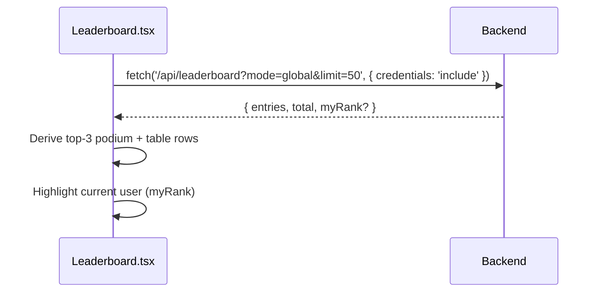

# Frontend — Leaderboard

## Table of Contents

- [Overview](#overview) — Global rankings table, read from the leaderboard endpoint
- [Files](#files) — Source file inventory
- [Key Types / Interfaces](#key-types--interfaces) — Data shapes
- [Core Logic / Flow](#core-logic--flow) — Mermaid sequence diagrams for leaderboard rendering
- [Logic Paths Summary](#logic-paths-summary) — Decision trees
- [Dependencies](#dependencies) — Internal and external dependencies

---

## Overview

The Leaderboard page (`/leaderboard`, full-bleed) shows players in rank order. It has:

1. **Rankings table** — rank, player (avatar + username), rating, matches, win rate.
2. **Top-3 podium** — highlighted cards for the top three players.
3. **Current user highlight** — "you" badge on the logged-in user's row.
4. **Counts and states** — the total number of entries, plus loading and empty states.

> **Note:** The Leaderboard reads live data from the leaderboard API (Application Programming Interface) at `GET /api/leaderboard?mode=global&limit=50`; there is no mock data. Translated text comes from `locales/*`, under the `leaderboard` namespace.

---

## Files

| File | Role |
|------|------|
| `src/pages/Leaderboard.tsx` | Leaderboard page — podium, rankings table, you-badge |
| `src/components/UserAvatar.tsx` | Player avatars |
| `src/components/RankBadge.tsx` | Rank tier badges |
| `src/utils/ranks.ts` | `getRankTier` rating → tier mapping |

---

## Key Types / Interfaces

### LeaderboardEntry

```typescript
type LeaderboardEntry = {
  rank: number  // Position in the ranking
  username: string  // Player's username
  displayName?: string  // Name shown in the game
  rating: number  // Player's rating (score)
  gamesPlayed: number  // Games played
  wins: number  // Games won
  losses: number  // Games lost
  winRate: number  // Win percentage (0-100)
  avatarStyle?: string | null  // Avatar style name
  hasAvatarPhoto?: boolean  // Whether a custom photo is uploaded
}
```

---

## Core Logic / Flow

### Leaderboard Rendering

Sequence of steps when the leaderboard loads.


---

## Logic Paths Summary

### Leaderboard Render Path
```
<Leaderboard />
  ├── GET /api/leaderboard?mode=global&limit=50
  │   ├── Success → render podium + table + you-badge
  │   └── Failure → render the empty state
  └── getRankTier(rating) → tier badge per row
```

---

## Dependencies

| Dependency | Purpose |
|-----------|---------|
| `api.ts` | Typed request helpers |
| `store.tsx` | `useApp` for current user |
| `utils/ranks.ts` | Rank tier badges |
| `i18n.ts` | `useTranslation` (`leaderboard.*` keys) |
