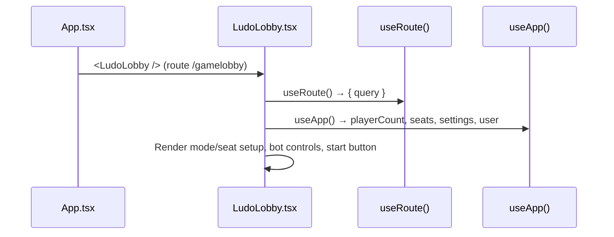
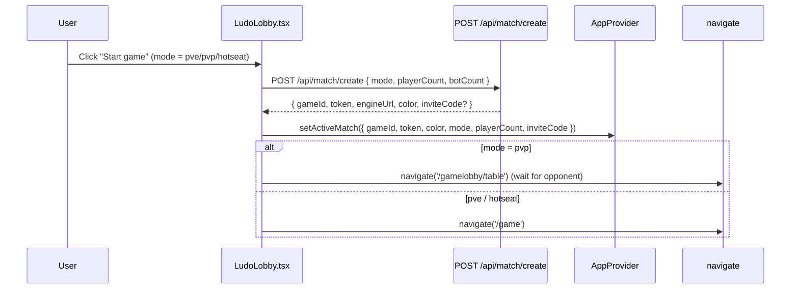

# Frontend — Lobby

## Table of Contents

- [Overview](#overview) — Pre-game lobby for seat setup, bot setup and mode selection
- [Files](#files) — Source file inventory
- [Key Types / Interfaces](#key-types--interfaces) — Seat, PlayerCount and BOT_POOL types
- [Core Logic / Flow](#core-logic--flow) — Mermaid sequence diagrams for lobby setup and game start
- [Logic Paths Summary](#logic-paths-summary) — Decision trees for seat management and game start
- [Dependencies](#dependencies) — Internal and external dependencies

---

## Overview

The lobby is at `/gamelobby` (`LudoLobby.tsx`), with a separate table/room screen at `/gamelobby/table` (`Lobby.tsx`). Players set up and start a game here. It has:

1. **Seat setup** — player count (2-4, read from the `?mode=` query param) and seat assignment (`you`, `player`, `bot`, or empty).
2. **Bot setup** — add or remove bots.
3. **Mode selection** — PvP (player versus player), PvE (player versus environment) or hotseat.
4. **Match creation** — calls the backend matchmaking API (Application Programming Interface) at `POST /api/match/create` (or the PvP/PvE shortcuts), stores the returned `activeMatch` (gameId and engine token) in the store, then navigates to `/game`, where the Socket.IO connection starts.

> **Note:** The lobby talks to the real backend. Creating a match returns engine credentials (`gameId`, `token`, `engineUrl`), which the Game page uses to connect through Socket.IO.

---

## Files

| File | Role |
|------|------|
| `src/pages/LudoLobby.tsx` | Main lobby page (`/gamelobby`) — mode/seat setup, match creation |
| `src/pages/Lobby.tsx` | Table view (`/gamelobby/table`) — room state, ready, invites |

---

## Key Types / Interfaces

### Seat

```typescript
export type Seat =
  | { type: 'you' }
  | { type: 'bot'; name: string }
  | { type: 'player'; name: string }
  | { type: 'empty' }
```

### PlayerCount

```typescript
export type PlayerCount = 2 | 3 | 4
```

### BOT_POOL

```typescript
// From theme.ts
export const BOT_POOL = ['Rook', 'Bishop', 'Knight', 'Castle', 'Duke', 'Marla', 'Otto', 'Vex']
```

---

## Core Logic / Flow

### 1. Lobby Rendering

Sequence of steps when the lobby page loads.


### 2. Start Game Flow

Sequence of steps when the user clicks "Start Game".


---

## Logic Paths Summary

### Lobby Render Path
```
<LudoLobby /> (/gamelobby)
  ├── useRoute() → query (mode preselect)
  ├── useApp() → playerCount, seats, settings, user
  ├── Render seat grid for seats[0..playerCount)
  │   ├── type = 'you' → host seat
  │   ├── type = 'bot' → bot name + remove button
  │   ├── type = 'player' → named player seat
  │   └── type = 'empty' → "+ Add" card
  └── Render Start button (enabled when a valid setup is chosen)
```

### Match Creation Path
```
Start game (pvp / pve / hotseat)
  ├── POST /api/match/create { mode, playerCount, botCount, botColors?, seatColors? }
  │   ├── Error (bad mode / bots in non-pve) → show message
  │   └── Success → setActiveMatch(result)
  ├── pvp → navigate('/gamelobby/table')
  └── pve / hotseat → navigate('/game') → Game connects via Socket.IO
```

### Seat Management Path
```
addBot(i)
  └── Find unused bot name from BOT_POOL → seats[i] = { type: 'bot', name }

removeBot(i) / removePlayer(i)
  └── seats[i] = { type: 'empty' }

addPlayer(i)
  └── seats[i] = { type: 'player', name }
```

---

## How Seat Colours Are Sent

For hotseat and PvE, the created game is exactly the occupied seats (the host is always seat 0 / blue, then each added local player or bot in seat order). `Lobby.tsx` therefore sends the **exact** `seatColors` list rather than a count. Without it, the engine's `playerCount`-based default fills the gaps again and brings back seats the user deliberately skipped.

---

## Dependencies

| Dependency | Purpose |
|-----------|---------|
| `store.tsx` | `useApp` for mode, seats and game actions |
| `router.tsx` | `navigate('/game')` on start |
| `theme.ts` | `BOT_POOL` constant, inline styles |